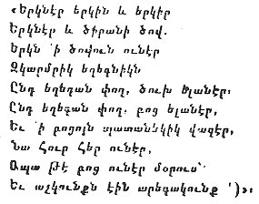

  
[Intangible Textual Heritage](../../index)  [Asia](../index.md) 
[Myths/Legends](../../neu/index)  [Index](index)  [Previous](alp81.md) 
[Next](alp83.md) 

------------------------------------------------------------------------

*Armenian Legends and Poems* \[1916\] at Intangible Textual Heritage

------------------------------------------------------------------------

In Armenian epics, the immortals stand in the background, the most
prominent place being assigned to legendary heroes, to whom poets
attribute divine descent, thus tracing the origin of the Armenian race
to the gods. Unfortunately, the greater part of these epics is lost,
though a few fragments are preserved, in their original shape, by Moses
of Khorene.

The following is one of these fragments, which gives the general
conception of the gods and the heroes descended from them:--

"Glorious and awful were the former gods. They were the cause of the
greatest blessings

p. 132

of the earth; also of the beginning of the world and the generations of
men. From them arose a race of giants, with great limbs, fantastical, of
stupendous stature, who, in their arrogance, conceived the impious idea
of tower-building. But by the wrath of the gods, a mighty wind arose,
overthrowing and shattering the structure. The speech of men was
confused; there was general bewilderment."

Among the giants mentioned in this passage was Haik, the brave and
illustrious chief--a famous archer, who is the patronymic hero of
Armenia, and is described by Moses of Khorene as having curly hair and
being beautiful to look upon, with brawny arms, well-set shoulders, and
fiery eyes. Recoiling from submission to Belus, he, with his followers,
went northwards to the foot of a mountain, where they took up their
abode. Belus sent emissaries to him, bearing the following message:--

"Thou hast departed and hast settled in a chill and frosty region.
Soften thy hard pride, change thy coldness to geniality; be my subject,
and come and live a life of ease in my domain. Thus shalt thou find
pleasure."

Haik's answer was to prepare for combat. The fights between Haik and
Belus are minutely recounted. The dress of the two champions, their
looks, their weapons, are all described in detail. At last Belus was
vanquished and slain by his adversary.

Before the time of Moses of Khorene, Haik was known as a great hunter
like the Greek Orion. In the passages in Job and Isaiah where "Orion"
appears in the English Bible as the name of a constellation, "Haik"
appears in the Armenian version.

The country that Haik conquered was named Hayastan, after him.

He was succeeded by Armenak, who extended the boundaries of his kingdom.
This expansion is thus described by Moses of Khorene:--

"Armenak, taking with him all his host, goes to the north-east. He
descends on a plain surrounded by high mountains, through which, from
the west, murmuring streams flow. The plain extends towards the east.
From the foot of the mountains gush springs no less limpid, mingling
together to form little rivers, which, with gentle flow, run round the
edge of the plain, parallel to the base of the mountains.

"But the southern mountain, with its white peak, at first rises straight
up; afterwards it curves, looking beside the other heights like a hoary
stooping elder amid youths."

Armenak was succeeded by Aramais. This king took up his abode on a hill
beside a river, where he built a town which he named Aramavir. The river
he called by the name of his grandson, Araxes. He had a son, named
Shara, who was a glutton and had an immense number of children. He sent
him to a very fertile place which was called, after him, Shirak.

p. 133

\[paragraph continues\] Moses of Khorene
quotes a proverb relating to Shara:--"If thou hast the gullet of a
Shara, our stores are not the stores of a Shirak."

Shara had a son, Amasa. After him Mount Ararat was named "Masis."

Moses of Khorene mentions another descendant of Haik, whose name was
Tork. He was ugly and of tremendous strength. He was able to break great
stones with his hands. Once, when he was on the shore of the Sea of
Pontus, he hurled huge rocks at the ships of his enemies and sank them.
This incident reminds us of the Cyclops Polyphemus, in the *Odyssey*.
Tork had also artistic proclivities. After dividing large stones with
his hands, he smoothed them with his nails, and with his nails covered
them with drawings of eagles and other pictures. [1](#fn_27.md)

Then the historian gives a table of royal names down to Aram, whom he
describes as industrious and patriotic, and who said that he would
rather die for his fatherland than endure the sight of strangers
devastating it. He collected an army of 50,000 and drove the foreign
invaders out of Armenia. Epic poems, according to Moses of Khorene,
praise Aram's valour in his conflicts with Barsham, King of Assyria,
whom he eventually subdued. He was succeeded by Ara the Beautiful.

The romantic love of Semiramis for this king, which was a favourite
theme of ancient Armenian song and epic, is elaborately recounted by
Moses of Khorene. A translation of his narrative is given on page
[23](alp23.htm#page_23.md) of this volume. There are several variants of
this story, which is still related in Armenia, and the names of many
places as well as many superstitions can be traced to it.

Semiramis invited Ara to Nineveh to be her husband, promising him the
half of the kingdom, but Ara refused her offer, having a wife already.
Semiramis thereupon sent an army against Ara, with orders to capture the
king alive and bring him to her; but, instead of the living king, they
brought his corpse. Semiramis, who, as is well known, was wont to
practise magic, laid the body on a certain high place, in order that the
gods might descend and restore it to life by licking the wounds. This
height is still called *Lezk*, and in former times others used it for
the same purpose as Semiramis: The idea of this mode of cure probably
originated from the fact that wounded men, lying unconscious on the
battlefield, have often been revived by the licking of dogs and other
animals.

In Moses of Khorene we find this story about the childhood of Sanatruk.
One day, he, under the care of his mother and his nurse, was walking
among the mountains of Kordua, when suddenly a high wind arose,
accompanied by a snowstorm, and separated the mother

p. 134

from her son. For three days and nights the nurse and the child were
buried in the snow, but the gods sent a miraculous white animal which
rescued them and brought them home alive. [1](#fn_28.md)

But, though such legends as these may have some foundation in fact,
there are others that are entirely fabulous, like the following, which
is related by Moses of Khorene:--

The heir to the principality of Ardzruni, when a boy, fell asleep in the
open air. A storm of rain came on and drenched him; and then the hot sun
shone down and scorched him with its rays; whereupon an eagle flew up
and hovered over his head with outspread wings, sheltering him from the
assaults of nature.

In the fourth century A.D., we find a similar story told of Prince
Mushegh Mamikonian. After his death his relatives put his body on a high
tower, believing that the spirits would descend and restore him to life.
This story is found in Faustus Byzand (A.D. 337-384).

The animals figuring in such stories as these are not represented as
merely adjuncts to man, but as independent individuals who act in
accordance with their own characters and inclinations. Plato, in his
*Republic*, gives a slightly different version of the legend of Ara. Er
was an Armenian (or, as some commentators say, "The son of Armenios"), a
native of Pamphylia. He was slain in battle, and ten days afterwards,
when the bodies of the dead were taken up, already in a state of
corruption, his body was found unaffected by decay and carried away home
to be buried. And on the twelfth day, as he was lying on the funeral
pile, he returned to life and told them what he had seen in the other
world.

The name "Er" is evidently a variant of Ara. The story, as told by
Plato, has all the features of a transplanted legend.

Moses of Khorene says that, after the death of Ara the Beautiful,
Semiramis passed the rest of her days in Armenia, which place she
greatly loved. Here she established the city of Van. A picturesque
account of its foundation given by the historian is included in this
volume (page [33](alp30.htm#page_33).md).

The following account is given of the end of Semiramis:--

Being pursued by her enemies, she ran away on foot, and, becoming
thirsty, she stopped to drink water from the Lake of Van. Here she was
overtaken by the "swordsmen," whereupon, after taking off her magic
bracelet and throwing it into the lake, she herself was turned into
stone.

p. 135

With regard to the bracelet of Semiramis, the following story is even
now commonly told in the neighbourhood of Van:--

Once Semiramis saw a bracelet in the hands of some little boys, who had
found it in the river, and were examining it with curiosity. Semiramis,
knowing that the bracelet had magic powers, took it away from the
children. By means of this jewel, she allured youths to their
destruction. This licentiousness brought her into general disfavour. An
old man, at last, snatched the bracelet from her and ran with it towards
the sea. Semiramis rushed after him in a fury, but, not being able to
come up with him, she let down her long hair and used it as a sling to
hurl a great rock at him. The weight of the rock pulled out her hair.
The rock itself fell into a ditch near Artamet. Semiramis, through fear
and amazement, was turned into stone. The old man threw the bracelet
into the Lake of Van. Even now a rock is shown at Artamet which bears
the name of "the Rock of Semiramis."

Then Moses of Khorene speaks of *Tigranes I.*, who, in conjunction with
Cyrus, put an end to the kingdom of Media. The epics say of Tigranes
that "his face was of lovely hue, his eyes were soft and lustrous, his
shoulders stalwart, the calves of his legs were well-shaped, he was
altogether fair to look upon; in food and drink he was moderate; he was
of lofty mind, eloquent in speech, and masterly in the conduct of
affairs. Just and equitable, he weighed each man's acts in the scale of
his mind. He was not jealous of the great nor did he despise men of low
estate, but spread the mantle of his care over all men alike. He
increased our treasures of gold, silver, and precious stones. Under him,
men and women wore fine garments, of divers colours, richly embroidered,
which made the ill-favoured to look fair and the beautiful to look like
demi-gods.

"Tigranes, the bringer of peace and prosperity, caused all men to grow
fat with butter and honey. In his day, the infantry became cavalry,
slingers became skilful archers, dagger-bearers were equipped with
swords, and naked soldiers were provided with shields and armour."

The historian adds that the splendour of the arms and equipments was
enough of itself to drive back the enemy.

As the head of a band of warriors, he performed many valorous
deeds:--"We were under the yoke of others, but he put other nations
under our yoke and made them our tributaries."

His rival, Astyages, King of Media, was always suspicious and
distrustful of him.

One night Astyages had a terrible dream. The next morning he summoned
his courtiers. They found him sighing, looking on the ground with gloomy
mien, and heaving groans from the depths of his heart. " When the
courtiers inquired the reason of his behaviour" (continues

p. 136

the historian) " the king remained silent for hours, then in a sad voice
he related his dream, which was as follows:--

"'To-day I was in an unknown country, close to a mountain, which rose
very high above the ground; its summit was covered with ice. It seemed
to me to be in Armenia. After I had gazed for a long time, it appeared
to me that there was a woman sitting on the summit. Her garments were
purple. Her face was covered by a blue veil. Her eyes were beautiful.
She was tall, with rosy cheeks. She was in travail, and for a long time
I looked on her with admiration, then I beheld her give birth to three
heroes, all of equal stature: the first, sitting on a lion, soared
towards the west; the second, seated on a leopard, went towards the
north; the third, bridling a huge dragon, defiantly attacked our
kingdom. In these confused dreams, I seemed to be standing on the roof
of my palace, and the covering of my chambers was adorned with beautiful
fountains of variegated colours. The gods that had crowned me were
standing there, with wondrous faces, and I, with you, was honouring them
with incense and sacrifice. Suddenly looking up, I saw the man who was
seated on the dragon wing his course in our direction, desiring to
overthrow our gods. I advanced to the attack and engaged in fight with
that youthful hero. First of all, with lances we pierced each other's
bodies, calling forth rivers of blood, and past our sunlit palace flowed
a crimson sea. For hours we fought also with other arms. But, to be
brief, the fight ended in my defeat. I was bathed in sweat, sleep
forsook me, and ever since I have felt as if I had no life in me. For
all these visions signify that the Armenian king, Tigranes, is about to
attack us. And whosoever amongst you, by counsel or deeds, wishes to aid
me, and aspires to the honour of being a king, equal to myself, let him
speak.'"

Then the story goes on to tell how Astyages, in order to prevent
Tigranes from making war on him, proposed that his rival's sister,
*Tigranuhi*, should be his wife; therefore Astyages sent to Tigranes one
of his councillors with a letter accompanied by many precious gifts.
Moses of Khorene gives the letter, which runs as follows:--

"Thou knowest, beloved brother, that of all the gifts of the gods to us
none is more precious than the multitude of our dear ones, especially
when they are wise and valiant. The reason of this is that, in such
case, quarrels will not arise from outside, and if they arise, they will
be unable to make their way within and will disperse themselves. Having
seen the great advantage of such relationships, it has entered my mind
to confirm and strengthen the love that is between us, so that, both of
us being secured on all sides, we may be able to carry on the affairs of
our kingdom in greater safety. All this will be ensured, if thou wilt
give me to wife thy sister Tigranuhi, the Great Lady of Armenia. I hope
that thou wilt look favourably

p. 137

on this proposal, that she may be the Queen of Queens. Mayest thou have
a long life, fellow sovereign and dear brother."

We have presented this letter as a matter of curiosity, because in none
of the early European epics are there texts of letters. This usage is
characteristically oriental. In Isaiah we read of the letter of
Sennacherib to Hezekiah; there is also a letter in the Persian Firdusi's
*Shah-nameh*.

After his marriage with Tigranuhi, Astyages tried to set her at enmity
with her brother, and once he contrived cunningly to entice Tigranes to
become his guest in order that he might slay him. But his wife perceived
his treachery and secretly sent a message to her brother. Tigranes
accepted the invitation of Astyages, but came accompanied by a great
army. He postponed his attack till his sister had made her escape. In
the battle which ensued, Astyages was killed.

Of this Tigranes, Xenophon says a great deal in his *Cyropaedia*, from
which we cite the following incident:--

The Armenian king having revolted against Cyrus, the latter invaded
Armenia and conquered him. Cyrus intended to deal very severely with the
rebel monarch, but Tigranes, the son of the Armenian king, persuaded him
to be more lenient. Xenophon gives a long conversation, discussing the
terms of peace, in the course of which Cyrus asked Tigranes, who was
newly married and greatly loved his wife, what he would give to regain
her freedom, she having fallen into the hands of the victor, together
with the other women of the royal family. "Cyrus," was the Prince's
reply, "to save her from servitude, I would lay down my life."

On which Cyrus replied: "Take, then, thine own, for I cannot reckon that
she is properly our captive, for thou didst never flee from us." Then,
turning to the king, he added: "And thou, Armenian, take thy wife and
children, without paying anything for them, that they may know they come
to thee freely."

On the return of the king and prince, after this interview, there was
much talk at the Armenian court about Cyrus; one spoke of his wisdom,
another of his patience and resolution, another of his mildness; one
also spoke of his beauty, his fine figure and lofty stature, whereupon
Tigranes turned to his wife, saying: "Dost thou think Cyrus handsome?"

"Indeed," she answered, "I never looked at him." "At whom, then, didst
thou look?" asked Tigranes. "At him," was the reply, "who said that, to
save me from servitude, he would give his own life."

p. 138

Of all the epics from which Moses of Khorene has derived incidents or of
which he gives fragments, the only one that has survived among the
people in complete form, with numerous variants, is *Sasmadzrer*. There
is a reference in the Bible to the story which is related in this poem.

In 2 Kings xix. 37, and Isaiah xxxvii. 38, we read:--

"And it came to pass, as he (Sennacherib) was worshipping in the house
of Nisroch his god, that Adramelech and Sharezer, his sons, smote him
with the sword; and they escaped into the land of Armenia."

Moses of Khorene tells the same story, adding that the Armenian king
assigned an abode to Sharezer in the south of Armenia and to Adramelech
in the south-east.

The epic, referred to above, relates the doings of the two brothers and
their descendants in Armenia, among the rest the founding by them of the
city of Sassoon.

The poem is divided into four parts. It is still transmitted orally,
word for word, in Armenia; in many places in poetical form. During the
last forty years, several versions of it have been taken down in writing
and published, and these have received much attention from scholars. We
cannot do more than mention this most interesting production; the space
at our disposal forbids our giving even an outline of its contents.

So far we have derived our information from the prose versions of
passages in the epics found in Moses of Khorene either as quotations or
as paraphrased in his own words. But that historian has also given a few
extracts from the poems in their original form, being the first
historian to do so. To these extracts we now turn.

Although they are very few, they convey some idea of ancient Armenian
poetry. The historian says he has himself heard these poems sung to the
accompaniment of various musical instruments, of which he gives long and
minute descriptions. According to him, these poems were sung chiefly in
the province of Goghtan (the present Agulis, in Russian Armenia). This
place abounded in gardens and vineyards, and produced a variety of good
wines. The people were gay and fond of merry-making. Their love of the
old pagan religion and manners still continued long after their
conversion to Christianity. In this respect they resembled the Saxons of
Germany, and, even in the early part of the fifth century, they observed
pagan rites, sometimes openly, sometimes secretly. One of the old
Armenian songs, describing the birth of the Armenian king Vahagn, is
given in this volume, page [10](alp14.htm#page_10.md). This is supposed to
be a myth describing the rise of the sun over the sea.

At sunrise the sky gradually becomes light; between the light and the
darkness there is a

p. 139

kind of struggle; all nature is waiting in expectancy of a life-giving
power, of the rising of the sun. It seems to be this expectancy of
nature and man that the poet likens to the travail of heaven, earth, and
sea. The "crimson reed" is perhaps the long red gleam sent forth from
the East over the sea at dawn.

We have already referred to Vahagn when dealing with Armenian mythology.
In, the Armenian translation of the Bible, in 2 Maccabees iv. 19, the
name "Vahagn" is substituted for "Hercules." This name is derived from
the Sanscrit words *vah*, "to bring," and *agn*, "fire," and therefore
means "fire-bringer." In connection with this, it is interesting to
compare the Armenian legend with a similar legend in the Rig-Veda. The
word "Agni" is the same as "Agn." The god Agni was born of the rising
sun, to the accompaniment of thunder and lightning; of Vahagn the song
says: "Out of the flame sprang the child." "His hair was of fire and a
beard had he of flame"; Agni had "flaming hair and a golden beard." A
comparison of the two poems shows that the similarity between them
arises, not from the imitation of one poet by the other, but from
identity of theme, for the belief in a fire-god or fire-hero, is common
to all mythologies. According to Agathangelos, Vahagn was a favourite
deity, and his temple at Taron was famous. King Tiridates, when greeting
the Armenian people in a manifesto, says: "May Vahagn, of all Armenia,
send you courage!" He puts the name of Vahagn after the names of Aramazd
and Anahit. But, in Moses of Khorene, Vahagn is little more than an
ordinary king, the son of Tigranes I., though the historian gives the
story of his birth and his fights with dragons, as related by the poets.
He also calls Vahagn the first of the *Vahuni* or priestly caste; but
this caste was far more ancient than the historian thinks, as sun
worship is one of the oldest forms of religion. [1](#fn_29.md)

Moses of Khorene says, moreover, that there was an image of Vahagn in
Georgia, where he was worshipped as a god.

p. 140

As to the form of this poem--we note the parallelism, similar to that of
the old Hebrew songs: "To Sisera *a prey of diverse colours, a prey of
diverse colours of needlework, of diverse colours of needlework*, on
both sides " (Judges v. 30). [1](#fn_30.md)

The Song of Deborah, from which we have just quoted, is supposed to be
the oldest passage in the Bible, and is a good specimen of ancient
oriental poetry.

The songs quoted in Moses of Khorene are also examples of this poetry,
and will therefore be welcome to scholars, as throwing light on this
class of ancient literature.

The ancient Armenian form of verse has, doubtless, its own national
peculiarities. One of its characteristics is that it consists of one
main idea expressed in two or more sentences, regularly connected with
one another. There are no complex sentences, only short simple ones, and
the manner of expression is direct and definite, but, in order that they
may not tire the ear by monotony, they are, by means of parallelism,
systematically interwoven so as to form one consistent whole. Thus the
different sentences become related to one leading thought. The words are
carefully chosen and harmonious to the ear. Metaphor and allegory
abound. In colour and splendour these songs might vie with any classical
poem, and their existence is a proof that long before the Christian era
the Armenians had a perfected poetical language, which, in its
construction, imaginative force, brilliancy, and grammatical
development, bears the impress of literary culture.

Most of the nouns and adjectives in this poem are in the diminutive
form, which expresses endearment

|                          |                            |                        |
|--------------------------|----------------------------|------------------------|
| karmrik = reddish        | egheknik = little reed     | patanekik = little boy |
| achkunk = little eyes    | aregakunk = little suns    |                        |

The adjectives used here do not qualify the nouns, but simply serve as
epithets, or attributes, like the adjectives in the Homeric poems. The
Armenian word *dzirani*, [2](#fn_31.md) used in
this poem, does not always mean "red"; applied to a robe it means "red,"
applied to a belt it means "variegated"; it may originally have had the
sense of "pleasing" (cf. Russian *krasni*, which originally meant
"beautiful," but now denotes only "red-coloured").

p. 141

Another of these extant songs, belonging to the time before the
Christian era, has, as its theme, the love story of King Artashes II.,
one of the greatest kings of the Arsacid dynasty. The former, as well as
all the other stories we have mentioned, belong to the Haikazian
dynasty, but the story of Artashes II. belongs to the Arsacid dynasty
and is contained in the second book of Moses of Khorene, the contents of
which are less legendary than those of the first book. When narrating
the story of Artashes, the historian addresses himself to Sahak
Bagratuni, by whose command his history was written, in these terms:--

"The doings of Artashes are known to thee, through the epical songs
which are sung in the province of Goghtan; that is to say, his founding
of Artaxata (Artashat), [1](#fn_32.md) his alliance
by marriage with the royal house of the Alans, his sons and their
descendants, the loves of Satenik with the Vishapazuns (progeny of
dragons) who were of the race of Astyages; his wars with them, the
overthrow of their dynasty, their slaughter, the burning of their
palaces, the rivalries of the sons of Artashes, the intrigues of their
wives, which further fomented the discord amongst them. Although these
things are well known to thee through the epical songs, I will,
nevertheless, narrate them again and will explain their allegorical
meaning."

Then Moses of Khorene gives, in detail, a prose account of the deeds of
Artashes and his son Artavazd, as they are related in the epic of
Artashes, quoting, in the course of his narrative, the songs given in
this volume on pages [48](alp40.htm#page_48.md) and
[49](alp40.htm#page_49.md).

Besides these songs, there are included in the history two or three
metrical lines, which must be extracts from the epic. One of these lines
contains the reply of the Alan king when he is asked to give his
daughter in marriage to Artashes: "From whence shall brave . . ." (see
for the rest page [48](alp40.htm#page_48.md), the last lines, in this
volume). The same poem contains a description of the wedding (see page
[49](alp40.htm#page_49) of this volume.md).

We learn from ancient Armenian historians that weddings were times of
great festivity, especially royal weddings. All the people of the
country, old and young, were astir. In the great square they danced and
sang, hand in hand. There was a special kind of song sung on these
occasions, called "Tzutzk."

The marriage of Satenik was unhappy, because, besides the Vishapazuns,
she loved Argavan, the chief of the Median prisoners, who was greatly
honoured by Artashes. Another of the verses quoted by Moses of Khorene
refers to this amour of Satenik. These lines throw some light on the
nature of ancient Armenian metre. We quote the text here:--

p. 142

"Tencha Satenik tenchans  
Zartakhoir khavart  
Ev ztitz khavardzi  
I bardzitzn Argavana."

The sense of the passage is not very clear, as it contains two words the
signification of which is disputed. M. Emin holds that the meaning of
these two words is the same, both signifying "crown," and he interprets
the line as saying that Satenik loves Argavan so dearly that she would
gladly exchange her royal crown for his princely diadem. After much
controversy among scholars, Professor Khalatian discovered that, in one
Armenian dialect, these words are the names of certain plants, about
which there was a superstition that, if they were put under the pillow
of the beloved being, and afterwards under the pillow of the lover,
mutual affection would be ensured; therefore, according to Professor
Khalatian, the passage means that Satenik was desirous of getting these
plants from under Argavan's pillow.

In the time of Artashes science and poetry flourished.

One of the sons of this king, Vroir, was a poet; another was Artavazd,
who was disliked by the people. The poem says that, when the prince was
born, the Vishapazuns stole him, and substituted a devil in his place,
and it was this evil spirit that went by the name of Prince Artavazd.

In this poem, also, there is an account of the obsequies of Artashes,
which were celebrated with great splendour, for he was dearly beloved by
his subjects, many of whom committed suicide at his grave, not caring to
survive him. His son Artavazd, who was present, became very jealous and
uttered a complaint which Moses of Khorene gives in the words of the
epic (see page [65](alp49.htm#page_65) of this volume.md).

We have omitted many other incidents of the story of Artashes, as given
by Moses of Khorene, but it may be gathered, from what we have of the
Artashes epic, that the whole poem was very lengthy.

From other sources we know that the poem was sung by minstrels as late
as the eleventh century, for the well-known scholar of that time, Grigor
Magistros, says in one of his writings that he has heard it, and he
quotes some of its lines in their original form.

Artashes died in a foreign country while engaged in a campaign. In his
last moments he is seized with home-sickness, as he remembers his
fatherland. He recalls the spring of life and of the year, when the
light of dewy morn, like a thin mist, is spreading over the towns and
villages. The poem gives his dying words:--

p. 143

"Who will give me the smoke of the chimneys and the morn of
Navasard, [1](#fn_33.md)  
The running of the stag and the coursing of the deer?  
We sounded the horn and beat the drum  
As is the manner of kings."

We have already said that Artashes was a popular king, much beloved by
his people, whose death was greatly lamented; this being so, no doubt
the Artashes epic must have contained some striking dirges, composed in
honour of this monarch, but unfortunately neither Moses of Khorene nor
Grigor Magistros records any such songs in connection with him. The
despair and melancholy which cast their shadow over pagans is
conspicuous in ancient Armenian funeral songs. There were companies of
professional mourners, called *egheramark* ("mothers of lamentation"),
also there were groups of singing maidens. All these followed the
corpse, dressed in black, with dishevelled hair, solemnly clapping their
hands and moving in a slow dance. Moses of Khorene gives details of such
obsequies as we have mentioned. Even now in some parts of Armenia such
companies of mourners exist. Faustus Byzand describes minutely the
funeral of a prince and gives also an account of the funeral of Queen
Tigranuhi, of whom we have already spoken, adding that the songs sung in
her praise, on this occasion, were such that Tigranes felt that they
uttered all that was passing in his own mind.

The subjects of funeral songs were the life of the deceased, his
stature, the manner of his death, and his domestic relations, so that a
collection of these songs would furnish a biography.

We have also details of these dirges from other sources. The song opens
with a prologue, addressing the deceased and calling on him to arise
from his slumbers and carry on his usual occupations. It then goes on to
rebuke him for being deaf to the prayers of the survivors and
vouchsafing neither word nor smile. Next comes a description of the new
dwelling that the departed has chosen for himself; the grave--an abode
without doors or windows. Then comes a repetition of the words spoken by
the dead man during his last illness, followed by a series of laudatory
epithets, and finally there is the recognition that all prayers for his
recovery have been unanswered, followed by an epilogue, taking farewell
of the deceased and sending messages by him to dead relatives and
friends.

We learn from Moses of Khorene that, in his time, besides the epics,
there was other pre-Christian Armenian literature, written and
unwritten, of various kinds. We have had examples of songs and epical
stories in their gradual development from the stage when man was weak
and ignorant, when the people sought after the supernatural and the
marvellous, and the subject

p. 144

of epic songs was the mystic relation between nature and man, to the
stage when the heroes are no longer gods, but men endowed with valour
and every other virtue, without spot or flaw. The stories we have
described are sufficient to prove that Armenia had a large store of epic
and heroic poems, of which unhappily only fragments have come down to
us.

Some specimens of other branches of pre-Christian literature figuring in
the list of Moses of Khorene are *Temple Books* and *Histories of
Temples*. Throughout ancient times members of the priestly class were
the chroniclers of the nation's history and its instructors in wisdom;
and there is no doubt that this was the case in Armenia. We know that
the famous Gnosticos Bardazan, in the second century A.D., came to
Armenia to collect material for his history, and in the fortress of Ani
he made extracts from the Temple History, which was a chronicle of the
doings of the Armenian kings.

Armenia had its own written histories which were, for the most part,
destroyed on the introduction of Christianity in the fourth century A.D.
Moses of Khorene mentions an Armenian historian named Ughup, who was a
priest presiding over the temple of Ani in 150 B.C.

To continue the list--we find *Books of the Kings*, containing
chronicles of kings and their works, and *Collections of Historical
Songs*, which were kept in the temples. These collections were in
existence in the fifth century A.D. Moses of Khorene gives extracts from
them and they were also sung by minstrels.

*Tueliatz Songs* recounted the doings of kings and princes in
chronological order, hence their name, *Tueliatz*, or chronicles.

There were also other species of literature, such as *Historical
Legends*, not included in the list, from which Moses of Khorene makes
quotations elsewhere, such as the History of the *Origin of the
Bagratuni Race*, the *History of Haik*, and four other books, without
titles, of which he speaks with great admiration.

There is mention of a poet, by name David, who wrote *The Wars between
Armenia and Media*, founding his narrative on Armenian minstrel songs.
Unfortunately, none of his works have come down to us.

There is also mention of an Armenian translation, from the Greek, of an
epic called *Legends of Aramasdes and Hermia*. Some scholars think that
this must be one of the lost books of Homer, as there are still extant
some fragments of an Armenian translation of the Homeric poems.

The Hindoos believed that originally dramas were invented by the gods
and were performed in heaven. They were brought to earth by Brahma and
introduced to men. Whether the ancient Armenians held a similar belief
we cannot tell, but it appears that they had, in

p. 145

early times, a drama of their own. The themes of their plays were the
doings of the gods of the earth, but there is no record that in Armenia
drama ever reached such a high level as it attained in Greece. It may be
noticed that, though Persia, the neighbour of Armenia, was rich in lyric
and epic poetry, it produced no dramatic literature. It is true that, in
Mohammedan times, the Persians had a religious drama; but this merely
formed part of their worship and has never had an independent
development.

But the Armenians must have done better, as mention is made of Armenian
drama by Greek and Roman writers, from whom we learn that King Artavazd
I. [1](#fn_34.md) wrote tragedies, some of which
were known to Plutarch. We also learn from Plutarch and others that, in
the time of Tigranes II., there were theatres in Armenia, and Plutarch
records that, when Lucullus entered Tigranocerta, he found a body of
actors busily engaged in preparing to produce a drama in the theatre
newly built by Tigranes, and made use of them in the games and other
public diversions in honour of his victory. Armenian historians also
make mention of the theatres in Armenia. As late as the fifth century
A.D., Hovhannes Mandakuni, a religious author, wrote an essay against
theatres and actors, which shows that, even after the introduction of
Christianity, drama survived in Armenia.

At later periods, in Law Books, restrictions on theatres are mentioned.

In order to determine the date of the Heroic Poems, we must define the
different periods of Armenian history. It is now generally accepted by
scholars that, towards the end of the seventh century B.C., the Vannic
or Chaldean kingdom fell before the invading hordes of Cimmerians or
Scythians, and, during the period of anarchy, Armenians also entered the
country, which was henceforth to bear the name of "Armenia." The only
uncertainty with regard to this migration is about the date. It is
universally agreed that it cannot have been later than the seventh
century B.C., though it may have been earlier. In the fifth century B.C.
Xenophon found Armenia an established kingdom under Tigranes I. Vahe was
the last of the Haikazian dynasty. He fell in the war with Alexander the
Great in 330 B.C.

The next Armenian dynasty was that of the Arsacidae, of which the first
king was Wagharshag I., whose reign began in 149 B.C.

All the epical songs that we have mentioned belong to the Haikazian
period, except the Artashes Cycle, which belongs to the Arsacid period.
During the 185 years between these two periods, there was no national
independence to supply themes for new epics and therefore there is no
heroic poetry belonging to this interval.

p. 146

The second period of Armenian literature (before the establishment of
Christianity) extends from the accession of the Arsacid dynasty to the
fourth century A.D.

During this period, learning flourished and the libraries in the temples
and palaces were the centre of culture. The libraries in palaces were
open to any one who wished to consult the archives with a view to
writing histories of the countries, and in the temples the priests were
engaged in compiling records of the past. In these libraries the
histories of the Haikazian dynasty were kept. To this period belongs the
epic of Artashes.

Under the rule of the Arsacidae, the number of the nobles greatly
increased and the chief amusement of the king and the nobility was
sport. Nearly every noble had his own park, which was full of all kinds
of deer and in which special sporting parties were given. One of the
chief attractions of these parties was the minstrels who sang songs
specially composed for the occasion. As upwards of seventy families were
ennobled under the Arsacidae, and entertainments were given both by them
and by those of lower rank, it will be understood that the number of
minstrels must have been large.

As we have mentioned, to this period belongs the Artashes Cycle (A.D.
85-126).

We have also some evidence as to the date of the epics from foreign
sources. Armenian epics must have been known, not only in Armenia
itself, but in other countries. In migration, their form must sometimes
have changed, as, in Plato, we have found the legend of Ara transformed
into the story of Er. As the story of Ara was known to Plato, we may
take for granted that it existed in the fourth century B.C.

Strabo gives an erroneous etymology of the name "Armenia," which he
derives from "Armenios." [1](#fn_35.md) Perhaps he
had heard of Aram, whose story is told in the epics. This story is known
to us through Moses of Khorene, who derives the word "Armenia" from
Aram, and says that the country was called by this name only by
foreigners. As to the etymology of the word "Armenia," there are many
different opinions which we cannot discuss here; we will only say that
the name "Armenia" is found in an inscription of Darius Hystaspes (510
B.C.).

We confine ourselves to one more foreign reference to Armenian epics,
viz., that of the philosopher Olympiodorus, who, in an assembly of wise
men at Athens, gave an account of an old book which had existed in
former times and which contained the history of Noah and his
descendants. He added that the incidents related in this book were still
sung by Armenian minstrels to the accompaniment of various musical
instruments.

------------------------------------------------------------------------

### Footnotes

[133:1](alp82.htm#fr_27.md) Zarmaïr, another king
of this dynasty, took part in the defence of Troy. The historian
emphasises the fact that he was killed by Achilles himself.

[134:1](alp82.htm#fr_28.md) It is interesting to
recall, in this connection, some passages of Strabo. Speaking of Armenia
he says:--"It is said that people passing by the foot of the mountains
are often buried in the snow which falls from the summits. In order to
be prepared for such a mishap, travellers carry with them two long
sticks for the purpose of making breathing places for themselves, should
they be covered by the snow. The sticks, at the same time, serve as
signals to any other travellers who may happen to be passing."

[139:1](alp82.htm#fr_29.md) Cf. the original text
of the Armenian poem which is as follows:--

<table data-border="0">
<colgroup>
<col style="width: 50%" />
<col style="width: 50%" />
</colgroup>
<tbody>
<tr class="odd">
<td data-valign="top">
 
</td>
<td data-valign="top">
Erkner erkin ev erkir 
Erkner ev dzirani dzov 
Erkn i dzovun uner 
Zkarmrik eghegnikn. 
Ŭnd eghegan pogh, dzukh elaner 
Ŭnd eghegan pogh, botz elaner, 
Ev i botzuin patanekik vazer, 
Na hur her uner, 
Apa to botz uner morus 
Ev achkunkn ein aregakunk.

 
</td>
</tr>
</tbody>
</table>

[140:1](alp82.htm#fr_30.md) The following lines
from a Chaldean description of *Ut-napisti*, the Chaldean Noah's
sacrifice after the Flood, furnish an example from Assyrian poetry:--

"The gods smelled a savour,  
The gods smelled a sweet savour,  
The gods gathered like flies over the sacrifice."

[140:2](alp82.htm#fr_31.md) *Dziran* in Armenian
means "apricot," therefore *dzirani* ="of apricot colour."

[141:1](alp82.htm#fr_32.md) Strabo says about
Artaxata that it was built upon a design which Hannibal gave to King
Artaxes (Artashes), who made it the capital of Armenia, and Tournefort,
the famous French botanist, who travelled in Armenia in the seventeenth
century, exclaims, in reference to this fact: "Who could have imagined
that Hannibal would come from Africa to Armenia to be engineer to an
Armenian king? But so it is."

[143:1](alp82.htm#fr_33.md) April, when the New
Year commenced.

[145:1](alp82.htm#fr_34.md) The son of Tigranes the
Great.

[146:1](alp82.htm#fr_35.md) "Armenios, one of the
Argonauts, who was believed to have been a native of Rhodes or of
Armenion in Thessaly, and to have settled in the country which was
called after him, *Armenia*" (Strabo, xi. 530, etc.; Justin, xlii. 2;
Steph. Byz. S. V. Αρμενια).

------------------------------------------------------------------------

[Next: Moses of Khorene](alp83.md)
