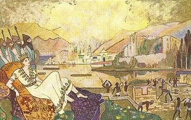

  
[Intangible Textual Heritage](../../index)  [Asia](../index.md) 
[Myths/Legends](../../neu/index.md) 

------------------------------------------------------------------------

<table width="75%">
<colgroup>
<col style="width: 50%" />
<col style="width: 50%" />
</colgroup>
<tbody>
<tr class="odd">
<td width="50%" data-valign="TOP"></td>
<td width="50%" data-valign="CENTER"><h1 id="armenian-legends-and-poems" data-align="CENTER">Armenian Legends and Poems</h1>
<h2 id="by-zabelle-c.-boyajian" data-align="CENTER">by Zabelle C. Boyajian</h2>
<h4 id="section" data-align="CENTER">[1916]</h4></td>
</tr>
</tbody>
</table>

------------------------------------------------------------------------

[Contents](#contents)    [Start Reading](alp00.md)

------------------------------------------------------------------------

This is a collection of translations of Armenian literature from the
middle ages, interspersed with poetry from the 19th century. In
addition, there are a number of episodes from the chronicles of Moses of
Khorene, a fifth century Armenian historian. These recount legendary
incidents of ancient Armenian history. The anthologist and translator of
many of these poems, Zabelle Boyajian, also created the luminous
illustrations.

The book concludes with a long essay by Aram Raffi which contextualizes
the long history of Armenian literature. This essay also details the
long religious history of Armenia, starting with an extended discussion
of the ancient Pagan deities. Armenia is in a region which is a
cross-roads between Asia and Europe, and has more often than not been
conquered by the dominant regional power of the day, starting with the
Assyrians, Babylonians, Persians, Macedonians, through the Ottomans and
finally the Russians.

Nevertheless, Armenia has managed to hold onto a unique cultural and
linguistic identity. Armenians have produced a substantial national
literature, particularly in those short windows of time while not under
foreign domination. Unfortunately, not much of this has been translated
into English. This anthology is one of the few sources we have in the
public domain. So please enjoy this little sampler of Armenian
literature.

------------------------------------------------------------------------

 [Title Page](alp00.md)  
[Preface](alp01.md)  
[Introduction](alp02.md)  
[Contents](alp03.md)  
[List of Illustrations](alp04.md)  
[Armenia's Love To Shakespeare](alp05.md)  
[Reproaches](alp06.md)  
[A Trial of Orthodoxy](alp07.md)  
[The Exile's Song](alp08.md)  
[The Apple Tree](alp09.md)  
[My Heart is Turned Into a Wailing Child](alp10.md)  
[O Night, Be Long](alp11.md)  
[Black Eyes](alp12.md)  
[Yesternight I Walked Abroad](alp13.md)  
[Vahagn, King of Armenia](alp14.md)  
[Huntsman, That on the Hills Above](alp15.md)  
[Liberty](alp16.md)  
[I Beheld My Love This Morning](alp17.md)  
[The Fox, the Wolf, and the Bear](alp18.md)  
[Incense](alp19.md)  
[The Little Lake](alp20.md)  
[Spring](alp21.md)  
[Cradle Song](alp22.md)  
[Ara and Semiramis](alp23.md)  
[Lament Over the Heroes Fallen in the Battle of Avarair](alp24.md)  
[The Song of the Stork](alp25.md)  
[Ye Mountain Bluebells](alp26.md)  
[The Sun Went Down](alp27.md)  
[Birthday Song](alp28.md)  
[Morning](alp29.md)  
[The Founding of Van](alp30.md)  
[I Have a Word I Fain Would Say](alp31.md)  
[The Song of the Partridge](alp32.md)  
[The Lily of Shavarshan](alp33.md)  
[Cradle Song](alp34.md)  
[The Wind is Howling Through the Winter Night](alp35.md)  
[The Armenian Poet's Prayer](alp36.md)  
[The Chragan Palace](alp37.md)  
[The Dream](alp38.md)  
[The Sorrows of Armenia](alp39.md)  
[Artashes and Satenik](alp40.md)  
[My Death](alp41.md)  
[The Eagle's Love](alp42.md)  
[Concerning the Rose and the Nightingale](alp43.md)  
[The Arrival of the Crusaders](alp44.md)  
[Like an Ocean is This World](alp45.md)  
[The Rock](alp46.md)  
[The Crane](alp47.md)  
[The Hawk and the Dove](alp48.md)  
[Artavasd](alp49.md)  
[Charm Verses](alp50.md)  
[The Tears of Araxes](alp51.md)  
[The Eve of Ascension Day](alp52.md)  
[''Thy Voice is Sweet''](alp53.md)  
[Christ and Abgarus](alp54.md)  
[Araxes Came Devouringly](alp55.md)  
[The Parrot's Song](alp56.md)  
[Earth and Sky](alp57.md)  
[O’er the Mountains High He Went](alp58.md)  
[Complaints](alp59.md)  
[A Day After](alp60.md)  
[Without Thee What Are Song and Dance to Me?](alp61.md)  
[The Lake of Van](alp62.md)  
[Spring](alp63.md)  
[The Fox](alp64.md)  
[The Tale of Rosiphelee](alp65.md)  
[The Song of the Vulture](alp66.md)  
[Dance Song](alp67.md)  
[Ballad](alp68.md)  
[No Bird Can Reach the Mountain's Crest](alp69.md)  
[The Nightingale of Avarair](alp70.md)  
[Thou Art So Sweet](alp71.md)  
[The Wandering Armenian to the Swallow](alp72.md)  
[The Christ-Child](alp73.md)  
[The Castle of Anoush](alp74.md)  
[Happiness](alp75.md)  
[Concerning Death](alp76.md)  
[Love One Another](alp77.md)  
[Pasqua Armena](alp78.md)  
[''Io Vidi''](alp79.md)  

### Armenia: Its Epics, Folk-Songs, and Mediaeval Poetry

[Introduction](alp80.md)  
[Armenian Paganism](alp81.md)  
[Armenian Epics](alp82.md)  
[Moses of Khorene](alp83.md)  
[Adoption of Christianity](alp84.md)  
[Golden Age of Armenian Literature](alp85.md)  
[Middle Ages](alp86.md)  
[Bagratuni Dynasty](alp87.md)  
[The Crusades](alp88.md)  
[Silver Age of Armenian Literature](alp89.md)  
[End of Armenian Kingdom](alp90.md)  
[Renaissance](alp91.md)  
[Eighteenth Century and onward](alp92.md)  
[Characteristics of Armenian Poetry](alp93.md)  
[Russian Era](alp94.md)  
[Addenda and Corrigenda](alp95.md)  
[Chronological Index to Authors](alp96.md)  
[Index to First Lines](alp97.md)  
