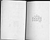

  
[Intangible Textual Heritage](../../index)  [Asia](../index.md) 
[Index](index)  [Next](flhl01.md) 

------------------------------------------------------------------------

[Buy this Book at
Amazon.com](https://www.amazon.com/exec/obidos/ASIN/B0028Y4OOY/internetsacredte.md)

------------------------------------------------------------------------

  
*Folk-lore of the Holy Land, Moslem, Christian and Jewish*, by J. E.
Hanauer \[1907\], at Intangible Textual Heritage

------------------------------------------------------------------------

# FOLK-LORE OF THE HOLY LAND

#### MOSLEM, CHRISTIAN AND JEWISH

###### BY

### J. E. HANAUER

#### EDITED BY MARMADUKE PICKTHALL

 

#### LONDON

#### DUCKWORTH & CO.

#### 3 HENRIETTA STREET, W.C.

#### \[1907\]

Scanned, proofed and formatted at Intangible Textual Heritage, July
2006, by John Bruno Hare. This text is in the public domain in the
United States because it was published prior to 1923.

  [  
Click to enlarge](img/cover.jpg.md)  
Front Cover and Spine  

  [  
Click to enlarge](img/title.jpg.md)  
Title Page  

 
[  
Click to enlarge](img/verso.jpg.md)  
Verso  

<table data-border="0" width="50%">
<colgroup>
<col style="width: 100%" />
</colgroup>
<tbody>
<tr class="odd">
<td data-valign="top" width="655">
TO

MY DEAR WIFE,

WITHOUT WHOSE ENCOURAGEMENT THIS BOOK WOULD NEVER HAVE BEEN WRITTEN AND WITHOUT WHOSE HELP ITS MATERIALS COULD NEVER HAVE BEEN COLLECTED, IT IS NOW MOST AFFECTIONATELY DEDICATED.

J. E. H.
</td>
</tr>
</tbody>
</table>

 

------------------------------------------------------------------------

[Next: Contents](flhl01.md)
