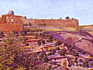

  
[Intangible Textual Heritage](../../index)  [Asia](../index.md) 
[Index](index)  [Previous](flhl05)  [Next](flhl07.md) 

------------------------------------------------------------------------

[Buy this Book at
Amazon.com](https://www.amazon.com/exec/obidos/ASIN/B0028Y4OOY/internetsacredte.md)

------------------------------------------------------------------------

  
*Folk-lore of the Holy Land, Moslem, Christian and Jewish*, by J. E.
Hanauer \[1907\], at Intangible Textual Heritage

------------------------------------------------------------------------

p. 13

### III

#### NOAH AND OG

NOAH, on whom be peace, was one of the six greatest prophets that ever
lived, though he left no writings behind him, as did his grandfather
Idrìs, [1](#fn_7.md) who was the first human being
to use a pen, wherewith he wrote thirty books of divine
revelation--besides works on astronomy and other sciences, which are now
lost--before Allah removed him to Heaven. Another name of Noah was ’Abd
el Ghâfar, which means Servant of the Forgiving One. He was born one
hundred and fifty years after the translation of Idrìs. He lived at
Damascus till Allah sent him to warn mankind of the Flood and build the
ark. By Allah's command and direction he made the first nâkûs or gong
such as those which are used to this day in oriental churches and
convents.

Noah's efforts to convert mankind were vain. He was beaten and mocked
even by his own wife Wa’ileh, an unbeliever, as well as by his wicked
son Canaan, and the latter's son Uj ibn ’Anak (Og the son of Anak). Anak
was the daughter of Adam, a vile woman, [2](#fn_8.md) and the first of witches. These four wicked
persons did their best to persuade everyone that Noah was mad.

The Flood burst forth from underground out of a "tannûr" or oven, the
site of which is uncertain, some placing it at Gezer and others at
Damascus.

p. 14

\[paragraph continues\] The ark was
upborne by the rising waters, which were swollen by torrential rains.
Noah and his family (his wife, Anak, Canaan, and Og excepted), together
with a company of other believers, the number of whom some say was six,
others ten, twelve, and even seventy-eight or eighty, half of them men
and half women, including Jorham the elder, the preserver of the Arabic
language, were saved, as well as the animals which Allah had caused to
enter the ark. Among the latter was the ass, under whose tail Iblìs had
hidden, disguised as a fly. This donkey, reluctant to enter the ark
bearing the Evil One with him, was driven in by Noah with hard blows. To
compensate the donkey for this injustice, it had been predestined that
one of his descendants should enter Paradise. This happened when the ass
of ’Ozair [1](#fn_9.md) was raised to life again and
admitted into the Heavenly Garden.

The waters of the Deluge destroyed all mankind except those inside the
ark, and Og. The latter was so tall that when the Flood came its waters
only reached up to his ankles. He repeatedly tried to destroy Noah and
his crew by submerging the ark, but in vain. The pitch with which it had
been coated had made it so difficult to grasp that it always slipped
from his hands and came safely up to the surface. When hungry, Og would
squat down on his haunches and take up a handful of water. Straining it
through his fingers, he always found a good many fish left in his grasp.
These he could roast

p. 15

by holding them up to the sun. When thirsty, all he had to do was to put
out his hands close together and catch the rain which was tumbling in
bucketsful from the skies. He lived several centuries after the Flood
till the time of Mûsa. One day, as he was standing on Jebel esh
Sheykh, [1](#fn_10.md) he wanted to stride across
El-Beka’a, [2](#fn_11.md) but, misjudging the
distance, he stepped, not on to the Lebanon Range, as he had intended,
but far beyond it, into the great sea. At another time when, suffering
from fever, he lay down to rest, he stretched from Banias, where the
Jordan gushes forth, as far as the Lake Merom. As he lay thus, some
muleteers passed Banias on their way southward. When they approached his
face, he said to them, "I am too ill to move. For the love of Allah,
when you reach my feet, drive away the mosquitoes that are tickling them
and cover them up with my "abâyeh." The men promised to do as he said:
but, when they reached his feet, they found no mosquitoes, but a crowd
of jackals.

Og died at last by the hand of Mûsa, in the following manner. In order
to destroy the Israelites on their way through the wilderness, the giant
pulled up a great rock out of the earth. It was so large that it would
have crushed the whole camp of Israel, which covered a square league of
country. Og was carrying it upon his head, meaning to drop it on the
camp, when Allah sent a bird that pecked through the stone a hole so
large that the mass slipped down over Og's head and on to his shoulders,
in such a

p. 16

way that he could not get rid of it, nor see where he was going.
Hereupon Mûsa, whose stature was ten dra’as, [1](#fn_12.md) and whose miracle-working rod was the same
length, leapt up to the height of ten dra’as and just managed to hit Og
on his ankle, so that he fell down and was killed. Stones were heaped
upon his body as high as a mountain.

To return to Noah: the ark floated to and fro on the surface of the
Flood till it came to the place where Mecca is situated, and there it
lay motionless seven days. Then it moved northward till it reached the
site of Jerusalem, where, being endowed with speech by Allah, it
informed Noah that here the "Beyt el Makdas," or House of the Sanctuary,
would be rebuilt, and inhabited by many prophets, his descendants. After
the Flood, when the men and women who had been saved in the ark had gone
forth to re-people the earth, the Patriarch was left alone with his
daughter, who kept house for him, his wicked wife (Wa’ileh) having
perished. One day a suitor for the girl appeared, and Noah promised her
to him on condition of his preparing a suitable home for her. The man
took his leave, promising to return within a certain time. The term
having passed without his reappearance, Noah promised his daughter to
another man, upon the same condition. He also departed and failed to
appear at the time stated, so when a third suitor came, with a home
quite ready, Noah consented to the marriage taking place at once.
Hardly, however, had the wedded pair departed, when the second suitor
came

p. 17

to claim his bride. Unwilling to disappoint him, the Patriarch, by
invoking the name of Allah, turned a she-ass into a girl resembling his
daughter, and gave her to the expectant bridegroom. Soon after the pair
had left, the first suitor appeared demanding his bride. Noah then
turned his bitch into a girl and married her to the laggard. Since then
there have been three sorts of women in the world. Firstly, the
God-fearing, who are true help-meets to their husbands; secondly, stupid
and indolent slatterns, who want driving with a stick; and thirdly,
shrews, who, scorning both admonition and discipline, continually snarl
and snap at their owners.

------------------------------------------------------------------------

### Footnotes

[13:1](flhl06.htm#fr_7.md) Enoch.

[13:2](flhl06.htm#fr_8.md) Awwal sharmûteh kânet
fi’d-dunyah.

[14:1](flhl06.htm#fr_9.md) *i.e.* Jeremiah, Esdras,
or Lazarus of Bethany: three saints who have got confused in Syrian
Hagiology.

[15:1](flhl06.htm#fr_10.md) Mount Hermon.

[15:2](flhl06.htm#fr_11.md) The wide plain of
Coele-Syria.

[16:1](flhl06.htm#fr_12.md) The modern "dra’a" or
"peak"=27 inches.

------------------------------------------------------------------------

[Next: IV. Job and His Family](flhl07.md)
