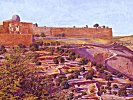

  
[Intangible Textual Heritage](../../index)  [Asia](../index.md) 
[Index](index)  [Previous](flhl35)  [Next](flhl37.md) 

------------------------------------------------------------------------

[Buy this Book at
Amazon.com](https://www.amazon.com/exec/obidos/ASIN/B0028Y4OOY/internetsacredte.md)

------------------------------------------------------------------------

  
*Folk-lore of the Holy Land, Moslem, Christian and Jewish*, by J. E.
Hanauer \[1907\], at Intangible Textual Heritage

------------------------------------------------------------------------

### XI

#### ABOUT PLANTS

THE Kharrûb, [1](#fn_160.md) among other trees and
shrubs, such as the fig, the sycamore and the caper-bush, is a perch for
demons of various kinds, and so classed among unholy plants; while the
olive-tree, among others, is sacred, not only because of its great value
in furnishing oil and food, but also on account of the following
legend:--

"At the death of Mohammed the trees, with a few exceptions--such as the
oak, the pine, the orange, and the citron--went into mourning by
shedding their leaves as they do in winter. When the others were asked
why they did not do the same,

p. 287

the olive, as their elder and spokesman, replied, You show your sorrow
by external signs, but our grief, who care not for the opinion of
others, but only that Allah, who reads the secrets of the heart, should
approve of our motives, is no less sincere, though inward. Should you
cleave my trunk open, for instance, you would find that at its core it .
has become black with grief."

The Abhar [1](#fn_161.md) is another sacred tree,
because its nut is used in the manufacture of rosaries, [2](#fn_162.md) and because, when he fled from Pharaoh,
Moses, tired in the shadeless desert, planted his staff of storax in the
soil and lay down in its scanty shade, which was instantly increased,
Allah causing the staff to sprout and put forth branches bearing leaves
and blossoms. In like manner the Miriamìyeh or sage [3](#fn_163.md) is much esteemed; not only for its
medicinal properties which cause its dried leaves to be burned in
fumigation in cases of cholera, small-pox, measles and other contagious
and epidemic diseases, while an infusion of its leaves is a specific for
various maladies; but also because the Virgin Mary, being overcome with
fatigue during her flight into Egypt, rested under a sage-bush; and,
breaking off a bunch of its leaves, wiped her brow with them; and when
she rose refreshed, blessed the plant and bestowed upon it the virtues
it now possesses.

The Nubk or Lotus [4](#fn_164.md) is also a sacred
plant. It

p. 288

often marks the boundaries between the lands of different villages, and
some believe that the hedge surrounding Paradise is formed of it. When a
Lotus-tree has attained the age of forty years it often becomes the
abode of some departed saint. It is therefore a dangerous thing to cut
down a Lotus tree that is above that age, as the saint might resent the
deed. In travelling through Palestine one frequently meets with clumps
of sacred trees, not necessarily always Lotus, which are thus haunted by
the spirits of holy men; and, on Thursday evenings especially, one
sometimes sees these trees lighted up, and can hear snatches of sacred
instrumental music proceeding therefrom, while lights appear to be
darting from tree to tree. It is a sign that the saints are keeping
festival, and exchanging visits. A sacred tree much affected by such
spirits is the Tamarisk. [1](#fn_165.md) If, when
passing these trees on windy nights, you listen attentively, you may
sometimes distinctly hear the holy name "Allah" soughing through the
branches.

It is not generally known that one of the proofs that the time when the
Orthodox Greek Christians celebrate Christmas is the right one, and that
the Latins and other Westerns are wrong in the time of their
celebration, is that on the Greek Christmas Eve all trees and plants,
but especially those on the banks of the Jordan, worship the Saviour.
This important fact was discovered in the following manner:--A certain
man rode into Lydda shortly before midnight on the Greek Christmas Eve.
On reaching his quarters he tied up his donkey to the

p. 289

trunk of a palm-tree which, as it lay prostrate in the yard, he
naturally supposed had been blown down by a recent storm. Next morning,
however, when he arose and went to look after his donkey, his
astonishment was great to find the tree erect and the ass hanging beside
and from the palm-trunk. As the animal was quite dead, the fact was
proved beyond dispute.

Another remarkable plant, much talked about is the "‘Ushbet el Kurka" or
"Tortoise-Herb." He who finds this plant has made his fortune in more
senses than one. In the first place, its leaves are of pure gold.
Further, if one is so fortunate as to find and gather it, he has the
marvellous power of unconsciously gaining the goodwill of everybody, and
can, if he choose, fascinate both men and women and make them his
willing slaves. Even should he unconsciously tread upon this plant,
without picking it, he is able, without himself being conscious of the
fact, or others being able to explain it, to win the love and esteem of
all whom he meets. Even goats which browse upon it have their teeth
turned to gold. Unfortunately this plant is extremely rare. Some years
ago there was a fellâh living in a village in Judæa who knew all about
it, where it grew, at what season it might be found, its appearance, and
so forth. He was offered a large sum of money by a rich Bethlehemite for
these secrets, but, being a man of high principles, he refused the offer
rather than betray the honour of the countryside by putting a Christian
in possession of such powers. He is dead now, and his knowledge perished
with him.

------------------------------------------------------------------------

### Footnotes

[286:1](flhl36.htm#fr_161.md) *Ceratonia siliqua*.

[287:1](flhl36.htm#fr_162.md) *Storax
officinalis*.

[287:2](flhl36.htm#fr_163.md) Called in Arabic
Massâbih (praising instruments), and used by Moslems and Christians at
their devotions.

[287:3](flhl36.htm#fr_164.md) *Salvia ceratophyx
vel controversa*.

[287:4](flhl36.htm#fr_165.md) *Zizyphus spina
Christi*.

[288:1](flhl36.htm#fr_166.md) *Tamaria Syriaca*.

------------------------------------------------------------------------

[Next: XII. About Coffee](flhl37.md)
