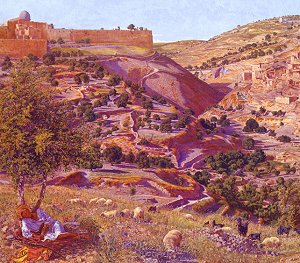

  
[Intangible Textual Heritage](../../index)  [Asia](../index.md) 

------------------------------------------------------------------------

[Buy this Book at
Amazon.com](https://www.amazon.com/exec/obidos/ASIN/B0028Y4OOY/internetsacredte.md)

------------------------------------------------------------------------

<table width="75%">
<colgroup>
<col style="width: 50%" />
<col style="width: 50%" />
</colgroup>
<tbody>
<tr class="odd">
<td width="50%" data-valign="TOP"> 
Jerusalem and the Valley of Jehoshaphat from the Hill of Evil Counsel (detail), by Thomas B. Seddon [1854]</td>
<td width="50%" data-valign="CENTER"><h1 id="folk-lore-of-the-holy-land" data-align="CENTER">Folk-lore of the Holy Land</h1>
<h3 id="moslem-christian-and-jewish" data-align="CENTER">Moslem, Christian and Jewish</h3>
<h2 id="by-j.-e.-hanauer" data-align="CENTER">by J. E. Hanauer</h2>
<h4 id="section" data-align="CENTER">[1907]</h4></td>
</tr>
</tbody>
</table>

------------------------------------------------------------------------

[Contents](#contents)    [Start Reading](flhl00.md)    [Page
Index](pageidx)    [Text \[Zipped\]](flhl.txt.gz.md)

------------------------------------------------------------------------

|                                                                                                                           |
|---------------------------------------------------------------------------------------------------------------------------|
|  |

This entertaining collection of folklore from what is now
Israel/Palestine was written at the start of the 20th century. It
contains an even mix of Moslem, Christian and Jewish lore; often a given
tale will draw from multiple traditions, and sometimes it is hard to
distinguish a point of view. Of special interest are the stories of the
Jinn, magical beings that correspond to the European fairies, the
accounts of folk-magic, and folklore from all three religions about
biblical topics.

The book covers the entire gamut of folkloric themes: animal tales,
tales about fools, calendar lore, and so on. There is an intriguing
chapter about the lore of coffee, its history, and the etiquette of
preparing and drinking it. Add yet another item on the list of Islamic
contributions to world culture: the coffeehouse.

Although Moslems comprised the largest proportion of the population of
Palestine, and it was governed by a succession of Moslem states,
including Egypt and the Ottoman Empire, there were also significant
numbers of Christians and Jews. These three populations managed to
co-exist in everyday life for centuries. This book vividly illustrates
how ordinary people managed to use humor and other coping mechanisms to
make this arrangement work.

Note: the version of this book which is currently in print by Dover is a
reprint of a 1935 edition. It differs slightly from this electronic
text, which (for copyright reasons) was prepared from an original 1907
edition. The 1935 edition has an additional preface, an index, and
different pagination.

------------------------------------------------------------------------

 [Title Page](flhl00.md)  
[Contents](flhl01.md)  
[Introduction](flhl02.md)  
[A Mohammedan Legend: Introductory And Apologetic](flhl03.md)  

### I. Saints, Sinners, and Miracles

[I. A Learned Moslem's Ideas On Cosmogony](flhl04.md)  
[II. Our Father Adam](flhl05.md)  
[III. Noah and Og](flhl06.md)  
[IV. Job and His Family](flhl07.md)  
[V. Abraham, ''the Friend of God''](flhl08.md)  
[VI. Lot and the Tree of the Cross](flhl09.md)  
[VII. The Deaths of Moses and Aaron](flhl10.md)  
[VIII. David and Solomon](flhl11.md)  
[IX. El Khudr](flhl12.md)  
[X. Simon The Just](flhl13.md)  
[Notes](flhl14.md)  

### Legends and Anecdotes

[I. Bâb El Khalìl, The Jaffa Gate at Jerusalem](flhl15.md)  
[II. Turbet Birket Mamilla](flhl16.md)  
[III. En Nebi Daûd](flhl17.md)  
[IV. Bâb el Asbât](flhl18.md)  
[V. Detective Stories](flhl19.md)  
[VI. Scraps of Unwritten History](flhl20.md)  
[VII. Judgements of Karakash](flhl21.md)  
[VIII. The Saragossan Purim](flhl22.md)  
[IX. Sultan Mahmûd's Autograph](flhl23.md)  
[X. The Right Answer](flhl24.md)  
[Notes](flhl25.md)  

### Ideas and Superstitions

[I. Folks Gentle and Simple](flhl26.md)  
[II. The Secret of Success](flhl27.md)  
[III. Origin of Three Well-Known Sayings](flhl28.md)  
[IV. Moral Tales](flhl29.md)  
[V. The Angel of Death](flhl30.md)  
[VI. The Underground Folk](flhl31.md)  
[VII. Nursery Tales](flhl32.md)  
[VIII. Satire](flhl33.md)  
[IX. About Women](flhl34.md)  
[X. About Animals](flhl35.md)  
[XI. About Plants](flhl36.md)  
[XII. About Coffee](flhl37.md)  
[XIII. Some Magic Cures](flhl38.md)  
[XIV. A Popular Calendar and Some Sayings](flhl39.md)  
[Notes](flhl40.md)  
[Translation of a Jewish Amulet](flhl41.md)  
