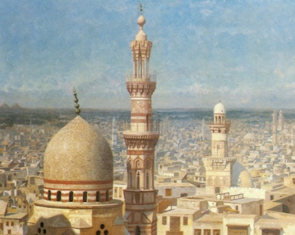

  
[Intangible Textual Heritage](../../index)  [Asia](../index.md) 

------------------------------------------------------------------------

[Buy this Book at
Amazon.com](https://www.amazon.com/exec/obidos/ASIN/1859581994/internetsacredte.md)

------------------------------------------------------------------------

<table width="75%">
<colgroup>
<col style="width: 50%" />
<col style="width: 50%" />
</colgroup>
<tbody>
<tr class="odd">
<td width="50%" data-valign="TOP"> 
View of Cairo (detail), by Jean-Leon Gerome [1890] (Public Domain Image)</td>
<td width="50%" data-valign="CENTER"><h1 id="folklore-and-legends-oriental" data-align="CENTER">Folklore and Legends: Oriental</h1>
<h2 id="by-charles-john-tibbitts" data-align="CENTER">by Charles John Tibbitts</h2>
<h4 id="section" data-align="CENTER">[1889]</h4></td>
</tr>
</tbody>
</table>

------------------------------------------------------------------------

[Contents](#contents)    [Start Reading](flo00.md)    [Page
Index](pageidx)    [Text \[Zipped\]](flotxt.zip.md)   

------------------------------------------------------------------------

|                                                                                                                           |
|---------------------------------------------------------------------------------------------------------------------------|
|  |

This is an anthology of tales from several widely separated Asian
story-telling traditions, with the center of gravity somewhere in
Persia. This was originally published in a series of 'folklore and
legends' volumes by the firm of W.W. Gibbings between 1891 and 1905, and
the author (editor?) is unnamed, but the initials C.J.T. given after the
preface are apparently those of one Charles John Tibbitts. It has been
republished as Oriental Myths and Legends. The book is meant to be
enjoyed as light reading, and the stories are unattributed and
uncredited. However, by internal evidence, the tales originate from
Arabian, Persian, Indian, and Kalmyk sources, and have Islamic, Hindu,
Buddhist and Zoroastrian elements.

Of some interest are the Kalmyk tales; the extended Scheherazade-like
Relations of Ssidi Kur is a märchen-cycle from the Buddhist Kalmyk
people, who today reside on the west shore of the Caspian Sea, and have
strong historical connections to Tibet and Mongolia. This is the only
time that I've seen an English translation of the Ssidi Kur. My best
guess as to the origin of each other tale is indicated in green type
below the title.

*--John Bruno Hare, Jan. 22, 2008.*

------------------------------------------------------------------------

 [Title Page](flo00.md)  
[Prefatory Note](flo01.md)  
[Contents](flo02.md)  
[The Cobbler Astrologer](flo03.md)  
[The Legend of the Terrestrial Paradise of Sheddád, The Son Of
’A’d](flo04.md)  
[The Tomb Of Noosheerwân](flo05.md)  
[Ameen and the Ghool](flo06.md)  

### The Relations of Ssidi Kur

[The Relations of Ssidi Kur](flo07.md)  
[The Adventures of the Rich Youth](flo08.md)  
[The Adventures of the Beggar's Son](flo09.md)  
[The Adventures of Massang](flo10.md)  
[The Magician with the Swine's Head](flo11.md)  
[The History of Sunshine and His Brother](flo12.md)  
[The Wonderful Man Who Overcame the Chan](flo13.md)  
[The Bird-Man](flo14.md)  
[The Painter and the Wood-Carver](flo15.md)  
[The Stealing of the Heart](flo16.md)  
[The Man and His Wife](flo17.md)  
[Of the Maiden Ssuwarandari](flo18.md)  

 

[The Two Cats](flo19.md)  
[Legend of Dhurrumnath](flo20.md)  
[The Traveller's Adventure](flo21.md)  
[The Seven Stages of Roostem](flo22.md)  
[The Man Who Never Laughed](flo23.md)  
[The Fox and the Wolf](flo24.md)  
[The Shepherd and the Jogie](flo25.md)  
[The Perfidious Vizier](flo26.md)  
