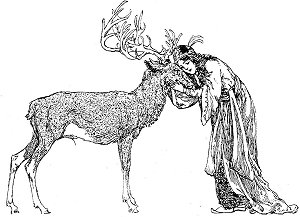
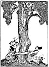
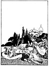
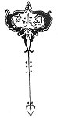

  
[Intangible Textual Heritage](../../index)  [Asia](../index.md) 
[Index](index)  [Previous](ftft03)  [Next](ftft05.md) 

------------------------------------------------------------------------

Forty-four Turkish Fairy Tales \[1913\], at Intangible Textual Heritage

------------------------------------------------------------------------

p. 3

 

|                     |
|---------------------|
|  |

NCE UPON A TIME there was an old Padishah who had a son and a daughter.
In due time he died and his son reigned in his stead, and it was not
long before the young man dissipated the whole fortune bequeathed by his
father.

|                    |
|--------------------|
|  |

One day he said to his sister, "My dear, we have spent all our fortune.
If it should become known that we have no money we should have to leave
this neighbourhood, as we could never look anyone in the face. We had
better go away quietly now, before it is too late." So they gathered
their belongings together, and left the palace secretly in the night.
They journeyed they knew not whither until they reached a great plain of
apparently limitless dimensions. Almost overcome by the heat of the day
and ready to succumb to fatigue they presently espied a pool. "Sister,"
said the brother to the maid, "I can make no further step with. out a
drink of water." "But brother," she answered, "who knows whether it is
water or not? As we have endured so long, surely we can hold out a
little longer, when perhaps we shall find water."

But the brother objected. "No, I go no further; I must drink if I am to
live." There upon the sister fetched a draught,

p. 4

which the young man drank greedily; and scarcely had he done so than he
was transformed into a stag.

The maid lamented bitterly. What should she do now? What was done was
done, and they resumed their journey. They wandered on over the great
plain until they came to a large spring by a tall tree; here they
decided to rest. "Sister," said the stag, "climb the tree; I will go and
endeavour to find food." The maid accordingly climbed the tree, and the
stag went foraging in the vicinity. Soon he caught a hare, which the
sister prepared for their meal. In this way the two lived from day to
day until several weeks had passed by.

Now it chanced that the Padishah's horses were accustomed to be watered
from the spring by the tree. In the evening slaves brought them, and
while they were quenching their thirst in a trough, the animals saw the
reflection of the maid on the clear surface of the water, and timidly
drew back. The slaves thinking that the water was perhaps not clean,
emptied the trough and refilled it. Still the horses shrank back and
refused to drink, and at length the slaves related this unaccountable
incident to the Padishah.

"Perhaps the water is muddy," suggested the potentate. "Oh no," answered
the slaves, "for we have emptied the trough and refilled it with fresh
water." "Go back," said the Padishah, "and look around; probably there
is something in the neighbourhood that frightens them." So they went
again, and drawing near they caught sight of the maid in the top of the
tree. Immediately they went back to their master with the news of their
discovery. The Padishah, deeply interested, hurried to the spot, and,
looking up into the tree, saw a maiden beautiful as the full moon, whom
to see was to desire. "Are you a spirit or a fairy?" called out the
Padishah to her. "Neither spirit nor fairy, but a child born of man,"
answered the maid.

In vain the Padishah besought her to come down; she had not sufficient
courage to do so and the Padishah, aroused to anger, gave orders to

p. 5

[  
Click to enlarge](img/00500.jpg.md)  
The Padishah gave orders to fell the tree  

p. 6

fell the tree. The slaves took hatchets and hacked and split the tree on
every side, and it was almost ready to fall when night came down upon
them and they were compelled to postpone their task. They had hardly
disappeared when the stag came out of the forest, and seeing the state
of the tree, he questioned his sister as to what had transpired.

"You did well," said the stag when he had heard the story. "Do not come
down under any circumstances." Then going to the tree, the stag licked
it, and lo! the trunk became thicker than it was before.

|                                                           |
|-----------------------------------------------------------|
|  |

Next morning the stag went into the forest again, and when the
Padishah's people came, great was their surprise to see that not only
was the tree whole but that it was even thicker than be. fore.
Nevertheless they resumed their work, and had about half completed their
task when night once more suspended the operations. To be brief, when
the slaves had gone home the stag came again and licked the tree, with
the same result as before, only that the trunk was thicker than ever.
Scarcely had the stag gone away next morning than the Padishah came
again with his woodcutters, and seeing that the tree was whole and sound
he decided to seek other means to accomplish his purpose. He went
therefore to an old woman who followed the calling of a witch and
related the story, promising her much treasure if she would entice the
maiden down from the tree.

The witch willingly undertook the task, and carrying to the spring an
iron tripod, a kettle, and other things, she placed the tripod on the
ground

p. 7

with the kettle on the top of it, but bottom upward. Then drawing water
from the spring, pretending to be blind, she poured the water not in the
vessel but outside it. The maiden seeing this and believing the woman to
be really blind, called to her from the tree: "Mother, you have set the
kettle upside down and the water is falling on the ground." "Oh my
dear," began the old creature, "where are you? I cannot see you. I have
brought dirty clothes to wash. For the love of Allah, come and place the
kettle aright, so that I can get on with my washing." But fortunately
the maiden remembered the stag's warning and remained where she was.

Next day the witch came again, stumbled under the tree, lit a fire, and
brought forth meal. Instead of the meal, however, she began to place
ashes in the sieve. "Poor blind woman! " called the maiden from the
tree, "You are not putting meal but ashes into your sieve." "I am blind,
my dear," said the witch fretfully, "I cannot see; come down and help
me." Once again, however, her ruse was unsuccessful and the maiden could
not be induced to disregard her brother's warning.

On the third day the witch came once more to the tree, this time
bringing a lamb to slaughter. But as she took up the knife she attempted
to press the handle instead of the blade into the animal's throat. The
maiden, un. able to endure the torture of the poor creature, forgot
everything else and came down to put it out of its misery. She soon
repented of her rashness, for hardly had she set foot upon the ground
than the Padishah, who was hidden behind the tree, pounced upon her and
carried her off to his palace.

The maiden found such favour in the eyes of the Padishah that he desired
ardently to marry her at once, but she refused to consent until her
brother, the stag, was brought to her. Slaves were therefore dispatched
to find the stag and they soon brought him to the palace. This done, the
twain never left each other's side; they slept together and arose
together. When the marriage was celebrated, the stag still would not
quit his sister, and

p. 8

when at night they retired, he struck her lightly with his forefeet
saying "This is the brother-in-law's bone; this is the sister's bone."

|                     |
|---------------------|
|  |

ime comes and goes, storytime more quickly, and with lovers the most
quickly of all. Ours would have lived altogether happily but for a black
slave-woman in the palace who was overcome with jealousy because the
Padishah had chosen the maiden from the tree instead of herself. This
woman awaited an opportunity for revenge which was not long in coming.
In the vicinity of the palace was a beautiful garden, in the midst of
which was a large pond. Here the Sultan's wife was accustomed to come
for pastime; in her hand a golden drinking-cup, on her feet silver
shoes. One day as she stood by the pond the slave darted from her
hiding-place and plunged her mistress head first into the water, to be
swallowed by a large fish which swam in the pond.

The black woman returned to the palace as though nothing had happened,
and donning her mistress's robes she put herself in her place. When
night came the Padishah inquired of his supposed wife what had happened
that her face was so changed. "I have been walking in the garden and
have become sunburnt," she answered. The Padishah, nothing doubting,
drew her to his side and spoke words of consolation; but the stag came
in, and recognising the deception, stroked the pair gently with his
forefeet saying; " This is the brother-in-law's bone; this is the
sister's bone."

The slave was now fearful lest she might be exposed by the stag, so she
set herself to contrive a means to get rid of him.

Next day she feigned illness, and by money and fine words persuaded the
physicians to tell the Padishah that his consort was dangerously ill and
only by eating a stag's heart could she hope for recovery. The Padishah
went to his supposed wife and asked her whether it would not grieve her
if her brother, the stag, were slaughtered. "What am I to do?" sighed
she; "if I die evil will befall him. It is better he should be killed;
then I shall not die, and he will be delivered from his animal form."
The Padishah

p. 9

[  
Click to enlarge](img/00900.jpg.md)  
The Padishah recovers his wife  

p. 10

thereupon gave orders to sharpen the knife and heat water in the boiler.

|                     |
|---------------------|
|  |

HE poor stag perceived the hurrying to and fro, and understood full well
its dire significance. He fled to the pond in the garden and called
three times to his sister:

"The knife is being sharpened,  
The water in the boiler is heated;  
My sister, hasten and help!"

Thrice he was answered from the interior of the fish:

"Here am I in the fish's stomach,  
In my hand a golden drinking-cup,  
On my feet silver shoes,  
In my lap a little Padishah!"

For a son had been born to the Sultan's wife even while she lay in the
fish's stomach.

The Padishah, with some followers intent on the capture of the stag,
came up in time to overhear the conversation at the pond. To draw out
the water was the work of a few minutes; the fish was seized, its belly
slit, and behold! there lay the Sultan's true consort, a golden
drinking-cup in her hand, silver shoes on her feet, and her little son
in her arms. Transported with joy the monarch returned to the palace and
related the occurrence to his suite.

Meanwhile the stag, by chance licking up some of the blood of the fish,
was changed again into human form. He rejoined his sister, and judge of
the additional happiness which she felt at seeing her beloved brother
again in his natural shape.

The Padishah now commanded the Arabian slave-woman to be brought before
him, and demanded of her whether she preferred forty swords or forty
horses. She answered: "Swords to cut the throats of my enemies;

p. 11

for myself forty horses, that I may ride." Thereupon was the vile woman
bound to the tails of forty horses, which setting off at a gallop tore
her to pieces.

Then the Padishah and his consort celebrated their marriage a second
time. The Stag-Prince also found a wife among the ladies of the court;
and for forty days and forty nights there were rare festivities in
honour of the double wedding. As they ate, drank, and accomplished their
object; let us also eat, drink, and accomplish that which we have set
out to do.

 

------------------------------------------------------------------------

[Next: Fear](ftft05.md)
