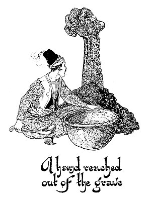
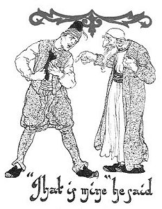
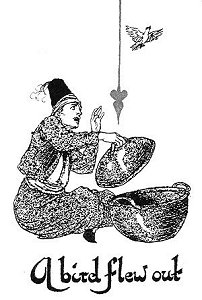
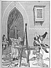

  
[Intangible Textual Heritage](../../index)  [Asia](../index) 
[Index](index)  [Previous](ftft04)  [Next](ftft06) 

------------------------------------------------------------------------

Forty-four Turkish Fairy Tales \[1913\], at Intangible Textual Heritage

------------------------------------------------------------------------

p. 12

 

|                     |
|---------------------|
|  |

NCE a very long time ago there was a woman who had a son. Sitting . both
together one evening, the mother said to her son: "Go, my child, and
shut the door, for I have fear." "What is fear?" the boy asked his
mother. "When one is afraid," was the answer. "What then can this thing
fear be?" pondered the son: "I will go and find it." So he set out, and
came to a mountain where he saw forty robbers who lighted a fire and
then seated them selves around it. The youth went up and greeted them,
whereon one of the robbers addressed him:

|                    |
|--------------------|
|  |

"No bird dares to fly here, no caravan passes this place: how then dost
thou dare to venture?"

"I am seeking fear; show it to me."

"Fear is here, where we are," said the robber.

"Where?" inquired the youth.

Then the robber commanded: "Take this kettle, this flour, fat, and
sugar; go into that cemetery yonder and make helwa therewith."

"It is well," replied the youth, and went.

In the cemetery he lit a fire and began to make the helwa. As he was
doing so a hand reached out of the grave, and a voice said: "Do I get
nothing?" Striking the hand with the spoon, he answered mockingly:
"Naturally I should feed the dead before the living." The hand vanished,
and

p. 13

|                                                   |
|---------------------------------------------------|
|  |

having finished cooking the helwa the youth went back to the robbers.

"Hast found it?" they asked him.

"No," replied he. "All I saw was a hand which appeared and demanded
helwa; but I struck it with the spoon and saw no more of it."

The robbers were astonished. Then another of them remarked: "Not far
from here is a lonely building; there you can, no doubt, find fear."

He went to the house, and entering, saw on a raised plat. form a swing
in which was a child weeping; in the room a girl was running hither and
thither. The maiden approached him and said: "Let me get upon your
shoulders; the child is crying and I must quieten it." He consented, and
the girl mounted. While thus occupied with the child, she began
gradually to press the youth's neck with her feet until he was in danger
of strangulation. Presently, with a jerk that threw him down, the girl
jumped from his shoulders and disappeared. As she went a bracelet fell
from her arm to the floor.

Picking it up, the youth left the house. As he passed along the road, a
Jew, seeing the bracelet, accosted him. "That is mine," he said.

"No, it is mine," was the rejoinder.

"Oh, no, it is my property," retorted the Jew.

"Then let us go to the Cadi," said the youth. "If he awards it to thee,
it shall be thine; if, however, he awards it to me, it remains in my
possession."

p. 14

So accordingly they went, and the Cadi said: "The bracelet shall be his
who proves his case." Neither, however, was able to do this, and finally
the judge ordered that the bracelet should be impounded till one of the
claimants should produce its fellow, when it would be given up to him.
The Jew and the youth then parted.

|                                            |
|--------------------------------------------|
|  |

On reaching the coast, the boy saw a ship tossing to and fro out at sea,
and heard fearful cries proceeding from it. He called out from the
shore: "Have you found fear?" and was answered with the cry, "Oh, woe,
we are sinking!" Quickly divesting him self of his clothes, he sprang
into the water and swam toward the vessel. Those on board said: "Someone
is casting our ship to and fro, we are afraid." The youth, binding a
rope round his body, dived to the bottom of the sea. There he discovered
that the Daughter of the Sea (Deniz Kyzy) was shaking the vessel. He
fell upon her, flogged her soundly, and drove her away. Then, appearing
at the surface, he asked: "Is this fear?" Without awaiting an answer he
swam back to the shore, dressed himself, and went his way.

Now as he walked (along he saw a garden, in front of which was a
fountain. He resolved to enter the garden and rest a little. Three
pigeons disported themselves around the fountain. They dived down into
the water, and as they came up again and shook themselves each was
transformed into a maiden. They then laid a table, with drinking
glasses. When the first carried a glass to her lips the others inquired:
"To whose health drinkest thou?" She answered: "To that of the

p. 15

youth who, in making helwa, was not dismayed when a hand was stretched
out to him from a grave." As the second maiden drank, the others again
asked: "To whose health drinkest thou?" And the answer was: "To the
youth on whose shoulders I stood, and who showed no fear though I nearly
strangled him," Hereupon the third took up her glass. "Of whom art thou
thinking?" questioned the others. "In the sea, as I tossed a ship to and
fro," the maiden replied, "a youth came and flogged me so soundly that I
nearly died. I drink his health."

|                     |
|---------------------|
|  |

ARDLY had the speaker finished when the youth himself appeared and said:
"I am that youth." All three maidens hastened to embrace him, and he
proceeded: "At the Cadi's I have a bracelet that fell from the arm of
one of you. A Jew would have deprived me of it but I refused to give it
up. I am now seeking its fellow."

The maidens took him to a cave where a number of stately halls that
opened before him overwhelmed him with astonishment. Each was filled
with gold and costly objects. The maidens here gave him the second
bracelet, with which he went directly to the Cadi and received the
first, returning without loss of time to the cave. "You part from us no
more," said the maidens. "That would be very nice," replied the youth,
"but until I have found fear I can have no rest" Saying this he tore
himself away, though they begged him earnestly to remain.

Presently he arrived at a spot where there was an immense crowd of
people. "What is the matter?" the youth inquired, and was informed that
the Shah of the country was no more. A pigeon was to be set free, and he
on whose head the bird should alight would be declared heir to the
throne. The youth stood among the curious sightseers. The pigeon was
loosed, wheeled about in the air, and eventually descended on the
youth's head. He was at once hailed as Shah; but as he was unwilling to
accept the dignity a second pigeon was sent up. This also rested on the
youth's head. The same thing happened a third time. "Thou art our Shah!"
shouted the people. "But I am seeking fear; I will

p. 16

|                                   |
|-----------------------------------|
|  |

not be your Shah," replied he, resisting the efforts of the crowd to
carry him off to the palace. His words were repeated to the widow of the
late ruler, who said: "Let him accept the dignity for tonight at least;
tomorrow I will show him fear." The youth consented, though he received
the not very comforting intelligence that whoever was Shah one day was
on the following morning a corpse. Passing through the palace, he came
to a room in which he observed that his coffin was being made and water
heated. Nevertheless, he lay down calmly to sleep in this chamber; but
when the slaves departed he arose, took up the coffin, set it against
the wall, lit a fire round it and reduced it to ashes. This done, he lay
down again and slept soundly.

When morning broke, slaves entered to carry away the new Shah's corpse;
but they rejoiced at beholding him in perfect health, and hurried to the
Sultana with the glad tidings. She thereupon called the cook and
commanded: "When you lay the supper tonight, put a live sparrow in the
soup-dish."

Evening came. The young Shah and the Sultana sat down to supper, and as
the dish was brought in the Sultana said: "Lift the lid of the dish."
"No," answered the youth; "I do not wish for soup." "But please lift
it," repeated the Sultana persuasively. Now as the youth stretched out
his hand and lifted the lid, a bird flew out. The incident was so
unexpected that it gave him a momentary shock of fear. "Seest thou! "
cried the Sultana. "That is fear."

p. 17

[  
Click to enlarge](img/01700.jpg)  
He observed that his coffin was being made  

p. 18

"Is it so?" asked the youth. "Thou wast indeed afraid," replied the
Sultana.

Then the marriage feast was ordered, and it lasted forty days and forty
nights. The young Shah had his mother brought to his palace and they
lived happily ever after.

 

------------------------------------------------------------------------

[Next: The Three Orange Peris](ftft06)
