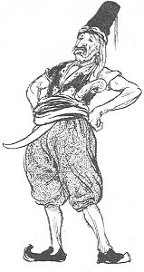
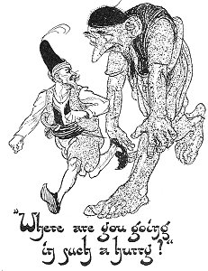
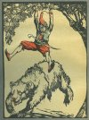

  
[Intangible Textual Heritage](../../index)  [Asia](../index) 
[Index](index)  [Previous](ftft08)  [Next](ftft10) 

------------------------------------------------------------------------

Forty-four Turkish Fairy Tales \[1913\], at Intangible Textual Heritage

------------------------------------------------------------------------

p. 50

 

|                     |
|---------------------|
|  |

HERE was once a woman who had a husband who was so timid that he never
dared to go out alone. On one occasion the woman was invited to a party,
and as she was about to set out her husband implored her to make haste
back, as he would be forced to remain in the house until her return. She
promised to do so; and had hardly been with her friends half an hour
when she got up to take leave. "Why must you go home so soon?" asked her
hosts. She answered that her husband was at home waiting for her. "Why
does he wait?" they asked.

|                    |
|--------------------|
|  |

"He dare not go out without me," was the reply. "That is strange,"
observed the women, and prevailed upon her to remain a little longer.
They advised her that next time she went out with her husband after
dark, she should slip away from him, and leave him alone in the
darkness. By that means he would be cured.

The woman followed this advice, and on the first opportunity that
offered, she left her husband alone in the darkness. The man cried out
in his terror until at last he fell asleep where he waited. At daybreak
he awoke, and went angrily into the house.

Among his possessions was a rusty old

p. 51

knife bequeathed him by his father. He took it up and while cleaning it
uttered a resolution not to live with his wife any more. He accordingly
set out and came to a place where honey had been spilt, on which a swarm
of flies were regaling themselves. Drawing his knife across the sticky
mass, he found that he had killed sixty of the flies. He drew it across
a second time and counted seventy victims. Immediately he went to a
cutler and ordered him to engrave on the knife: "At a single stroke Kara
Mustafa, the great hero, has killed sixty, and at the second stroke
seventy." The inscription finished, the knife was returned to its owner,
who went his way.

|                                                  |
|--------------------------------------------------|
|  |

Presently he came to a wilderness, and when night fell he lay down and
slept, sticking his knife into the earth. Now in this locality dwelt
forty Dews, one of whom took an early walk every morning. The Dew saw
the sleeping man and the knife, and as he read the inscription upon the
latter he was seized with terror. Seeing that Mustafa was now waking up,
the Dew, with a view to appeasing this redoubtable person, begged him to
join his brothers’ company. "Who are you?" asked the hero. "We are Dews
to the number of forty, and if you will deign to join us we shall be
forty one." "I am willing," said Mustafa; "go and tell the others."
Hearing this the Dew hastened to his fellows and said: "My brothers, a
hero desires to join us. His immense strength may be gathered from the
inscription

p. 52

on his knife: 'At a single stroke Kara Mustafa, the great hero, has
killed sixty, and at the second stroke seventy.' Let us put everything
in order, for he will be here directly."

But the Dews hastened to meet Mustafa, who when he saw them felt his
courage sink. However, he managed to address them. "God greet you,
comrades!" he exclaimed. The Dews modestly returned his greeting and
offered him a place among them. By and by he inquired: "Is there among
you any fellow like me?" The Dews assured him that there was not. Thus
satisfied, Mustafa proceeded: "Because, if so, let him step forth and
try his strength with me." "Where shall his equal be found?" exclaimed
the Dews, as they walked home.

The Dews were obliged to carry their water from a long distance, and
this duty was performed in turn by each of their number. Being of
gigantic stature and strength, they were of course able to carry a
quantity impossible for a mere mortal. On the following day one of the
Dews accosted Mustafa: "It is your turn to fetch the water, and we are
sorry to say the well is far away." Being afraid of the hero, the Dews
naturally addressed him somewhat apologetically. Mustafa reflected, and
then asked for a rope. It was given him, and he proceeded with it to the
well. The Dews, full of curiosity to know what he intended to do with
the rope, looked on from a distance, and saw him attach it to the
stonework of the well. Astonished, they ran up and shouted to him to
know what he was about. "Oh," he answered, "I am only going to put the
well on my back and bring it home, so that none of us need go so far for
water again!" They begged him for Allah's sake to desist, and he
promised to do so on the understanding that they would not trouble him
again with the duty of water-carrying.

A few days afterwards it was Mustafa's turn to fetch wood from the
forest. Again he asked for the rope, and went. The Dews hid them selves
and watched him. On the edge of the forest they saw him drive a peg into
the ground and fix the rope, which he then drew round the

p. 53

trees. By chance the wind rose and shook the trees to and fro. "What are
you doing, Mustafa?" shouted one of the Dews. "Oh, I am only going to
take home the forest all at once instead of piecemeal, to save trouble."
"Don't shake the trees! " cried all the Dews. "You will destroy the
whole forest. We would rather fetch the wood ourselves."

|                     |
|---------------------|
|  |

HE Dews were now more afraid of Mustafa than ever, and they called a
council to deliberate on the best means of getting rid of their
formidable associate. It was eventually decided to pour boiling water
upon him during the night while he slept, and thus kill him. Fortunately
for himself, however, he overheard the conversation, and prepared
accordingly. When evening came he went to bed as usual. The Dews heated
the water and poured it through the roof of his dwelling. But Mustafa
had laid a bolster in the place where he should have been; on the
bolster he had placed his fez, and he had drawn up the bedcover. Then he
betook himself to a corner of the room, where he lay down and slept
soundly out of harm's way. When morning broke the Dews came in the
belief that he was dead, and knocked at the door. "Who's there?" came a
voice from the inside. The astonished and affrighted Dews called to him
to get up, as it was already nearly midday. "It was very hot last
night," he observed; "I lay bathed in perspiration." The astonishment of
the Dews that boiling water had no further effect upon him than to make
him perspire may be imagined.

The Dews next resolved to drop forty iron balls upon Mustafa while he
slept: those would surely kill him. This plan also our hero overheard.
When bedtime came he entered his room and arranged the bolster as
before, putting his fez upon it and drawing up the cover, after which he
retired to his corner to await developments. The Dews mounted the roof,
and lifting some of the tiles, looked down upon what appeared to be
their sleeping companion. "Look, there is his chest; there is his head,"
they whispered, and thud came the balls one after the other.

Next morning the Dews went to Mustafa's house and knocked at the

p. 54

door. This time no answer came, and they began to congratulate them
selves that the hero would trouble them no more. But as a measure of
precaution they knocked again and also uttered loud shouts. Then they
found their rejoicing had been premature, for Mustafa's voice was heard:
"I couldn't sleep last night for the mice gambolling over me; let me
rest a little longer." The Dews were now nearly crazy. What manner of
man was this, who thought heavy iron balls were mice?

|                     |
|---------------------|
|  |

FEW days afterwards the Dews said to Mustafa: "In the adjoining country
we have a Dew-brother: will you fight a duel with him?" Mustafa inquired
whether the Dew were a strong fellow. "Very," was the reply. "Then he
may come." In saying this, however, our hero was ready to die of fright.
When the gigantic Dew appeared on the scene, he proposed to preface the
duel by a wrestling bout. This being agreed to, they repaired to the
field. The Dew caught Mustafa by the throat and held him in such a
mighty grasp that his eyes started from their sockets. "What are you
staring at?" demanded the Dew, as he relaxed his grip on Mustafa's neck.
"I was looking to see how high I should have to throw you so that all
your limbs would be broken by your fall," answered our hero in
well-simulated contempt. Hearing this, all the Dews fell upon their
knees before him and begged him to spare their brother. Mustafa
accordingly graciously pardoned his adversary; and the Dews further
entreated him to accept a large number of gold-pieces and go home.
Secretly rejoicing, he accepted the proffered money and expressed his
willingness to go. Taking a cordial farewell of them all, he set out in
the company of a Dew, who had been deputed to act as his escort.

When he arrived in sight of his home Mustafa saw his wife looking out of
the window; and as her gaze rested upon him she cried, "Here comes my
coward of a husband with a Dew!" Mustafa made a sign to her, behind the
Dew's back, to say nothing, and then began to run toward the house.
"Where are you going in such a hurry?" demanded the

p. 55

[  
Click to enlarge](img/05500.jpg)  
''What are you staring at?'' demanded the Dew.  

p. 56

\[paragraph continues\] Dew. "Into the
house to get a bow and arrow to shoot you," was the answer of the flying
hero. On hearing this the Dew made off back again to rejoin his
brothers.

Mustafa had hardly had time to rest in his home when news was brought of
a fierce bear that was playing havoc in the district.

The inhabitants went to the vali and begged him to order the hero to
slay the depredator. "He has already encountered forty Dews," they said.
"It is a pity that the bear should kill so many poor people."

|                                                        |
|--------------------------------------------------------|
|  |

The vali sent for Mustafa and informed him that it was unseemly that the
people should be terrorized by a bear while the province held such a
valorous man as himself. Then spake Mustafa: "Show me the place where
the bear is, and let forty horsemen go with me." His request was
granted. Mustafa went into the stable took a handful of small pebbles,
and flung them among the horses. The creatures all with the exception of
one began to rear. This Mustafa himself took. When the horsemen saw what
he did, they remarked to the vali that the man was mad and they were not
disposed to help him to hunt the bear. The vali advised them: "As soon
as you hear the bear, go away and leave him to it, to do what he will."
So the cavalcade set out, and when presently they came to the bear's

[  
Click to enlarge](img/05601.jpg)

p. 57

hiding-place the mounted escort left our hero in the lurch and rode
back. Mustafa spurred his steed, but the animal would not move, and the
bear came at him with ungainly strides. Seeing a tree close at hand, our
hero sprang on to the back of his horse, clutched at the overhanging
branches, and pulled himself up. The bear came underneath the tree and
was preparing to ascend when Mustafa, letting go his hold, alighted on
its back, and boxed bruin's ears so severely that he set off in the
direction the horsemen had taken. Catching sight of them, he yelled:
"Kara Mustafa, the hero, is coming!" Whereon they all wheeled round,
and, understanding the situation, dispatched the bear with their lances.

After this the fame of Kara Mustafa spread far and wide. The vali
conferred upon him various marks of honour, and he enjoyed the respect
of his neighbours to his long life's end.

 

------------------------------------------------------------------------

[Next: The Wizard-Dervish](ftft10)
