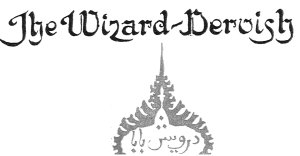
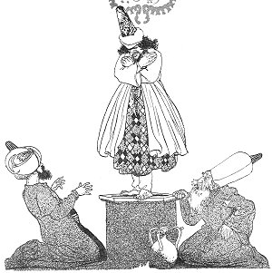
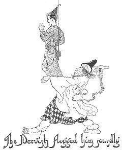
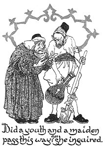
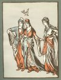
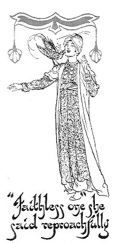
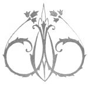

  
[Intangible Textual Heritage](../../index)  [Asia](../index) 
[Index](index)  [Previous](ftft09)  [Next](ftft11) 

------------------------------------------------------------------------

Forty-four Turkish Fairy Tales \[1913\], at Intangible Textual Heritage

------------------------------------------------------------------------

p. 58

 

|                     |
|---------------------|
|  |

LONG time ago lived a Padishah who had no son. 

|                    |
|--------------------|
|  |

As he was taking a walk with his lala one day, they came to a well, near
which they stopped to wish. A dervish suddenly appeared and cried: "All
hail, my Padishah!" upon which the latter made answer: "If you know that
I am the Padishah, then can you tell me the cause of my sorrow." The
dervish drew an apple from his breast and said: "Your sorrow is that you
have no son. Take this apple; eat half yourself and give the other half
to your wife; then in due time you shall have a son. He shall belong to
you till his twentieth year afterwards he is mine." With these words he
vanished.

The Padishah went home to his palace, and cut the apple, sharing it with
his wife according to the instructions of the dervish. Some time

p. 59

later, as the wizard had promised, a little prince came to the palace
and the Padishah, in his great joy, ordered the happy event to be
celebrated throughout his dominions.

|                                                   |
|---------------------------------------------------|
|  |

When the boy was five years old a tutor was appointed to teach him
reading and writing. In his thirteenth year he began to take walks and
go on journeys, and soon after wards he took part in the hunting
excursions also. When he was nearing his twentieth year his father began
to think of finding him a wife. A suitable maiden being discovered, the
young couple were betrothed, but on the very day of the wedding, when
all the guests had assembled in readiness for the ceremony, the dervish
came and carried off the bridegroom to the foot of a mountain. With the
words "Remain in peace" he went away. In great fear the young Prince
looked around him, but saw nothing more alarming than three white doves
flying towards the river on whose bank he was resting.

As they alighted, they were transformed into three beautiful maidens,
who entered the water to bathe. Presently two of them came out, resumed
their bird forms, and flew away. As the third maiden left the water, she
caught sight of the young Prince. Much astonished at his presence, she
inquired how he had come there.

"A dervish carried

p. 60

me hither," he answered, whereon the girl rejoined: "That dervish is my
father. When he comes, he will take you by your hair, hang you on that
tree, and flog you with a whip. 'Dost know? he will ask, and to this
question you must answer, 'I know not.'" Having given this advice, the
girl, transforming herself into a white dove, flew quickly away.

Presently the young Prince saw the dervish approaching with a whip in
his hand. He hung the youth by his hair to a tree; flogged him soundly,
and asked, "Dost know?" When the young Prince answered "I know not" the
dervish went away. For three days in succession the youth was beaten
black and blue; but when the dervish had satisfied himself that his
victim under stood nothing at all, he set him free.

|                                                                            |
|----------------------------------------------------------------------------|
|  |

When the youth was out walking one day the dove came to him and said:
"Take this bird and hide it. When my father asks which of the three
maidens you desire, point to me; if, however, you do not recognise me,
produce the bird and answer: 'I desire the maiden to whom this bird
shall fly.'"

Saying this the dove flew away.

The next day the dervish brought with him the three maidens and asked
the youth which of them pleased him best. The youth accordingly produced
the bird and said that he desired her to whom the bird should fly. The
bird was set free and alighted on the maiden who had instructed

[  
Click to enlarge](img/06001.jpg)

p. 61

him. She was given in marriage to the youth, but without the consent of
her mother, who was a witch.

While the youth and the maiden were walking together, they saw the
mother coming after them. The maiden, giving the youth a knock, changed
him into a large garden, and by another knock changed herself into a
gardener. When the woman came up she inquired: "Gardener, did not a
maiden and a youth pass this way?" The gardener answered: "My red
turnips are not yet ripe--they are still small." The witch retorted: "My
dear Gardener, I do not ask about your turnips, but about a youth and a
maiden." But the gardener only replied: "I have set no spinach, it will
not be up for a month or two." Seeing she was not understood, the woman
turned and went away. When the woman was no longer in sight, the
gardener knocked the garden, which became a youth again, and knocked
herself and became a maiden once more.

|                     |
|---------------------|
|  |

HEY now walked on. The woman turning back and seeing them together,
hastened to overtake them. The maiden also turned round and saw her
mother hurrying after them. Quickly she gave the youth a knock and
turned him into an oven, knocked herself and became a baker. The mother
came up and asked: "Baker, have not a youth and a maiden passed this
way?" "The bread is not yet baked--I have just put it in; come again in
half an hour, then you may have some," was the answer. At this the woman
said: "I did not ask you for bread; I inquired whether a youth and a
maiden had passed this way." The reply was as little to the point as
before. "Wait a while; when the bread is ready we will eat" When the
woman saw she was not understood she went away again. As soon as the
coast was clear the baker knocked the oven, which became a youth, and
knocked herself back into a maiden; then they pursued their way.

Looking back once more the woman again saw the youth and the maiden.

She now realised that the oven and the baker were the runaways in

p. 62

disguise, and hurried after them. Seeing that her mother was coming, the
maiden again knocked the youth and changed him into a pond; herself she
changed into a duck swimming upon the water. When the woman arrived at
the pond she ran to and fro seeking a place whence she could reach the
opposite side. At length, seeing she could go no further, she turned
round and went home again. The danger over, the duck struck the pond and
changed it into the youth; and transformed herself into a maiden as
before; upon which they resumed their journey. 

|                                                            |
|------------------------------------------------------------|
|  |

Wandering onward they came at length to the birthplace of the youth,
where they entered an inn. Then said he to the maiden: "Remain here
while I fetch a carriage to take you away." On the road he encountered
the dervish, who seized him and transported him immediately to his
father's palace, and set him down in the great hall where the
wedding-guests were still waiting. The Prince looked round at them all,
and rubbed his eyes, Had he been dreaming? "What can it all mean?" he
said to himself.

Meanwhile, the maiden at the inn, seeing that the youth returned not,
said to herself: "The faithless one has forsaken me." Then she
transformed herself into a dove, and flew to the palace. Through an open
window she entered the great hall, and alighted on the Prince's
shoulder. "Faithless one!" she said reproachfully, "to leave me alone at
the inn whilst you are making merry here!" Saying this, she flew back
immediately to the inn.

When the youth realised that it was no dream, but fact, he took a
carriage and returned without delay to the inn, put the maiden into the

p. 63

coach, and took her to the palace. By this time the first bride had
grown tired of waiting for so eccentric a bridegroom and had gone home.
So the Prince married the dervish's daughter, and the wedding
festivities lasted forty days and forty nights.

 

------------------------------------------------------------------------

[Next: The Fish-Peri](ftft11)
