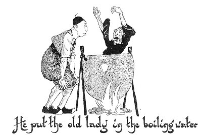
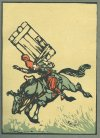
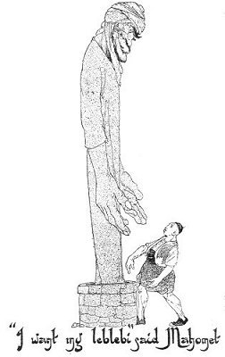

  
[Intangible Textual Heritage](../../index)  [Asia](../index) 
[Index](index)  [Previous](ftft14)  [Next](ftft16) 

------------------------------------------------------------------------

Forty-four Turkish Fairy Tales \[1913\], at Intangible Textual Heritage

------------------------------------------------------------------------

p. 95

 

|                     |
|---------------------|
|  |

HEN the camel was a messenger, when frogs could fly, and when I used to
roam up hill and down dale, there lived two brothers together. Besides
their mother and poverty they had a little live-stock which they had
inherited from their father. 

|                    |
|--------------------|
|  |

Now the younger brother, who was bald, conceived one day the idea of
dividing their little property; so he went to his elder brother and
said: "you see these two stalls; the one is quite new, the other almost
worn out. Let us turn all the cows loose, and those that return to the
new stall shall be mine, the others yours." "Oh, no, Mahomet," answered
the other, "those that return to the old stall shall be yours." Mahomet
agreed. The cows were let loose, and all returned to the new stall
except a miserable old blind one. Mahomet uttered not a word of
complaint or dissatisfaction, but daily drove his blind cow to pasture,
returning regularly every evening.

One day as Mahomet was sitting by the road. side, the wind blowing
violently through the

p. 96

trees made the branches bend and creak. Mahomet accosted the tree thus:
"Eh, creaker, have you seen my brother?" The tree apparently not
hearing, creaked all the louder. Mahomet repeated his question, and as
again the tree did not reply the bald-head became furious, took his axe
and proceeded to cut it down. But lo! an avalanche of gold-pieces fell
out of the hollow trunk through the incisions he had made. Making use of
what little sense he had, Mahomet went home and borrowed an ox from his
elder brother, yoked it to a cart, procured sacks, which he filled with
earth, and went therewith to the tree. Arrived at the spot, he emptied
the sacks and refilled them with the gold. On his return home he amazed
his brother with the sight of so much wealth.

|                                                            |
|------------------------------------------------------------|
|  |

The younger brother was again seized with a desire to divide--the elder,
we may be sure, having no objection this time. He borrowed a measure
from a neighbour, exciting that worthy man's curiosity as to what that
stupid fellow Mahomet could have to measure. The neighbour smeared the
inside of the measure with bird lime, and when the bald-head returned
the article a gold-piece was found adhering to it. This neighbour
related his discovery to another, that

[  
Click to enlarge](img/09601.jpg)

p. 97

one to a third, and in a short time the whole village knew of Mahomet's
luck.

The possession of so much gold occasioned the two brothers much
perplexity. They did not know what to do with it. Eventually they took
spades, dug a deep trench, buried the money, and hastened to leave their
native place. After setting off, however, the elder bethought himself
that he had not locked the house-door, and he dispatched the younger to
see to it. On reaching home it occurred to Mahomet that he ought to
secure his mother's silence; so he heated a boiler of water, put the old
lady in, and kept her there until she uttered no further sound. He then
took her out, supported her against the wall with a broom, put the door
on his back and went with it to his brother in the forest.

When the elder saw the door and understood what had happened to his
mother he became very angry with the bald-head, who flattered himself
that he had done something extremely clever in bringing away the door to
prevent anyone opening it. The elder took the younger by the scruff of
his neck and shook him violently. While reflecting what he should do
further he saw three horsemen riding along the road. In their fright the
brothers thought the cavaliers were pursuing them, and anxious to escape
they climbed up a tree, carrying the door with them. As it was already
dark they were not discovered. Mahomet reflected that they were lucky to
have escaped with their lives, and in this grateful frame of mind he let
the door fall on the head of one of the cavaliers who was just passing
beneath.

The rider whom it struck put spurs to his horse and galloped quickly
away with the cry: "Mercy on us! It is the end of the world!" A few days
after this adventure the elder brother had had enough of the younger's
vagaries, and secretly forsook him. What could Mahomet do now? He was
alone in the world, He wandered on, weary and hungry, till at length he
reached a village. He took up his position at the door of the djâmi and
begged paras and food from the passersby.

p. 98

A little man with a thin beard came out of the djâmi, and on seeing
Mahomet asked him if he would like to become his servant. "Yes,"
answered Mahomet, "if you promise never to be angry with me whatever
happens. If ever you become angry with me, I have the right to kill you;
if, on the other hand, I ever become angry with you, you have the right
to kill me." As it was very difficult to obtain a servant in this
locality, the man agreed to this extraordinary condition.

The bald-head commenced his duties by slaughtering all his master's
fowls and sheep. "Are you angry with me, master?" he asked. "No, of
course not. Why should I be angry?" returned the affrighted man.
Henceforth, however, Mahomet's duties consisted of sitting in the house
doing nothing.

|                     |
|---------------------|
|  |

HE master's wife was afraid that soon it might be her turn to follow the
fowls and sheep, so in order to escape from the madman she persuaded her
husband to go away with her secretly by night. But Mahomet, hearing of
their intention, hid himself in the luggage, and when it was opened in
another village he stepped out. Now the husband and wife took counsel
together, and as a measure of safety resolved that all should sleep at
night on the seashore; Mahomet should go with them, and they would seize
the opportunity while he slept to cast him into the sea and drown him.
Mahomet, however, had so much cunning that he threw in the woman
instead, and she was drowned. "Are you angry with me, master?" he asked.
"Why should I not be angry with thee, thou wretch!" cried the man. "Thou
hast not only ruined me in fortune and brought me to beggary, but now
thou hast bereft me of my wife!" Upon this the bald-head seized him,
and, reminding him of the condition of his employment, cast him also
into the sea after his wife.

Mahomet, once more alone in the world, tramped about, drank coffee, and
smoked his pipe. One day he found a five-para piece, with which he
bought leblebi. While eating them he accidentally dropped one, which
fell into the well and was lost. Now Mahomet began to cry: "I want

p. 99

|                                                       |
|-------------------------------------------------------|
|  |

my leblebi! I want my leblebi!" and this loud bellowing brought to the
surface an Arab with two such immense lips that one swept the sky and
the other the earth. "What willst thou?" he demanded of Mahomet. "I want
my leblebi! I want my leblebi!" the bald-head continued to scream. The
Arab disappeared in the well, and presently came up again holding in his
hands a small table. Giving it to the bald-head, he said: "When thou art
hungry say, 'Table, be laid!' and when thou art satisfied say, 'Table,
enough!"

Mahomet took the table and went to the village. When hungry he had only
to say, "Table, be laid!" and the most expensive dishes were set before
him; the food was so delicious he hardly knew of what to partake first.
In his conceit he thought, "I should like the villagers to see this," so
he invited them all to supper. When they arrived and saw neither fire
nor food, they concluded their host was jesting with them. But when the
fellow brought in his little table and pronounced the words, "Table, be
laid!" the feast was ready in a moment. All ate their fill, and went
home envying their bald neighbour and devising various schemes to
deprive him of his wonderful piece of furniture. Finally it was settled
that one of their number should creep into Mahomet's house during his
absence and steal the magic table.

p. 100

Thus it came about that Mahomet felt the pangs of hunger once more, What
should he do? He went to the well and began to cry: "I want my leblebi!
I want my leblebi!" and the Arab appeared. "Where is the table?" "It has
been stolen!" The Arab with the thick lips popped down into the well and
reappeared with a hand-mill. Giving it to the bald-head, he said: "Turn
to the right--gold; turn to the left--silver." So the fellow took the
mill home, and turned so many times right and left that his floor was
strewn with money. He was now a richer man than ever had been in the
village before. 

|                                                  |
|--------------------------------------------------|
|  |

Somehow the villagers got wind of the precious mill, and one fine day it
was missing. "I want my leblebi! I want my leblebi!" was again the cry
at the well. The Arab came up and demanded: "Where are the table and the
mill?" "Both have been stolen from me," lamented the bald-head. The Arab
went down again and appeared with two sticks, which he gave to our hero,
cautioning him strictly against saying other than the words, "Cudgels,
come together!"

Mahomet took the sticks and examined them. Desiring to put their
efficacy to the test, he pronounced the words, "Cudgels, come together!"
and immediately they flew out of his hands and commenced to beat him
most mercilessly. "Stop, cudgels!" he exclaimed as soon as he had
overcome his

p. 101

surprise, and they ceased belabouring him. Though sore from his
chastisement, Mahomet was glad nevertheless, for he had already thought
of the use to which he should apply his sticks.

Hastening home, he invited all the villagers to his house, though
without divulging his reason for calling them thus together. They came
eagerly, full of curiosity to see what other wonderful thing he had to
show them. At the auspicious moment Mahomet introduced his couple of
sticks, and at the words "Cudgels, come together!" fearful strokes
descended on the heads and bodies of the guests. They began to cry out
for mercy, but Mahomet declined to utter the formula by which the
punishment ceased until all had promised to return him the table and the
mill. The articles were brought back without loss of time and peace was
restored.

The bald-head took his three magic gifts and went to his native village,
where he rejoined his brother. Being now wise and wealthy, our hero, as
well as his brother, married and lived a merry life. Henceforth there
was no more prudent man in the village than Mahomet the Bald-head.

 

------------------------------------------------------------------------

[Next: The Storm Fiend](ftft16)
