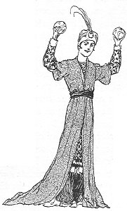
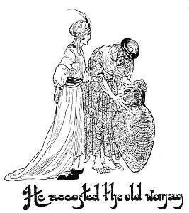
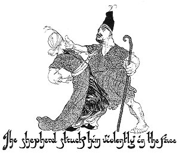
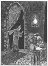
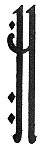

  
[Intangible Textual Heritage](../../index)  [Asia](../index) 
[Index](index)  [Previous](ftft16)  [Next](ftft18) 

------------------------------------------------------------------------

Forty-four Turkish Fairy Tales \[1913\], at Intangible Textual Heritage

------------------------------------------------------------------------

p. 117

 

|                     |
|---------------------|
|  |

N olden time lived a Padishah who had three sons. 

|                    |
|--------------------|
|  |

One day as the youngest was sitting in a kiosk, near which was a spring,
there came an old woman to draw water. The boy threw a stone at her jug
and broke it. Saying nothing the old woman went away, and presently
returned with another jug. Again the youth threw a stone and shattered
the jug. The woman went away as before, and returned a third time. The
boy saw her, threw a stone at her jug and broke it as on the two
previous occasions. Now spake the old woman:

"May you fall in love with the Laughing Apple and the Weeping Apple!"
she said. With these words she disappeared.

A few days afterwards the words of the old woman began to take effect,
and the King's son was actually in love with the Laughing Apple and the
Weeping Apple. Day by day he grew paler and weaker. As soon as his
father heard that he was ill, he sent for the hodjas and physicians, but
such an in disposition was beyond their skill.

One day a physician told the Padishah that the youth was lovesick. Upon
this the

p. 118

monarch went to his son and asked what ailed him. The youth answered
that he was in love with the Laughing Apple and the Weeping Apple. "What
is to be done?" asked the father. "Where are the two apples to be
found?" Then said the youth: "With your permission I will go and seek
them." The Padishah endeavoured to dissuade him, but the youth remained
obstinate, determined at all costs to go in search of the apples. As his
two elder brothers were willing to accompany him the father at length
consented, and one day the party set out on their journey.

Up hill, down dale, and across the plains they wandered on, until one
day they came to a spring where three roads met. Here was a notice set
up for the information of travellers to the effect that whoever took the
first road would return, whoever took the second road might return or
not return; whoever took the third road would never return. The eldest
of the brothers said he would take the first road, the middle brother
elected to take the doubtful road, while the youngest was willing to
take the road which promised no return. Ere they separated the youngest
said: "How may we know which of us returns first? Let us take off our
rings, put them under this stone, and as we return let each one take up
his ring again." Thus they agreed, and set out on their several ways.

The eldest walked on and on until he reached a land where there was a
swimming-bath, and he engaged himself as a servant. The middle brother
also wandered on and on until he came to a land where there was a
coffeehouse; he entered and became an attendant.

Now we will see how the youngest fared. After long journeying he arrived
one day at a spring where he saw an old woman drawing water. He accosted
her with the words: "Mother, could you give me shelter just for
tonight?" She answered: "My son, I have only a small hut, so small that
when I lie down my feet are outside; where then could I put you?" He
showed the old woman a handful of gold, and begged her to find room for
him somewhere. As soon as she caught

p. 119

sight of the gold-pieces she said: "Come, my son, I have a large house.
For whom should I make room if not for you?" Accordingly they went home
together. As they sat at supper the youth asked: "Tell me, mother, where
can I meet with the Laughing Apple and the Weeping Apple?"

|                                             |
|---------------------------------------------|
|  |

Hardly had the question left his lips than the old woman struck him on
the mouth crying: "Silence! their names are forbidden here!"

The youth offered her another handful of gold, on receiving which she
said: "Get up in the morning and cross that mountain opposite; there you
will meet a shepherd--the shepherd of the palace in which the Laughing
Apple and the Weeping Apple are to be found. If you can win his favour
you may gain admittance to the palace. But take care, and as soon as you
have obtained possession of the apples make haste back to me."

So next morning he went across the mountain and there found the
shepherd, who was minding his sheep. He greeted him courteously, and the
man returned the salutation. While in conversation the youth asked the
shepherd about the Laughing Apple and the Weeping Apple. Hardly were the
words out of his mouth than the shepherd struck him so violently in the
face that he nearly fell. "Why do

p. 120

you strike me, shepherd?" asked the youth. "What! You still ask
questions? I'll soon silence you!" answered the shepherd, and again he
struck him in the face. But the youth pleaded more earnestly than
before, and gave the shepherd a handful of gold.

|                                                                 |
|-----------------------------------------------------------------|
|  |

Being thus placated, the shepherd said to the youth: "I will now kill a
sheep, so that I may make a leathern bottle of its skin; slip you into
the skin. When it is evening and I drive the sheep home to the palace,
you can go in with the sheep. At night when everybody is asleep go up to
the first floor and steal unobserved into the chamber on the right.
There lies the Sultan's daughter in bed, and the apples will be found on
the shelf near her. If you can get them away, it is well; but if not, it
is all over with you.

The shepherd accordingly killed a sheep, hid the youth in its skin and
drove the sheep to the serai. The youth succeeded in entering without
discovery.

When night came on and everybody was asleep, the youth stole forth from
the skin of the sheep, and crept carefully and slowly to the first
floor. Entering the chamber indicated by the shepherd, he saw therein a
bed on which lay a lovely maiden, beautiful as the moon at the full,

p. 121

[  
Click to enlarge](img/12100.jpg)  
The youth was beside himself with astonishment  

p. 122

She had black eyebrows, blue eyes, and golden hair; her equal surely did
not exist in the world. So beautiful was she that the youth was beside
himself with astonishment. While he gazed upon the maiden, one of the
two apples on the shelf began to laugh, the other to weep bitterly. The
youth shut the door quickly and ran back to the sheep. The noise made by
the apples awakened the maiden. She got up, and seeing no one, looked
about the room, scolded the apples for their stupidity, and lay down
again.

After a while the maiden fell asleep once more, and the youth went
upstairs, opened the door slowly and carefully, and entered. He took a
few steps towards the apples, and again one began to laugh, the other to
weep. The maiden woke up, but saw no one. "You naughty creatures!" she
cried; "this is the second time you have waked me; if you do so again I
shall cut you through." Then she lay down again. When she was asleep the
youth came again, opened the door, went straight to the apples, and as
he took them from the shelf they began to laugh and weep. But the youth
ran off, and when the maiden awoke for the third time there was nothing
to be seen. "You impudent creatures!" she cried; "have you gone mad that
you have waked me up a third time?" She struck them both and lay down
again.

A short time afterwards the youth came a fourth time to the apartment,
went to the shelf and took down the apples, which now made no sound,
being angry at the treatment they had received. Quickly he made his exit
and returned to the sheep.

When morning dawned the shepherd led his flock to the mountain. Then the
youth crept out of the sheepskin, gave the shepherd another handful of
gold, and saying "It was Allah's will!" went back to the house of the
old woman. When she saw the youth she filled a large basin with water,
then killed a fowl and let its blood flow into the vessel. This done she
put a plank into the water and set the youth upon it.

We will now return to the serai. When the maiden awoke, she saw

p. 123

that the apples were no longer on the shelf. "Oh, what has become of my
apples?" she exclaimed, searching everywhere, but without avail. "Woe is
me! my apples have been stolen. Three times they woke me, but I did not
understand. A thief has been here!"

|                     |
|---------------------|
|  |

HE maiden wept continually and sighed: "Oh, my apples! Oh, my apples!"
When it came to the ears of her father, the Padishah, he ordered the
gates of the city to be closed immediately, and a thorough search was
instituted, but nowhere could the apples be found. He sent for the
astrologers, who, consulting the stars, announced that he who had stolen
the apples was at that moment in a ship on a sea of blood. "Oh,
Padishah!" they said, "he must be very far away, for we know not where
there is such a sea of blood." The monarch realized that there was no
chance of catching the thief, so the city gates were opened again.

The youth presented the old woman with a few more gold-pieces, and
commending her to Allah, he set off again in search of further
adventures. Some days later he found himself by the spring where he had
parted from his brothers. Lifting the stone under which they had put
their rings, he saw that neither of his brothers had yet returned.
Replacing his own ring on his finger, he now set out along the road
taken by his middle brother.

He wandered on and on, up hill, down dale, and across the plains,
drinking water from the river, resting in the desert, listening to the
song of the nightingales, till one day he came to a certain country.
Entering a town he sought out a coffeehouse, and while drinking coffee
and smoking his chibouque he recognized his middle brother serving
coffee. His brother, however, knew him not. Calling him aside, he spoke
to him, asking him so many questions that at length the elder recognized
his brother. Then they both set off together and in due time arrived at
the spring. The second ring was taken up and the pair now resolved to
look for their eldest brother. They discovered him eventually, and made
themselves known to him, and now all three returned to the spring.

p. 124

On the way they asked the youngest whether he had secured the apples.
"Of course," answered he, and brought them forth. They had hardly
glanced at the two apples than they fell in love with them, and begged
their brother to let them hold the apples in their hands. The youth com
plied and gave them up. Being now in possession of the magic fruit, the
two elder resolved to kill their youngest brother and divide the apples
between them.

They went to a coffeehouse, where they sat down in the garden, and after
ordering something to eat, asked the proprietor for a mat. In the garden
was an open well; this they covered with the mat, and their youngest
brother (not knowing of the well) sat on the mat and fell down to the
bottom. The others, affecting not to notice his disappearance, ate,
drank, and smoked, and eventually rose up and went away. When they
arrived home their father asked what had become of his youngest son. The
brothers answered that they had found the Laughing Apple and the Weeping
Apple, but their youngest brother had taken the way from which there was
no returning, and consequently they had seen him no more. The father
shed tears, but hoped that if his son were still living he would find
his way home before long.

Now, when the youth fell down the well, which was dry, he was not
killed, but merely stunned. He soon returned to consciousness, and
shouted several times in the hope of being heard. The coffeehouse keeper
happened to be taking a walk in the garden. Hearing the cry he sent down
a man to bring up the youth. Thanking his rescuer cordially the youth
went his way, but not to his father's house; instead, he offered himself
as apprentice to a tinsmith.

One day the Padishah whose daughter's apples had been stolen ordered a
rosary of a thousand beads to be made, and this he sent by the hands of
his servants into all countries. The magic power of this rosary was such
that he who had stolen the apples would, on telling the beads, relate a
full account of the incident.

p. 125

At length the rosary reached the land where the three brothers lived.
When the youth heard of it he informed his master, the tinsmith, that he
would tell the beads. Word was sent to the Padishah's servants, who
brought him the rosary and requested him to begin. The youth said he was
willing to do so, but only in the presence of the Padishah of that land.

|                     |
|---------------------|
|  |

E was brought before the Padishah, to whom the affair was explained. The
monarch consented to be a witness, and the rosary was handed to the
youth, who began his task. He related a complete account of his
adventures in search of the apples, and when he came to the part about
his brothers casting him down the well, the rosary was finished. Now the
Padishah, recognising his son, fell on his neck and kissed him, weeping
for joy.

The strangers begged the Padishah to allow his youngest son to return
with them, and consent was given; not, however, until the two wicked
brothers had been severely punished. They started on their long journey
and after many days came to the home of the apples. There the youth was
taken before the Padishah, who as soon as he saw him felt his heart go
out to the young Prince. The monarch ordered him to tell the beads
before him.

Once more the youth related his adventure with the apples. When the
story was ended the Padishah offered him his daughter in marriage, so
that both the youth and the maiden might rejoice in the possession of
the apples they both loved. Very willingly the young Prince consented;
and with festivities lasting forty days and forty nights the lovers were
united.

As they attained happiness, we will now seek our divan.

 

------------------------------------------------------------------------

[Next: The Crow-Peri](ftft18)
