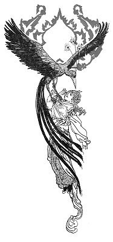
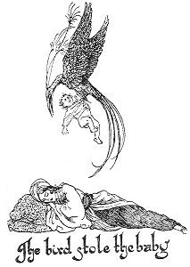
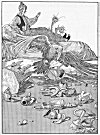
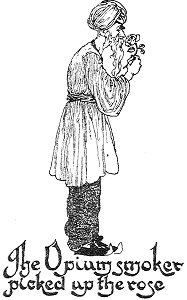

  
[Intangible Textual Heritage](../../index)  [Asia](../index) 
[Index](index)  [Previous](ftft20)  [Next](ftft22) 

------------------------------------------------------------------------

Forty-four Turkish Fairy Tales \[1913\], at Intangible Textual Heritage

------------------------------------------------------------------------

p. 150

 

|                     |
|---------------------|
|  |

N very remote times there lived a Padishah whose daughter was so much
attached to her governess that she scarcely ever left her side. 

|                    |
|--------------------|
|  |

One day, seeing the latter deep in thought, the Princess asked: "Of what
are you thinking?" "I have sorrow," answered the governess. "What is
sorrow?" questioned the Padishah's daughter; "let me also have it." "It
is well," said the woman, and went to the tscharschi, where she bought a
Bird of Sorrow in a cage. She presented it to the maiden, who was so
delighted that she amused herself day and night with the creature.

Some time afterwards the Sultan's daughter, attended by her slaves, paid
a visit to the Zoo. She took with her the bird in its cage, which she
hung upon the branch of a tree. Suddenly the bird commenced to speak.
"Set me free a little while, Sultana," it pleaded, "that I may play with
the other birds. I will come back again." The Princess accordingly set
her favourite at liberty.

A few hours later, while the Princess was sauntering idly

p. 151

about the park, the bird returned, seized its mistress and flew off with
her to the top of a high mountain. "Behold! this is sorrow," said the
bird; "I will prepare more of it for you!" Saying this he flew away. The
Princess, now hungry and thirsty, wandered about until she met a
herdsman, with whom she exchanged raiment, so that she might disguise
herself as a man for her better protection. After long wandering she
came to a village where, finding a coffeehouse, she entered, and
besought the proprietor to engage her as his assistant. The former,
regarding her as a young man in need of employment, accordingly engaged
her, and towards evening went home, leaving her in charge of the house.
Having closed the shop, the girl lay down to sleep. At midnight, how.
ever, the Bird of Sorrow appeared, broke all the cups and saucers and
nargiles in the place, woke the maiden from her sleep, and thus
addressed her: "Behold! this is sorrow; I will prepare more of it for
you!" Having thus spoken he flew away as before. All night long the poor
girl lay thinking what she should say to her master on the morrow. When
morning came the proprietor returned, and seeing the woeful damage done,
beat his assistant severely and drove her away.

Her eyes filled with bitter tears, she set out once more, and ere many
hours arrived at a tailor's shop. As preparations were being made for
the great religious feast of Bairam, the tailor was busy in executing
orders for the serai. He was therefore in need of an extra hand, and
took the youth, as he supposed the girl to be, into his service. After a
day or two the tailor went away, leaving the maiden alone in the house.
When evening came she closed the shop and retired to rest. At mid. night
came the bird again, and tore to shreds all the clothes on the premises,
and waking up the girl, said: "Behold! this is sorrow; I will prepare
still more of it for you!" and flew off again. Next morning brought the
master, who seeing the clothing all torn up, called his assistant to
account. As the girl answered nothing, the master beat her soundly and
sent her away.

p. 152

Weeping bitterly she once more set forth, and by and by came to a
fringe-maker's, where she was taken in. Being again left alone, she fell
asleep. The Bird of Sorrow reappeared, tore up the fringes, woke the
girl, made his customary speech, and flew away as on previous occasions.

When the master returned next morning and saw the mischief, he beat his
assistant more cruelly than ever, and dismissed her. Overwhelmed with
grief, the unhappy maiden again took her lonely way. Feeling sure that
the Bird of Sorrow would give her no peace, she went into a mountain
pass, where she lived in seclusion for many days, suffering the pangs of
hunger and thirst, and in constant fear of the wild beasts that haunted
the region. Her nights were spent in the leafy branches of a tree.

|                                               |
|-----------------------------------------------|
|  |

One day the son of a Padishah, when out hunting, espied the girl in the
tree. Mistaking her for a bird, he shot an arrow at her, but it merely
struck one of the branches. On approaching the tree to reclaim his
arrow, the Shahzada observed that what he had supposed to be a bird
appeared to be a man. "Are you an in or a jin?" he called out. "Neither
in nor jin," was the response, "but a human creature like yourself."
Where upon the Prince permitted her to descend from the tree, and took
the seeming herdsman to the palace. Here, after bathing, she resumed the
garments of a maiden. Then the royal youth saw that she was beautiful as
the moon at the full, and straightway fell violently in love with her.
Without delay he

p. 153

besought his father, the Padishah, to consent to his wedding with her.
The Sultan commanded the maiden to be brought into his presence, and as
he gazed upon her wonderful beauty, her loveliness and grace won his
heart. The betrothal took place forthwith; and after a period of
festivity lasting forty days and forty nights the marriage was
celebrated. In due time a little daughter was born to the princely pair,
a child gentle and fair to look upon, and giving early promise of
becoming as lovely as its mother.

|                                           |
|-------------------------------------------|
|  |

One midnight came the bird, stole the babe, and besmeared the mother's
lips with blood. Then it woke the Princess, and said: "Behold, I am
taking away your child; and still more sorrow will I prepare for you!"
So saying the bird flew off. In the morning the Prince missed his little
daughter, and observed that his wife's lips were blood-stained. Going
quickly to his father, the Padishah, he related the ominous occurrence.

"From the mountain -did you bring the woman," said the Padishah; "she is
forsooth a daughter of the mountain and eats human flesh; there. fore I
counsel you to send her away!" But the devoted Prince pleaded for his
young wife and prevailed over his father.

p. 154

Some time later another daughter was born to them, which also the bird
stole away under similar circumstances. This time the Padishah commanded
that the mother should be put to death, though yielding at length to the
earnest entreaties of his son he grudgingly consented to pardon her.

Time passed away, and eventually a son was born. The Prince, fearing
that if this child also should disappear his beloved wife would surely
be put to death, determined to lie awake at night and keep watch and
ward over his loved ones. Tired nature, however, insisted on her toll
and the Prince slept.

Meanwhile the bird returned, stole the babe, besmeared the Princess's
lips with blood as before, and flew away. When the poor mother awoke and
discovered her terrible loss, she wept bitterly; and when the Prince
also awoke and found the child missing and his wife's mouth and nose
dripping with blood, he hastened to his father with the awful
intelligence. The Padishah, in a violent rage, again condemned the woman
to death. The executioners were summoned; they bound her hands behind
her and led her forth to execution. But so smitten were they with her
ravishing beauty, and so stricken with pity for her sore affliction,
that they said to her:

"We cannot find it in our hearts to kill you. Go where you will, only
return not again to the palace."

The poor ill-fated woman again sought her mountain refuge, brooding over
her sad lot; until one day the bird once more appeared, seized her and
carried her off to the garden of a grand palace.

Setting down his burden, the bird shook himself, and lo! he was suddenly
transformed into a handsome youth. Taking her by the hand, he led the
disconsolate woman upstairs into the palace. Here a wonderful sight met
her eyes. Attended by many servants, three beautiful children, all
radiant and smiling, approached her. As her astonished gaze fell upon
them, her eyes filled with tears of joy and her heart melted with
tenderness.

p. 155

[  
Click to enlarge](img/15500.jpg)  
The Bird of Sorrow broke all the cups and saucers  

p. 156

Escorting the now happy and wondering Princess into a stately apartment,
richly carpeted and furnished with all the art of the luxurious Orient,
the youth thus addressed her: "Sultana, though I afflicted you with much
grief and sorrow, robbed you of your precious children, and nearly
brought you to an ignominious death, yet have you patiently borne it all
and not betrayed me. In reward I have built for you this palace, in
which I now restore to you your loved ones. Behold your children!
Henceforth, Sultana, I am your slave." The Princess hastened with winged
feet to her long-lost children, embraced them, pressed them to her
bosom, and covered them with kisses.

How fared it with the Prince?

|                                                       |
|-------------------------------------------------------|
|  |

Sorrowing for his children and for his beloved wife, whom he believed to
have been put to death, he grew morose and melancholy, passing the time
with his old opium smoker, who beguiled the hours with indifferent
stories.

One day, having no more opium, the old man requested the Prince's
permission to go to the tscharschi in order to buy more. On his way
thither he saw something he had never before beheld: a large and
magnificent serail! "It is remarkable," thought the old fellow; "I
frequent this street daily, yet have I not seen this palace before. When
can it have been built? I must inspect it."

p. 157

The Sultana, whose palace it was, happened to be at one of the windows
and caught sight of her husband's opium smoker. The slave--formerly her
Bird of Sorrow--being in attendance, he respectfully suggested: "What
say you, lady, to playing a trick on the Prince's old storyteller?" At
these words he threw a magic rose at the feet of the greybeard. The
latter picked it up, inhaled its exquisite perfume, and muttered to
himself: "If your rose is so beautiful, how must it be with yourself!"
So instead of returning home he entered the palace.

The Prince in the meantime grew concerned over the prolonged absence of
the old man and sent his steward to look for him. The steward, arriving
before the palace, the door of which had been left open intentionally by
the slave, went in to look round. A number of female slaves received him
and led the way up the stairs. At the top he was handed over to the
magician slave, who requested him to remove his outer robe and precede
him. The robe was taken off without difficulty, but the steward was
astonished to find that in spite of all his efforts he was quite unable
to remove his fez. At this the magician ordered him to be cast out "for
refusing to take off his fez." The steward was therefore forcibly
ejected. But no sooner was he outside than--wonderful to relate--the fez
fell from his head of its own accord! On his way home he overtook the
old opium smoker. Meanwhile the Shahzada was troubled at the non-return
of his steward and dispatched his treasurer after him. The treasurer met
both on the road and demanded to know what had befallen them. The old
opium smoker answered somewhat enigmatically: "If a rose be thrown from
that palace, take care not to smell it, or the consequences be on your
own head." And the steward warned him no less mysteriously: "When you
enter that palace, be sure to leave your fez at the door!"

The treasurer considered the behaviour of both his companions some what
peculiar, but taking their warning lightly he entered the palace. Inside
he was ordered to don a dressing-gown before proceeding upstairs.
Commencing to undress for the purpose, he discovered that his schalwar

p. 158

refused to part company with his person. Consequently he was
unceremoniously thrown out of the palace. Hardly, however, was he
outside than his schalwar came off by itself!

The Prince becoming unable longer to endure the unaccountable absence of
his servants, set out himself to discover, if possible, what had
happened to them. On the way he met all three, who counselled him in an
excited manner: "If a rose be thrown to you from the palace, be careful
not to smell it; when you enter, be sure to leave your fez at the door;
and before you arrive there, take off your schalwar and enter without
it!"

The Prince was exceedingly puzzled at such extraordinary advice, yet he
straightway went to the serail and disappeared from sight within the
portal. Unlike his servants, the Prince was received with every mark of
honour and respect, and conducted to a noble hall. Here a lady of
remarkable beauty, surrounded by three lovely children, awaited him.

The lady gave to her eldest child a stool, to the second a towel, and to
the youngest a tray; into the tray she put a bowl, into the bowl a pear,
and beside it a spoon. The eldest set the stool on the floor, the second
offered the towel to the Prince, while the youngest sat himself down in
the bowl. The Prince then inquired of the children: "How long has it
been the custom to eat pears with a spoon?" "Since human beings have
eaten human flesh," they answered in chorus. The chord of memory was
struck; the past flashed before the mind's eye of the Prince. Here the
magician appeared and cried: "Oh Prince, behold thy Sultana! Behold also
thy children!" Whereat all--father, mother, and children--fell on each
other's necks weeping for joy.

The magician continued: "My Shahzada, I am your slave; if, however, you
deign to give me my liberty, I will hasten to my own parents."
Overflowing with gratitude for their reunion, they immediately set the
magician slave free and prepared a new festival, happy in the knowledge
that henceforth they would never be parted from each other.

------------------------------------------------------------------------

[Next: The Enchanted Pomegranate Branch and the Beauty](ftft22)
