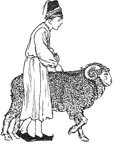
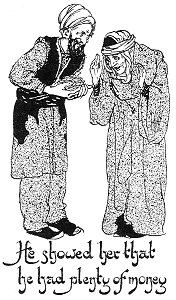

  
[Intangible Textual Heritage](../../index)  [Asia](../index) 
[Index](index)  [Previous](ftft30)  [Next](ftft32) 

------------------------------------------------------------------------

Forty-four Turkish Fairy Tales \[1913\], at Intangible Textual Heritage

------------------------------------------------------------------------

p. 238

 

|                     |
|---------------------|
|  |

HERE was once a woman who had a son. To whatever school she sent him, he
always ran away. Perplexed, the mother asked the boy "Where shall I send
you?" To which he answered: "Do not send me, but go with me; if I like
the place I will not run away." So she took him with her to market, and
there they watched a number of men working at various handicrafts, and
among them was a wizard.

|                    |
|--------------------|
|  |

The boy was very much attracted by this last, and requested his mother
to apprentice him to the wizard. She went to the man and told him her
son's desire. The matter was soon arranged to their mutual satisfaction,
and the boy was left with his master, as the wizard was henceforth to
be.

In the course of time the youth had learnt all that the wizard was able
to teach him, and one day his master said: "I will transform myself into
a ram; take me to market and sell me, but be sure to keep the rope." The
youth agreed, and the wizard accordingly changed himself into a ram. The
youth took the animal to the auctioneer, who sold it in the marketplace.
It was bought by a man for five hundred

p. 239

piastres, but the youth kept the rope as he was instructed. In the
evening the master, having resumed his human form, escaped from the
buyer of the ram and came home.

Next day the wizard said to his pupil: "I am now going to transform
myself into a horse; take me and sell me, but guard the rope." "I
understand," answered the youth, and led the horse to market, where it
was sold by auction for a thousand piastres. The pupil kept the rope,
however, and came home. An idea struck him: "Now let me see," said he to
himself, "whether I cannot help myself," and he went to his mother.
"Mother," said he when they met, "I have learnt all that was to be
learnt. Many thanks for apprenticing me to that wizard; I shall now be
able to make a great deal of money." The poor woman did not understand
what he meant, and said: "My son, what will you do? I hope you are not
going to run away again and give me further trouble." "No," he answered.
"Tomorrow I shall change myself into a bathing establishment, which you
will sell; but take care not to sell the key of the door with it, or I
am lost."

While the youth was thus discoursing with his mother, the wizard escaped
from the man who had bought him as a horse, and came home. Finding his
apprentice not there, he became angry. "You good-for-nothing; you have
sold me completely this time, it seems; but wait until you fall into my
hands again!" That night he remained at home, and next morning went out
in search of his truant pupil.

The youth transformed himself into a beautiful bathing establishment,
which his mother put up for sale by auction. All the people of the town
were astonished at its magnificence, and multitudes collected round the
auctioneer. The wizard was among the crowd, and guessed at once that
this stately building was in reality his rascally pupil. He said nothing
of that, however, but when all the pashas, beys, and other people had
bid their highest he bid higher still, and the building was knocked down
to him. The woman was called, and when the wizard was about

p. 240

|                                                             |
|-------------------------------------------------------------|
|  |

to hand her the money she explained that she could not give up the key.
Then the wizard said he would not pay unless he received it. He showed
her that he had plenty of money, and observed to the woman that that
particular key was of no importance to her; she could easily buy another
if she must have one. Many of the bystanders expressed their agreement
with the purchaser, and as the woman knew not the true significance of
keeping the key, she parted with it to the wizard in return for the
price of the bathing establishment. When she gave up the key the youth
felt that his time had come, so he changed himself into a bird and flew
away. His master, however, changed himself into a falcon and pursued
him. They both flew a long distance until they reached another town,
where the Padishah was entertaining himself with his court in the palace
garden.

As a last resource, the youth now changed himself into a beautiful rose
and fell at the feet of the Padishah. The King expressed his surprise at
seeing the rose, as that flower was not then in season. " It is a gift
from Allah," he concluded. "It smells so sweetly that not even in the
rose-flowering season could its equal be found."

The wizard now resumed his human form and entered the garden, lute

p. 241

in hand, as a minnesinger. As he was striking his instrument he was
observed by the Padishah, who, calling him, ordered him to play and sing
his songs. In one of his impromptu ballads the singer requested the
Padishah to give him the rose. Hearing this the King was angry, and
said: "What say you, fellow? This rose was given me by Allah! How dare
you, a mere wanderer, demand it?" "O Shah," answered the singer, " my
occupation is obvious; I have fallen in love with the rose you possess.
I have been seeking it for many years, but till now have I been unable
to find it. If you give it not to me I shall kill myself. Would not that
be a pity? I have followed it over hill and fell, to find it now in the
hands of the mild and gracious Padishah. Have you no pity for a poor man
like me, who has lost love and light and happiness? Is it seemly to
afflict me thus? I will not move from this spot until you give me the
rose."

The Padishah was moved, and said to himself: "After all, of what
consequence is the rose to me? Let the unfortunate man attain his
object." Saying these words he stepped forward and handed the flower to
the singer. But before the latter could grasp it, it fell to the ground
and was changed into millet pulp. Quickly the wizard transformed himself
into a cock and ate

 

p. 242

it up. One grain, however, fell under the Padishah's foot and so escaped
the cock's attention. This grain suddenly changed into the youth, who
picked up the cock and wrung its neck--in other words, he disposed of
his master.

The Padishah was astonished at these strange proceedings, and commanded
the young man to explain the riddle. He told the King every thing from
beginning to end, and the monarch was so delighted with his skill in
magic that he appointed him Grand Vezir and gave him his daughter in
marriage. The young man was now able to provide for his mother, and thus
everybody lived happily ever after.

 

------------------------------------------------------------------------

[Next: The Padishah of the Thirty Peris](ftft32)
