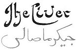
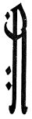
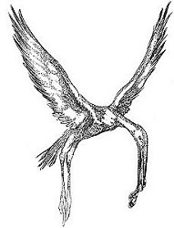
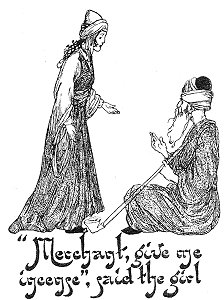
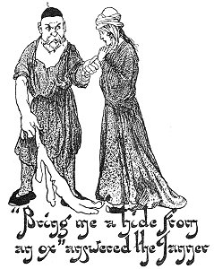
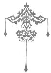

  
[Intangible Textual Heritage](../../index)  [Asia](../index) 
[Index](index)  [Previous](ftft36)  [Next](ftft38) 

------------------------------------------------------------------------

Forty-four Turkish Fairy Tales \[1913\], at Intangible Textual Heritage

------------------------------------------------------------------------

p. 286

 

|                     |
|---------------------|
|  |

N old woman once fancied some liver to eat, so she gave her daughter a
few paras with which to buy a portion. "Wash it in the pond and bring it
straight home," she said. The girl went accordingly to the tscharschi,
and having bought the liver, carried it to the pond and washed it. As
she with drew it from the water, however, a stork swooped down upon the
liver and flew off with it. The girl exclaimed: "Give me back the liver,
O stork, that I may take it to my mother, or she will beat me." 

|                    |
|--------------------|
|  |

"If thou wilt give me barley, I will give thee back the liver," replied
the stork.

The girl accordingly went to the farmer and said: "Farmer, give me
barley, that I may give it to the stork, who will give me back the
liver, that I may take it to my mother." Said the farmer: "If thou wilt
pray to Allah for rain, I will give thee barley."

This seemed very simple, but while she was praying: "Send rain, O Allah,
to the farmer, who will give me barley, that I may give it to the stork,
who will give me back the liver, that I may take it to my mother,"

p. 287

there came a man who said that without incense prayer could not
avail.

|                                                                |
|----------------------------------------------------------------|
|  |

So the girl went to the merchant and said: "Merchant, give me incense,
that I may burn it before Allah, who will send rain to the farmer, who
will give me barley, that I may give it to the stork, who will give me
back the liver, that I may take it to my mother."

"I will give thee some," answered the merchant, "if thou wilt bring me
shoes from the shoemaker."

Off the girl went to the shoemaker and said: "Shoemaker, give me shoes,
that I may give them to the merchant, who will give me incense, that I
may burn it before Allah, who will send rain to the farmer, who will
give me barley, that I may give it to the stork, who will give me back
the liver, that I may take it to my mother."

But the shoemaker replied: "First bring me ox-leather, then will I give
thee shoes."

So the girl went to the tanner, and said: "Tanner, give me leather, that
I may give it to the shoemaker, who will give me shoes, that I may give
them to the merchant, who will give me incense, that I may burn it
before Allah, who will send rain to the farmer, who will give me barley,
that I may give it to the stork, who will give me back the liver, that I
may take it to my mother."

p. 288

|                                                                      |
|----------------------------------------------------------------------|
|  |

"Bring me a hide from an ox and I will give thee leather," answered the
tanner. So the girl went to the ox and said: "Ox, give me a hide, that I
may take it to the tanner, who will give me leather, that I may give it
to the shoemaker, who will give me shoes, that I may give them to the
merchant, who will give me incense, that I may burn it before Allah, who
will send rain to the farmer, who will give me barley, that I may give
it to the stork, who will give me back the liver, that I may take it to
my mother."

The ox made answer: "If thou wilt bring me straw I will give thee a
hide."

The girl now went to a peasant and said: "Peasant, give me straw, that I
may give it to the ox, who will give me a hide, that I may take it to
the tanner, who will give me leather, that I may give it to the
shoemaker, who will give me shoes, that I may give them to the merchant,
who will give me incense, that I may burn it before Allah, who will send
rain to the farmer, who will give me barley, that I may give it to the
stork, who will give me back the liver, that I may take it to my
mother."

How could the peasant refuse? "I will give thee straw if thou wilt kiss
me," said he.

The girl concluded that she must kiss the peasant if she would attain
her object. So she kissed him and received the price. She took the straw
to the ox, who gave her a hide, which she took to the tanner,

p. 289

who gave her leather, which she took to the shoemaker, who gave her
shoes, which she took to the merchant, who gave her incense, which she
burnt before Allah, praying: "Give rain, O Allah!" Allah gave her rain,
which she took to the farmer, who gave her barley, which she took to the
stork, who now gave her back the liver, which she took to her mother,
who cooked it, and they ate it up.

 

------------------------------------------------------------------------

[Next: The Fortune Teller](ftft38)
