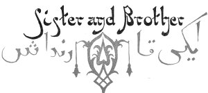
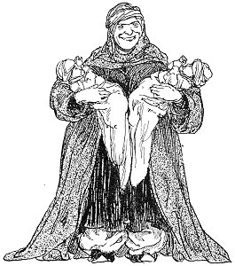
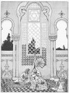
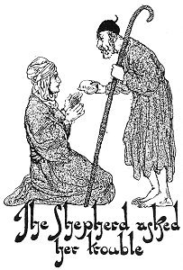
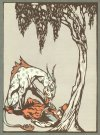
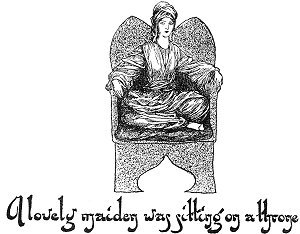

  
[Intangible Textual Heritage](../../index)  [Asia](../index) 
[Index](index)  [Previous](ftft38)  [Next](ftft40) 

------------------------------------------------------------------------

Forty-four Turkish Fairy Tales \[1913\], at Intangible Textual Heritage

------------------------------------------------------------------------

p. 298

 

|                     |
|---------------------|
|  |

HERE once lived a man named Ahmed Aga. He was very rich, and beside his
wife had no one belonging to him. The only thing that disturbed his
happiness was the fact that he had no child. "Allah," said he, "has
endowed me with much property and wealth; I have also an honourable
name; would that He might vouchsafe me a child! Then were my happiness
complete. After my death he would inherit my whole fortune, and my fame
would be enhanced."

|                    |
|--------------------|
|  |

One night he was brooding as usual over this matter and said to his
wife: "Would it not have been better if Allah had given us poverty with
a child?" These words pained his wife very deeply, and before she went
to bed she prayed to Allah for consolation, In the night she dreamt that
she was sitting by the sea-shore. A mermaid came to the surface of the
water with a pot in her hand and said to the woman "Tell your husband
Allah has given him this kismet; let him come and fetch it." She
hastened home to tell her husband and in her excitement woke Ahmed Aga
as well as herself. "What is the matter?" asked the man. "Nothing,"
answered the woman; "but you have waked me."

p. 299

"No," returned the man, "it was you who roused me." Then his wife
recounted what she had seen and heard in her dream. "Then that was why
you woke me," muttered her husband, and turning over went to sleep
again. To his wife, however, the dream was a thing of good omen.

Rising next morning, the woman advised her husband to go down to the
seashore. "It might be no vain dream after all," she mused. "Do not be
foolish," retorted her husband, "our kismet is not in dreams; if Allah
has any gift to bestow on us He will do it by other means." His wife,
how. ever, gave him no peace. "Nevertheless go," she insisted; "the sea
will not engulf you, and maybe Allah will bless us in this wise." The
man could not further withstand his wife, so when he went out for a
stroll, he took the direction of the seashore.

While pacing up and down he noticed that some dark object was being
washed ashore on the crest of the billows. As it came nearer he could
see that it was a pot, the mouth of which was securely bound.
Alternating betwixt hope and fear, he seized the pot and with a
bismillah opened it. Imagine his joy to find therein two newborn babes.

 

p. 300

When Ahmed Aga saw them he was like a child himself; in his delight he
knew not what to do first. Taking off his cloak, he wrapped the babes
carefully in it and ran all the way home. He arrived out of breath, and
dropped the bundle in his wife's lap. When she opened it and saw what it
contained she too was frantic with joy, kissing the children and
pressing them to her heart. The babes being hungry soon began to cry
lustily. This brought the worthy couple to their senses, and soon Ahmed
was on the road in search of a nurse for their unexpected family. Before
long he found a suitable woman, and engaged her at a very generous wage.
As soon as she arrived the cries of the infants were stilled
immediately. On the following day two more nurses were engaged, and thus
cared for the children, a boy and a girl, grew fat and strong.

|                     |
|---------------------|
|  |

N another town there was likewise a man who had no children, although,
like Ahmed Aga, he greatly desired a son. So he and his wife prayed
earnestly to Allah that he would give them a child, and when they
learned that their prayers were to be answered, their rejoicing was
unbounded. The good news came to the ears of a servant who at one time
had been in that household, but having been dismissed by the wife for
neglecting her duties, she was desperately jealous at the happiness
which was coming to her former mistress. Determined to take her revenge,
she presented herself as a nurse, and was engaged. In due time twin
babies, a boy and a girl, were born; but while their mother was
sleeping, and before ever their father had seen them, the false nurse
put the children into a pot, and having sealed it carefully, cast it
into the sea. While the husband was sleeping, the false woman sat by him
and whispered in his ear so that he thought it was a dream sent by
Allah. She told him that he had been deceived and had, after all, no
child. As the mother had been asleep, she could not tell what had become
of her children, and certainly they were nowhere to be found. So the
husband, believing his dream, was very angry at what he thought was his
wife's

p. 301

[  
Click to enlarge](img/30100.jpg)  
The false woman sat by him and whispered in his ear  

p. 302

attempt to deceive him, and he drove her out of his house. The poor
creature had not a friend in the world, and went forth weeping
bitterly.

|                                                  |
|--------------------------------------------------|
|  |

She wandered on from one hill to another, until one day, although it was
dark, it seemed as though each hill was a different colour from the
others. Fear seized upon her heart and tears started from her eyes.
Hunger and fatigue overcame her, and she knew not what to do. Seeing a
tree, she climbed up to spend the night in it and await Allah's pleasure
toward her. Having settled herself among the leafy branches, she wept
herself to sleep. When morning dawned she descended in the hope of
meeting with a passer by or coming to a village where she might obtain a
little bread.

But, alas! no aid was nigh, and after wandering for many hours she sank
down from sheer exhaustion. Presently, however, she saw in the distance
a shepherd, and, summoning the remainder of her little strength, she
accosted him. Offering her bread, the shepherd asked her trouble. When
he had heard it he took pity upon her and led her home to his wife, his
son, and his daughter.

As time went on the poor woman had almost forgotten her sorrow,
excepting her grief for the loss of her children, over whom she often
sighed and wept. How fared they in the meantime?

With the good Ahmed Aga and his wife they grew up to their fourteenth

p. 303

 

year and went together to school. One day the boy was playing with a
companion, who, jealous of his superiority over him, said: "Be off, you
fatherless and motherless brat, found by Ahmed Aga on the seashore." At
these words the boy's brow became clouded, and he ran away angrily to
his foster-mother, telling her what had been said to him. She
endeavoured to calm him, but that same night the boy dreamt of the
shepherd's hut and of his mother, who in the dream related all her
sufferings. When he repeated the dream to his sister, lo! she also had
had a similar dream. Then the boy knew that what his playfellows had
taunted him with was no untruth, but the fact. They went together to
their kind foster-father and told him what they had both dreamt. The
good man was troubled, but confessed that he had indeed found them in a
pot washed up by the waves; of their mother he knew nothing. The

p. 304

brother and sister were in despair at the thought of their poor mother
living in a shepherd's cottage. It was impossible to comfort them, and
finally the boy declared his intention of setting out to find his
mother. His sister was left behind in the kind hands of her
foster-parents.

Spurred on by his heroic courage and anxiety for his mother, the boy
made all haste, and as he lay down to rest under the stars one night the
place of his mother's sojourn was revealed to him in a dream. To cut our
story shorter, we will only say that in one day he covered a five-days,
journey without experiencing either hunger or fear. As he followed the
course indicated in his dream he found his further progress barred by a
hideous dragon. The boy had no weapon, but picking up a large stone he
flung it at the ugly beast with such tremendous force that the creature
reeled backward and fell to the earth. "If you are a man throw another
stone at me," shouted the dragon; but the youth went his way, leaving
the dragon to perish.

Indefatigably the boy travelled, and in due time reached the valley
where his mother had once spent the night in a tree. Here he stopped,
and at the foot of the tree sought the rest that had long been denied
him. While he slept, the brother of the dead dragon, having heard what
had happened, came in search of the boy. The monster's heavy strides
caused the earth to tremble and awoke the youth. "I am certain you are
the youth who has killed my brother," began the dragon. "Now it is my
turn." Saying this, with jaws foaming and fire issuing from his
nostrils, he sprang upon the lad. In self-defence the youth grasped the
dragon's foreleg, using such strength that he tore it from the body and
flung it away. Then the dragon sank down weakening from loss of blood,
saying: "To him who has taken my life belongs my treasure." The unwieldy
beast rolled over and over and finally disappeared into a cavern at the
foot of a mountain.

Prompted by curiosity, the youth glanced into the mouth of the cavern
and saw a staircase leading downward. Descending, he found a palace,

[  
Click to enlarge](img/30400.jpg)

p. 305

which he entered and explored in all directions. In one apartment was a
maiden sitting on a throne--a maiden so lovely that his heart was a thou
sand times filled with love of her. On her part the maiden was
enraptured with the youth's comeliness; but, not knowing of the dragon's
destruction, she cried: "Woe unto us! If the dragon sees this youth he
will kill us both." Then addressing the youth she asked: "How came you
into this palace of the Breathless Dragon? Whomsoever he looks upon is
slain by his mere glance."

|                                                           |
|-----------------------------------------------------------|
|  |

Now the youth related to the maiden how he had slain both dragons, and
he besought her to come away with him. As she appeared not to
comprehend, he repeated his words and urged her to hasten, as he had
other business to fulfil. "That being so," said the maiden at last,
"there is much here that we might take away with us." The maiden leading
the way and the youth following, they entered the forty rooms of the
palace, each of which was filled with gold, diamonds, and precious
stones. However, the youth said: "My dear, I have first an important
duty

p. 306

to perform; when that is done, we will return and take away as much of
this treasure as we please."

Thus they departed, and at some distance saw the shepherd's hut which
sheltered the youth's mother. At once he recognised it as the building
seen in his dream. Hurrying up, he knocked at the door, and it was
opened by his mother herself. Each recognised the other from their
dreams, and they fell into each other's arms.

Next morning they all set off together for the dragon's palace. On the
backs of the horse and donkey they brought with them, they packed as
many sacks of gold and diamonds as the animals could possibly carry.
Then they hastened, with brief pauses for rest, to the home of Ahmed
Aga, where the youth rejoined his sister and the mother saw her
daughter. Now the joyful woman was repaid for all her past sufferings,
and they all lived happily together for many years.

The worthy shepherd's son was betrothed to the youth's sister, while the
youth himself was betrothed to the maiden of the dragon's palace. A
suitable husband was found for the shepherd's daughter, and they were
all married on the same day, the festivities lasting forty days and
forty nights, and their happiness for ever.

 

------------------------------------------------------------------------

[Next: Shah Jussuf](ftft40)
