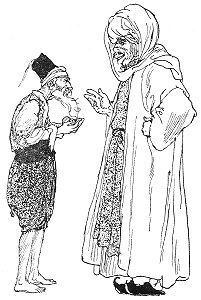
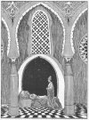

  
[Intangible Textual Heritage](../../index)  [Asia](../index.md) 
[Index](index)  [Previous](ftft39)  [Next](ftft41.md) 

------------------------------------------------------------------------

Forty-four Turkish Fairy Tales \[1913\], at Intangible Textual Heritage

------------------------------------------------------------------------

p. 307

 

|                     |
|---------------------|
|  |

N a certain country lived a man who had three daughters. So poor were
they that one day there was not even a crust of bread in the house; and
not knowing what else to do, the girls spun some thread. This they gave
to their father, saying: "Take this to the tscharschi, sell it for a few
paras, and bring home something to eat." The old man took the thread,
but no one in the tscharschi would look at him.

|                    |
|--------------------|
|  |

While pacing to and fro in deep dejection, an Arab appeared before him
and asked: "What hast thou to sell, father?" The old man showed him the
thread, and remarked that he must sell it in order to obtain food. The
Arab asked who had spun it. "My daughters at home," was the reply. The
Arab bought the thread and paid generously for it. He then asked the man
to give him one of his daughters. "I will speak to my daughters on the
subject," said the man, "and if I can persuade one of them, thou shalt
have her." So the Arab accompanied him home. Arriving there, the father
said to his eldest daughter: "If I offered thee

p. 308

an Arab for husband, wouldst go to him?" She replied: "What could I do
with an Arab? Marry me to some one more useful." He then put the same
question to his middle daughter, whose answer was the same as that of
her elder sister. His youngest daughter, however, said she was prepared
to marry the Arab in order to lighten in some measure their burden of
poverty.

The Arab accordingly took the maiden under his care, and, giving the old
man much gold, he departed with her.

|                     |
|---------------------|
|  |

FTER they had gone some distance the Arab said to the maiden: "Shut your
eyes--open your eyes!" Immediately she found herself in a magnificent
palace with slaves supporting her arms as she ascended the grand
staircase. She imagined herself in Paradise, it was all so wonderful. At
the top of the stairs other slaves escorted her into a chamber
glistening with diamonds and pearls, for the walls and floor were inlaid
with these gems, while the ceiling was ornamented with gold and silver
stars. When she had taken a seat, these slaves remained at hand with
bowed heads and folded arms, while other slaves appeared with a sable
robe and a dress ornamented with gold and silver sequins in which they
clothed her.

In the evening delicious food was served to her in golden dishes, the
repast concluding with a glass of sherbet, after drinking which she fell
into a deep sleep. Immediately the slaves lifted her up and carried her
to bed. While she slept the bey of the palace entered, and gazed at her
in admiration, but departed before she awaked. When the maiden rose next
morning, slaves appeared to bathe and clothe her and obey her slightest
behest. Such was her daily life for three whole months, until
homesickness seized her and she longed for a sight of her father and
sisters.

One day she spoke of the matter to the Arab who had brought her thither.
"Lala," said she, "may I not be allowed to spend a few days with my
father and sisters?" The Arab replied: "Call me not lala:

p. 309

[  
Click to enlarge](img/30900.jpg.md)  
  

p. 310

my name is Laklak Aga. I am the guard of the palace." Next day she
addressed him again as lala, and repeated her request; but the Arab
simply corrected her as before. On the third day, however, when she
addressed him as "Laklak, my Aga," he listened to her request: "I am
longing to spend one or two days with my father and sisters." "Very
well," promised the Aga, "tomorrow we will go."

The Arab spoke to his master the bey on the subject. The latter had no
objection, but impressed upon the Arab that he must not allow the maiden
to remain long out of his sight. Thus, on the following morning the
maiden prepared for her journey home with Laklak Aga, who supplied
himself well with gold. "Shut your eyes--open your eyes! commanded
Laklak Aga, and behold! they were at their destination, and in a few
moments the maiden was receiving the caresses of her now happy father
and sisters. There was great joy in the house that day.

With the money he had first received the old man had opened a shop, and
now the Arab gave him more gold with which to extend his business.

Meanwhile the other girls asked their sister how it fared with her, "Not
very well," she replied; "every night I have to drink a glass of sherbet
and I fall asleep directly." They next asked her whether she had ever
seen the bey. She answered that the Arab was the only man she had ever
seen. On this they gave her a sponge, saying: "When sherbet is next
brought to you, pretend to drink it, but instead let the sponge absorb
it; then lie down and seem to be asleep. You will thus see what happens
to you."

When the few days had expired she took leave of her father and sisters
and left her home under the Arab's escort. With " Shut your eyes--open
your eyes! " she found herself back again in the serai.

In the evening sherbet was brought as usual; but the maiden very
cleverly, while pretending to drink it, allowed it to fall into the
sponge she held. This done, she lay down and appeared to go to sleep.
Slaves

p. 311

|                                       |
|---------------------------------------|
|  |

carried her to bed, and, as usual, the bey came and stood looking at
her. Hearing footsteps, she could not help opening her eyes to see who
had entered, and the bey, seeing that she was awake, knew she must have
deceived them all about the sherbet. "So thou hast thought by cheating
us to satisfy your curiosity?" he exclaimed angrily. "As a punishment
thou shalt be shod with iron shoes, and with an iron staff in thy hand
thou shalt seek me for seven years till thou findest me." With these
words he disappeared.

The maiden was accordingly shod with iron shoes, and taking an iron
staff in her hand she set out on her pilgrimage. She wandered over
mountains, through valleys, and across plains, though on looking back
she found the distance she had travelled was but the length of a
barley-corn. Pursuing her way, ere long she met a Dew-woman who had a
horn

p. 312

on her head and tremendous feet. She greeted the Dew-woman with
"Salaam!" whereupon the creature answered: "If thou hadst not greeted me
I should have pulled thee to pieces and devoured thee." "And if thou
hadst not returned my greeting," retorted the maiden, "I should have
knocked thee down with my staff." The Dew-woman now asked whence she
came and whither she went, and the maiden told her all. Then the
Dew-woman informed her that Shah Jussuf the bey had just passed that
place, if she would go farther she would meet another Dew-woman who
would tell her more.

The maiden wended her way onward until she met the second Dew, woman,
who informed her that Shah Jussuf had passed not long ago. Farther and
farther she went, until she met a third Dew-woman, who was cleaning a
warm oven. The maiden asked her whether she had seen anything of Shah
Jussuf. "Why dost thou ask?" inquired the woman, who was in fact the
bey's aunt. After the maiden had told her story the Dew-woman observed:
"If thou wilt, thou shalt remain with me. Shah Jussuf visits me every
seven years; thus thou canst meet him here."

Kissing the woman's hand, the maiden consented to stay. But the woman
proceeded: "Thou canst not remain with me in thy present form, however,
for I have forty sons, and if they saw thee they would eat thee up."
Saying this the Dew-woman gave the maiden a knock, changing her into an
apple, which the woman set on a shelf.

At night the Dew-sons came home and said to their mother: "We smell
human flesh!"

"What should a human being be doing here?" was the rejoinder.
Nevertheless, when they had finished their supper the mother asked: "If
anyone should stray hither, and, kissing my hand, beg me to receive him
as my child, what would ye do in my place?" "Accept him as our brother
and do him no harm," answered the Dew-sons. At these words the Dew-woman
took down the apple from the shelf, and giving it

p. 313

a slap, transformed it again into a maiden. "Go and kiss your brothers'
hands," she commanded. The maiden did so, and the Dew-sons accepted her
as their sister. Shortly after her arrival among them a little son was
born to the girl, and him also the Dews accepted as a relative, and
treated with kindness.

|                     |
|---------------------|
|  |

EVEN years the maiden passed in their company, and when the seventh year
had nearly run out, the Dew-woman observed one day to the maiden: "Shah
Jussuf will be here soon. If he requests a glass of water, bring it, and
when he returns the empty glass, let it fall from thy hand and break. I
shall then pretend to be angry with thee, and by that we shall see
whether he loves thee. If so, he will not permit me to beat thee."

Some days later Jussuf appeared, looking very sad and careworn. After
greetings had been exchanged, his aunt asked him why he was so downcast,
instead of in his usual merry mood. "I am suffering the pangs of grief,"
answered the youth; "wherefore am I sad." The woman professed not to
understand. Food was brought in, and while eating Shah Jussuf asked for
a glass of water. It was brought by the maiden, and in drinking Jussuf
kept his eyes continually upon her; he could not help seeing in her a
vivid resemblance to the wife he was seeking. Having emptied the glass,
he handed it back to the maiden, who, as though from carelessness, let
it fall to the floor, where it broke in pieces. Now the Dew-woman sprang
up from her seat, overwhelmed the girl with reproaches, and would have
beaten her soundly had not the Shah interceded on her behalf, placing
the blame on himself instead of the maiden. The Dew-woman immediately
calmed down, and dismissed the girl with the words: "Get out of my
sight."

Shah Jussuf could not help thinking of the maiden, and he questioned his
aunt as to whence she procured her, and whether she would not sell her
to him. The Dew-woman, however, would not agree to part with her, saying
that the girl was indispensable in the house.

p. 314

Shah Jussuf remained a few days longer and then departed. Yet not.
withstanding, that it was his custom to visit his aunt but once in every
seven years, in three months he was back again. " Thou rascal!"
exclaimed the woman playfully on seeing him again so soon. But to the
maiden she said: "On thy account is he come; when thou bringest in the
food, upset the dish."

They sat down to supper, and the maiden on entering with the food
stumbled, and the dish overturned and fell. In a great rage the woman
mercilessly scolded her for her clumsiness in the presence of their
guest, and would have beaten the girl had not the Shah forcibly held her
back, entreating her once more to pardon the poor girl. Gradually the
Dew. woman became calm, but seemingly with great difficulty.

Again the Shah took his departure. When he was gone the woman said to
the maiden: "He cannot endure it much longer; he will surely come again
very soon, and when he does, open the door to him and tell him who thou
art. Moreover, wear the dress thou didst wear when with him, and have
the child by thy side."

Looking out of the window one morning she saw Shah Jussuf approaching in
the distance. She hastened to dress, and, with her son, ran out to meet
him. Seeing her in the dress she wore while at his palace, the Shah knew
the woman was surely his wife and the boy by her side his son. Shyly and
shamefacedly he glanced first at the maiden and then at the child.
Leaving the boy the wife fell on her husband's breast, and with tears of
joy at their reunion, told him all that had befallen her during their
long separation.

Shah Jussuf now sought his aunt and, kissing her hand, begged her
permission to take his wife and child away. "Take her and be happy--she
has suffered enough," said the Dew-woman.

Now with hearts overflowing with joy they set out for the palace of Shah
Jussuf. On their arrival home they were received with every
demonstration of gladness, for during seven long years the Shah in his
grief had not

p. 315

inhabited his palace but had wandered over the face of the earth. Their
return was celebrated with forty days and forty nights of festivity and
merrymaking. Shah Jussuf invited his wife's father and sisters to take
up their residence at his palace, and they all lived together in
happiness to the end of a long life.

 

------------------------------------------------------------------------

[Next: The Black Dragon and the Red Dragon](ftft41.md)
