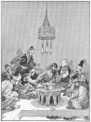
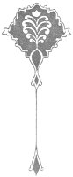

  
[Intangible Textual Heritage](../../index)  [Asia](../index.md) 
[Index](index)  [Previous](ftft43)  [Next](ftft45.md) 

------------------------------------------------------------------------

Forty-four Turkish Fairy Tales \[1913\], at Intangible Textual Heritage

------------------------------------------------------------------------

p. 342

 

|                     |
|---------------------|
|  |

HERE once lived a poor combmaker who said to his wife one day: "Give me
a few paras, and I will take my stock of combs into a coffee-house.
Perchance I may sell five or six of them and bring home the proceeds."

|                    |
|--------------------|
|  |

Going into the coffee-house he sat down, and while he was drinking his
coffee and thinking over the problem of his precarious existence,
several merchants came in and began to inquire for a combmaker. At this
the combmaker got up and produced his combs for the merchants'
inspection. His wares evidently gave satisfaction, for besides disposing
of all he had with him he secured an order for a thousand more.
Delighted with his luck the combmaker went home, and in the course of a
couple of months the thousand combs were ready for delivery. He took
them to the merchants, and received the price agreed upon, with a
handsome present into the bargain.

The combmaker was now no longer poor indeed he was a rich man, and he
proposed to his wife that they should make a pilgrimage to the Prophet's
Tomb at Hedjaz. "By all means let us go," answered his wife; "but we
cannot take our daughter with us." "We

p. 343

will leave her in the care of the hodja," said the combmaker; "he is a
very well-disposed person." Thus the matter was settled, and they
prepared for their long journey, taking only their young son with them
and leaving their daughter in the good hands (as they believed) of the
hodja.

It happened that the hodja, in whose house the combmaker and his wife
had placed their daughter, was envious of the combmaker's success, and
secretly had long wished to injure him. Now he determined to kill the
girl left in his charge, but he wished her death to appear an accident.
It being the custom of that land for every one to visit daily the great
bath houses of the city, he thought it would be easy to get the girl to
one of these baths and quietly drown her.

Going to the bathhouse, he pressed a couple of gold-pieces into the palm
of the bath-woman, and induced her to persuade the girl to bathe there.
Accordingly on the following day the bath-woman appeared at the hodja's
house and said to the girl: "Why dost thou not go sometimes to the
bath?"

"Because I have no one to accompany me," replied the girl.

"Come with me, then," rejoined the woman, "and I will assist thee." Thus
they went together to the bath. The woman took her to the hot-air bath
and--called in the hodja.

When the poor girl caught sight of the hodja she began to comprehend
that she had fallen into a trap, but, determined not to betray any
embarrassment, she greeted the hodja: "I am glad thou art come; I will
help thee to wash thy head." And she soaped him to such purpose that,
when she had done with him, his head could not be seen for lather. Then
taking off her heavy wooden clogs and tying them together with a
bath-towel, the girl thrashed the hodja so mercilessly therewith that he
could not afterward stir for bruises. The girl hurriedly escaped and ran
all the way back to the house of her parents.

By and by the hodja recovered consciousness, wiped the soap from his
head, dressed himself, and also went home. For more than a week after

p. 344

he still felt the effects of his punishment. Then in revenge he wrote a
letter to the girl's parents, in which he stated that she had run away
from his care after stealing money from him.

When in due time the parents received the letter they were naturally
very shocked and angry. They charged their son to return home with all
speed, take the dishonoured girl to the top of a hill and kill her,
bringing back her bloodstained clothes in token that he had fulfilled
his mission.

The young man appeared and, seizing his sister, took her to the hilltop.
However, he had not the heart to put her to death, but set her free to
go whither she would; while, to save appearances, he cut his foot
slightly and dyed his sister's garments with the blood that flowed from
the wound. These he took back to his parents.

|                                                             |
|-------------------------------------------------------------|
|  |

After her brother had left her the maiden set off in an opposite
direction, wandering over mountains, across plains, and through valleys
until she came to a spring. While resting she saw the Padishah of that
country hunting with his Vezir; and, fearing them, she climbed a tree,
hiding herself amidst the foliage.

The two huntsmen came to the spot, and the Padishah said to the other:
"Vezir, I will undertake an abdest here and say many prayers. While
praying

p. 345

the Padishah lifted up his head and saw the maiden in the tree; she
seemed to him as beautiful as the noonday sun. His devotions finished,
he turned to his Vezir and exclaimed: "I have already unearthed my
quarry!" Casting his eyes up to the girl, he asked: "Art thou an in or a
jin?"

"Neither in nor jin, but a child of the dust like thyself," was the
answer.

The Padishah begged her to descend, which she did, and they returned to
the palace together, where, with three days and nights of merrymaking,
they became husband and wife.

One day she related to the Padishah the story of her life, and at the
same time told him how she longed to see her parents and her brother
once more. The Padishah sympathized with her, and ordered preparations
to be made for her journey. He sent her in charge of his Vezir,
instructing him to bring the Sultana's parents back with him if they
were willing to come. On the day fixed the Sultana set out,
accompanied-by the Vezir and a strong escort of soldiers.

After travelling many days they arrived at the foot of a hill, where
they decided to pitch their tents for the night. At midnight the Vezir
entered the Sultana's tent and said: "Thou belongest to me as well as to
the Padishah, for we both found thee. Since thou hast married the
Padishah rather than me, I will kill thee."

The poor Sultana begged him, before he put her to death, to allow her to
retire for a few moments' prayer. He gave the required permission, but
to provide against her escape fastened a rope round her waist. Bound as
she was she retired into another compartment of the tent, where,
favoured by Providence, she was able to release herself and flee.

Meanwhile the Vezir became tired of waiting and went to seek the woman.
What was his surprise to find the rope bound round a stone, but of the
Sultana no trace! He roused his soldiers from their sleep and made up
for them an ingenious account of how the Sultana had endeavoured to

p. 346

murder him, and then escaped. It was resolved to strike tents and return
to their own country.

|                                                                |
|----------------------------------------------------------------|
|  |

The fugitive Sultana hastened on in the direction of her parents' home.
Meeting a shepherd, she begged him to lend her a suit of men's clothing
in exchange for her own rich attire. The shepherd raised no objections
to making such a good bargain. Disguised now as a young man, the Sultana
entered a shop where helwa was made and sold, and applied for the post
of assistant. She was taken on, and the report soon spread that the
helwa-shop had a handsome new assistant who was very clever in making
that favourite sweetmeat. The Sultana's father had by this time retired
from business as a comb maker and opened a coffeehouse. He was among
those who came often to the helwa-shop to see the famous new assistant.
The disguised helwa-maker knew her father in a moment, but it was no
surprising matter that he did not recognize his daughter.

We will now return to the Padishah. Since the false Vezir had returned
with his lying report the Padishah had known no peace. He was
continually brooding over the loss of his wife, sighing and groaning and
weeping. "I want my wife, Vezir," he said one day. "I must seek her, or
I die." The Vezir protested in vain. The Padishah, taking the Vezir with
him, quitted the palace and set out in search of the Sultana.

After long wandering they reached the place where she was actually

p. 347

sojourning; and being tired and hungry, inquired for an inn. They were
informed there was no inn in the place, there was, how. ever, a shop
where a young man sold the most excellent helwa ever eaten.

The Padishah and the Vezir resolved to try this much-praised
establishment, and wended their way thither. As soon as they entered the
shop the Sultana knew them both, but they failed to recognize her in the
handsome young shopman. "Here, young man, let me taste thy helwa," said
the Padishah, putting down several paras. "If, my lord," said the
assistant, "thou wilt remain here all night, I will make helwa
especially for thee, and besides will relate to thee a strange story."
Drawn unaccountably to the handsome young shopman, the Padishah
willingly consented to remain and listen to what the youth had to say.

A "helwa evening" had been planned to take place in the town, and the
clever young helwa-maker was asked to come and prepare the cakes for the
occasion. "I would gladly do so, but I have guests," was the
helwa-maker's reply to the invitation. Not to be denied, the deputation
returned. "Bring thy guests with thee," they said; " we shall be happy
to welcome them and accord them places of honour."

Thus it was arranged, and in the evening all three repaired to the helwa
feast. Places were chosen, and for the present the helwa-maker
disappeared into the kitchen to prepare the cakes.

When all was ready she appeared again with plates and a mangal in her
hands and went among the guests, recognizing in the gathering, besides
the Padishah and the Vezir, her father, her brother, and the hodja.

While distributing the helwa she spoke as follows: "As we are here for
entertainment, let each of us tell a little story out of his own life."
Conversation began, and many interesting personal reminiscences were

p. 348

|                                                                                              |
|----------------------------------------------------------------------------------------------|
|  |

related. Then it came to the turn of the helwa-maker, who before
beginning her narration imposed the condition that no one should leave
the room during the recital. "If anyone must go," said she, "let him do
so now." "Begin," said the audience; "no one shall quit his place."

Taking her seat before the closed door she commenced her story. She
began with her visit to the bath--at which the hodja declared he felt
rather unwell and must go out into the fresh air. "Sit down," commanded
the storyteller with a flash of scorn. Then continuing, she described
the atrocious conduct of the Vezir.

As the Padishah listened spellbound, his eyes filled with tears, for he
as well as the Vezir, the hodja, her father and her brother, all
understood the story. Concluding the narration of the great wrongs she
had suffered, she exclaimed: "Know thou, O my hearers, that this Vezir
and the hodja were my enemies; they are in this company tonight, as are
also my father and my brother and my husband, the Padishah." At these
words she ran towards her husband, who clasped her in his arms, weeping
tears of joy.

Next day the Padishah summoned the Vezir and the hodja to his presence
and asked whether they preferred forty mules or forty knives. They
answered: "Forty knives for our enemies; for ourselves, forty

p. 349

[  
Click to enlarge](img/34900.jpg.md)  
''Sit down,'' commanded the story-teller  

p. 350

mules." Whereupon they were bound fast to forty mules, which rent them
asunder, and so there was an end of them.

After a happy sojourn at her old home with her parents and brother, the
Sultana and her husband returned to their palace to begin life anew
after the long period of affliction and cruel separation from each
other.

 

------------------------------------------------------------------------

[Next: Astrology](ftft45.md)
