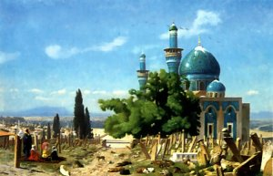

  
[Intangible Textual Heritage](../../index)  [Asia](../index) 

------------------------------------------------------------------------

<table width="75%">
<colgroup>
<col style="width: 50%" />
<col style="width: 50%" />
</colgroup>
<tbody>
<tr class="odd">
<td width="50%" data-valign="TOP"></td>
<td width="50%" data-valign="CENTER"><h1 id="forty-four-turkish-fairy-tales" data-align="CENTER">Forty-four Turkish Fairy Tales</h1>
<h2 id="by-ignácz-kúnos" data-align="CENTER">by Ignácz Kúnos</h2>
<h3 id="illustrations-by-willy-pogany" data-align="CENTER">Illustrations by Willy Pogany</h3>
<h4 id="section" data-align="CENTER">[1913]</h4></td>
</tr>
</tbody>
</table>

------------------------------------------------------------------------

[Contents](#contents)    [Start Reading](ftft00)

------------------------------------------------------------------------

This book draws on the rich folklore of Turkey. Forty-four Turkish Fairy
Tales is long out of print, for reasons which will become clear below.
For one thing, this edition had lavish production standards: it is in an
oversize quarto format, with gold deckling, about ten inches in height.
It has two-color printing on every page, and 16 tipped (i.e.,
hand-glued) four-color plates. On the used market, mint copies of this
book normally run in the high three figures. We obtained a well-loved
(and nicely rebound) copytext for this online edition through
interlibrary loan from Northwestern University Library.

Most of these stories are framed by the usual fairy tale apparatus.
There are quests to win the hand of a princess, evil step-relations,
talking animals, magical objects and transformations, simple (but brave)
peasants, wizards and witches, dragons and dungeons, thousand-league
journeys, and loveable fools. The majority of these stories contain
encounters with Turkish supernatural beings. These are called 'Dews,'
known elsewhere in Islamic folklore as 'Devis,' or 'Jin,' Europeanized
as 'Genie.' (Sometimes in this book, the Turkish Dew are also called
'Arabs!') These most resemble the giants of European folk tales, with
elements of the fairies. The Dews are, more often than not, malevolent
towards humans, although they occasionally help the protagonist in their
quest. There are many other specifically Turkish elements and
terminology in the stories, for which note the [helpful
glossary](ftft47) at the end of the book. So this isn't simply an
orientalized set of European Märchen, but apparently drawn from an
authentic Turkish oral storytelling tradition. However, there is no
attribution of source for any of these stories; this is not a scholarly
study by any means.

There are graphics on nearly every page, with titles and initials in
quasi-Arabic script and decorations inspired by Islamic art. The chapter
headings even include the title in Arabic script (presumably in Turkish,
this being before the 1928 reform which mandated Roman script). Willy
Pogany drew the relentlessly comic illustrations: he later illustrated
many other books of folklore in a somewhat more sober style. Although he
is illustrating Turkish scenes, Pogany uses off-the-shelf European
drawing techniques. He does not attempt to emulate local styles, which
is a bit of the disconnect from the ornate geometric decorations.

The page layout is wrapped around these graphics, sometimes to the
detriment of readability. Often illustrations split the text into two
columns which have to be read across each line. No attempt was made to
reproduce this layout in an online version. Although we have included
all of the illustrations, we had to leave out most of the decorations.
Even so, this etext has nearly nine megabytes of graphics, which is an
order of magnitude over the normal budget for a project of this size.
The illustrations have been repositioned on each page, and we had to do
a bit of editing on them to filter out overlapping decorative elements.
We retained full color for the plates and the first chapter, but all
other graphics were reduced to grayscale. All graphics with associated
text have ALT tags for accessibility.

There are a couple of caveats. As is usual with the fairy tale genre,
not all of the story elements are 'suitable for children': e.g.
beheadings, sacrifices, anthropophagy, and inter-species romance.
Another thing to note is that some of the illustrations would be
considered unsuitable by contemporary standards because they are
caricatures with obvious ethnic stereotypes. However, in most cases, the
illustrator is portraying imaginary creatures, which are *supposed* to
be grotesque. We have not censored any of these illustrations, but this
should be kept in mind.

*--J.B. Hare, August 8, 2006*

------------------------------------------------------------------------

 [Title Page](ftft00)  
[Contents](ftft01)  
[Preface](ftft02)  
[The Creation](ftft03)  
[The Brother and Sister](ftft04)  
[Fear](ftft05)  
[The Three Orange Peris](ftft06)  
[The Rose-Beauty](ftft07)  
[The Silent Princess](ftft08)  
[Kara Mustafa the Hero](ftft09)  
[The Wizard-Dervish](ftft10)  
[The Fish-Peri](ftft11)  
[The Horse-Dew and the Witch](ftft12)  
[The Simpleton](ftft13)  
[The Magic Turban, the Magic Whip and the Magic Carpet](ftft14)  
[Mahomet, the Bald-head](ftft15)  
[The Storm Fiend](ftft16)  
[The Laughing Apple and the Weeping Apple](ftft17)  
[The Crow-Peri](ftft18)  
[The Forty Princes and the Seven-headed Dragon](ftft19)  
[Kamer-taj, the Moon-horse](ftft20)  
[The Bird of Sorrow](ftft21)  
[The Enchanted Pomegranate Branch and the Beauty](ftft22)  
[The Magic Hair-Pins](ftft23)  
[Patience-Stone and Patience-Knife](ftft24)  
[The Dragon-Prince and the Step-Mother](ftft25)  
[The Magic Mirror](ftft26)  
[The Imp of the Well](ftft27)  
[The Soothsayer](ftft28)  
[The Daughter of the Padishah of Kandahar](ftft29)  
[Shah Meram and Sultan Sade](ftft30)  
[The Wizard and his Pupil](ftft31)  
[The Padishah of the Thirty Peris](ftft32)  
[The Deceiver and the Thief](ftft33)  
[The Snake-Peri and the Magic Mirror](ftft34)  
[Little Hyacinth's Kiosk](ftft35)  
[Prince Ahmed](ftft36)  
[The Liver](ftft37)  
[The Fortune Teller](ftft38)  
[Sister and Brother](ftft39)  
[Shah Jussuf](ftft40)  
[The Black Dragon and the Red Dragon](ftft41)  
[''Madjun''](ftft42)  
[The Forlorn Princess](ftft43)  
[The Beautiful Helwa Maiden](ftft44)  
[Astrology](ftft45)  
[Kunterbunt](ftft46)  
[Meaning of Turkish words used in the text](ftft47)  
