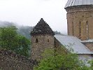

  
[Intangible Textual Heritage](../../index)  [Asia](../index) 
[Index](index)  [Previous](geft00)  [Next](geft02) 

------------------------------------------------------------------------

[Buy this Book at
Amazon.com](https://www.amazon.com/exec/obidos/ASIN/B002FB5J1C/internetsacredte)

------------------------------------------------------------------------

  
*Georgian Folk Tales, by Marjory Wardrop* \[1894\], at Intangible
Textual Heritage

------------------------------------------------------------------------

p. vii

### PREFACE

AS the first attempt to translate into English any part of the varied
and interesting secular literature of the Georgian people, this little
book may perhaps claim some attention from the public. A volume of
sermons by Bishop Gabriel of Kutaïs was published by the Rev. S. C.
Malan in 1867, but, with this single exception, I do not know of any
other work in the Iberian tongue which has been offered to English
readers. The state of comparative neglect into which Oriental studies in
general have fallen of late among us, the rulers of the East, accounts,
to some extent, for this fact; it is to be hoped that an improvement in
this respect may soon be apparent.

Some years ago, a book written by my brother [1](#fn_0) first excited my interest in the Caucasus
and its brave and

p. viii

beautiful inhabitants. A study of the classical literature, especially
of the great epic poet, Shota Rusthaveli, of the twelfth century, has
profitably occupied much of my time during the past two years, and it is
my intention to give my countrymen an early opportunity of sharing in
the pleasure I have derived therefrom.

As a relaxation from these more arduous studies, I amused myself by
turning into English the originals of the following stories. I showed
the manuscript to Dr. E. B. Tylor, who told me that it presented many
features of interest to folklorists, and advised me to publish it; it
is, therefore, fitting that I should dedicate the book to the creator of
the modern science of anthropology, and he has kindly given me
permission to do so.

The geographical position of Georgia, a region lying between East and
West, forming a bridge along which a great part of the traffic in ideas
as well as in commodities must pass, makes it a rich field of inquiry
for the student. By their religious and political connection with
Byzantium on the one hand, and by their constant intercourse with Persia
and Turkey on the other, the Iberians have gained much from both
Christendom and Islam, and among them may yet be found lost links in
several chains of historical and literary investigations.

p. ix

The sources from which I have taken the stories are the following:--

Part I. is a collection edited by Mr. Aghniashvili, and published in
Tiflis, in 1891, by the Georgian Folklore Society, under the title,
*Khalkhuri Zghaprebi*.

Part II. comprises the Mingrelian stories in Professor A. A. Tsagareli's
*Mingrelskie Etyudy, S. Pbg*., 1880 (in Mingrelian and Russian).

These were collected by Professor Tsagareli during the years 1876-79,
chiefly in the districts of Sachichuo and Salipartiano, which lie almost
in the centre of Mingrelia, far removed from foreign influence, and are
famous for the purity of their Mingrelian idiom. The Mingrelian dialect
is rapidly being replaced by pure Georgian throughout the country.

Part III. is an anonymous collection, entitled *Gruzinskiya Narodnyya
Skazki. Sobr. Bebur B.\* S. Pbg*., 1884.

 

It will be found that, besides the differences due to geographical
position, the three groups of stories are not of the same character.
Part II. is more naive and popular than Part I., and Part III. exhibits
more appreciation of the ridiculous than the rest of the book, and is of
a more didactic nature.

p. x

The points of resemblance between the following stories and those quoted
by the late Mr. Ralston, in his well-known *Russian Folk Tales*, are so
numerous, and so apparent, that I have not thought it necessary to refer
to them in the notes.

In conclusion, I must express my thanks to Prince Ivané Machabeli, of
Tiflis, the Georgian translator of Shakespeare, for his kindness in
reading my proofs, and to my brother, who did the Russian part of the
work for me.

M. W.

CHISLEHURST, *April* 1894.

------------------------------------------------------------------------

### Footnotes

[vii:1](geft01.htm#fr_0) *The Kingdom of Georgia:
Notes of Travel in a Land of Women, Wine, and Song*. To which are
appended Historical, Literary, and Political Sketches, Specimens of the
National Music, and a Compendious Bibliography, with Illustrations and
Maps. By Oliver Wardrop. London: Sampson Low, 1888.

------------------------------------------------------------------------

[Next: Contents](geft02)
