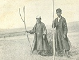

  
[Intangible Textual Heritage](../../index)  [Asia](../index) 
[Index](index)  [Next](jss01) 

------------------------------------------------------------------------

[Buy this Book at
Amazon.com](https://www.amazon.com/exec/obidos/ASIN/B0029XG0XM/internetsacredte)

------------------------------------------------------------------------

  
*A Journey in Southern Siberia*, by Jeremiah Curtin, \[1909\], at
Intangible Textual Heritage

------------------------------------------------------------------------

p. i

### A JOURNEY

###### IN

# SOUTHERN SIBERIA

##### THE MONGOLS, THEIR RELIGION

##### AND THEIR MYTHS

###### BY

## JEREMIAH CURTIN

###### Author of "The Mongols, A History," "The Mongols in Russia," "Myths and Folk-Lore of Ireland," "Creation Myths of Primitive America," etc.

###### TRANSLATOR OF THE WORKS OF HENRYK SIENKIEWICZ

*With a Map, and Numerous Illustrations from Photographs*

#### BOSTON

#### LITTLE, BROWN, AND COMPANY

#### \[1909\]

Scanned, Proofed and formatted at Intangible Textual Heritage, January
2006 by John Bruno Hare. This text is in the public domain in the United
States because it was published prior to 1923.

  [  
Click to enlarge](img/cover.jpg)  
Front Cover and Spine  

  [  
Click to enlarge](img/front.jpg)  
JEREMIAH CURTIN GOING UP THE STEPS OF MARS HILL TO THE PLACE WHERE ST.
PAUL ADDRESSED THE ATHENIANS. *Frontispiece*  

  [  
Click to enlarge](img/title.jpg)  
Title Page  

p. ii

 
[  
Click to enlarge](img/verso.jpg)  
Verso  

COPYRIGHT, 1909,  
By A. M. CURTIN.

*All rights reserved*

Published November, 1909

TUE UNIVERSITY PRESS, CAMBRIDGE, U.S.A.

p. iii

FULFILLING THE AUTHOR'S WISH

THIS BOOK IS DEDICATED

TO HIS VALUED

FRIEND

SIR WILLIAM VAN HORNE

 

------------------------------------------------------------------------

[Next: Prefatory Note](jss01)
