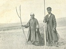

  
[Intangible Textual Heritage](../../index)  [Asia](../index) 
[Index](index)  [Previous](jss15)  [Next](jss17) 

------------------------------------------------------------------------

[Buy this Book at
Amazon.com](https://www.amazon.com/exec/obidos/ASIN/B0029XG0XM/internetsacredte)

------------------------------------------------------------------------

  
*A Journey in Southern Siberia*, by Jeremiah Curtin, \[1909\], at
Intangible Textual Heritage

------------------------------------------------------------------------

p. 130

#### GESIR BOGDO. No. II

##### A VERSION OF THE PRECEDING STORY

IN a time unknown, but very, very long ago, in a world preceding this
world there were people called Marat; there were also Mangathais, who
were ruled over by Shalmo Khan (Invisible Khan).

Once Delquen Sagan, the Highest Being, said: "Let Shalmo Khan and his
people be destroyed. Let a people be created who will be peaceful." Then
he sent his grandson, Gesir Bogdo, to the earth to be Khan.

In the South, in a land called Altai Deda, lived an old man and an old
woman. He was seventy years old and she was sixty. His name was Sundlei
U!gu!gun, and hers was Sundlei Hamiagan (U!gu!gun means old man, and
Hamiagan, old woman). They were of the Marat people.

One day Sundlei Hamiagan said, "I feel that I am to be the mother of
many children, I hear them discussing as to how they will come into the
world."

Soon many sons were born to Sundlei Hamiagan, each in a different way,
and each immediately went to the sky. After ten days a child was born,
who said:

"In the way that I am born all people will be born hereafter." And so it
has been.

This child was Gesir Bogdo. No knife could cut the umbilical cord. At
last the boy said to his father:

"On the west side of the yurta roof is a plant, the khan of plants. Get
that plant, wave it three times in the sun over the cord, and I shall be
free." This was done; the cord withered and dropped. When they had
swaddled the boy and placed him near his mother, he said to his father:

"Go to the forest and cut nine birch trees. In your herd is a strong
black stallion. On the lintel of the yurta door is a yellow flint given
me by Esege Malan; that flint has magic power. In a box on the west side
of the yurta is a saddle, sweat

p. 131

cloth, and all the outfit of a hero." Sundlei U!gu!gun did not know of
these things; they had come with Gesir Bogdo.

When the old man brought the nine birch trees and placed them, as Gesir
told him, against the hitching-post, they became nine blue horses. That
moment nine Shalmos came riding nine horses just like those at the
hitching-post. As they rode up, the boy rose and went to the door of the
yurta.

"Have you not horses to run against ours?" asked the Shalmos.

"I am young, just born. I do not know how to ride yet. Mount my horses
and try them. When I grow up I will ride with you."

The nine sprang on to the horses, and the horses rushed away to the
Yellow Sea. They did not stop at the shore, but raced on till they
reached the navel of the sea; there, turning into nine trees again, they
sank in the waves, and the nine Shalmos were drowned.

When three years old Gesir Bogdo was full grown; then changing the
strong black stallion and his hero's outfit into a flint, he put the
flint in his pocket and went away on foot.

It is unknown how long he traveled, but at last he came to a place where
three roads met. There he became a small, deformed boy; one arm and hand
grew out of his back, one leg was drawn up to his hip, his eyes were
sunk in his head. He was ugly, terrible to look at.

From the southwest came ninety-nine Shalmos on ninety-nine blue horses.
They approached the deformed child and wondered what he could be, but
said nothing and rode on. The boy sat awhile longer; then by his magic
he went around the ninety-nine Shalmos, was at the Yellow Sea before
them. There he made with his flint, from the bark of a tamarack tree,
ninety-nine little boats, and commanded them to be large and strong;
then he made a shed by the sea, turned himself into an old man, and was
sitting there in the shade of the shed. The ninety-nine Shalmos rode up
on the ninety-nine blue horses. Seeing the old man and his boats, they
said:

"We are going to the Northwest Tengerin (heavens). We

p. 132

cannot cross the sea on horseback. Take our ninety-nine horses and give
us thy ninety-nine boats."

The old man consented. As he untied the boats, he said to each one,
"When thou reachest the navel of the sea turn into a chip of tamarack
bark, and let the Shalmos drown in the abyss of the sea."

When the Shalmos were in the boats, the boats shot away of themselves
and could not be stopped or guided. They reached the navel of the sea,
turned into tamarack chips, and the ninety-nine Shalmos were drowned.

Then Gesir Bogdo went back to the old man's yurta, saddled his strong
black stallion, put on his armor of a hero, and went to the Northwest,
where lived three hundred and sixty Mangathais. Of those the greatest,
Danjin Shara Mangathai, had seventy-three heads.

Gesir Bogdo turned his horse and armor into a flint, put the flint into
his pocket, became a weak old man, and went to the yurta of the
Mangathais.

"A splendid dinner has come of itself," said the chief Mangathai. "I was
without a dinner, now I have one."

"What dinner am I for you? I am an old man," said Gesir Bogdo. "I paint.
Have you no work for me to do?"

"Paint the inside of my yurta," said the Mangathai.

The old man began painting, and as he painted he said, "Let the Black
Colt people increase, let the Mangathais perish!"

"What are you saying?" asked the Mangathais, and Gesir Bogdo answered,
"I say, let the three hundred and sixty Mangathais increase, let the
Black Colt people perish."

Instead of painting, Gesir Bogdo was making the yurta iron inside. When
he had finished inside he went outside, and painted until the outside of
the yurta was iron also. Then, going to the smoke hole, he said:

"Let thirteen enchantments lie on this yurta. Let twenty-three iron
hoops surround it. Let the three hundred and sixty Mangathais perish,
and the Black Colt people increase."

"What art thou muttering up there?" asked the chief Mangathai. "I was
saying, 'Let thirteen enchantments settle down

p. 133

on this yurta, let twenty-three iron hoops surround it, let the three
hundred and sixty Mangathais perish inside it!"

The Mangathais could not escape from the iron house, though they felt
that the weight of enchantment was sucking them into the earth.

The whole yurta was sinking. Soon the smoke hole was level with the
ground. The chief Mangathai stuck one of his heads through the opening.
Gesir crushed it with a mighty blow from a seventy pood hammer sent him
by his grandfather, Esege Malan. Then he asked the Burkans for an iron
hero to watch at the yurta and crush with the hammer any Mangathai who
should try to escape. Thus perished the Mangathais, "evil creatures who
lived in a world preceding this."

------------------------------------------------------------------------

[Next: Gesir Bogdo. No. III](jss17)
