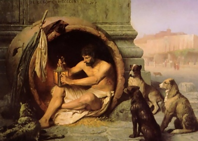

  
[Intangible Textual Heritage](../../index)  [Asia](../index) 

------------------------------------------------------------------------

<table width="75%">
<colgroup>
<col style="width: 50%" />
<col style="width: 50%" />
</colgroup>
<tbody>
<tr class="odd">
<td width="50%" data-valign="TOP"></td>
<td width="50%" data-valign="CENTER"><h1 id="the-laughable-stories-of-bar-hebraeus" data-align="CENTER">The Laughable Stories of Bar-Hebraeus</h1>
<h2 id="by-bar-hebraeus-tr.-e.a.w.-budge" data-align="CENTER">by Bar-Hebraeus, tr. E.A.W. Budge</h2>
<h4 id="section" data-align="CENTER">[1897]</h4></td>
</tr>
</tbody>
</table>

------------------------------------------------------------------------

[Contents](#contents)    [Start Reading](lsbh00)    [Page
Index](pageidx)    [Text \[Zipped\]](lsbh.txt.gz)

------------------------------------------------------------------------

Bar-Hebraeus was a 13th century bishop of the Syriac Orthodox Church.
Born in 1226 in what is now Turkey, Bar-Hebraeus was renowned as a
scholar and theologian. He died in 1286 in Persia. Writing mostly in
Syriac and Arabic, Bar Hebraeus wrote on philosophy, poetry, language,
history and theology, including a comprehensive history of the world,
the Chronicon Ecclesiasticum.

The Laughable Stories are a sequence of anecdotes categorized by the
story-teller: starting with Persian, Indian, Hebrew and Christian sages,
and including stories of Misers, Clowns, Thieves, and Animals and so on.
Many of these stories have been included in compilations much further
away in time and space. While a streak of sexism runs through the
collection, in a couple of instances, the shoe is on the other foot.
While many of these tales were probably pretty funny in the original
13th century cultural context, some of them will be totally mysterious
to moderns.

Production notes: The translation, by E.A.W. Budge, who also did many of
the Ancient Egyptian texts at this site, used a 19th century form of
quotation in which quotes are inserted at the start of each line in
multi-line quoted blocks; this has been modernized. This made the
transcription difficult, since in some cases I had to make editorial
decisions as to the location of the modern quotes. --J.B. Hare, October
9, 2009.

------------------------------------------------------------------------

 [Title Page](lsbh00)  
[Contents](lsbh01)  
[Preface](lsbh02)  
[Introduction](lsbh03)  
[Introduction](lsbh04)  
[List of the Chapters](lsbh05)  
[The First Chapter: Profitable Sayings of the Greek
Philosophers](lsbh06)  
[The Second Chapter: Profitable Sayings of the Persian Sages](lsbh07)  
[The Third Chapter: Profitable Sayings of the Indian Sages](lsbh08)  
[The Fourth Chapter: Profitable Sayings of the Hebrew Sages](lsbh09)  
[The Fifth Chapter: Profitable Sayings of the Christian
Recluses](lsbh10)  
[The Sixth Chapter: Profitable Sayings of Muhammedan Kings and of Their
Sages](lsbh11)  
[The Seventh Chapter: Profitable Stories Of Teachers And Learned
Men](lsbh12)  
[The Eighth Chapter: Profitable Sayings of the Arab Ascetics and Old
Men](lsbh13)  
[The Ninth Chapter: Profitable Sayings of Physicians and Legends
Attributed to Them](lsbh14)  
[The Tenth Chapter: Choice Stories of the Speech of Irrational
Beasts](lsbh15)  
[The Eleventh Chapter: Stories of Those Whose Dreams and Divinations
Have Come True](lsbh16)  
[The Twelfth Chapter: Stories About Wealthy and Liberal and Generous
Men](lsbh17)  
[The Thirteenth Chapter: Stories of Misers](lsbh18)  
[The Fourteenth Chapter: Stories of Men Who Followed Despised
Handicrafts](lsbh19)  
[The Fifteenth Chapter: Laughable Stories of Actors and
Comedians](lsbh20)  
[The Sixteenth Chapter: Stories of Clowns and Simpletons](lsbh21)  
[The Seventeenth Chapter: Stories of Lunatics and of Men Possessed of
Devils](lsbh22)  
[The Eighteenth Chapter: Stories of Thieves and of Robbers](lsbh23)  
[The Nineteenth Chapter: Stories of Wonderful Events and
Occurrences](lsbh24)  
[The Twentieth Chapter: Physiognomical Characteristics Described by the
Sages](lsbh25)  
[Additional Verses](lsbh26)  
[Index](lsbh27)  
