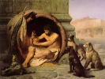

  
[Intangible Textual Heritage](../../index)  [Asia](../index) 
[Index](index)  [Next](lsbh01) 

------------------------------------------------------------------------

  
*The Laughable Stories of Bar-Hebraeus*, by Bar-Hebraeus, tr. E.A.W.
Budge, \[1897\], at Intangible Textual Heritage

------------------------------------------------------------------------

###### THE

# LAUGHABLE STORIES

## COLLECTED BY

## MÂR GREGORY JOHN BAR-HEBRÆUS

##### MAPHRIAN OF THE EAST FROM A.D. 1264 TO 1286

### THE SYRIAC TEXT EDITED WITH AN ENGLISH TRANSLATION

###### BY

## E. A. WALLIS BUDGE, LITT. D. (CANTAB), FṢ.A.

##### KEEPER OF THE EGYPTIAN AND ASSYRIAN ANTIQUITIES

##### IN THE BRITISH MUSEUM

#### London

#### LUZAC AND CO.

#### \[1897\]

Scanned, proofed and formatted at Intangible Textual Heritage, October
2009, by John Bruno Hare. This text is in the public domain in the US
because it was published prior to 1923.

------------------------------------------------------------------------

[Next: Contents](lsbh01)

