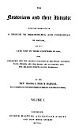

  
[Intangible Textual Heritage](../../index)  [Asia](../index.md) 
[Index](index)  [Next](rty01.md) 

------------------------------------------------------------------------

*An Inquiry into the Religious Tenets of the Yezeedes*, by George Percy
Badger, \[1852\], at Intangible Textual Heritage

------------------------------------------------------------------------

# An Inquiry into the Religious Tenets of the Yezeedees

###### *from*

### The Nestorians and their Rituals, Volume I.

### (pp. 111-134)

## by the Rev. George Percy Badger

#### London; Joseph Masters, Aldersgate Street, and New Bond Street.

#### \[1852\]

###### Scanned at Intangible Textual Heritage, October 2004. Proofed and formatted by John Bruno Hare. This text is in the public domain in the United States because it was originally published prior to January 1st, 1923, and can be used for any purpose.

[  
Click to enlarge](img/front.jpg.md)  
SHEIKH NÂSIR  
The Religious Head of the Yeseedees  

[  
Click to enlarge](img/title.jpg.md)  
Title Page  

------------------------------------------------------------------------

[Next: An Inquiry into the Religious Tenets of the Yezeedees](rty01.md)
