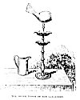
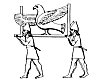

  
[Intangible Textual Heritage](../../index)  [Asia](../index) 
[Index](index)  [Previous](rty00) 

------------------------------------------------------------------------

*An Inquiry into the Religious Tenets of the Yezeedes*, by George Percy
Badger, \[1852\], at Intangible Textual Heritage

------------------------------------------------------------------------

p. 111

# CHAPTER X.

Origin of the Yezeedees.--Yezd and Sheikh Adi designate the Supreme
Being.--Yezeedee poem in honour of Sheikh Adi who is the Good
Principle.--Emblems of the Deity: the sun, fire, and water, and how
worshipped.--The Evil Principle.--Extract from Mrs. Badger's
journal.--Sacred festivities.--Sheikh Nâsir and Husein Beg.--Procession
of the Melek Taoos, or the symbol of the Evil Principle.--Description of
this Image.--Worship of the Evil Principle.--Magism In the religious
system of the Yezeedees.--What the Yezeedees have borrowed from
Christianity and Mohammedanism.--The five sacerdotal castes.--Their
temporal chief.--Character of the Yezeedees.-- Glimpse at their past
history-They are an unpromising field for missionary exertion.

DURING our stay at Mosul in 1842-44, we made several excursions among
the Yezeedees, visiting all their principal villages in the
neighbourhood, and holding frequent intercourse with the beads of their
community. In 1850 we resided for two months at *Ba-Sheaka*, where we
had an opportunity of witnessing many of their religious rites and
ceremonies, and of gleaning a mass of information respecting them which
I shall now proceed to lay before my readers.

The family name of the tribe is *Dâseni*, (pl. *Duasen*) by which title
they are frequently spoken of both by Christians and Mohammedans. They
themselves also use the term, but can give no other account of its
origin than that it is the ancient appellation of their race, which
according to their account existed in these parts from time immemorial.
Whence they sprung, from what source they derived their creed, what is
meant by many of their religious observances, are subjects upon which
the Yezeedees of the present day are thoroughly ignorant. In physiognomy
they resemble the Coords, whose language is in general use among them,
and I think it cannot be doubted that

p. 112

they are of the same stock with this people, and descendants of the
ancient Assyrians.

The origin of the name of "Yezeedee," by which they are more commonly
known, is referred by some among them to Yezeed ibn Moawiyah, but this
is only a stratagem to secure their toleration by the Mohammedans. For a
like purpose one of the tombs in the temple of Sheikh Adi is ascribed to
Hasan-ool-Basri whereas I have been assured that the Sheikh who is said
to be buried there was a different individual, and one of their own sect
whose descendants are still living at Ba-Sheaka. The quotation from the
Koran near the tomb was also admitted by several *Kawwâls* to have been
introduced as a blind, and in order to prevent the Moslems from
desecrating; their sacred shrine. We have already noticed a similar
subterfuge as practised by the Christians of this district, and hence
the convent of Mar Behnâm is commonly called "Khudhr Elias," and that of
Mar Mattai "Sheikh Matta."

I think it cannot be doubted that the term "Yezeedee" is derived from
Yezd, one of the titles applied by the ancient Persians to the Supreme
Being. "We are Yezeedees," said Sheikh Nâsir to me on one occasion,
"that is, we are worshippers of GOD." But a difficulty then arises as to
the person of him whom they designate "Sheikh Adi," and who there is
every reason to believe also represents the Deity in their theology. The
conversation which I held with the guardians of the temple clearly leads
to this conclusion, and the same has been declared to we again and again
by many Yezeedees. [1](#fn_0) In that case his
tomb must be regarded as a myth, and the prefix "Sheikh"

p. 113

as another artifice to throw dust into the eyes of the Mohammedan
persecutors. Or it may be that "Adi" was a supposed incarnation of Yezd,
who appeared on earth only for a season. This opinion receives support
from the fact that several buildings are erected near his shrine to
commemorate the places on which he is said to have sat.

The above hypothesis receives support from the subjoined translation of
an Arabic poem, which I obtained after much trouble from the Sheikh
already alluded to.

"THIS IS THE EULOGY OF SHEIK ADI; UPON HIM BE PEACE!

"My wisdom knoweth the truth of things,  
And my truth hath mingled with me.  
My real descent is from myself;  
I have not known evil to be with me.  
All creation is under my control;  
Through me are the habitable parts and the deserts,  
And every created thing is subservient to me.  
And I am he that decreeth and causeth existence.  
I am he that spake the true word,  
And I am he that dispenseth power, and I am the ruler of the earth.  
And I am he that guideth mankind to worship my majesty,  
And they came unto me and kissed my feet.  
And I am he that pervadeth the highest heavens  
And I am he that cried in the wilderness;  
And I am the Sheikh, the one, the only one;  
And I am he that by myself revealeth things  
And I am he to whom the book of glad tidings came down  
From my Lord who cleaveth the mountains.  
And I am he to whom all men came,  
Obedient to me they kissed my feet.  
I am the mouth, the moisture of whose spittle  
Is as honey, wherewith I constitute my confidents. [1](#fn_1)  
And by his light he hath lighted the lamp of the morning.  
I guide him that seeketh my direction.  
And I am he that placed Adam in my paradise.

p. 114

And I am he that made Nimrod a hot burning fire.  
And I am he that guided Ahmet mine elect,  
I gifted him with my way and guidance.  
Mine are all existences together,  
They are my gift and under my direction.  
And I am he that possesseth all majesty,  
And beneficence and charity are from my grace.  
And I am he that entereth the heart in my zeal;  
And I shine through the power of my awfulness and majesty.  
And I am he to whom the lion of the desert came,  
I rebuked him and be became like stone.  
And I am he to whom the serpent came, [1](#fn_2)  
And by my will I made him like dust.  
And I am he that shook the rock and made it tremble,  
And sweet water flowed therefrom on every side.  
And I am he that brought down an authentic verity,--  
A book whereby I will guide the prudent ones.  
And I am he that enacted a powerful law,  
And its promulgation was my gift.  
And I am he that brought from the fountain water  
Limpid and sweeter than all waters;  
And I am he that disclosed it in my mercy,  
And in my might I called it the white \[fountain.\]  
And I am he to whom the Lord of heaven said:  
Thou art the ruler and governor of the universe.  
And I am he who manifested some of my wonders,  
And some of my virtues are seen in the things that exist.  
And I am he to whom the flinty mountains bow,  
They are under me, and ask to do my pleasure.  
And I am he before whose majesty the wild beasts wept;  
They came and worshipped and kissed my feet.  
I am Adi of the mark, [2](#fn_3) a wanderer,  
The All-Merciful has distinguished me with names.  
And my seat and throne are the wide-spread earth.  
In the depth of my knowledge there is no God but me.  
These things are subservient to my power.  
How, then, can ye deny me, O mine enemies?  
Do not deny me, O men, but yield,  
That in the day of the resurrection you may be happy in meeting with me.

p. 115

He who dies enraptured with me, I will cast him  
In the midst of paradise, after my pleasure, and by my will;  
But he who dies neglectful of me  
Shall be punished with my contempt and rod.  
And I declare that I am the essential one:  
I create and provide for thou who do my will.  
Fraise he to mine essence; for all things are by my will,  
And the world is lighted with some of my gifts.  
I am the great and majestic king;  
It is I who provide for the wants of men.  
I have made known to you, O congregation, some of my ways.  
Who desireth me must forsake the world.  
I am he that spake a true word;  
The highest heavens are for those who obey me.  
I sought out truth, and became the establisher of truth;  
And with a similar truth shall they attain to the highest like me.

Confused and unintelligible as much of the above rhapsody is, it tends
to confirm our hypothesis that "Sheikh Adi" is one of the names of Deity
in the theology of the Yezeedees. I believe this poem to be the only
fragment now extant in any way connected with their creed, and I very
much doubt whether they ever had any sacred Scriptures. Their occasional
pretensions to possess such must he regarded as another artifice to
evade the hatred of the Mohammedans, who are taught in the Korân to
consider those who are not the "people of a book," i.e. have no written
revelations, as fit objects for every species of indignity and
persecution. Should this, however, be a mistaken conclusion, it in an
indisputable fact, that hardly one Yezeedee exists who could understand
a well written Arabic treatise; their Patriarch himself scarcely knows a
letter of the alphabet, and his principal scribe can just read and write
the colloquial dialect. So then, if they really have any books, it is
clear that they can make no use of them. The notion entertained by some,
that they had a secret language of their own, seems to be without
foundation.

Yezd, or Sheikh Adi, is held by the Yezeedees to be the good Deity, and
to him they offer their worship, which may he divided into two kinds,
direct and indirect. The former consists of a few hymns, which are
handed down traditionally among the Kawwâls, who may be regarded as the
sacred musicians and hierophants of the sect. I have heard several of

p. 116

these poems repeated, but they differ little in substance from that
given above, except that they are shorter, and much more unconnected.
The hymns are chanted by the Kawwâls at their principal festivals to the
sound of flutes and tambourines, which style of worship some among them
have learned from the Christians to support by a quotation from the
150th Psalm. Their tunes are monotonous in the extreme, and the strain,
though sometimes plaintive, is generally loud and harsh, and would be
deemed any thing but melodious to one accustomed to the solemn harmony
of our church music. Twice a year they make the pilgrimage to Sheikh
Adi, where they celebrate their religious rites with great rejoicing and
festivity. Mr. Layard was present on one of these occasions, and
describes the uncontrollable excitement which prevailed among those
present during the performance of the *Kawwâls*. [1](#fn_4) The above, so far as I have been able to
learn, forms the substance of their direct worship of the Supreme Being.

The adoration of the run by the Yezeedees may be regarded as a sort of
indirect homage paid to the Deity. That great luminary, as being one of
the noblest productions, and most powerful agents of the divine power
and goodness, is looked upon by them as the purest symbol of Yezd, and
hence they worship its rising and setting by kissing the ground with
their faces turned either to the east or west. This is done every
morning and evening by the priestly castes; but the common people
frequently omit the ceremony, and some neglect it altogether. I have
been informed that the duty is only incumbent upon these latter on
particular occasions, such as during the pilgrimage to Sheikh Adi, when
it is performed with more than common solemnity. Large parties
frequently encamp at the foot of the mountain which hems in the sacred
valley on the South, and begin the ascent at early dawn. As soon as the
rays of the sun touch the ground beneath them, they bow down and
reverently kiss a stone, which they then place upon some other close by.
We crossed this mountain on our return from the shrine, and found its
surface covered with these piles, which frequently consisted of eight or
ten stones raised one above the other. The same practice is observed by
the heathen in India,

p. 117

and I have frequently seen an idol temple or pagoda surrounded with
similar tokens of Pagan adoration.

Mr. Layard mentions a building and a herd of white oxen at Sheikh Adi,
dedicated to "Sheikh Shems," which he supposes to be the sun. It is
clear, however, that the Yezeedees so designate the place for the sake
of brevity, as the entablature over the doorway records the names in
full, namely, "Sheikh Shems Ali Beg and Faris," for two persons are
mentioned in the inscription, which has been given entire a few pages
back. In like manner the word "Shems" frequently enters into the
construction of Mohammedan names.

Fire and light, as being elements cognate with that of the sun, are
received by the Yezeedees as symbols of the good Deity. They never spit
into a fire, and will frequently pass their hands through the flames,
and make as though they would kiss and wash their faces with them, just
as the Christians do with the incense in their churches. Water, also, is
held by them to be a symbol of Yezd, it being a most powerful agent in
communicating temporal blessings to mankind. Hence almost every fountain
and spring is considered sacred, and when in their power, as those at
Sheikh Adi, Ba-Sheaka, Ba-Hazâni, and others, they leave a lamp burning
nightly in some adjacent niche or cave, in token of their adoration. On
this account bathing is looked upon by them more in the light of a
sacred duty than as an ordinary purification; and their objection to
frequent the Mohammedan baths of the country has, I have no doubt, some
connexion with this superstition. For the same reason they consider fish
*moobârak*, i.e. blessed, the term which they apply to every thing
sacred, and which reminds one of the *aghiasmata* of the Greeks. I have
been informed that only a few of the lowest classes among them ever eat
any produce of the waters.

The above rites and ceremonies form the sum of the religious worship
offered up by the Yezeedees to the good Deity. They have no forms of
prayer, and it is shocking to any Christian mind to bear them allow with
the utmost indifference that they never pray. I have frequently urged
upon them the duty of acknowledging their dependence on GOD on the
ground of common gratitude, natural instinct, and what they admit to be
due

p. 118

to any earthly benefactor to whom they look for help, or from whom they
had received any benefits. Their only answer has been: "Such is our way;
as our forefathers did before us even so do we."

I think it not improbable, however, that the reverence which they pay to
their so-called *Sheikhs* (I mean those over whose tombs the *Shaks* are
erected), may be regarded as another form of indirect homage rendered to
the Supreme Being. I have not been able to learn who these reputed
saints were, and the modern Yezeedees are quite ignorant as to the time
when they lived or died. The names by which they are designated, such as
Sheikh Aboo-Bekr, Sheikh Mohammed, &c., must be regarded as fictitious,
and invented to conciliate the Moslems, since they do not admit the
mission of their prophet or the authority of the Korân, and their
Sheikhs they affirm to have lived long before Mohammed. I have often
inquired whether it was not possible for a new Sheikh to rise up among
them now-a-days, and the answer has been a decided negative. Sometimes
they affirm that the *Shaks* occupy the sites where the *Sheikhs* have
sat, sometimes where they are buried, sometimes that they are only
cenotaphs, and that the bodies were interred at Sheikh Adi, and then
again you are told that the *Sheiks* did not really die. From this I
have been tempted to conclude, that these monuments may be myths, or
symbols of the attributes ascribed to the Deity, or of supposed Divine
emanations or incarnations. [1](#fn_5) Twice a
year these festivals are commemorated at the different villages with the
same rites as those observed at Sheikh Adi; a lamp is nightly kindled
and left to burn in the *Shaks* called after their names, and in those
to which a room is attached (as in the case of that dedicated to Sheikh
Mohammed at Ba-Sheaka), the *Kawwâls* assemble at sunset every Tuesday
and Thursday, when they burn incense over the tomb, and after watching a
short time, and smoking their pipes, return home.

The season for commemorating the principal *Sheikhs* takes place in the
month of April, and continues for eight or ten

p. 119

days. Ba-Sheaka and Ba-Hazâni, the adjoining village, being the two
places where most of the *Shaks* exist, they are the great scene of
Yezeedee festivities. I was absent in the Tyari country when the chief
rites were performed, but Mrs. Badger having accompanied my sister and
Mr. Rassam on a visit to Ba-Sheaka, took several notes of the
proceedings on that occasion, which I shall insert here as illustrative
of the religious customs of the Yezeedees, and as introductory to the
succeeding remarks on their worship of the Evil Principle.

"*April* 18*th*, 1850.--We took a walk through the village this morning,
and noticed a small enclosure which was erected by a Yezeedee last year,
and who is said to have been incited thereto by the Evil Principle in a
dream. The promise made to him if he obeyed was, that all persons
suffering from cutaneous diseases should be cured on rubbing themselves
with the dust taken from that spot. After visiting the fountain, where
we saw a number of females performing their ablutions in preparation for
the coming feast, we went to the shrine of Sheikh Mohammed, situated in
a pretty grove of olive-trees. Part of the court of this building serves
as a kitchen, in which were a number of Yezeedees engaged in
slaughtering ten sheep destined to be eaten this evening by the
community. There was also a large stock of food in the place, which had
been furnished by the villagers, each according to his ability, to be
distributed among the poor. We next entered the shrine through a low
entrance, and found there a broken cabinet inlaid with mother-of-pearl,
which is said to cover the remains of the Sheikh. The enclosure round
the shrine contains several other tombs, and a number of small
apartments.

"This being new year's day with the Yezeedees we again walked through
the villages to witness their festivities, and observed a number of wild
scarlet anemonies stuck over the entrance to several of the houses. We
learned on inquiry that these were intended to propitiate the Evil
Principle, and to ward off calamity during the coming year. The practice
reminded me at once of the blood sprinkled upon the door-posts of the
dwellings of the Israelites in Egypt as a sign for the destroying angel
to pass over, and it also recalled to my memory a custom prevalent among
the Hindoos and Parsees of India, who hang a string of

p. 120

leaves across the entrance to their houses at the beginning of every new
year.

"On our return home we had a visit from five *Kawwâls* who brought with
them their flutes and tambourines, and entertained us with what they
styled their sacred music. During the performance they put themselves
into all kinds of unnatural contortions, swinging their bodies to and
fro, and uttering strains which were anything but solemn or harmonious.
Mr. Rassam requested them to play some more cheerful airs, but this they
declined on the ground that the day was consecrated to religious
observances.

"In the evening we again visited the shrine to see the Yezeedees partake
of the feast which had been prepared for them during the day; but being
rather late we met the guests as they were leaving the place, some with
their mouths full, others wiping them with their sleeves, and looking as
if they had enjoyed themselves exceedingly. We were then invited by
those who acted as waiters on the occasion to partake of the
entertainment. A carpet was accordingly spread before the shrine for our
accommodation, and dishes of mutton cut up into small pieces, wheat
boiled in sour milk, and six new wooden spoons were laid before us. I
was struck with the cleanliness of the food and the vessels in which it
was served, as also with the general neatness of the people. After we
had tasted of the different dishes, the place was again swept, an old
Yezeedee near observing the meanwhile that 'cleanliness is next to
heaven.' A number of *Kawwâls* sat smoking in the court-yard waiting the
coming of Sheikh Nâsir, their religious head, who had just reached the
village and was expected to conduct their sacred ceremonies the same
night. We made many inquiries respecting the object of these
festivities, but the Yezeedees were by no means communicative: all they
informed us was that on the present occasion they celebrated the
nuptials of Sheikh Mohammed, whom they believe to be married once every
year.

"On reaching home we received a visit from Sheikh Nâsir, who wits
accompanied by a younger brother of Husein Beg, the temporal Yezeedee
chief, by several Kawwâls, and a large retinue of servants. He appeared
a very quiet humble man, with a benevolent but sorrowful countenance. He
spoke feelingly of

p. 121

the indignities to which those Yezeedees were subjected who were forced
into the army, and complained that they were not only ill-treated and
persecuted by the Turkish soldiers, but were made to put on uniform of a
colour which it was unlawful for any of their community to wear, and
moreover to eat prohibited food, and to frequent the bath, which for
them was a sin. I understood afterwards that the colour objected to was
blue, especially dark blue; [1](#fn_6) and that
the prohibited vegetables were lettuce and cabbage. A new levy of
soldiers was about to take place, which seemed to cast a gloom over
Sheikh Nâsir and the Yezeedees generally.

"On leaving the chief told us that he should spend the night with the
*Kawwâls* in the shrine of Sheikh Mohammed, where the principal
religious ceremonies were to be performed. What those were we could not
learn, but were told that they danced to the music of the tambourines
and flutes. This evening none of the cattle were milked, but all the
cows, sheep, and goats with their young were turned out into the fields,
and permitted to feast themselves at their pleasure.

"April 19th.--This morning the sound of fife and drum at dawn of day
announced that the recreative part of the festival had commenced; so
after an early breakfast we repaired to the vicinity of the shrine near
which a large concourse of Yezeedees Lad already assembled, all habited
in their best holiday suits. The men were clad in clean and
gaudy-coloured jackets and turbans, the women in silk and satin
garments, their necks hung round with ornaments, and their head-dresses
covered with rows of silver coin. All carried in their turbans a bouquet
of flowers, among which the rose and anemone were the most conspicuous,
interspersed with an occasional ostrich feather dyed scarlet. About two
hundred now joined hand in hand and formed themselves into a ring round
a couple of musicians who played on a drum and kind of lute. The merry
strain was at first slow, but quickened as it proceeded, the dancers the
meanwhile keeping time with their arms which were thrown violently
backwards

p. 122

and forwards as they moved round and round again, alternately narrowing
and widening the circle by advancing and retreating two long and two
abort steps. The varieties of form and feature, the animated
countenances, the rich dresses, long flowing sleeves waving to and fro
and seeming to keep time with the measured paces of the performers, made
up a lively scene, and reminded me of the merry-making at an English
fair. No little coquetry was displayed by the younger girls both in
dress and manners, and several were pointed out to me as being joined
hand in hand with their future husbands. At a short distance from this
group were a number of gaily dressed Yezeedees mounted on horse-back,
amusing themselves with the more manly sport of throwing the *jereed*,
and in running races. They soon got tired of this, however, and politely
joined the ladies, into whose faces they peered with something very much
akin to impudence. Many of them had evidently a particular object in
view, and the musicians abetted them in the search by playing a very
slow tune, so as to allow them a better opportunity of examining each
damsel as she moved round in the dance. I was afterwards informed that
these rencontres generally lead to matrimonial engagements.

"After returning home we received a visit from Husein Beg, the temporal
head of the Yezeedees, who had come hither to join in the festivities.
From what passed on this occasion we learned that much jealousy existed
between him and Sheikh Nâsir, on account of the greater influence which
the latter seems to possess among the Yezeedees. Husein Beg is but a
stripling, and has three wives already; his father, it is said, had a
new wife every week.

"Having heard that the Melek Taoos \[literally King Peacock\] was to be
exhibited in the village, we made every effort to learn all particulars
respecting it, and were informed by Sheikh Nâsir, who, together with
Husein Beg and many of the principal Yezeedees dined with us this
evening, that it would be brought in procession from Ba-Hazâni to
Ba-Sheaka on the following day. Accordingly we sallied forth hoping to
get a sight of this mysterious idol. On arriving at the outskirts of the
village, we heard the sound of music, and hastening to the spot from
whence it came, saw the procession slowly advancing, but no sooner did

p. 123

they catch a glimpse of our party than they hid the *Senjak*. [1](#fn_7) The harsh and deafening noise of the pipes
and tambourines still went on, however, and we stood silent spectators
of the scene. Two *Peers* preceded the bearer of the sacred cock,
carrying burning censers in their hands which they waved to and fro,
filling the air with the odour of the incense. As they passed along the
bystanders bowed themselves in adoration, uttering some indistinct
sentences the meanwhile, and immersed their hands in the smoke with
which they perfumed their arms and faces. The *Senjak* was then carried
to the house of the old *Kiahya*, or head, of the village (he having
been the highest bidder for the honour of entertaining it on this
occasion,) where it remained for two days, during which time all profane
festivities were suspended.

"Being still anxious to penetrate into the mystery of this sacred
symbol, we solicited Sheikh Nâsir to allow us to see it, which, after
much ado, he finally promised, and fixed the next morning for our visit,
when most of the villagers would be absent on a religious excursion to
Ain-oos-Safrâ. His consent, however, was given, on condition that my
sister-in-law and I should go to the house unattended. At the time
appointed, a respectable Yezeedee came to conduct us to the place, which
to our astonishment we found thronged with people. We were then ushered
into an open recess where about thirty *Kawwâls* and *Peers* were seated
in two rows. On entering, the whole party rose, and after the usual
eastern salutation, coffee was served: but Sheikh Nâsir was not
forthcoming, neither could we see any traces of the Cock. On inquiring
whether they had not received directions to show us the *Senjak*, they
replied in the negative, and further assured us that it could not be
exhibited to us unless Sheikh Nâsir or Husein Beg were present. We were
not a little annoyed at this disappointment. Mrs. Rassam and I having
had to brook the vulgar gaze of so many men; but resolving not to be
discouraged, we again sent to Sheikh Nâsir, calling upon him to fulfil
his promise. The messenger noon returned to tell us that all was now
ready, but that we must still go unaccompanied by any other person. We
found the house more crowded than before, and were again conducted

p. 124

to the recess, where Husein Beg, two Peers, and a few Sheikhs were
seated. At the end of the apartment on a raised platform, was the famous
*Senjak*, which we were permitted to examine as near as we chose. The
figure is that of a bird, more resembling a cock than any other fowl,
with a swelling breast, diminutive head, and wide spreading tail. The
body is full, but the tale flat and fluted, and under the throat is a
small protuberance intended perhaps to represent a wattle. This is fixed
on the top of a candlestick, round which are two lamps, placed one above
the other, and each containing seven burners, the upper being somewhat
larger than the under. The whole is of brass, and so constructed, that
it may be taken to pieces and put together with the greatest case. Close
by the stand was a copper jug, filled with water, which we understood
was dealt out to be drunk as a charm by the sick and afflicted. A
*Fakîr* was in the room relating all the benefits that had been
conferred on Christians and Mohammedans, as well as on Yezeedees, by the
contributions to the *Senjak*, and calling upon all present to give
liberally to the same object. The following is a sketch of the famous
symbol which I committed to paper on my return home."

[  
Click to enlarge](img/12400.jpg)  
THE MELEK TAOOS OF THE YEZEEDEES  

p. 125

According to the theology of the Yezeedees, Melek Taoos, of which the
Senjak is a type, is the principle or power from whom all evil proceeds,
and their religious Services seem to partake much more of a propitiatory
than of an eucharistic character. In this respect, their system is in
accordance with the natural feelings of man in his fallen state, which
lead him rather to dread punishment for his misdeeds, than to be
thankful for benefits received. The Yezeedees, therefore, revere the
evil principle, not out of love, but from fear, and this reverence they
manifest not only by such religious rites as these already described,
but by scrupulously avoiding all mention of Satan, and the use of any
word implying execration. Thus, they will never pronounce the word
"Sheitan," the Arabic for Devil, nor "Shat," a river, because of its
resemblance to the former. Neither will they use any part of the verb
"laan," to curse, nor "naal, naalbend," a horse-shoe, a farrier, because
the two latter have nearly the same sound, and all express the much
dreaded attribute of Melek Taoos. Their use of the scarlet anemone as a
propitiatory charm or offering, has already been mentioned, and if this
flower is chosen for its colour, we may see in it, as well as in the
ochre with which the heathen in India daub their idols, a symbol of
blood and sacrifice.

What the particular rites are wherewith the Yezeedees testify their
veneration for the evil principle in their secret assemblies, I am
unable to state from personal observation; but I received the following
account from one who has frequently been an eyewitness of them. It
appears, there are in all seven [1](#fn_8) brazen
cocks, which are constantly being carried about in some or other of the
Yezeedee districts. These are under the absolute control of Sheikh
Nâsir, who directs their line of march, and in

p. 126

what places they are to be exhibited. The honour of entertaining the
sacred symbol is accorded to the highest bidder, and I have heard that
Sheikh Nâsir is entitled to a tithe of the contributions collected on
these occasions. The successful competitor having made all the necessary
preparations, the cock is set up at the end of a room, and covered with
a white cloth, underneath which is a plate to receive the subscriptions.
At a given signal all rise up, each approaches the Senjak, bows before
it, and throws his contribution into the plate. On returning to his
place, each worships the image several times, and strikes his breast, as
if to propitiate the favour of the much dreaded principle.

It will appear from the above, that the worship of Melek Taoos is much
more common among the Yezeedees than that of Sheikh Adi. I have
frequently inquired the cause of this, and the answer has been, that the
latter is so good that he needs not to be invoked, whereas the former is
so bad, that he requires to be constantly propitiated. As these two
principles seem to form the substance of their religious creed, there
can be no doubt as to its origin. "The great and fundamental article of
the Persian theology," writes Gibbon, "was the celebrated doctrine of
the Two Principles; a bold and injudicious attempt of Eastern philosophy
to reconcile the existence of moral and physical evil, with the
attributes of a beneficent Creator and governor of the world." Such was
pure Zoroastrianism, which in after ages was corrupted by the Persian
Magians by a various mixture of foreign idolatry. This was borrowed
chiefly from the Sabeans, whose religion had been diffused over Asia, by
the science of the Chaldeans, and the arms of the Assyrians. Of this
people, the author above quoted says: "The flexible genius of their
faith was always ready, either to teach or to learn; in the tradition of
the creation, the deluge and the patriarchs, they held a singular
agreement with their Jewish captives; they appealed to the secret books
of Adam, Seth, and Enoch; and a slight infusion of the Gospel has
transformed the last remnant of the Polytheists, into the Christians of
S. John, in the territory of Bassora." It is not within the scope of
this work to trace with precision, the relation existing between the
modern Yezeedees and the Magians of old; enough has been advanced to
show

p. 127

that the religious system of both took its rise from the famous prophet
and philosopher of the Persians, and the after history of the Yezeedees,
their admixture with Christians, and subjection to Moslem rule, will
fully account for any variations in their present opinions and rites,
from those which they originally professed and practised. [1](#fn_9)

p. 128

I am of opinion, however, that the modern Yezeedees have borrowed little
from Christianity beyond what was incorporated into their system by
their more learned and zealous forefathers, when the Gospel was first
proclaimed in these parts. Their professed reverence for our blessed
LORD seems to arise more from the difficulty of withholding from Him the
honour which is universally ascribed to His character and dignity, than
from any knowledge which they possess of His person or mission. In this
respect, indeed, they are profoundly ignorant, and their confession of
Isa, the Son of Mary, is much more undefined and imperfect than that of
the Mohammedans. It is true that they affect more attachment to
Christians than to Mussulmans; but this may be fully accounted for on
other ground than that of any sincere respect for Christianity. For ages
the Christians have been co-sufferers with them, they have lived under
the same yoke of bondage and oppression, and this community of endurance
has doubtless tended to engender something akin to sympathy between the
two parties.

Beyond this vague acknowledgment of the SAVIOUR of mankind, and an
equally uncertain homage which they profess to render to the prophets
arid apostles, as well as to the Old [1](#fn_10)
and New Testament Scriptures, the Yezeedees practise no rites
distinctively Christian. Their ceremonial washings at Sheikh Adi, which
have been thought by some to be borrowed from the Sacrament of Holy
Baptism, have a much closer resemblance to an almost universal practice
among the heathen, who deem it an act of devotion to bathe in the pools
near which their temples are erected. And not only are these ablutions
repeated at every new visit to the shrine of Sheikh Adi, but many other
streams and ponds are held sacred by the Yezeedees, and are frequented
by them on particular occasions for the same purpose.

Mr. Layard is mistaken when he states that the "Yezeedee year begins
with that of the eastern Christians." It began this year (1850) on the
17th of April, and the inscriptions on

p. 129

all their monuments are dated from the Hegira. The festival of the new
year must always be kept on Wednesday, which with Friday, they seem to
consider the most sacred days in the week. The service already described
as being performed at the Shaks of Sheikh Mohammed every Tuesday and
Thursday after sunset has respect to these two days,--as the day with
all easterns begins at that time. Friday, however, may be observed to
conciliate the Mohammedans. None fast on these days, nor do any abstain
from work; in fact the visit of a few *Kawwâls* to the village shrines
seems to be the only rite by which these days are hallowed. The only
fast of the Yezeedees is kept for three successive days in the month of
December, when they profess to commemorate the death of Yezeed ibn
Moawiyah. This also I consider another artifice to conciliate the
bigotry and intolerance of their Mohammedan rulers. Their seeming
neglect of this exercise may be regarded as another feature of Magism,
since Zoroaster, as is well known, condemned fasting as a criminal
rejection of the best gifts of Providence.

Sufficient has already been said by way of accounting for the different
traces of Mohammedanism which are to be met with in the creed and
practices of the modern Yezeedees. My conviction is that they have no
real respect for any of the distinctive doctrines of Islâm, and if a few
of their *Fakîrs* have learned to read a chapter or two of the Koran,
the unwelcome task has been undertaken with the same object, viz. in
order that their sect may be the more readily tolerated, or for the sake
of learning the language of their rulers. Circumcision cannot be
regarded as a distinctive Mohammedan rite, nor is it deemed
indispensable by the Yezeedees. The large tribe of the Khaletiyeh on the
Tigris about Radhwân do not practise circumcision, nevertheless they are
held to be orthodox Yezeedees.

The sacerdotal order of the Yezeedees, like that of the Magi of old, is
extremely numerous, and it; divided into five castes which are
prohibited from intermarrying, and are thus kept distinct. The first in
dignity is Sheikh Nâsir, who may be regarded as the patriarch or supreme
Pontiff of the whole sect. This office is hereditary in the family, and
generally descends to the first-born son. It is the province of the of
the Great Sheikh to direct all the religious affairs of the community,
to lead in their

p. 130

sacred rites at certain times, and to send teachers to the different
districts. The present incumbent possesses considerable property, and
engages in extensive agricultural pursuits. Twice a year he visits most
of the villages in the neighbourhood to collect contributions in the
shape of free-will offerings, and he commissions deputies to the more
distant provinces for the same purpose. The Yezeedees believe him to be
endued with supernatural powers, and his mediation is often sought to
heal obstinate diseases in men and cattle, to make the barren fruitful,
to crown a journey or other undertaking with success, &c. which he
affects to do by charms and other occult means. Mohammed, Mr. Rassam's
*Kawass*, or orderly, who is a strict and sincere Mussulman, and
cordially hates all unbelievers, especially such as possess no books,
assured me that his wife Miriam, originally a Yezeedee, was cured of
epilepsy by Sheikh Nâsir. He had tried the native physicians, the piety
of the Moollahs, and afterwards the skill of an able Frank surgeon, who
treated her for several months; but all to no purpose. At length, in
spite of all his prejudices, he took her to the great Yezeedee Sheikh,
who, he informed me, first directed him to slaughter a sheep, with the
blood of which he sprinkled her forehead, then covered her breast with a
coating of bitter clay brought from Sheikh Adi, tied a string over her
left wrist, and kept her in a separate room for seven days, feeding her
upon a particular kind of bread which he prepares with his own hands.
Several years have now elapsed, and Mohammed declares that his wife has
never had a single attack since she left the roof of Sheikh Nâsir.
Knowing his antipathy for the Yezeedees, I asked him how he accounted
for the possession of such power by an unbeliever. "It puzzled me very
much," said he, "but on applying to Moollah Sultan for a solution of the
difficulty, he told me that it was natural that the unclean should cast
out the unclean!"

Sheikh Nâsir sometimes takes part in celebrating the marriages of
persons of distinction among his community. The contract is generally
settled by the relations of the two parties, but the bond is scaled by
the bridegroom going to the Great Sheikh, and receiving from him a loaf
of consecrated bread, half of which is eaten by himself and the other
half by his bride.

p. 131

The *Peers* and *Kawwâls* are empowered to exercise the same functions,
for which they receive a fee. Sheikh Nâsir is also occasionally
solicited to preside over the funeral rites, which are more generally
conducted by the *Kawwâls* and Sheikhs. These are extremely simple, but
in one respect peculiar: when a Yezeedee is about to die, a *Kawwâl* is
called in, who pours into his mouth a quantity of water; if he happens
to die before this ceremony can he performed it is reserved till the
body is brought to the grave. [1](#fn_11) Whilst
the corpse is laid out in the house, the *Kawwâls* chant one or two
hymns to the sound of their sacred instruments, and then precede the
funeral procession to the grave, burning incense as they go. Morning and
evening for several successive days the male and female relatives of the
deceased repair to the grave in distinct parties, the women to weep and
mourn, and the men to burn incense, and watch a short time in silence
round the spot. It strikes me that these rites go to support the
hypothesis already advanced, and that as a symbol of Yezd or Sheikh Adi,
the life-giving principle, the infusion of water is intended to typify,
or is supposed to convey, vitality after death. Some would fain deny it
for fear of reproach, but I think there can be no doubt that the
Yezeedees hold the doctrine of the metempsychosis.

The next in dignity are the PEERS, or Elders, who are few in number
compared with the other minor orders of the priesthood. In a Subordinate
degree they are Supposed to possess the powers, and permitted to
exercise the functions of the Pontiff, and frequently act as his
deputies.

The SHEIKHS may be regarded as the scribes of the Sect, though few of
them can write. Sheikh Nâsir, who has already been mentioned as having
furnished me with the eulogy of Sheikh Adi, belongs to this order, and
is perhaps one of the most learned among them. He can spell over a few
chapters of the Koran, and write a tolerable hand; but he could not
explain to me the meaning of several words in the Yezeedee poem.

The *Kawwâls* [2](#fn_12) have been so
frequently brought before the reader in the exercise of their peculiar
office, that little further

p. 132

needs to be added under this head. They are the musicians of the
community, and as music and dancing form so important a part in the
worship of the Yezeedees, theirs is the most numerous of all the
sacerdotal castes. They are confined to the villages of Ba-Sheaka and
Ba-Hazâni, but are frequently sent to other parts to conduct the
religious services of the people, for which they receive remuneration.

The *Fakîrs* are the lowest order in the Yezeedee hierarchy; it is their
province to minister at Sheikh Adi, as hewers of wood and drawers of
water, and to attend the *Cock* in its peregrinations. They carry a band
on their left shoulder with which they tie up the faggots for the
shrine, and are sometimes called *Kara-bash*, or Black-heads, from
always wearing a turban of that colour. They are also employed in
collecting contributions for the temple, and in this respect they
resemble the begging friars of monastic establishments.

Besides the above, the Yezeedees have a temporal chief, which dignity is
also hereditary and confined to one family. Husein, the present Emeer,
exercises a kind of conventional authority over the entire sect, and is
the medium through which the local government communicates to them its
wishes and orders. He exercises great influence among them, and, what
appears rather strange, possesses the prerogative of cutting off any
refractory member from the privileges of the community. From all I have
heard, this punishment imposes far greater penalties upon the offenders
than the severest form of excommunication as practised by Christians,
and is much dreaded by the Yezeedees.

I shall now add a few words on the general character of this people. The
Yezeedees, particularly those in the district about Mosul, are a very
industrious race, clean in their habits, and quiet and orderly in their
general behaviour. Many of them, however, are very intemperate in the
use of arrack, and some make a boast before Christians of the
superiority of their religion to that of Islâm, inasmuch as it does not
prohibit the use of intoxicating liquors. Drunken broils, however, such
as are, alas! too common in our own land, are almost unknown among them,
and the native Christians with whom they dwell, bear witness that in
their general intercourse with other sects, they are comparatively free
from many of those known immoralities which

p. 133

pollute the lives and conduct of Mohammedans; though it in said that
great lewdness secretly prevails within the limits of their own
community. This is a natural result of polygamy, which is allowed among
them to the extent of three wives, to the facility of obtaining divorce,
and particularly to the frequency of incestuous marriages. Instead of
being deemed a crime, it is generally thought desirable and
praiseworthy, for a man to marry his sister-in-law, and for a woman to
marry her brother-in-law.

During the government of the different hereditary pashas of these
districts, and when anarchy frequently prevailed throughout the country,
the Yezeedees occasionally got the upper hand, and the people of Mosul
still remember the time when Christians and even Mohammedans did not
dare to enter the mountain-pass in which Sheikh Adi is situated, for
fear of being robbed or murdered. The Yezeedees of Sinjâr were the
terror of all caravans and merchants travelling through the desert, few
of whom escaped without being attacked and plundered. In 1832 the
Coordish pasha of Rawandooz, instigated thereto by religious fanaticism
and a thirst for booty, fell upon those inhabiting the plains, burned
their villages, carried many of them away captive, and on the mound of
Kayoonjuk massacred several thousands in cold blood who had fled
thither, hoping that the people of Mosul would offer them a refuge
within the city walls. About six years later Mohammed Pasha led an army
against the Yezeedees of Sinjâr, and after several defeats finally
succeeded in crushing their power, and in reducing them to abject
submission by the most cruel and barbarous measures. And as late as
1814, when Jebel Toor was under the government of Bedr Khan Beg, the
Yezeedees of that district were subjected to the most wanton oppression
by that tyrannical Coord, in order to force them to embrace Islamism.
Many underwent imprisonment, stripes, and other indignities, and a few
angered death, rather than renounce their creed; but seven entire
villages became the professed followers of the False Prophet.

The *Tanzeemât Khairiyyeh*, or Beneficial Ordinance, lately issued by
the Sultan, has wrought a great change in the local administration of
the Turkish provinces, and the Yezeedees are now free from many of those
exactions and hardships under which they formerly laboured. An imperial
edict has also been

p. 134

issued permitting such as were made Mohammedans by force to return to
their own creed; and the Yezeedees in Jebel Toor are just beginning to
recover from the effects of their former servitude and oppression.

------------------------------------------------------------------------

### Footnotes

[112:1](rty01.htm#fr_0) May not the Yezeedee
"Adi" be cognate with the Hebrew ‏אד‎ *Adh* or *Ad*, the two first
letters in the original of Adonai, *the Lord*, and its compounds
Adonijah, Adonibezek, &c.? This derivation is open to objection on the
ground that the Yezeedees write the word with ‏ע‎ and not with ‏א‎.
Little weight, however, ought to be attached to this fact, since they
write it so only in Arabic, of which they know but very little, and not
in their own language which they do not write at all. Moreover they may
have assimilated the mode of expressing the title of their Deity in
by-gone days to that of Adi, one of the descendants of the Merawiyan
caliphs, with whom from fear of being persecuted by the Mohammedans,
they sometimes identify him. It is supposed by some that the "Sheikh
Adi" of the Yezeedees, is the same with "Adi," one of the disciples of
Mani; but this, I think, improbable, since there is no proof that even
Mani himself was deified by his followers.

[113:1](rty01.htm#fr_1) Derwishes among the
Mohammedans are inducted into office by drinking a bowl of milk into
which a Sheikh has spat, which ceremony is called *Hâl* by the Arabs.
The original word which I have translated "Confidents," designates
literally those learned men whom eastern monarchs used to entertain at
their courts. The term as above applied seems to indicate the *Kawwâls*
who are the sacred poets of the Yezeedees.

[114:1](rty01.htm#fr_2) The façade of the temple
at Sheikh Adi bears the figure of a lion and serpent, as may be seen
from the sketch already referred to.

[114:2](rty01.htm#fr_3) The original word is
*Esh-Shâmi*, which the ignorant Yezeedees think to mean "the Damascene,"
and hence they frequently say that Sheikh Adi came from Damascus. The
spirit of the passage has guided me in the rendering above given, which
is supported by the context.

[116:1](rty01.htm#fr_4) Nineveh and its Remains,
Vol. I. p. 293.

[118:1](rty01.htm#fr_5) It in a well known fact,
that many of these monuments have been raised within the last century.
The four walls are first built, some time after these are roofed in, and
eventually the cone is superadded. I have no doubt that the enclosure,
to be mentioned presently, will ere long be converted into a *Shaks*.

[121:1](rty01.htm#fr_6) This prejudice against
blue seems to spring from reverence for that colour. There is a dyeing
establishment at Ba-Hazâni kept by Christians, where indigo is the only
dye used. This place is considered sacred by the Yezeedees; who
frequently resort thither to kiss the door-posts.

[123:1](rty01.htm#fr_7) *Senjak* is the name by
which the Yezeedees generally designate this sacred image. The word
means literally *a Banner*.

[125:1](rty01.htm#fr_8) This seems to be a sacred
number with the Yezeedees. The reader will remember, that the two lamps
on the *Senjak*, already described, had each seven burners. We are
reminded here of the worship of the Sabeans, of whom Gibbon thus writes:
"They adored the seven gods, or angels, who directed the course of the
seven planets, and shed their irresistible influence on the earth. The
attributes of the seven planets, with the twelve signs of the zodiac,
and the twenty-four constellations of the northern and southern
hemispheres, were represented by images and talismans; the seven days of
the week were dedicated to their respective deities." It in worthy of
note, moreover, that the sceptre engraved on the front of the temple of
Sheikh Adi has *seven* branches.

[127:1](rty01.htm#fr_9) Mr. Layard, in his
"Nineveh and its Remains," (Vol. II. p. 462) gives the annexed sketch of
a bird from one of the slabs dug up at Nimrood:

[  
Click to enlarge](img/12700.jpg)

to which he subjoins the following note. "The Iynges, or sacred birds,
belonged to the Babylonian and probably to the Assyrian religion. *They
were a kind of demons*, who exercised a peculiar influence over mankind,
resembling the ferouher of the Zoroastrian system. The oracles
attributed to Zoroaster describe them as powers animated by GOD.

'Νοούμεναι Ἴυγγες παρόθεν νοέουσι καὶ αὐταί.  
Βουλαῖς ἀφθέγκτοις κινούμεναι ὤοτε νοῆσαι.'

\[paragraph continues\] (Zoroaster,
Oracul. Magn. ad Calcem Oracul. Sybill. ed. Gall. p. 80; and Cary's
Fragments, p. 250.) Their images made of gold were in the palace of the
King of Babylon, according to Philostratus. (Lib. i. c. 25, and lib. vi.
c. 2.) They were connected with magic. (Selden, de Diis Syriis, p. 39.)
It is possible that the bird borne by warriors, in a bas-relief from the
centre palace. way represent the Iynges."

There can be little doubt, but that the Melek Taoos is in substance the
ferouher of Zoroastrianism; and I think it very probable, that this
Image in used for purposes of divination in the secret assemblies of the
modern Yezeedees. The worship of a bird appears to have been a most
ancient species of idolatry; it in condemned expressly in Dent. iv. 16,
17: "Lest ye corrupt yourselves and make you a graven image, the
similitude of any figure the likeness Of any fowl that flieth in the
air."

[128:1](rty01.htm#fr_10) The cosmogony of the
Yezeedees is different from that of the Old Testament Scriptures. They
sometimes speak as though they agreed with us on this subject; but I am
persuaded that they believe the world to have existed long before Adam.
From several remarks which dropped from their Sheikhs, I am inclined to
think that they hold the eternity of matter.

[131:1](rty01.htm#fr_11) The reader will here
remember a practice common among the Brahmins of India, who pour water
from the Ganges into the mouth of the dying.

[131:2](rty01.htm#fr_12) *Kawwâl* literally
means one who can speak fluently, an orator.

It has been my lot to know much of this people under their adverse as
well as under their more prosperous circumstances, and my conviction is
that they present the most unpromising field I know of for missionary
exertion. They are ignorant to a proverb, and entertain the strongest
prejudices against learning of every kind. They are neither
communicative nor frank when inquired of respecting their own religious
system, and manifest the greatest indifference whenever any attempt is
made to expound to them the doctrines of Christianity. With God all
things are possible; but humanly speaking there seems little hope of the
conversion of these heathen until the native churches shall have risen
from sleep, and again trimmed their lamps with a zeal and love such as
were exhibited in the early Nestorian missionaries, who earned the glad
tidings of the Gospel into the wilds of Tartary, and planted the banner
of the cross among the refined pagans of China.
