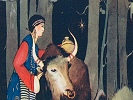

  
[Intangible Textual Heritage](../../index)  [Asia](../index) 
[Index](index)  [Previous](tft20)  [Next](tft22) 

------------------------------------------------------------------------

[Buy this Book at
Amazon.com](https://www.amazon.com/exec/obidos/ASIN/B0025VKZPM/internetsacredte)

------------------------------------------------------------------------

  
*Tibetan Folk Tales*, by A.L. Shelton, \[1925\], at Intangible Textual
Heritage

------------------------------------------------------------------------

p. 81

#### EIGHTEEN

## How the Rabbit Killed the Lion

To your foe do not give a promise, for he carries a
sword.  
                                        *Tibetan Proverb*.

A LONG, long time ago, before the mountains were melted, and the trees
were burned, and the animals all died, the sun was so hot that the
mountains all ran down level with the plains. Then the king of beasts on
the earth was the lion, and every morning all the animals had to come
and kotow to him. One day there was a rabbit in a nice soft bed of
grass, feeling so comfortable that he didn't want to go and kotow to the
king. He didn't see any use of it, didn't know exactly where the lion
was, and he was having too good a time anyway. All of a sudden the king
stood before him looking like a thunder cloud. He spoke and said, "You
little split-nosed rascal, here you are having a nice time eating grass,
and have not come to kotow to me. All the other animals have made
obeisance this morning. You do not value your life at all, do you?"

The rabbit thought, "If I don't tell this lion a lot of big lies, he
will surely kill me, so I must tell them to save myself." Very politely,
he said, "This morning when I got up to go to make my

p. 82

obeisance to you, I came to a stream of water, and in it was a big
she-devil and I was afraid, and ran up here a few minutes ago to hide in
this grass."

The lion asked, "Did that devil harm you?"

"No," answered the rabbit, "she didn't hurt me, she only yelled as I
went by and my heart seemed as if it would break into two pieces, and
that was enough for me. She asked, 'You little short-footed fellow,
where are you going so fast?' I answered, 'I'm going to make my
obeisance to the king of beasts.' Then she said, 'Well, we are going to
see about that, son, and find out who is greater, he or I. I've hunted
every place for this lion and can't find him, so when you go to kotow to
him, you tell him for me, that I want him to come here where I am in
this water, and we will see who is to be the ruler of the beasts.' So if
you have anything to say to her I'll go take the message, as it would
not do for you to go down there."

The lion answered, "I haven't anything to tell you, but I have something
to say to that devil, and I'll go down and say it myself. There isn't
anything on earth or any devil that can be bigger or think themselves
bigger than I am, or more able to rule the beasts, for I'm the biggest
there is. If she whips me, I'll be the same as a dog and let her rule."

The rabbit thought, "I'm in for it now, I'll lead him down and let him
see for himself." He led him to the stream, and when the lion saw his
reflection

p. 83

 

  [  
Click to enlarge](img/08300.jpg)  
THE KING OF THE BEASTS AT THIS TIME WAS A LION AND EVERY MORNING ALL THE
ANIMALS HAD TO COME AND KOTOW TO HIM.  

 

p. 84 p. 85

his hair all bristled up and his tail lashed from side to side. The
rabbit, dancing up and down, yelled, "There she is, there she is."
Whereupon the lion flew into a great rage, jumped into the water to
fight and drowned himself.

------------------------------------------------------------------------

[Next: Nineteen: How the King Lost His Great Jewel](tft22)
