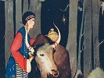

  
[Intangible Textual Heritage](../../index)  [Asia](../index) 
[Index](index)  [Previous](tft39)  [Next](tft41) 

------------------------------------------------------------------------

[Buy this Book at
Amazon.com](https://www.amazon.com/exec/obidos/ASIN/B0025VKZPM/internetsacredte)

------------------------------------------------------------------------

  
*Tibetan Folk Tales*, by A.L. Shelton, \[1925\], at Intangible Textual
Heritage

------------------------------------------------------------------------

p. 147

#### THIRTY-SEVEN

## The Story of a Turquoise

Whether you love or hate him a dumb man cannot tell
--whether a thing is dirty or clean a blind man cannot tell.  
                                                    Tibetan
Proverb.

ONCE upon a time, away in the midst of some high, high mountains, there
was a mud house. In it dwelt an old father and mother and a son and
daughter. As the custom is in that country they gave their daughter to a
man for a wife and the son took two wives, bringing them both into the
home, making five in the family. The son's wives were called the little
and the big wife, the one he married first being the big one with the
most authority.

Suddenly one day the mother and her son died, so the two
daughters-in-law took things into their own hands and proceeded to make
a slave of the old father, sending him out on the mountain every day to
tend the cattle, and giving him nothing to eat but a little sour cheese
and blood. They got this blood by tying a yak so he couldn't move and
sticking a needle into the jugular vein, letting him bleed a few bowls
full, then turning him loose, and the next day bleeding another. The
blood coagulated and became jelly-like, so they sliced it,

p. 148

warmed, cooked and ate it. The poor old man was very bad off and was
about to starve to death, when he decided he would send to his daughter
and see if she would give him some food. So he went down to the road to
see if he could find any one going to her home, and as he sat waiting he
fell asleep.

A big caravan of merchants came along and called out, "Old man, why are
you sleeping here in the road?" He wakened and asked where they were
going and when they named the place where his daughter lived he asked
them to take a message to her. "Tell her that her mother and brother are
both dead, that I am very happy, for I am a shepherd with great power,
and have cheese and dried blood to eat; that there is no other man so
powerful as a shepherd. Sometimes I have a little wine to drink, but in
making the wine I don't need to beat up any barley, as there are no
bubbles on top." (His wine was only water.) The mer-chants traveled on,
found his daughter and delivered the message. She asked what time they
were going back, as she wanted to send a message to her father. When
they were ready to return they went for her message. She had a very
valu-able turquoise, and she made a brick of mud, put the stone in its
center and said, "Tell him if he wants to live well to keep this brick,
that he mustn't sell it, but may use it to gain influence."

The old man watched eagerly every day for the return of the caravan. At
last it came and delivered the message and the brick. He understood

p. 149

at once, and took the brick up on the mountain, broke it open and got
the stone, then he went down to the home where his daughters-in-law
ruled supreme and showed it to the big wife, saying, "See what my
daughter sent me. I'm not going to sell it, and when I die I will give
it to you." So she decided to feed him and clothe him well, for she
thought, "He won't live long and I'll soon get it."

One day when the big wife was not there he showed it to the second wife
and said, "Look what I have; now I don't want to give it to the big wife
and I don't want to sell it, but when I die I want to give it to you."
So she was greatly pleased and thought, "Well, the old man won't live
long, I'll be good to him and feed him well." So they both vied with
each other to see who could treat him the best, but neither knew why the
other was doing it. One day he became very ill and thought he was about
to die, so he hid the stone on a cross beam of the house, just above a
big water tank. His daughters-in-law were not home. He called the
servants and told one of them to go to his daughter with this message,
"Tell her to come to see me, and if she has no horse to ride, tell her
to ride a donkey, and if I am dead when she arrives there is a great
treasure on the neck of a big dragon and its image appears in the sea."

Soon he died and his daughters-in-law looked through everything he had,
but could not find the stone. So the big wife said they must have a lot
of lamas and read prayers for his soul. One day

p. 150

his daughter came and asked if there was any last message from her
father and they told her "Yes." He said, "Tell her that there is a
treasure on the back of the dragon's neck and its image appears in the
sea." She understood at once, and looking in the water tank saw the
image of the turquoise, climbed up on the beam and got it, tucked it in
her bosom and went home.

------------------------------------------------------------------------

[Next: Thirty-Eight: A Wise Idiot](tft41)
