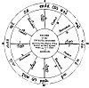

  
[Intangible Textual Heritage](../../index)  [Sky Lore](../index) 
[Index](index)  [Previous](aia04)  [Next](aia06) 

------------------------------------------------------------------------

p. 20

### CHAPTER II.

[  
Click to enlarge](img/fig01.jpg)  
Fig. 1.  

EXPLANATION.--In the above figure the ANGLES and the succeedent and
cadent houses appear at one view. The 1st house embraces 24° of
longitude in the zodiac, viz. from ♎ 0° 0' to ♎ 24°; the 2nd house
contains 30°, viz. from ♎ 24° to ♏ 240; the 3d house contains 36°, viz.
from ♏ 24° to

p. 21

\[paragraph continues\] ♑ 0° 0', being 6° of ♏ and the whole of ♐; the
4th house contains 36°, viz. the whole of ♑ and 6° of ♒; the 5th house
contains 30°, viz. from ♒ 6° to ♓ 6°; and the 6th house contains 24°,
viz. from ♓ 6° to the end of that sign, or ♈ 0° 0'.--N.B. The other
*six* houses will be found to embrace exactly the same number of degrees
of the opposite signs of the zodiac; the 7th being opposite to the 1st,
the 8th to the 2d, &c. If the student look for ♋ 0° 0' on the 10th house
in the table of houses for London, he will find the longitude of the six
*eastern* houses, as here noted; and, of course, the six opposite or
*western* houses have the same degrees of the opposite signs on their
cusps.

### OF ERECTING A FIGURE OF THE HEAVENS.

THIS is merely a map to represent the heavens at any particular moment,
such as when a child is born, or a question asked, &c. In the first
place, draw three circles, as in [figure 1](#img_fig01); and then draw
lines to represent the horizon, and others, at right angles with them,
to represent the meridian: thus will be shewn, the natural divisions
formed by the rising and setting of the Sun, and by his passing the
meridian at noon and midnight. Each of these quarters or quadrants is to
be again divided into three equal parts, forming

*The Twelve Houses*.

These are marked from No. 1 to No. 12; and it will be observed, that the
double lines 1 and 7, which represent the eastern and western horizons,
and those marked 4 and 10, which represent the meridians below and above
the Earth, are the cusps or commencement of the *angles*. Those lines
numbered 2, 5, 8, and 1l, are the cusps of the *succeedents*, so called
because they follow or *succeed* to the angles. These houses are next in
power to the angles. Those lines marked 3, 6, 9, and 12, are the cusps
or beginnings of the *cadent* 

p. 22

houses; so called because they are *cadent*, that is, *falling* from the
angles: these are the weakest of all the houses.

Thus the student will perceive, that if a planet, &c. be in one of the
*angles*, it is powerful; if in a *succeedent* house, it is less
powerful; and if in a *cadent* house, it is weak and in capable of
effecting much either good or evil.

*Rule to erect the Figure of the Heavens at any Time*.

1\. Learn in an ephemeris [1](#fn_8) for the year
what was the right ascension of ☉ at the noon previous to the required
time, in hours, minutes, and seconds. To this right ascension add the
number of hours and minutes which have elapsed since that noon: [2](#fn_9) the sum will be the right ascension in time
of the meridian above the Earth (the mid-heaven) at the required time.

2\. Find the longitude answering to this right ascension, in the column
marked 10th house in the Table of Houses, which longitude is to be
marked over the line which denotes the mid-heaven or 10th house.

3\. In a line with this will be found the longitude on the cusps of the
11th, 12th, 1st, 2d, and 3d houses; which copy out from the table, and
enter over the lines which denote those respective houses.

4\. Having thus completed the *six eastern* houses, find the signs and
degrees exactly opposite to each of them, and enter it over the cusps of
the opposite or western houses, in the following order:--

|                                 |          |           |
|---------------------------------|----------|-----------|
| 10th house                      | opposite | 4th house |
| 11th                            | do.      | 5th       |
| p. 23 |          |           |
| 12th                            | opposite | 6th house |
| 1st or ascendant                | do.      | 7th       |
| 2d                              | do.      | 8th       |
| 3d                              | do.      | 9th       |

5\. Having thus completed the figure, as far as regards the signs of the
zodiac, it now remains to place in the planets as they may be situated.
The most distant from the ☉ is ♅, whose longitude is generally given in
the ephemeris for each ten days, and if the time of the figure fall
between it, it must be found by proportion. When his longitude is found,
write it in the figure, thus, ♅ 13° 19', just by the cusp of the house,
which falls in the same sign. in which ♅ is found. If the cusp be
farther on than the planet in the sign, place the planet *outside* the
cusp; but if the planet be the farthest advanced in the sign, place it
*inside* the cusp. After having entered ♅, enter in the same way ♄, then
♃, ♂, ☉, ♀ and the ☽. To find the exact longitude of these seven, which
is usually given for the noon of each day, find the distance they travel
in longitude between the two noons preceding and succeeding the time of
erecting the figure; and then take the proportional part for the time
after the previous noon, and add it to, (or if the planet be retrograde
subtract it from), the planet's longitude for the previous noon.

6\. Find the longitude of ☊ in the same manner, and enter it
accordingly, and place ☋ in the sign and degree and minute exactly
opposite thereto.

7\. If it be a horary question, calculate the place of ⊕, and enter it
accordingly; when the figure of heaven will be complete. But if it be a
nativity, you must calculate the ⊕ according to the rule given, first
having prepared a Speculum, or Table of Data, as taught in *Chap*. 9 of
the *Grammar of Astrology*.

------------------------------------------------------------------------

### Footnotes

[22:1](aia05.htm#fr_8) Ephemeris signifies a
journal or Almanac, in which the places of the planets, &c. for each day
are registered. For all years before 1834, *White's* is the best.

[22:2](aia05.htm#fr_9) This time must first be
corrected for the error of the clock, by, adding what the clock is too
slow, or subtracting what it is too fast.

------------------------------------------------------------------------

[Next: Chapter III. Of the Aspects](aia06)
