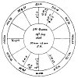

  
[Intangible Textual Heritage](../../index)  [Sky Lore](../index.md) 
[Index](index)  [Previous](aia25)  [Next](aia27.md) 

------------------------------------------------------------------------

### CHAPTER XXIII.

### If one shall find the Party at Home he would speak with?

THE ascendant and its lord are for the querent, the 7th and its lord for
him you would speak with; but if it be with any relation, take the house
signifying that relation and its lord; as, for the father the 4th, for a
child the 5th, and for an intimate friend the 11th; if the lord of the
7th, or quesited's significator, be in any of the four angles, the party
is at home; but if he be in a succeedent house, he is not far from home;
but if in a cadent house, then he is far from home.

If you find the lord of the ascendant apply to the quesited's perfect
aspect the same day you intend to visit him, you may be assured either
to meet him going to his house, or hear of him by the way; or, if any
planet separate from the lord of the quesited's house, and transfer his
light to the lord of the ascendant, you will learn where he is by a
person signified by

p. 96

that planet. Describe the planet, and it personates the individual; and
the nature of the planet, sign, and quarter of heaven it is in will, by
the plurality of testimonies, shear whether it be male or female.

*Of a thing suddenly happening, whether it signifies Good or Evil*?

Erect your figure of heaven at the exact time of any event happening, or
when you first heard of it: then consider who is lord of the ascendant,
and which planet disposes of ☉ and ☽ and see if either of these be in
the ascendant, and, if more than one, take the most powerful; and let
his position be well considered. If he be in good aspect with ☉, ♃, or
♀, there will no evil arise from the accident, rumour, or whatever the
event may be; but if you find that planet weak in the scheme, combust,
or in evil aspect to ♅, ♄, ♂, or ♀, there will be some evil occur. If
you consider the afflicting planet and his nature and position, you may
learn the nature of the misfortune. If it be the lord of the 3d, it will
come through some kinsman or neighbour, or by some short journey; if the
lord of the 2d cast the ray, or the evil planet be in the 2d, it denotes
loss of money; [1](#fn_66.md) if the lord of the
4th. trouble about houses, &c., or by means of a father or wife's
mother; if the 5th, by intemperance, or by children, &c., and so of the
rest. [2](#fn_67.md)

p. 97

QUERY.--*What Mark, Mole, or Scar has the Querent on any Part of his
Body? This is useful to prove that a question is radical, and to satisfy
sceptics of the truth of the science*.

When you have, upon any demand, erected the querent's figure, observe
what member of man's body the ascending sign represents; for upon that
part of his body will the querent have a mole, mark, or scar; as, if the
ascendant be ♈, the same will be on the head; if ♉, it will be on the
neck; if ♊, on the arms or shoulders, &c. [1](#fn_68.md) And also in the part ruled by the sign in
which the lord of the ascendant is, will there be another mark.

The signs on the cusp of the 6th house, and that in which the lord of
the 6th is, will give other marks on the parts they rule. Also the sign
in which ☽ is found will give a mark in that part it governs.

If ♄ give the mark, it is dark, obscure, or black; ♂ usually gives a red
mole; but if he be in a fiery sign, it is generally a cut or scar.

If the sign or planet signifying the mark or mole be much afflicted, the
mark, &c. will be more obvious and eminent.

If the sign or planet be masculine, the mark is on the *right* side of
the body; but if they be feminine, on the *left* side. And if the
significator of the mole, &c. be *above* the horizon, the mark or mole
will be on the *fore part*, or visible to the eye, or on the outside of
the member, &c.; but if the planet be *below* the earth, it will be
found on the inside, of

p. 98

*hinder part*, or not visible. If few degrees are on the cusp of the
house, or the planet signifying the mole, &c. be in few degrees of the
sign, the mark, mole, &c., will be in the upper part of the member. If
they be in the middle of the sign, it will be in the middle of the
member or part ruled by the sign. But if the latter degrees ascend, or
are on the 6th, or their lords, or ☽ be in the latter degrees of a sign,
then will the mark, mole, or scar be near the lower part of the member.
If your question be radical, and the time rightly taken, the above rules
will always exactly hold good. And so will they (*mutatis mutandis*)
upon the body of the quesited; for if a person inquire concerning his
wife, then the sign on the 7th and its lord will shew the woman's marks;
and the sign on the 12th, (the 6th from the 7th), and its lord will shew
two other marks.

Many times if the ☽ be in ☌ or ☍ ☉, the querent has some blemish in or
near his eyes: and this is ever true, if the ☌ or ☍ be in angles, and ☽
or ☉ be afflicted by Mars. [1](#fn_69.md)

*Whether one absent be dead or alive*?

If the quesited have no relation to the querent, then the

p. 90

ascendant, its lord, and ☽ shall signify the absent person. [1](#fn_70.md) But if the party inquired after be a
relation, then take the house and its lord which signifies that
relation; as the 3d for a brother or sister, The 4th for a father, the
6th for a paternal uncle or aunt, the 10th for a mother, &c.

In judging this question, see whether the quesited's lord of the 1st and
8th be joined corporally together in the 8th, or be in ☍ from the 6th or
8th. These are tokens of his being sick or near to death. See if there
be any translation of light between the lord of his ascendant and the
8th, or if the lord of the 8th being in his ascendant, the lord of his
ascendant be also in the 8th; or the lord of the 8th in the 4th, and the
lord of the 4th in the 8th; these are all tokens that the party is dead;
especially if his significator be much afflicted by ill aspects, and the
evil planets be angular, and the good ones cadent.

If the lord of his ascendant be separating from ill aspect of the lord
of the 6th, the absent party has been lately sick; if from the lord of
the 8th, he has been near death, but is not dead, without other striking
testimonies, as above, concur. If from the lord of the 12th, he has been
troubled with anxiety about arrests or fear of imprisonment; and if his
significator be in the 12th, he is in much trouble by means of a private
enemy; and if in a fixed sign, and other testimonies of trouble agree,
he is in prison. If he separate from the lord of the 2d by ill aspect,
he is now suffering by want of money If from the lord of the 7th, he has
had some quarrel or contention. If the 9th, trouble on journeys or by
law, &c. and so of the other houses. I have ever found that if the lord
of his ascendant be in the 9th, 10th, or 11th, though reported

p. 100

dead, he was alive. If you find him alive, and would know when you will
hear from or see him, observe in the Ephemeris when the lord of the
querent's 11th and the quesited's ascendant come to ✶ or △ aspect: about
that time news of him will arrive. If the ☽ apply to ✶ or △ of his
significator, then allow a day, week, or month, for each degree she be
distant, according as the significators may be placed in angles,
succeedent or cadent houses, and the signs be moveable, common, or
fixed. [1](#fn_71.md)

p. 101

[  
Click to enlarge](img/fig03.jpg.md)  
Fig. 3.  

THE ABOVE FIGURE WAS FOR RESOLUTION OF THE FOLLOWING QUERIES.

1st. *If a Party might be found at Home*?

2d. *A Thing suddenly happening, whether Good or Ill is about to
follow*?

3d. *What Moles or Marks the Querent has*?

4th. *If one absent be dead or alive*?

p. 102

1st QUERY.---*A Woman demanded whether her Son was with his Master at
her own House*?

In this figure, ♀ lady of the ascendant denotes the querent. The 5th
house is that of children, and describes the matter inquired of. I found
♃, lord of the 5th, youth's significator, in the east angle; one
argument that the party was at home at his mother's house. The ☽ was
applying to ✶ of ♄ lord of the 4th, the significator of the querent's
dwelling: I judged that she would find him there at her coming home:
which she did. Now, had I found ♃, lord of the 5th, in the 10th, which
house signifies the master; or had ☽ separated from ♃, the youth's
significator, and then applied to ☉, the ☽ being in an angle, I would
have judged him at his master's house. I considered further, that the
25th of July following at 2 P.M., the significators of the mother and
son (♃ and ♀) came to △ aspect; and therefore I judged that she should
see him at that time: which she did. For usually about that day when the
*significators* come to ✶ or △ aspect (which may be seen in the
*Ephemeris*), it is very probable that news of, or a letter from, the
quesited will arrive, if the distance will permit. But if the querent
and quesited be not far asunder, without question they meet on that very
day.

Had the party inquired for been a stranger, he would have been denoted
by ♂ lord of the 7th; and being in the 2d, a *succeedent* house, I
should have said he is not at home, but yet not far from home. And as
the sign ♐ is eastern, and the 2d house is north east, I should judge
him in that direction; and as ♐ governs fields, hills, or high grounds,
1 should direct a messenger, if sent for him, to go in that direction,
and look for him in such places; hut if it were in a town, as ♐ governs
stables, fire-places, &c., I should cause him to be sought near a
stable, smith's or butcher's shop, &c., as ♂ delights in such places.

p. 103

2d QUERY.--*A Thing suddenly happening, whether Good or Ill is about to
follow*?

The ☉ is here lord of the sign he is in; ♃ is lord of ♓, where ☽ is; ♀
is lady of the ascendant, and is casting a △ to the ascendant, and is in
△ to ♃, and he in the ascendant; from all which we might safely have
judged, had this been the time of a sudden accident, or thing done, that
it could not have redounded to the querent's injury. But had ♀ been
nearer to ☍ of ♂, he being in the 2d, I should have of judged that the
querent would have received some loss of money shortly, and so of the
rest. [1](#fn_72.md)

3d QUERY.--*What Moles or Marks the Querent has*?

I find 25° of ♎ ascending and ♃ in the ascendant, which signifies the
face. This querent had a wart or mole on the right side of her face,
near her mouth; for ♃ and ♎ are *masculine*. And as the latter degrees
of ♎ ascend, so the querent confessed a mole on the lower part of her
reins towards the haunches. ♈ being the sign of the 6th, shewed she had
one on the forehead, near the hair, for the cusp of the house is but 4
degrees. ♂ lord of the 6th, being in ♐ a masculine sign and under the
earth, shewed a mole on the right thigh, towards the middle of it, on
the back part, or

p. 104

that part which is not visible. The ☽ in 27th degree of ♓, a feminine
sign, under the earth, I told her she had one mole under and towards the
extremity of her left foot.

The quesited being her son, had ♓ for his ascendant, which denoted a
mole on the left side of his cheek; and as ♓ signifies the foot, so he
had one on the left foot a little below the ancle, as few degrees
ascend. The 6th from the 5th is the 10th in the figure, which having 4°
♌, shewed that near his right side, below his breast, he had some scar,
mole, or mark.

In this way follow the directions of the rule.

4th QUERY.--*Whether one absent be dead or alive*?

In the aforesaid figure, the ascendant ♃ therein and ♀ its ruler, as
also ☽, are the significators of the party absent. The ascending sign
and ♃ therein describe his person; [1](#fn_73.md)
and ☽ and ♀ shew his condition.

The ☽ and ♀ are free from any evil aspect of the lord of the 8th, and a
benefit is in the ascendant, and ♀ in the 9th; I should therefore
pronounce the absent in health. But ♀ having been recently in ☍ to ♂,
lord of the 2d and 6th, he had been lately in trouble about money, and
also inclined to a feverish state. But by ♃ in the ascendant, and in △
to ♀, I should say that medicine, or such a person as is described by ♃,
had relieved him. And as ☿ lord of the 11th applies to a ☐ of ♃, (both
of them in signs of long ascension, which is equivalent to a △) [2](#fn_74.md) I should judge the querent to have news of
the absent about ten weeks from the time of the

p. 105

question, because ☿ wants ten degrees of the ☐ of ♃. If the absent be
known to be at a short distance from the quesited, I should have judged
that in ten days they should hear of him, because the signs are
moveable. [1](#fn_75.md)

------------------------------------------------------------------------

### Footnotes

[96:1](aia26.htm#fr_66.md) the same if ⊕ receive
evil rays approaching.

[96:2](aia26.htm#fr_67.md) The nature of the planet
casting the ray, also may be expected to shew the nature of the evil; ♂
shews robbers, &c., ♄ elderly persons, ☿ young persons and lawyers, ♅
unlooked-for and uncommon events, ♀ females, ☉ men in power, ♃ clergymen
and magistrates, ☽ sailors, low people, mobs, &c. But note, that unless
the benefit planets be lords of evil houses, their ill aspects do not
import much evil. And if they be lords of good houses, or placed in good
houses and strong, their good aspects denote benefits in the same
manner; and in all cases ⊕ shews gain or loss, as it may be aspected;
and ☊, with the chief significator, imports benefits, and ☋ the reverse.

[97:1](aia26.htm#fr_68.md)

PARTS *of* MAN'S BODY *ruled by the* TWELVE SIGNS.

<table data-border="0">
<colgroup>
<col style="width: 50%" />
<col style="width: 50%" />
</colgroup>
<tbody>
<tr class="odd">
<td data-valign="top" width="327">
♈ <em>Head and face</em>. 
♉ <em>Neck and throat</em>. 
♊ <em>Arms and shoulders</em>. 
♋ <em>Breast and stomach</em>. 
♌ <em>Heart and back</em>. 
♍ <em>Bowels and belly</em>.
</td>
<td data-valign="top" width="327">
♎ <em>Reins and loins</em>. 
♏ <em>Secret members</em>. 
♐ <em>Hips and thighs</em>. 
♑ <em>Knees and hams</em>. 
♒ <em>Legs and ancles</em>. 
♓ <em>Feet and toes</em>.
</td>
</tr>
</tbody>
</table>

[98:1](aia26.htm#fr_69.md) If ♃ give the mark, it
will be bluish or purple; ♀ gives it yellow; ☿ a pale lead colour; ☉
olive or chesnut; and ☽ a whitish hue, or partly of the colour of the
planets she aspects. The infortunes ♄ and ♂, especially when together,
or in exact aspect, mark according to their position. If they be in the
ascendant, a mole, &c. will be in the face; if in the 2d, on the neck;
in the 3d, on the arms, &c.

And all these rules apply to the figure of birth, as well as horary
figures; but *defects*, such as protrusion of the breast bone, or a
humped back, &c. (to persons born with ♋ or ♌ rising), may sometimes be
found in lieu of moles or scars. For example, her present majesty,
having ♄ in ♓, which rules the feet, and situated near the cusp of the
12th *house*, at her birth, she has a *weakness* in her feet. Had one
testimony only existed, and ♄ been in ♓ elsewhere, she would have merely
had a mole on her foot.

[90:1](aia26.htm#fr_70.md) We should always take
the ascendant, &c. for the querent, and the 7th and its lord for the
quesited. But if the figure be erected by an artist at his own
suggestion, let the ascendant, &c. shew the absent person.

[100:1](aia26.htm#fr_71.md) The most difficult
thing in all questions is to judge of time with accuracy. I should
advise the young student to be cautious of giving any judgment on this
head, unless where it is the chief point desired to be known. In this
case, and if the figure be very radical, and *if the planet which is
applying* to the other be taken, the following rule will hold good:

*Each Degree gives*

|                              |         |
|------------------------------|---------|
| IN MOVEABLE SIGNS AND ANGLES | DAYS    |
| IN COMMON SIGNS AND ANGLES   | WEEKS.  |
| IN FIXED SIGNS AND ANGLES    | MONTHS. |

*Succeedent houses* give *weeks*, *months*, and *years*, as the sign is
*moveable*, *common*, or *fixed*; and *cadent houses* give *months* in
*moveable signs*, *years* in *common*, and an indefinite time in *fixed*
signs.---ZAD.

[103:1](aia26.htm#fr_72.md) We consider that our
author has been rather brief on this point, for numerous occasions occur
where the mind is desirous of knowing the result when events happen. If
♀ had been within orbs of ♂ opposition, that is, *half the distance of
their united orbs*, or 7°; we should have judged loss of money by a
party shewn by ♀, and her situation considered with the houses she
governs. As, for example, ♀ ruling the 12th, some private female enemy,
among the relations of the wife or husband. because ♀ is in the 3d from
the 7th house. And as ♂ is ☍ to ⊕, we should predict a loss by a servant
(since ♂ rules the 6th); and as ⊕ is in the 8th, it might be by one who
comes to char or go messages; if ⊕ had been in a watery sign, a
washerwoman. But the general testimonies being good, we should say the
evil will be but trifling. Experience will teach the student these
points.

[104:1](aia26.htm#fr_73.md) If no planet be in the
ascendant of the party, look to the lord of the ascendant for a
description of his person, according to the sign it is in, and judge by
that and the sign ascending; but if the lord of the ascendant be much
*afflicted*, the ☽, according to the sign she is in, must be taken.

[104:2](aia26.htm#fr_74.md) This doctrine of the
signs of long ascension, causing a ✶ to be equal to a ☐, and a ☐ to a △,
and the reverse in signs of short ascension, can only be received in
horary and mundane astrology; and not in nativities.

[105:1](aia26.htm#fr_75.md) We should, in this
latter case, prefer looking to the Ephemeris for [a](errata.htm#0.md) day
when ☿ formed a △ of ♃ for hearing news, and when ♀ and \#\#\# came to ☌
for his return.

------------------------------------------------------------------------

[Next: Chapter XXIV. Of a Ship, and her Safety or Destruction](aia27.md)
