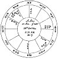
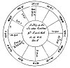

  
[Intangible Textual Heritage](../../index)  [Sky Lore](../index.md) 
[Index](index)  [Previous](aia26)  [Next](aia28.md) 

------------------------------------------------------------------------

### CHAPTER XXIV.

### OF A SHIP, AND HER SAFETY OR DESTRUCTION.

THE ascendant and the ☽ signify the ship and cargo; the lord of the
ascendant, those that sail in her. If you find a malevolent, having
dignities in the 8th, placed in the ascendant, or the lord of the
ascendant in the 8th in ill configuration with the lords of the 8th,
12th, 4th, or 6th, or if the ☽ be combust, and under the earth, you may
judge that the ship is lost, and the men drowned. But if you find
reception between the significators at the same time, the ship was
wrecked, but some of the crew escaped: if all the preceding
significators be free from affliction, then both ship and cargo are
safe; and if there be reception, the more so. If the ascendant and ☽ be
unfortunate, and the lord of the ascendant fortunate, the ship is lost,
but the men saved.

But when the querent demand, of any ship setting forth, and the state of
the ship ere she return, and what may be hoped of the voyage; then,
behold the *angles* of the figure, and see if the fortunes are therein,
and the infortunes remote from angles, cadent, combust, or under the ☉
beams, then you may judge the ship will go safe with all her lading. But
if you find the infortunes in angles, or succeeding houses,

p. 106

there will chance some hinderance unto the ship. If the infortune be ♄,
the vessel will strike ground. If ♂, and he be in an earthy sign, he
will signify the same, or very great danger and damage. But if the
fortunes cast their benevolent rays to the place of ♄ or ♂, and the
lords of the angles and of the dispositor of the ☽ be free, then the
ship shall labour hard, and suffer damage, yet the greater part of the
crew and cargo shall be preserved. If ♂ afflict the lords of the angles,
and dispositor of ☽, the crew will be in danger by enemies or pirates;
and if there be any additional evil configurations among these
significators, there will be quarrels on board, thieving, and
purloining, &c., with bloodshed: ♄ causes thefts only, if so situated,
but no bloodshed.

If the signs afflicted by ♄, ♂, ☋ (and ♅, if he be ill aspected), be
those that signify the vessel's bottom, or parts under water, she
springs a leak; if the signs be unfortunate in the midheaven, fiery
signs, and ♂ therein, there is danger of lightning or fire; if airy
signs and ♀ afflict, damage by high winds. If ♂ be in the 4th, and
afflicted, it denotes fire beneath; and if ♅ be with him, spontaneous
combustion. If the sign be ♊, ♎, or ♒, she may be set on fire by an
enemy.

If ♄ be in the midheaven, and shew damage, it will be by rotten sails or
gear, and bad weather, foul winds, &c. An in-fortune in the ascendant
shews damage to the fore part of the vessel; and if the lord of the
ascendant be retrograde, it denotes that she will put into some harbour;
and if he be in a moveable sign, she returns to the very port she sailed
from. If the lord of the 8th afflict the lord of the 1st, and he in the
8th, the ship will be injured according to the nature of the planet
afflicting. If he impedite the ☽'s dispositor, the lord of the ascendant
and ☽, it shews the death of the master, and probably of his mate. If it
be ⊕ which is afflicted, it

p. 107

foreshews evil to the cargo or a had market; but if ♃, ♀, or ☊ be in the
second, or assist its lord, or the lord of ⊕, it shews good profit,
which will be according to their strength.

If the lords of the ascendant, of the ☽ and their dispositors be slow in
motion, the voyage will be long; if they be swift, the ship will return
quickly. If there be ill aspects between the lord of the 1st and the
dispositor of ☽ without reception, there will be discord among the
seamen, and with them and the owner. If the lord of the ascendant be
strongest, the seamen will prevail; but if the lord of the house where ☽
is, then the owner. If the dispositor of ⊕ be not with it, or the lord
of the 2d be weak, there will be scarcity of provisions, and, if they be
in watery signs, of fresh water.

PARTS *of a* Ship *ruled by the* SIGNS.

♈ The breast, or bows of the ship.

♉ The cutwater, and parts beneath.

♊ The rudder, or stem.

♋ The bottom, or floor.

♌ The upper works.

♍ The hold.

♎ The parts about the water's edge.

♏ The seamen's berths, or cabin.

♐ The seamen themselves.

♑ The ends of the vessel.

♒ The master, or captain.

♓ The oars, in galleys; the wheels, in steam-vessels; and the sails in
others.

p. 108

[  
Click to enlarge](img/fig04.jpg.md)  
*Fig*. 4.  

AN EXAMPLE OF A SHIP AT SEA.

In December 1644, a merchant, in London, having sent a ship to the coast
of Spain to trade, had several times news that his ship was wrecked. He
would have given £60 per cent. to insure her, but no insurance company
would meddle, no, not upon any terms. A friend of the merchant asked,
*What I thought of the ship, if sunk or living*? I gave my opinion,
*that the ship was not lost, but did live, and though* 

p. 109

*of late in some danger, yet was now recovered*. My judgment was founded
on the considerations in act following:

In the first place, the ascending degrees of Cancer shewed the bulk or
body of the ship. I find ♄ casts his ☐ from a cardinal sign, out of the
11th house, very near to the ascendant. After his ☐ I find ☽ in her
exaltation, casting a ✶ to the ascendant, interposing her ✶ between the
☍ aspects of ☿ and ☉ in the 7th, which otherwise had been dangerous, for
all aspects to the ascendant in this judgment are dangerous. From the
ascendant afflicted by ☐ of ♄, and presence of fixed stars of his
nature, I judged the ship was of ♄'s nature, sluggish, heavy, and not
very sound. And ♋, being a weakly sign, made me judge the ship was of
such nature; (*and it was so confessed*). From hence, and ☋ in the 9th,
I judged that the ship had been in some distress in her voyage,
occasioned by such casualties as ♄ signifies, viz. some leak or damage
in or near her breast, as ♈, the sign ♄ is in, represents that part.

But as ☽, lady of the ascendant, is in the 11th in her exaltation, in no
way impedited, and by a benevolent △ aspect applying to ☉ and ☿, and is
so near the body of ♃, and as all the significators are above the earth,
and no infortunes in angles; I judged the ship, sailors, and officers,
were safe, and in good condition. The next QUERY was--

*Where the Ship was, upon what Coast, and when any News would come of
her*?

Herein I considered the ☽ was fixed, and in the 11th house; ♉ is a
southern sign, but in an east quarter of heaven, verging to the south;
her application is to △ of ☿, and he in ♑ a south sign and west angle;
all this made me judge that the ship was *south-west* from London, and
upon our own coasts, or near those which lie between Ireland and Wales.
I judged her at that time to be in some harbour, because ♉, where ☽ is,
is fixed, and in the 11th, or house of

p. 110

comfort and relief, and that she was put in to repair. (*It proved that
she was an a harbour in the west*.)

Because ☽ applied to △ of ☿ and ☉, and they in an angle, and all three
very swift in motion, and did want but a few minutes of a perfect △, I
judged there would be news, or a certain discovery of the ship in a very
short time. The significators being so near a perfect aspect, I said,
either that night, or within two days, the news would arrive. (*And so
at proved*.) And, observe, that it gave me good encouragement when I saw
⊕ disposed of by ♂, and that ☿, to whom ☽ applied, was in reception with
♂; also, that ☽ did so well apply to ☉, lord of the 2d, or house of
*substance*: a sign that the merchant should gain by that adventure.

Besides, usually when ☽ applies to a good aspect of a *retrograde*
planet, it brings the matter to an issue one way or other speedily, and
when least expected; and it is a general maxim, that if ☽ apply to the
fortunes, or by good aspect to any planet or planets in metes, it is
reason that we hope well, &c.

p. 111

[  
Click to enlarge](img/fig05.jpg.md)  
*Fig*. 5.  

EXAMPLE *of another* SHIP *at* SEA.

Here the ascendant and ☽ are significators of the ship, and those who
sail in her. The ☽ lately separated from a ☐ of ♄, lord of the 8th and
9th, and afterwards applied to △ of ♄, then to ☍ of ☿, lord of the 12th
and 4th houses. This shewed that the ship had lately been in danger of
shipwreck: and as the ☽ had been void of course, so had no news been
heard of her; for, after being in ☐ of ♄ in fixed signs, and at the time
in a cadent house, and then not next

p. 112

applying to the good aspect of any benefit planet, but being void of
course, and then again continuing her application out of the 4th to ♄,
who is still lord of the 8th, though it was by good aspect; and then to
☍ of ☿, her dispositor, who is in his detriment and entering combustion;
and, ♃, dispositor of ☿, subterranean, and ☌ with ♂ and in term of an
infortune; and, moreover, as ♂ is in his fall near the cusp of the 2d, I
judged, by all this, loss to the merchant. Besides ⊕, is in the 6th
disposed by ♃, he retrograde and afflicted in the 2d in no aspect to ⊕,
the ☽ also in ☐ to it, as also ☿. There being so many ill testimonies, I
judged he would lose much, if not all, in this ship; and so consequently
that she was cast away. (*And so it proved*.) The principal significator
in the 4th and afflicted, was a sure sign of the ship sinking.

------------------------------------------------------------------------

[Next: Chapter XXV. Judgments Concerning the Second House](aia28.md)
