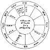

  
[Intangible Textual Heritage](../../index)  [Sky Lore](../index) 
[Index](index)  [Previous](aia27)  [Next](aia29) 

------------------------------------------------------------------------

### CHAPTER XXV.

### JUDGMENTS CONCERNING THE SECOND HOUSE.

WHETHER *the Querent shall be rich? or have a competent Fortune? By what
Means attain it? The time when? and of it shall continue?* 

Whoever interrogates, the lord of the ascendant and the ☽ are invariably
his significators.

Consider the sign on the 2d, its lord, and the planets therein, or
aspecting the cusp or its lord; also the ⊕.

If you find the planets all angular or even succeedent, if direct and
swift in motion, it is a good sign. If in good houses, direct, and
moderately well dignified, it is also a good sign. Those two rules are
general.

If the lord of the 1st, the ☽, and lord of the 2d, be joined together,
or if they have good aspect to the lord of the 2d, or

p. 113

if ♃ or ♀ cast a good aspect to ⊕, or if the lord of the 2d or ☽ be in
the ascendant, or lord of the 1st in the 2d, or benefits do ascend or be
found unafflicted in the 2d, or ☊ be there, all these are testimonies
that the querent need fear no poverty. As the significators may be
strong, and the testimonies numerous, the querent shall be in proportion
rich. Always remember to judge according to his condition in life; for,
*quoad capax*, it shall happen to the interrogator.

*By what Means attain it*?

If the lord of the 2d be in the ascendant, he may gain a fortune
unexpectedly, (especially if well aspected by ♅, and this planet be
strong), or gain it without much labour. If the lord of the 2d or the
Moon promise substance by any mutual aspect, observe from what house the
aspect is, or what house ☽ rules; if neither of these promise substance,
see what house ⊕ and its dispositor be in.

If the planet assisting be in the ascendant, the querent will gain by
his own industry, and, if he be a mechanic, by his own labour, care, or
invention. But if the assisting planet be not lord of the 2d, he will
gain by well managing his own affairs, estate, &c.; or by such things as
are of the nature of that planet, the sign he is in being also
considered.

If the lord of the 2d be in the 2d, he shall profit by his own industry.
If the lord of the 3d. benefit the lord of the 2d, ⊕, or other
significators of wealth, he will be assisted by his neighbours,
brethren, or kindred; or by removing to that quarter from whence the
lord of the 3d throws the aspect.

The lord of the 4th gives wealth by means of his father, or some aged
person; or by taking lands, or purchasing houses, &c.; or by well
managing money lent him by his kindred or neighbours; or property left
him by his ancestors.

p. 114

The lord of the 5th promises gain by cards or other gambling; or stock
jobbing; or by holding office as an ambassador or messenger. If a man of
low quality ask, by keeping an inn, &c., or being porter to some
institution, or connected with theatres, &c., and such things as the 5th
house denotes. It may be by well managing his father's estate, or
receiving something thereout.

The lord of the 6th gives gain by servants, dealing in small cattle,
&c., or by turning surgeon, &c., if capable.

The lord of the 7th gives gain by means of a wife, by the sword or
warfare, by contracting bargains in his way of business, or by gaining
some lawsuit, &c.

The lord of the 8th or planet therein denotes legacies, or a wife's
portion, which may be unexpected at the time, (especially if ♅ assist),
or he may suddenly go and settle in some country wherein he shall thrive
and grow rich.

The lord of the 9th, &c., gives property by the wife's relations, or
some neighbour of her's when he did marry; or some clergyman or lawyer
shall befriend him; or if ♋ or ♓ be in the 9th, he may thrive by a
distant sea voyage. But if an earthy sign be there, he may gain by
removing to the part signified by that sign, and by dealing in the
commodities belonging to that country, &c.

The lord of the 10th, &c. promises gain by the service of the king or
some great man, holding office, &c. If the querent be young and of small
fortune, let him learn some trade or business that may be shewn by the
sign and planet in the 10th.

The 11th and its lord denote unexpected benefit by friends, or the
employment of some king, nobleman or other great person.

If the fortunate aspect be cast from the 12th or by its lord, the
querent will advance his fortune by great cattle or

p. 115

horse-races; or if the sign be human, that is, ♊ or ♒, by means of
prisons, &c., such as being governor or turnkey of a jail, a sheriff's
officer, &c. If the sign be ♈, ♉, or ♑, by cattle; if ♍, by corn. Herein
mix your judgment with reason.

The most assured testimonies of riches are if the lords of the 1st, 2d,
and ♃ be joined in the 2d, 1st, 10th, 7th, 4th, or 11th houses; or if
not in ☌, if they apply by ✶ or △ and be in mutual reception. If they
apply by ☐ or ☍, yet have reception, the querent will gain wealth,
though with much labour and pains.

*Signs of Poverty, and its Cause*.

If you find that the querent will *not* be rich, and he desire to know
*why*, that he may the better order his affairs and be wary of such
difficulties as may threaten, then carefully observe as follows. The
planet afflicting most the lords of the 2d and 1st, the ☽, ⊕, or their
dispositors, or the cusp of the 2d or planet therein, shews the cause.
If the lord of the 1st, then the querent himself is the cause, and the
house in which he is found may shew how. The lord of the 2d shews want
of money or sufficient capital to set up with. The lord of the 3d shews
that his kindred or neighbours will oppose him much, or undersell him,
&c. And in this way you may go through the twelve houses, judging the
reverse of what you were instructed when the aspects, &c. were good.

*Caution*.--If the lord of the 2d or the dispositor of ⊕ be infortunes,
yet be strong and well aspected, they may denote gain as well as ♃ or ♀,
though with less satisfaction and more painstaking. Also ♃ or ♀ being
afflicted, may obstruct as well as any other; for every planet must do
the work for which he is by Providence assigned. Again, wherever ☋ may
be found, he denotes evil by that house, as if in the 6th, by evil
servants, sickness, &c.

p. 116

*If the querent shall obtain the Substance he hath lent, or which he
demands*?

The lord of the ascendant and ☽ are the querent's significators, the
lord of the 2d denotes his substance. [1](#fn_76)

The 7th and its lord denote the person of whom he means to ask the
money, and the 8th and its lord, &c., his property. Observe whether the
lord of the ascendant or ☽ be joined with the significator of the
quesited's property, or be in good aspect with such significator. If
this be so, and that significator be a fortune or very strong, he shall
assuredly receive the money. If he be an infortune, and there be
reception between him and the querent's significator, the querent will
also receive his money, &c.; but if the quesited's significator be an
evil planet, and there be no reception, he will hardly ever gain his
desire, or with so much delay and difficulty, he would rather wish the
thing undone.

In like manner if the lord of the 8th be in the 2d with reception, it is
a sign he shall gain his money, &c. But if the lord of the 7th or 8th be
in the 1st or 2d without reception with the querent's significators or
lord of the 2d, he shall not have his desire, but may rather expect
prejudice in the thing demanded.

If the lord of the 1st and ☽ be joined to a fortune that has dignity in
the sign ascending or *intercepted* in the *ascendant*, the matter will
be effected; or if joined to an infortune having such dignity, *with
reception*, the business will be dispatched. Or, if the significators be
joined to a fortune in the 10th or 11th, though without reception, the
matter shall be perfected.

p. 117

*If one shall acquire Gain, or Profit, Salary, &c., from the Government,
or any Nobleman, or Person of high Rank, &c.*?

This question will serve for any other of the like nature, where the
querent is much inferior in rank to the person he looks to for
accomplishing his desires.

The ascendant, its lord and the ☽, represent the querent as usual, and
the 10th and its lord the quesited. The 2d is the house of property for
the querent, and the 11th for the person inquired about.

If you find the lord of the 1st or the ☽ joined to the lord of the 11th,
or to any fortune in the 11th, not afflicted, you may affirm that the
querent shall obtain his money, salary, or debt, &c. Or if it happen
that the ☽ and lord of the ascendant be joined to an evil planet with
reception, he may expect to succeed, but not without much solicitation,
and many weary efforts. If there be any evil aspect between the
significators, one being an infortune and without reception, the querent
will never gain what he desires.

In this question be very careful to observe the planets' true essential
dignities, and their mutual receptions, and by which of their mutual
dignities they receive each other. [1](#fn_77)

*Of the Time when the aforesaid Events treated of in this Chapter may
happen*.

Herein diligently note to what planet the lord of the ascendant or ☽
applies, by ☌ or aspect. Consider how many degrees are wanting of the
perfect aspect or ☌, and say that it shall be as many days as there are
degrees, if they be *both in cadent houses*; if both in *succeedent*
houses, so many weeks; if both in *angles*, so many months. But if the
matter cannot possibly be effected in days or weeks, but requires

p. 118

much time, instead of months say years, and of weeks say months, and of
days say weeks, &c. And if one planet be in an angle, and the other in a
succeedent house, they shall signify months; one succeedent, and the
other cadent, they denote weeks; and when one be angular and the other
cadent, months. [1](#fn_78)

Some of the ancients have said, that if, at the time of a question, the
planet which signifies the perfection of the thing demanded be in the
same sign with the lord of the ascendant, the matter shall be brought to
conclusion when they come to bodily conjunction; if the lord of the
ascendant be the heavier planet, and whether there he reception or not.
But if the lord of the ascendant be the lighter planet, not without
reception, unless they be in an angle when the conjunction hall be
effected, or that the other planet be in one of his own houses,
especially that which is termed his joy. [2](#fn_79)

I have observed that reception by house, though the aspect were a ☐, or
even ☍, brings things to perfection; but that other receptions avail not
in this case.

*As regards the time when*; I find that if a fortune, or the ☽, or lord
of the thing quesited, be in the ascendant, and have any essential
dignities therein, the number of degrees between the planet and the cusp
of the ascendant denote the time; days, if a moveable sign, and the
business capable of being quickly perfected; months, or years, according
to the sign and quality of the business.

p. 119

[  
Click to enlarge](img/fig06.jpg)  
*Fig*. 6.  

EXAMPLE.--A tradesman of *London*, in the year 1634, propounded the
following queries. I have seen the experience of my judgment.

QUERIES.--1st. *If he should be Rich, or subsist himself without
Marriage*?

2d. *By what Means he should attain Wealth*?

3d. *The Time when*?

4th. *If it would continue*?

\_\_\_\_\_\_\_\_\_\_\_\_\_\_\_\_\_\_\_

1st QUERY.--*If the Querent should be Rich, or subsist himself without
Marriage*.

I first considered the general disposition of the planets,

p. 120

and found the major number, especially the fortunes, swift in motion,
well posited, and not afflicted. Also, that ♀, lady of the ascendant,
was near *Cor Leonis*, a star of great virtue and influence; ☽
increasing in light, ♃ almost culminating. Hence I formed this general
judgment, that he should live in good rank and quality among his
neighbours, &c. (*quoad capax*) according to his calling. Secondly,
whether he should be rich or not? I considered that the lord of the 2d
is in the ascendant, and being also lord of ⊕, is near *Spica Virgina*,
in 18° ♎. [1](#fn_80) Then ♃ (a general
significator of wealth) was in his exaltation and angular, casting his ☐
to the cusp of the ascendant, which ☐ in signs of long ascension we
usually repute a △. [2](#fn_81) Also, that ☽
separated from a ✶ of ♂, lord of the 2d, &c., significator of the thing
demanded, and ☌ of ☿, and applied to ☌ ♀, the querent's significator;
transferring the light and virtue of both ♂ and ♀, to the proper
significator of the querent. The dispositor of ☽ is ☉, and he strong and
powerful, the ⊕ in a fixed sign, and in the terms of ♂; from all which I
judged that the querent would acquire an estate, and have a competent
fortune; but as it is signified by an infortune, that he would attain it
by labour and care. (*And so to this day he hath*.) And as ♂, lord of
the 7th (the house of marriage), hath the most material signification of
the thing demanded, viz. wealth, I advised him to marry, and said, that
without marriage he should not so well subsist.

2d QUERY.--*By what Means he should attain Riches*?

In this scheme, ♂ being the planet signifying wealth, as lord of the ⊕
and the second house, and placed in the ascendant,

p. 121

signifies property got by the querent's own industry. And as ♂ is lord
of the 7th, I said, he would marry a woman who would produce him a good
fortune; and it more than he could well look for, and of a settled
nature; which I judged by ♀, lady of his wife's house of property, being
so well fortified. And as ☽ was lady of the 10th, (house of trade), and
was transferring the light of ☿ and ♂ to ♀ his significator, I advised
him to be diligent in his profession, and that he would thereby gain a
good estate. (*He has since had a good fortune with his wife, money, and
land, and been very successful in trade*). Jupiter, so strong in the
10th, was an infallible sign (according to natural causes) of plenty of
trade, or a gainful profession.

3d QUERY.--*The Time when*?

All the significators oriental, and five planets swift in motion,
promise property in a short time after the question; and ♂, the chief
significator of the thing inquired after, being swift in motion, argues
the same. The distance from the ascendant to ♂ being about two degrees,
signified about two years, at which time he had a portion with his wife.
The ☽ wanted 6° 27' of her ☌ with ♀: hence I concluded that about 1640
he should have very great trading, and live in excellent repute; and as
♀ is seated on the cusp of the 11th, (or house of friends), that he
should have many good friends, &c., by whom he should increase his
estate.

4th QUERY.--*If the Querent should continue rich*?

This I resolved by the cusp of the 2d, which being a fixed sign and ⊕
therein, and ♃ in his exaltation and angular, and ♀, the dispositor of
♂, being in ♌, a fixed sign, as also the ☽ in ♌, all implied that he
should continue in a plentiful estate, and that the riches God should
bless him with would be permanent, and that he should never be reduced
to want or poverty.

p. 122

There was only one thing arising out of the figure, of which I cautioned
him. The ☉, lord of the 11th, beholds ⊕ by ☐, as also the cusp of the
2d; and as ☉ here signifies friends, I exhorted him to avoid confiding
in solar men, though of much friendship with him. In all such cases
describe the planet afflicting, and you give caution sufficient. [1](#fn_82)

------------------------------------------------------------------------

### Footnotes

[116:1](aia28.htm#fr_76) When any planets are
found in a house signifying anything, they may he taken as well as the
lord of the house,

[117:1](aia28.htm#fr_77) Reception by house is
the most powerful; then exaltation, triplicity,, and face: the latter is
very weak.

[118:1](aia28.htm#fr_78) There appears a species
of confusion in this arrangement, which is the reverse of the usual
system, of allowing angles to produce events quicker than cadents. We
should advise the student to be careful in his experiments before he
adopt it.

[118:2](aia28.htm#fr_79)

*Joys of the Planets*:

♒, ♄; ♐, ♃; ♏, ♂; ♎, ♀; ♍, ☿. These are not usually not noticed by
modern astrologers.

[120:1](aia28.htm#fr_80) This star has now
advanced to 22° ♎.

[120:2](aia28.htm#fr_81) Signs of long
ascension, are ♋, ♌, ♍, ♎, ♏, ♐. Signs of short ascension, are ♑, ♒, ♓,
♈, ♉, ♊. In the former a ✶ is taken for a ☐, and a ☐ for a △; and in the
latter, a ☐ is taken for a ✶, and a △ for a ☐. We advise the student to
reject these distinctions, which only tend to create confusion.

[122:1](aia28.htm#fr_82) The description of ☉ in
♌, would herein answer the exact kind of persons who might injure the
querent's property.

------------------------------------------------------------------------

[Next: Chapter XXVI. Of the Third House, viz. of Brethren, Sisters,
Kindred, News, Short Journeys, etc.](aia29)
