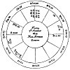
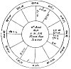

  
[Intangible Textual Heritage](../../index)  [Sky Lore](../index.md) 
[Index](index)  [Previous](aia28)  [Next](aia30.md) 

------------------------------------------------------------------------

### CHAPTER XXVI.

### OF THE THIRD HOUSE, VIZ. OF BRETHREN, SISTERS, KINDRED, NEWS, SHORT JOURNEYS, ETC.

THE chief, but not the only, questions regarding this house are those
concerning brethren, cousins, or neighbours, and short journeys.

QUERY.--*Shall the Querent agree well with his Brother or Neighbour*?

The querent has the time significators; the quesited is shewn by the
lord of the 3d, the cusp of the 3d, and the planets therein. If the lord
of the 3d be a benevolent planet, or be in the ascendant, or there be a
fortune in the 3d, or the respective lords be in good aspect or mutual
reception, or the lord of the ascendant throw a good aspect to the cusp
of the 3d, no doubt unity will endure between the parties. If the evil
planets, or ☋, be found in the 3d, unless very well dignified and
aspected, it denotes discord, and the querent may expect little good
from the quesited. If there be evil aspects between their significators,
the same judgment holds; and if the significators are afflicted by being
peregrine, retrograde, or combust, it shews hatred or untoward conduct.

p. 123

♄ or ☋ in the third, shews the neighbours are ill-mannered and the
kindred selfish; if ♂ be there, the neighbours are dishonest, and the
relations treacherous. If they be out of their dignities, these evils
are increased; and if ill planets be in the ascendant, or ☋ be there,
the querent is himself ill conducted.

*Of an absent Brother*?

The 1st, and its lord and ☽, are for the querent; the 3d for the
quesited; and the 4th, his house of substance, &c.

Consider in what condition the lord of the 3d is, in what house, and how
aspected. If he be in the 3d, free from evil aspects of the infortunes,
you may judge that the absent brother is in health. If he be in his own
house, but afflicted by the evil planets, without reception, judge that
he is in health, but in great perplexity and. sorrow; but if they so
aspect him with reception, say, that he is in distress, but that he will
shortly evade it, and rid himself of his troubles. If the fortunes
aspect him by ✶ or △ without reception, or by ☐ or ☍ with reception, you
may judge him to be in health, and well contented; and if they aspect
him by ✶ or △, and there be reception, you may tell the querent that his
brother is healthy and happy, and wants nothing in this world.

If the lord of the 3d be in the 4th, without aspects of the malefics, he
is endeavouring to get property in the country where he then lives. If
he be in the 5th, and joined by ☌, or good aspect to the lord of the
5th, if the latter be not much afflicted, he is healthy, jocund, and
merry, and likes the society he is in. If it be a fortune, and there be
a reception between the lords of the two houses, the 3d and 5th (his
3d), you are assured of his happy condition. Yet if it be a malefic, or
he be in evil aspect with a malefic in the 5th, without reception, or if
he be void of course while in the 5th.

p. 124

you may judge that he is restless, and discontented in his present
abode. Generally, if he be afflicted in any but the 6th, 8th, or 12th
houses, he is not very comfortable, yet not in ill health.

If he be in the 8th, and well aspected by a fortune, he is not in
danger, yet he is indisposed. If he be joined to evil planets by bad
aspects out of the 6th, he is in an infirm and dangerous state. The
same, if the lord of his 6th be in the 3d, unless he have dignities
therein. If, in this case, the lord of the 3d be ☌ with the lord of the
8th, or entering combustion at the same time, with other testimonies of
his being ill, there is reason to fear that he will die.

If you find his significator in the 7th, he is still in the country he
went to, and indifferently well.

If the lord of the 3d be in the 8th, he apprehends that he shall die;
and there is great fear of his death if his significator be combust, in
☌ with the lord of the 8th, or afflicted by evil planets.

If his significator be in the 9th, he is gone to some country further
off than when he first went, or is forming some clerical, regal, or
scientific connexion, or is employed travelling.

If he be in the 10th, and well aspected by the fortunes, especially if
with reception, he has got some good employment, or office, in the
country to which he is gone. If combust and afflicted, there is fear
that he is dead.

If he be in the eleventh, and joined to the lord of the 11th, it denotes
he is well situated, with his friends, and happy; though if evil planets
afflict him, he is not so well pleased with his present condition.

If he be in the 12th, and well aspected, he is engaged with horses or
cattle, &c., keeping an inn, or is turned grazier, &c. If ill aspected
in this or the 2d house, he is in trouble, and if in a fixed sign,
probably in prison; yet, if his significator be

p. 125

retrograde, he will manage to escape. If in the ascendant, tie is very
pleasantly situated; and, unless ill aspected, he is much respected.

If any other person than a brother be inquired of, his condition may be
known by applying the foregoing rules to that person's significator. As,
for example, if the quesited be the querent's father, let the lord of
the 5th (the 2d from the 4th) be considered for his substance. And if
the quesited be a friend, let the 11th house represent him, and then the
12th will be his 2d, or house of property; the 8th will be his 10th, or
house of honour, &c.; and so all round the 12 houses. But understand
that, though every house has its 6th, 8th, and 12th, yet of every person
inquired after, the 6th house of the figure shall signify his sickness,
the 8th his death, the 12th his imprisonment.

*Of Reports, News, Rumours, &c. whether true or false? and whether
importing Good or Evil*?

That which I found true by experience (in our late sad times of war) was
this: if I found ☽ in the ascendant, 10th, 11th, or 3d house, separating
by benevolent aspect from any planet, and then applying by good aspect
to the lord of the 1st; I say, I found the report or rumour true, but
always tending to the good of the parliament, let the report be good or
ill. But if ☽ applied to the lord of the 7th by any good aspect, I was
sure we had the worst, and our enemies the victory. If the ☽ was void of
course, the news proved of no moment, usually vain and false, and soon
contradicted. If the ☽ and ☿ were in ☐ or ☍, without reception, and
neither casting a good aspect to the degree ascending, the news was
*false*, and reported purposely to alarm us.

The time of erecting the figure was ever the hour when I

p. 126

first heard the rumour; but, if another propounded it, then that very
minute when it was first proposed.

If, on hearing of any matter, you desire to know whether it will be
prejudicial to you or not, observe whether ♃ or ♀ be in the ascendant,
or ☽ or ☿ in any of their essential dignities, in ✶ or △ to the lord of
the 11th; you may then judge that the party inquiring shall receive no
damage thereby. But if the lord of the 6th, 8th, or 12th, be in the
ascendant, or in evil aspect to the lord of the ascendant, or a malefic
retrograde in the ascendant, or afflicting its lord, or the degree
ascending, then the querent will be prejudiced by the matter. But if it
concern the public, some damage has happened to their ministers or
friends. In this case, if ♄ denote the evil, he shews plundering, loss
of corn, or cattle, &c.; ♂ causes straggling parties to be cut off, and
military violence, bloodshed, &c.; ☿ the miscarriage of letters, or evil
to the literary community, messengers, &c.; ☉ causes distress to the
king, or some chief or leader; ♀ causes ill to some gentlemen or their
friends. The ☽ denotes violence by mobs, and if she be afflicted,
injuries are done to the people.

*If Rumours be true or false, according to the* ANCIENTS.

If the lord of the ascendant, the moon, or her dispositor, be in an
angle or a fixed sign, and in good aspect to the fortunes, or the ☉, you
may judge the rumour is true. If they be in moveable signs, cadent, and
ill aspected by the infortunes, judge the reverse; and consider the
majority of the testimonies. When the angles of the figure, the ☽, and
☿, are in fixed signs, and these latter separate from infortunes and
apply to fortunes, the rumour is true. Evil rumours hold true, or will
be in some way verified, if the angles of the 4th and 10th are fixed,
and the ☽ therein. If you have evil news, yet if either fortune be in
the ascendant, or the ☽ fortunate,

p. 127

it is a strong argument that the rumours are false, and that they will
turn rather to good than evil. Mercury, or the planet to whom he or ☽
applies, being retrograde or afflicted, or if either of these two be
lord of the ascendant, it signifies that the rumour shall vanish to
nothing, or shall be converted to good. If the lord of the ascendant be
under the beams of ☉ [1](#fn_83.md), the matter is
kept secret, and few shall ever know the truth.

*Of Counsel or Advice given by a Neighbour, or Relation, Friend, &c*.

Erect the figure when first the party begins to break their mind, and
you shall know whether they really wish you well or not, and whether it
be good to follow their advice.

If there be in the 10th house either ☉, ♃, ♀, or ☊, or, or if ☽ apply by
good aspect to the lord of the ascendant, judge they come with an honest
heart, and the advice is intended for your good. If ♅, ♄, ♂, or ☋ be
there, or if ☽ apply by evil aspect, they intend deceitfully. *Haly*
affirms, that if the sign ascending be moveable, and the ☽ and lord of
the ascendant are both in moveable signs, the party comes to
deceive. [2](#fn_84.md)

*Of short Journeys, whether good to go or not*?

By a short journey, I mean such distances as a person may go and come
back in a day or two. Consider the lord of the ascendant, and whether he
be swift in motion, and in the 3d,

p. 128

or in any of the dignities of the lord of that house; or in good aspect
with its lord, or a planet therein; or if the ☽ apply to such aspect, or
be in the 3d, or cast her ✶ or △ to the degree ascending, or be swift in
motion; all these are arguments that the party shall go his short
journey, and have success. The part of heaven in which the place lies to
which he would go is known by the situation of ☽, the sign on the cusp
of the 3d, or its lord, whichever may be strongest in essential
dignities. If the chief significator be in a northern sign, he goes
north, and so of the rest.

EXAMPLES.

In November 1645, a citizen of *London* having gone into the west of
England, and no news being heard of him for many weeks, his brother,
with great importunity, moved me to give my judgment concerning these
particulars.

The figure, erected at the moment of the question, is on the following
page; and the particulars of the judgment on each of three queries,
which were put on the occasion will be found to follow.

p. 129

[  
Click to enlarge](img/fig07.jpg.md)  
*Fig* 7.  

QUESTIONS REGARDING AN ABSENT BROTHER.

1st.--*If Living or Dead? if Dead, whether Killed by Soldiers? for at
this time our miserable kingdom was full of soldiers*.

2d.--*If Living, when he should hear of him? and where he was*?

3d.--*When he should come Home*?

\_\_\_\_\_\_\_\_\_\_\_\_\_\_\_\_\_

1st QUERY.--*If Living or Dea*d?

The ascendant doth here represent the shape and form of

p. 130

him who asked the question, with consideration had to ♄, lord of the
sign. The querent was lean, spare of body, and a real *saturnine* man,
&c.

♉ is the ascendant of the 3d house, and ♀ being lady thereof,
represented the absent brother.

♀, the significator of the quesited, being noways afflicted, either by
☿, lord of the 8th in the figure, or ♂, lord of the quesited's 8th: and
the separation of the ☽ being good, *viz*. a △ of ♃, and ☌ of ☿, who is
in good aspect to ♃, and going to ☌ of ☉ on the cusp of the midheaven, I
judged the absent brother was alive, and had had no manner of accident,
but was in good health.

2d QUERY.--*When to should hear of him*?

♀ lady of the 3d applies to a friendly △ of ♄, lord of the ascendant,
and ♄ being retrograde, applies also to the aspect of ♀; a very good
argument that the querent should hear news of his brother very suddenly.
And if you look into the *Ephemeris* for 7th November, 1645, you will
find that, about four o'clock on that very day, the △ aspect between ♀
and ♄ was formed. I therefore advised the querent to go to the carriers
of those countries where he knew his brother had been, and ask when they
saw the quesited; for I told him that it was probable that he should
hear of him that very day. (*He has since confidently a firmed, that
about the very moment of time, viz., about four, a carrier came casually
where he was, and informed him that his brother was living, and in
health*.)

*Where he was*?

His journey was into the *west*. At time of the question I find ♀, his
significator, leaving ♐, a north-east sign, and entering ♑, a south
sign; whereon I judged he was in the

p. 131

south-east part of the county unto which he went. And as ♀ was not far
out of the ascendant, and was in the oriental quarter of heaven, that he
was not above one oar two days' journey from London; and as ♀ was
leaving ♐, and entering a sign in which she has dignities by
*triplicity* and *term*, I judged the man was leaving the country where
he had no possession or habitation, and was coming to his own house in
London, where he had good property. As ♀ wanted one degree of getting
out of the sign, I judged he would be at home in less than *one week*;
for ♐ is a common sign, and one degree therein in this question might
well denote one week. He came home on the following *Tuesday*, when ☽
came to ☌ ♀, she being then got into ♑, in her own *term* and *diurnal
triplicity*. The two significators being in △, these two brothers always
did, and do, live very amicably together.

p. 132

[  
Click to enlarge](img/fig08.jpg.md)  
*Fig*. 8.  

QUERY.--*If a Rumour or Report were true or not*?

In 1643, his Majesty's army being then *rampant*, several reports were
given out that his Majesty had taken Cambridge, &c.: a well-affected
person inquired of me if the news were true or false? whereupon I
erected this figure, and gave judgment:--"*All that we heard was
untruth, and that the town neither was or should be taken by him or his
forces*."

*A Report that Cambridge was taken by the King's Forces; if true*?

First, I considered that the angles were all moveable, and

p. 133

that the evil ♂ vitiated the cusp of the 10th, and ♄ that of the 7th;
one argument that the report was false.

Secondly, the ☽ was cadent, and in ♊, a sign wherein she is very weak: a
second such argument.

Thirdly, the ☊ on the cusp of the ascendant was a sign of good to the
Parliament, for the first house signified that honourable society. ♀,
lady of the ascendant, was in her exaltation, but ♂, lord of the 7th,
our enemies, in his fall, viz. ♋, and afflicted by ☐ of ♄. The ☽
separating from ♃ in the 7th, and transferring his light to ♀, gave
reason to expect that there would come good to our side by this report
or rumour, and no benefit to the enemy. The ☐ of ♄ and ♂ assured me that
our enemies were so full of division and treason, and so thwarting one
the other's designs, that no good should come unto them by this report.
And so, in short, I judged that Cambridge was not taken, and that what
we heard was false. [1](#fn_85.md)

\_\_\_\_\_\_\_\_\_\_\_\_\_\_\_\_\_\_

Had this question been, *Whether the querent would have brethren or
not*? then you should judge as follows:

The sign on the 3rd ♏ is fruitful; ♋, the sign in which the lord of the
3d is found, is fruitful, and the ☽ applies to ♀; signs that the querent
might expect both, but chiefly sisters, as the signs are mostly
feminine.

------------------------------------------------------------------------

### Footnotes

[127:1](aia29.htm#fr_83.md) This signifies within a
distance of 12 degrees of ☉. Modern authors say 17 degrees.

[127:2](aia29.htm#fr_84.md) If the advice be
intended for your benefit, yet it may not be well to follow it. This may
be seen by the lord of the 4th, and planets therein; for if malefics be
there, or the lord of the 4th afflict the lord of the ascendant, it will
end ill: if good planets be there. it ends well.--ZAD.

[133:1](aia29.htm#fr_85.md) If the student erect a
figure for 10h. 53m. A.M. Dec. 23d, 1834, he will find ♐ 15 on the 10th,
and ☽ in ♎ 0: 15 in the 7th, applying to ☐ of ☉, lord of the 7th. We
erected this figure on hearing a rumour of several persons being cruelly
slaughtered by soldiers at Rathcormac, in Ireland, for the purpose of
collecting tithes. The ☽ being angular and afflicted, shewed that the
*evil* report was true; and ♅ being exactly on the cusp of the
ascendant, ♒ 23: 30, was a similar testimony. was in ♐ 16: 35 on the
cusp of the 10th, shewing discredit to the government, arising out of
the transaction. The coroner's jury found a verdict of *wilful murder*.

------------------------------------------------------------------------

[Next: Chapter XXVII. Of the Fourth House, and Judgments Depending
Thereon](aia30.md)
