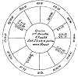

  
[Intangible Textual Heritage](../../index)  [Sky Lore](../index) 
[Index](index)  [Previous](aia29)  [Next](aia31) 

------------------------------------------------------------------------

p. 134

### CHAPTER XXVII.

### OF THE FOURTH HOUSE, AND JUDGMENTS DEPENDING THEREON.

*This is the House of Parents, Lands, Tenements, Cities, Towns,
Villages, Farms, Castles, Treasure found, &c., or of any Thing hidden in
the ground; also of the Grave*.

RULE.--*To Find a Thing hidden or mislaid*.

BE careful to consider to whom the thing hidden, &c. may belong: if the
goods did belong to the querent, take the lord of the 2d; but if to his
brother or sister, regard the lord of the 4th; if to his father, the
lord of the 5th; if to his mother, the lord of the 11th, and so of other
persons; if to a stranger to the querent, or one who is no relation,
take the lord of the 8th. If you find the lord of the house of property
is in any angle, judge the thing missing is within the house of him who
is the owner. And if the lord of the property is in the ascendant, or
disposed of by the lord of the ascendant, by house, or in the same sign
with him, say it is in that part of the house wherein he most frequents,
or lays up his goods, or such things as he most delights in. But if the
lord of the quesited's property be in the 10th, it is then in his shop,
if he keep one, or, if he be a gentleman, in his dining-room; if he be a
farmer, it is in the common room of the residence, or first room after
you enter the house. If the lord of the property be in the 7th, it is
then in that part where the quesited's wife or his maid-servants have
most to do. If in the 4th, it is where the most aged of the house
lodges, or formerly did most frequent; or in the middle of the house, or
in the most ancient part, or where his father or

p. 135

some elderly man lodged. The nature and quality of the place are known
by the signs the significators are in; for it the sign of the second be
*airy*, or the greater part of the significators, including the sign
where ⊕ is, be the same, the thing is hid in the eaves, or the upper
part of the room where it is, or on high from the ground; and if the
thing be in an orchard or garden, it is higher than the ground, or upon
some tree, line, &c., or is on the highest hill or part of the ground.
If the said significators be strong, and in *watery* signs, it is in the
dairy, or washhouse, brewhouse, or near water. If they be in *fiery*
signs, it is near the chimney, or the walls of the house, or where iron
is found. If in *earthy* signs, the thing is on the ground or earth, or
near some pavement or floor; and if the thing lost be out of the house,
it will be found near the bridge, stile, or gate, where people come into
the grounds.

If the significator be going out of one sign into another, the thing is
behind something, or fallen between two rooms, or near the threshold;
and it is higher or lower, according to the sign being airy, &c.

If a thing be lost, and not stolen, consider the following points:

1\. The sign ascending, its nature, and the quarter of heaven it
denotes.

2 The sign the lord of the ascendant is in.

3\. The sign of the 4th house.

4\. The sign the lord of the 4th is in.

5\. The sign the ☽ is in.

6\. The sign of the 2d house.

7\. The sign the lord of the 2d is in.

8\. The sign ⊕ is in.

Then examine the greater number of testimonies to discover what quarter
of heaven the thing is in, as regards the parts of

p. 136

the house. Having found the bearing, or point of the compass, observe
the nature of the sign, viz. *airy* signs, above ground; *fiery*, near a
wall, or partition; *earthy*, on the floor; *watery*, near a moist place
in the room, &c.

*Bearing by Compass of the Signs*.

|         |               |               |
|---------|---------------|---------------|
| ♈ East  | ♌ E. by North | ♐ E. by South |
| ♎ West  | ♊ W. by South | ♒ W. by North |
| ♋ North | ♏ N. by East  | ♓ N. by West  |
| ♑ South | ♉ S. by East  | ♍ S. by West. |

*Of Buying and Selling Lands, Houses, Farms*, &c.

The ascendant, its lord, and the ☽, are for the buyer, and the 7th, its
lord, and planets therein, for the seller. The 4th its lord, and planets
therein, signify the land, or house, &c. And the 10th house, its lord,
and planets therein, signify the price; that is, whether it will be sold
cheap or dear.

If you find the lords of the 1st and 7th in good aspect, and the lord of
the 7th apply by good aspect (or if by evil aspect with reception) to
the lord of the ascendant, you may judge the seller has good will to the
buyer; and if they are at all dignified, the purchase will be effected;
but if the aspect be evil, there will be much bargaining and dispute
before all be settled.

If the lord of the ascendant, or ☽, apply to the lord of the 4th, or
this planet apply to them, or if they be in each other's places, viz.
the lord of the 1st, or ☽, in the 4th, or the lord of the 4th in the
ascendant, and there be any reception, the purchase will be effected.

But if there be no dwelling in houses as above, yet the ☽ transfer the
light of the lord of the 4th to the lord of the ascendant, the bargain
will be concluded, though by brokers or agents, rather than by the
principals.

p. 137

If none of the above rules hold, there will be no bargain made.

*Of the Quality of the Land or Houses, &c*.

If you find the infortunes in the 4th, especially if they be peregrine,
or the cord of the 4th retrograde or afflicted, it will never continue
long with the buyer's posterity, or benefit him.

But if ♃, ♀, or ☊, be in the 4th, or the lord of the 4th be strong and
well aspected, the purchaser may expect good success with the property;
and if a fixed sign be in the 4th, it will continue in the family of the
purchaser.

If an infortune possess the ascendant, the tenants or occupiers are evil
and deceitful, and will give trouble. If a fortune be there, or ☊, judge
the reverse. In the former case, if the evil planet be retrograde, the
tenants will decamp without paying their rent, or will throw up their
leases.

If in the 10th house there be a fortune, and it direct, the timber will
he profitable, or the house will let well. If it be retrograde, there
are many trees, but they not profitable. If there be an infortune
direct, there are few trees, or the house will not let well; and if he
be retrograde, the timber will be stolen, or the rent will be either
stolen after payment, or no payment be well and truly made. If there be
no planet in the 10th, consider the lord of the house, and, as he may be
strong or weak, judge the result of the profits, whether by timber, &c.,
or by letting the house, &c. But the angle of the 7th must be considered
in like manner, to judge the quality of the grass, corn, or herbage, &c.
As regards the description of the ground, look to the 4th house; and if
you find a fiery sign on its cusp, the ground is in general hilly, dry,
and hard; the more so, if the lord of the 4th be in a fiery sign, viz.
♈, ♌, ♐. If there be an earthy sign on the cusp, the ground is plain,
level and good pasture land, or for tillage. If there

p. 138

be an airy sign thereon, the ground is of a mixed nature, part hilly and
part plain, partly good and partly bad. If the sign be watery, then
there is plenty of water, a brook, or rivulet, &c., thereon. And if an
infortune be in the 4th, and retrograde or peregrine, the land will
partake greatly of the nature of that infortune; as if ♏ be the sign,
and ♄ in it, the land is marshy or boggy, and full of rushes; if he be
afflicted, so much worse is the land. And if the land lie near the sea,
you may fear an overflow, or that the banks are damaged, &c. If ♄ be in
the 4th in a fiery sign, the land is barren, and wants water; if he be
afflicted, it is utterly stony and worthless. If ♄ be there in an airy
sign, the land is defective; and if he be afflicted, especially in ♊,
the management of it has been bad and unthrifty. If he be there in an
earthy sign, the land is tolerably good, but heavy, clay land; and if he
be afflicted, the farmers are dull, and too poor to manage it well.

In like way judge of the standing of a house or building: if it be a
watery sign, there will be much damp; and if ♄ be there in ♏, it is
overrun with rats.

*Of the Cheapness or Dearness of the Land or Houses, &c*.

This is known by the lord of the 10th; for if he be angular and strong,
the price will be high, and the seller will stand upon his terms; but if
he be weak, cadent, afflicted, &c., the price will not rise high.

*If it be good for the Querent to take or lease the House, Farm, or
Land, &c*.

The 10th house, &c., will herein shew the profit or advantage to be made
by the undertaking, having regard also to the usual significators of
property, viz. the lord of the 2d, and ⊕, &c.

p. 139

The 4th house will shew the end of the matter as regards the taking the
property.

If there be a fortune ascending, or ⊕ be in the ascendant, or the lord
of the ascendant be there, or be in ✶, or △ to the degree on the cusp
and not afflicted, the querent will take the house or farm, &c., and
find it a good bargain.

If an infortune ascend, the querent will not take the property; or if he
have already taken it, he has no mind to it, and will quickly put it off
to another party.

If you find the lord of the 7th in the 7th, or casting a good aspect to
its cusp, or there be benefics therein, the man will keep his word in
the bargain, but he will profit by it more than the querent.

If an infortune be in the 7th and not lord of the 7th, have great care
of the covenants or agreements between you; for the landlord will be too
hard for you, as he minds nothing but his own ends in the matter.

Consider the 10th house; and if a fortune be there or behold its cusp by
good aspect, the parties, notwithstanding some rubs, will proceed in
their bargain, and the land, &c. will be let to the querent.

If you find an infortune in or in evil aspect to the 10th, the bargain
will be broken off. If it be land, they differ about the timber, &c., or
upon the erecting of some new buildings; and if the thing be a house,
&c., they differ about the repairs.

As to the end of the matter, see to the 4th house. If fortunes be there,
or the lord of the 4th behold the cusp favourably, it will end well, and
both parties will be pleased; but if an infortune be there, or the lord
of the house aspect it by ☐ or ☍, the whole matter will end ill, and
will please neither party.

p. 140

QUERY.--*Shall the Querent enjoy the Estate of his Father*?

If in this question you find the lords of the 2d and 5th in reception
and in each other's houses, there is no doubt that the querent shall
have a competent fortune out of his father' estate. But if the lord of
the father's property be retrograde or afflicted, then some part of the
estate intended for the querent will be wasted or otherwise disposed of.
If you would know why or how, see what planet impedites the lord of the
5th, and what house he is lord of. If it be the lord of the 6th, it may
be one of the father's brothers, or sisters, or neighbours shall prevail
on the father to alter his intentions towards the querent. If it be the
lord of the 7th, it may be some female, or his wife, or some person with
whom the querent has quarrelled, that will cause his father to alter his
mind. If it be the lord of the 12th, it is some one of the mother's
kindred, or it may be (especially if ♃), some minister or clergyman.
Now, if, upon describing the party, the querent is well informed of who
it is, and is desirous to gain the person's good will, and so to
diminish their malice, let him do as follows: on the approach of any ✶,
△, or ☌ between the planet signifying that party and the lord of the
ascendant, let the day be observed in the Ephemeris when the separates
from one and applies to the other, (by good aspect if possible), and on
that day endeavour a reconcilement: and it is not to be doubted that he
may obtain his desire, .as I have found many times by good
experience. [1](#fn_86)

If the lord of the 5th dispose of the ⊕, and be in the ascendant or 2d,
the querent shall gain his desires. ♃ or

p. 141

\[paragraph continues\] ♀ in the 5th, casting a ✶ or △ to any planet in
the 2d, argues the same.

If ☽ separate from the lord of the 5th, and go immediately to ✶ or △, of
the lord of the 2d or of the ascendant, it shews assured hopes of
acquiring the property of the father.

If you find an infortune ill dignified in the 4th, the father has no
inclination to part with his money; nor will it be well to move him much
thereto, until that unfortunate planet be transited out of the sign. But
if you cannot stay so long, observe when that planet is direct, swift in
motion, oriental, in ✶ or △, with ♃ or ♀ or the lord of the ascendant,
and then let the father be moved in the business. The observing those
influences will not *compel* the father's mind, but will cause more
benevolent intentions.

If the lords of the 2d and 5th apply to any good aspect by
retrogradation, the querent will receive some property from his father
suddenly, before he thinks of it. If there be any good aspect,
reception, &c., between the lord of the 4th and any other planet,
stronger than there is between the lord of the 4th and the lord of the
ascendant, the father regards the party signified by that other planet
better than the querent: if it be the lord of the 3d, or any planet in
the 3d, then it is one of the querent's brothers, &c.

*Of removing from one House or Place to another*.

Observe the ascendant, the 4th and 7th houses, and their lords, planets
therein, &c.

If the lord of the 4th be in the 7th, and he a good planet, and the
lords of the 1st and 7th be good also and strong, it is then better to
remain where you are. But if the lord of the 7th be with a good planet,
and the lord of the 4th with an evil one, it is then not well to remain.
If the ☽ or lord of the ascendant separate from ill aspects of the
infortunes, and

p. 142

they lords of the 4th or 7th, or from the lords of the 6th, 8th, or
12th; or if an evil planet be in the ascendant or 4th; or if the lord of
the 2d be weak, I advise the querent to re-move. And if the lord of the
6th be in the ascendant, or afflict its lord or the ☽, I have found that
the querent has ill health where he is, or is troubled by evil servants.
If the lord of the 12th be the afflicting planet, he has backbiting,
treacherous neighbours. And if the ⊕ was in the 6th, 8th, or 12th, or
the lord of the 2d was in ill aspect to the lord of the ascendant, I
have found that he went back in the world, &c. If the lord of the 10th
afflict, I judged that he was unfortunate in trade, or had lost his
credit. If the lord of the 4th afflict, he has been injured by repairing
the house, &c. The lord of the 7th shews injury by an opposite
neighbour, who undersells him, &c.

In giving advice which way to steer his course in hopes of better
success, I observe what planet in the scheme is strongest, and has the
best aspect to the lords of the ascendant or 2d; and according to the
quarter of heaven the sign that planet is in signifies, I advise the
querent to remove. I do not remember that any ever repented the
following my advice, though many have afterwards returned me both thanks
and rewards. [1](#fn_87)

If ☽ separate from a fortunate planet, stay; if she separate from an
infortune, remove. An infortune in the ascendant, or a fortune in the
7th, remove; but a fortune in the ascendant, or infortune in the 7th,
remain.

*Of Treasure, Mines, &c. concealed in the Ground*.

To discover mines or any other thing supposed to be concealed in any
place, the querent must observe whether there

p. 143

be any planet strongly dignified in the 4th house; and the nature of the
treasure, mine, &c. may be judged of by that planet, if he have any
affinity with the 7th house. The nature of the mine, &c. will depend on
the nature of the planet. If ♄ be lord of the 7th and in the 4th
dignified, he signifies good coal mines; or if the question were of
stone, then there is a good quarry. And so judge of the others according
to their nature and strength in essential dignities.

EXAMPLE.

*If I should purchase the Houses of Master B*.?

The inheritance of the house wherein at this present 1647 I live, and
some others, being proffered me to buy in 1634, had a desire to know if
I should deal with the seller, and procure money in convenient time to
pay for the purchase, my own money being in such hands that I could not
call it in under six months' notice. Being desirous, I say, to purchase
the said houses, and fully resolved upon it, I took my own question
myself, at the time I found my mind most perplexed and solicitous about
it. The time of the query to myself fell out according to the position
of heaven following.

p. 144

[  
Click to enlarge](img/fig09.jpg)  
*Fig*. 9.  

*Resolution of the above Question*.

The sign ascending is ♎, and the degree ascending the place of ♃ in my
*radix*: I looked upon that as a good omen in the first place. ♀ is for
myself, ☉ locally placed in the 7th is for the seller. ☉ receives ♀ in
his exaltation; and as ♀ is near the cusp of the 7th, and no other
planet there but the ☉, this signified that there was no other purchaser
about it at present but myself. The ☉ so exalted and angular, denoted
that the seller was high in his demands, (*and so he was*,) nor was he
necessitated to part with it. Finding my significator received of ☉ and
so near the cusp of the 7th, was an

p. 145

argument that I should proceed in the business, notwithstanding the many
debilities of ♀. For as ☉ was lord of the 7th, so also was the lord of
the 11th; signifying that my *hopes* should not be frustrated. And ♀
also was applying to △ of ♄, lord of the 4th, viz. the houses inquired
after, and had no frustration, &c., before the perfect aspect a strong
argument that I should buy the houses. Both significators applied to the
aspect, ♄ being retrograde, I also considered that ☉ was in △ to ♄, the
☉ being lord of my 11th and ♄ of the 4th; and as ♄ beholds the ascendant
and has dignities therein, he, therefore, had signification of myself.
Now, whether you consider him as having dignities in the ascendant or as
lord of the 4th, the lord of the 11th and he applying by a △, argued
assuredly that I should proceed and in the end conclude for the houses.
The ☽ in the next place translating the influence of ♂, lord of the 7th,
to ♄, having virtue in the ascendant, though by a ☐ out of signs of long
ascension, did much facilitate the matter; but argued my contracting
leisurely and slowly, because of the ☐ aspect. And as ☽ is afflicted and
♀ unfortunate, so I had much trouble and many meetings about it; the
seller not abating one penny of £530, being the first money he demanded.
As ☉ is near to a ✶ of ♃, so did a *jovial* man endeavour to procure the
purchase (after I began), but ♃ is cadent and in detriment, which shewed
he should not prevail. ♀ angular and in aspect with ♄, and ☉ lord of the
11th (or 5th from the 7th), shewed that a daughter of the seller was my
very good friend in this business, and suffered no interloper to
intervene, though some offered fair to hinder me. As ♂, lord of my 2d,
was retrograde, it denoted that I should get none of my own money to
supply my occasions. ♃, lord of ⊕ in ✶ to ☉, no ways impedited, but by
being in detriment, in platic ✶ with the lady of the ascendant, gave me
such hopes.

p. 146

that I doubted not of procuring money when he entered \#\#\#, his
exaltation, and ♂ became direct; which he did twelve days after, when a
friend lent me £500.

The qualities of the houses are shown by ♑, the sign on the 4th, and by
♄, lord thereof, who having no material debilities (except being
retrograde and cadent), and being also in △ to ☉, the houses were really
old, but strong and able to stand many years. When ♀ and ☉ came to ☌ in
♉ (25th April), I bargained; and on the ☽ to ☌ ♀ (May 17th), I paid in
£530, and my conveyance was sealed. As ♀ wanted 6 degrees of being ☌
with ☉, so was it six weeks and some days from the time of the question
until I perfected what the figure promised.

As to the moles and scars on my body, it exactly agrees; for as ♀ is in
♈, which represents the face, so have I a mole on my cheek, about the
middle of it; and as ♎ ascends, I have one on the reins of my back. The
☽ in ♍, afflicted by ♂, I have a red mole below the navel. ♃ lord of the
6th in ♊, a masculine sign, I have a mole near my right hand, visible on
the outside; so have I one on the left foot, as ♓, the sign on the 6th
signifies.

I had a hard bargain, as the figure every way considered manifests; and
shall never live to see many of the leases yet in being expire. And as ♀
is in ♈, the sign opposite her own house, so did I do myself injury by
the bargain; I mean in matter of money; but the love I bore to the house
I now live in, wherein I lived happily with a good master full seven
years, and therein obtained my first wife, and was bountifully blessed
with the goods of this world, made me neglect a small hinderance; nor
now, I thank God, do I repent it, finding God's blessing in a plentiful
measure upon my labours.

------------------------------------------------------------------------

### Footnotes

[140:1](aia30.htm#fr_86) This method of electing
times for application to individuals for any favour, or to gain any
point, may be safely practised after any other horary question, as well
as this particular one.--ZAD.

[142:1](aia30.htm#fr_87) Let the querent also
attend to the places ruled by the sign in which the planet is; as London
for ♊, Dublin for ♉, &c.

------------------------------------------------------------------------

[Next: Chapter XXVIII. Of the Fifth House and its Questions](aia31)
