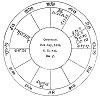

  
[Intangible Textual Heritage](../../index)  [Sky Lore](../index.md) 
[Index](index)  [Previous](aia33)  [Next](aia35.md) 

------------------------------------------------------------------------

#### CHAPTER XXXI.

#### OF THE EIGHTH HOUSE, AND ITS QUESTIONS: THESE ARE DEATH, DOWRY, THE WIFE'S SUBSTANCE, &c.

QUERY.--*Whether an absent Person be dead or aliv*e?

Take care to learn whether the *quesited* be any relation to the
*querent*: if so, look to the house signifying that relation; and if
not, look to the 7th for the quesited's significator. If the lord of the
quesited's ascendant be in the 4th or the 8th, either from his own house
or in the figure, it is one argument that the party is dead. If, also,
his significator be in the

p. 250

\[paragraph continues\] 12th, or his own 12th in ☐ or ☍ to a malefic, or
if ☽ or ☉ be unfortunate in like way, you have strong testimony that he
is deceased.

If the significator of the absent be strong, and in a good house, and
separated from a fortune, he is not dead. If he be afflicted, and was
lately in ☍ or ☐ of an evil planet, I judge that he has been in trouble
or misfortune, according to the nature of the house from whence
afflicted; but not dead, unless the lord of the 8th afflict him also,
and the lights be afflicted.

*Of the Death of the Querent*?

If any one ask concerning the probable length of his life, or when he
may probably die, observe the ascendant, its lord, and ☽; also, the lord
of the 8th, an unfortunate planet in the 8th, and that planet to whom
the lord of the 1st or ☽ be joined by ☌, ☐, or ☍; and you may determine
the death of the querent, according to the number of degrees between the
significator and the aspect of the afflicting planet. If the lord of the
ascendant be in ☌ with the lord of the 8th in an angle, it notes so many
years; for in this question angles do not accelerate death, but show
that life and nature are strong. If in a succeedent house, months;
though if the sign be *fixed*, it gives half years, half months. In a
cadent house, weeks. But you must always consider whether the
significators are extremely afflicted; if not, the querent may live
longer, and only be *near* death at the time threatened. The lord of the
ascendant is more to be considered in this case than the ☽; and,
therefore, his ☌ with the lord of the 8th or ☉ is to be most feared.

Observe that the ☽ being strong even, yet if the lord of the ascendant
be afflicted extremely, she does not denote health or life, but only
success in his affairs, &c. Aspects

p. 251

by separation are not to be considered, but only those by
*application*. [1](#fn_117.md)

*What manner of Death the Querent shall die*?

This judgment is chiefly shewn by the lord of the 8th, if in the 8th, or
any planet therein or nearest to its cusp, and having dignities in the
8th house; or from the planet which afflicts the lord of the ascendant,
and has dignities in the 8th. If it be either ♃ or ♀, or that they be in
the 8th house, or aspect its cusp by ✶ or △, they shew a natural death
by such diseases as they shew in the sign they are in, and the part of
man's body it governs. If evil planets be there, they shew violent
deaths, or fevers, and long and painful illnesses; and if the figure be
violent, it may be by accidents, &c. The ☋ with the significator of
death is very evil; and if it be ♄, (and ♀ assist by her ☐, &c.), it
shews fear of poison. The lord of the 1st and 8th being the same planet,
shews that the querent brings on his own death by imprudence, &c.

*Whether the Wife's Fortune will be great, or easily obtained, or
whether the Person inquired of be rich or not*?

The cusp of the 8th, in terms of ♃ or ♀, gives good hopes of wealth, or
if ♃ or ♀ be therein. If they be essentially strong, and free from
combustion, &c., they denote much wealth; but though well dignified, if
they be combust, slow, or retrograde, they shew trouble in procuring the
fortune, &c. The lord of the 8th in the 8th, and strong, and no way
afflicted, gives good hopes of some estate or legacy to fall to the
quesited; this is more sure if either the lord of

p. 252

the 4th or 10th be in good aspect with the lord of the 8th from angles.
If ⊕ be in the 8th, and in ♌, or ♒, or any of the houses of ♃ or ♀, or
they in good aspect to ⊕, the quesited's fortune is good. The dispositor
of ⊕ in good aspect to it, or ♃ and ♀, shew the same thing. If all these
happen, the quesited is very rich.

If ♄ or ♀ be in the 8th and peregrine, the party is poor, or there will
be contention about the property. The lord of the 8th combust, shews
slow performance, and little ability of what is promised; and if ☋ be in
the 8th, and no planet there, fraud is intended, or more will be
promised than can be performed.

The lord of the 8th in the 2d, or in ✶ or △ to its lord, the querent
shall have what is promised; in ☐, with difficulty; in ☍ with much
wrangling; if without reception, never. But weigh well what the
particular figure promises besides these general rules.

*Whether the Querent shall suffer by a particular Thing of which he is
in fear*?

If you find the ☽ afflicted, or the lord of the ascendant unfortunate
and falling from an angle, or especially if he be in the 12th, and the ☽
with him, there is ground for his fear; and he may expect to be accused,
&c. of much of which he is not guilty. If the lord of the 1st ascends
into the 11th or 10th, or be joined to a fortune, he shall not be
injured. If he apply to infortunes, the thing threatened is true; but if
to a fortune, and not at the same time to an infortune, it is false or
ungrounded. The ☽ in △ to ☉ discovers all suddenly. The ☽ cadent, and
applying to a cadent planet, the supposed danger will be nothing, or
come to nothing in the end.

p. 253

[  
Click to enlarge](img/fig23.jpg.md)  
*Fig*. 23.  

QUESTION.--SHALL THE QUERENT RECEIVE THE PORTION PROMISED?

*Judgment*.--The querent's significator retrograde in the 12th, shewed
he had been in despair of it, which he confessed. The female is
signified by ♃ and ♀; ♃ in his exaltation, and ☽ in ♌, a fixed sign,
argue that she thinks well of herself, is confident, &c., yet modest and
virtuous. The ☽ being near ☉, she had a scar near her right eye.

Finding ☉ lord of the quesited's 2d in his own house, and

p. 254

\[paragraph continues\] ♀ in her 2d, and also that ☽ separated from ☉,
and transferring his light to ♄, lord of the ascendant and 2d and ⊕, I
assured the querent that he had no cause to fear the nonpayment of his
wife's portion; that all promised would be paid; and that, to his
farther comfort, she would prove a chaste and virtuous woman, but
somewhat proud. I have since heard, from his own mouth, that this
judgment proved exactly true.

------------------------------------------------------------------------

### Footnotes

[251:1](aia34.htm#fr_118.md) If the fatal ☌ or
aspect fall in the term of ♃ or ♀, or exactly in their ✶ or △, there is
much 'less fear of death.

------------------------------------------------------------------------

[Next: Chapter XXXII. Of The Ninth House and its Questions. Long
Journeys, Voyages, Arts, Science, Church Preferment, Law, &c.](aia35.md)
