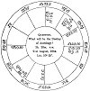
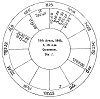
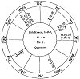
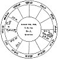

  
[Intangible Textual Heritage](../../index)  [Sky Lore](../index.md) 
[Index](index)  [Previous](aia34)  [Next](aia36.md) 

------------------------------------------------------------------------

### CHAPTER XXXII.

### OF THE NINTH HOUSE AND ITS QUESTIONS. LONG JOURNEYS, VOYAGES, ARTS, SCIENCE, CHURCH PREFERMENT, LAW, &c.

*Of a Voyage, and its Issue.*

If there be good planets in the 9th, or its cusp be well aspected, or
the lord of the ascendant or 10th be there, and well affected, it is
good. But if ♅, ♄, ♂, or ☋ be there, It is always evil. If the lord of
the 9th be with an evil planet, he shall not speed well. ♄ shews losses
and sickness; ♂ shews danger by thieves or pirates: and ☋ much the same
as ♂, but more of cozening and cheating. The house of substance from the
9th is the 10th. Fortunes there shew wealth; infortunes loss. If
benefits be in the 9th, a good voyage; if malefics, many hardships, &c.

*What Wind and Weather the Querent will experience*.

The lord of the ascendant with good planets, and they strong and in
friendly aspect, and the lords of the 1st and 9th in △ out of ♊, ♎, or
♒, shew fair weather and favourable winds. The significators in ☍, out
of fixed signs, shew

p. 255

detention by foul winds; and if near violent fixed stars; storms and
contrary winds will drive him back.

*Of a long Journey, and its Issue*.

If a fortune be in the ascendant, say he will have good success before
he sets out, or in the commencement of his journey; if it be in the
10th, then he will have success on the journey; if in the 7th, at the
place to which he goes; and if in the 4th, it will be on his return, and
when he is come home. In this case ♃ gives benefits by clerical persons,
judges, magistrates, or gentlemen, according to the querent's situation
in life and the house ♃ rules, and the nature of the ruler of ♃. As if
it be ☉, by a king, or nobleman, or person in power; if ♄, it will be by
old people, or ancient matters, or farmers. &c. Let him apply to such a
person in his affairs as ♄ describes, according to the sign he is in and
the aspects he receives. If it be ♀, it will be by women, pleasure,
sport, &c.; or by dealing in linen, silks, jewels, spices, &c. If ☿, by
writing or merchandize, letters of introduction, &c. If ☽, by some
female, probably a widow, or by a sailor, or by carrying news, &c., or
by play.

*Of the Length of the Journey, &c*.

The lord of the 9th, or planet therein, or ☽ in moveable signs, swift
and oriental, shew a short time absent. If they be in fixed signs, slow
and occidental, it shews a long and tedious journey and absence. If they
be in common signs, they shew change of mind, and a varying of his
journey, going to other places, &c. According as the ☽ is assisted or
afflicted, judge results to happen. As, for example, if ☽ be in the 6th,
or in ☍ to its lord, it shews sickness or impediments from servants. The
lord of the 4th, and the 4th house, denote the final issue.

p. 256

*Of the Return, &c ., of a Person who is gone a long Journey*

The lord of the ascendant in the ascendant or midheaven, or aspected by
planets therein, shows that he is thinking of returning. But if he be in
the 7th or 4th, his return is prolonged; and he is not thinking of
leaving the place he went to. The lord of the ascendant in the 3d or
9th, applying to a planet in the ascendant, he is on his journey
homeward. The same may be judged if he be in the 8th or 2d, and apply to
a planet in the 10th; but in this case observe also the ☽, and whether
she aspect the ascendant, or a planet therein. If the lord of the
ascendant or ☽ apply to a retrograde planet, or the lord of the
ascendant be himself a retrograde, and behold the ascendant, he is
coming; but if his significator be afflicted, it shews some hinderance
which makes him tarry. The dispositor of the ☽ afflicted, shews
hinderance also.

If you find ☿ or the ☽ in the ascendant or midheaven, judge that letters
or some news shall come shortly from the party; for ☿ is the
significator of letters, and the ☽ of news. If they separate from a
fortune, it denotes good news; and if from an infortune, the contrary.

The planet from whom the lord of the ascendant of the quesited is
separated, is the significator of the state and condition in which he
lately was; the planet to whom he applies, of the state in which he now
is; and the planet to whom he afterwards applies is the significator of
him to whom he in tends to come.

If the quesited's significator be going out of one sign into another,
judge that he went out of the place he was in, and entered another, or
that he has undertaken another journey. Observe in which of those signs
he was stronger, better aspected and received, &c.; and so judge of his
corresponding condition.

Observe, that combustion in all questions of one absent,

p. 257

shews some great evil; such as imprisonment, &c.; and if it be in the
house of death, or ☉ be lord of the house of death, it generally denotes
death.

Ever consider for whom the question is asked, and take his proper
significator. The lord of the 7th for a husband (or for any one who is
no relation), the lord of the 3d a brother, 5th a son, &c.; and note how
the fortunes are placed; if strong in the figure, well aspecting the
significator of the quesited, or in his house, judge health and
prosperity; and the reverse by infortunes.

OF PROFIT BY, OR PROFICIENCY IN, ANY SCIENCE, &c.

The ascendant, its lord, and the ☽, are for the querent; and the 9th,
its lord, or planet therein (if more than one, the nearest to the cusp),
for the science.

See whether the lord of the 9th be fortunate or not, oriental, angular,
&c.; and whether he behold the lord of the ascendant with ✶ or △. If he
be a fortune, and aspect the lord of the ascendant, the man has
scientific knowledge, and will gain thereby; the more so if there be
reception. If the aspect be ☐ or ☍, the man has talent, but shall do no
good by it. If an infortune aspect either the lord of the ascendant or
9th, the man has wearied himself, but to no purpose, for he will never
attain the knowledge he desires. If infortunes be in the 9th, or its
lord afflicted, the party has but little scientific knowledge.

The ☽ must also be observed with the lord of the 9th; for if they both
apply to fortunes, the man is scientific; if to infortunes, the
contrary.

If the question be put regarding another person, you must in this case
give the ascendant for the quesited. [1](#fn_118.md)

p. 258

EXAMPLE.

The author having given no good example regarding this question, the
reader is here presented with a figure, which will no doubt prove
interesting.

The editor being in company with two other artists, a general desire was
expressed to know the future destiny of astrology, and the following
figure was erected.

[  
Click to enlarge](img/fig24.jpg.md)  
*Fig*. 24.  

JUDGMENT ON THE ABOVE FIGURE.

The first thing to be observed in this figure is that ☿, the natural
significator of science, is lord of the 9th, and is, therefore,

p. 259

the significator of the science of astrology. He is found cadent, and
almost peregrine, having no essential dignity but his term, by which may
be seen the present enfeebled state of the science; but as ☿ has passed
through four degrees of his term in a *fixed* sign, this points out,
that for four years it has been in some measure more in credit than
previously. And this is the case, as it is about four years since the
Editor's publications began to call attention to the science. And as ☿
has just passed a ✶ of ♃, who describes the person asking the question,
it is shewn that the science has been much benefited by such a person,
about nine months before, because ☿ is past the ✶ of ♃ by 43', which
shews about nine months, taking a degree for a year. And the fact is,
that the *Grammar of Astrology* was published about nine months before
the time of the question.

The ☋ in the ascendant shews the difficulties the Editor has had to
encounter, and the contumely he has had to meet in bringing the science
forward again.

The presence of ♃ in the 9th, denotes the discredit in which the science
is generally held; and being in ☌ with ♀, it shews that injury has been
done to it by elderly females, who pretend to practise divining, &c.,
but who are held in great contempt by the public, as may be seen by the
☽ (the general significator of the public) being in ☍ to both ♀ and ♄,
from the house of enemies to the science.

The next aspect formed by ☿, is the ✶ of ♂, who being lord of the 11th
house of the figure, and placed on the cusp of the 11th from the ninth,
denotes *friends*. This shews, that in about four years from the time of
the question, the science will gain many friends among persons denoted
by ♂ in ♊, such as writers of public spirit, booksellers, &c.; and there
is no doubt that about that time it will suddenly and rapidly gain
ground in public opinion. The next aspect

p. 260

formed by ☿, is the ☍ of ♅, from which he is distant 14°; this may shew
that some *sudden* mischief may be done to the interests of the science
by means of female agents, as ♀ is in exact sesquiquadrate aspect to ♅.
But as ♅ is retrograde, and not angular, this will not be very
important. The ☉ is in the 12th from the 9th, and denotes secret enmity
to the science by men in power, the ☉ being in ♌; and as he disposes of
☿, it shews that the hand of power at present keeps it down. As ☿ is 18°
from ☉, 1 judge that, about the year 1852, some important honour will be
done to the science; probably by the present penal laws being repealed,
which forbid the acceptance of any remuneration for practising it. As ☿
has 20° to pass before he reaches his own dignities, and as ♄ will then
have entered ♊, and be disposed of by ☿, I judge that about 20 years
hence the science will be publicly honoured; and as has afterwards 18°
to pass in a common sign (signifying months), I conceive that about 18
months after that, when ☿ crosses the cusp of the 9th house in this
figure (about the year 1856), the science will rapidly rise in public
estimation, and be publicly studied in colleges, &c.

The ☉ enters ♍ after two years, as he is two degrees off, which will
cause the ruling powers to relax something of their severity against the
science; and as he then has 18°, (equal to 18 months, being in a common
sign,) to go before he passes the cusp, there will be some person of
rank who will assist the science at that time; viz. three years and a
half from the time of the question, or the year 1838.

The ☽ must now be considered; she is hastening to ☍ of two planets in
the 9th, which shews that there is yet much opposition to be expected to
the science by the public, and especially by rash and violent people,
which ☽ in the house of ♂ always denotes. But after the influence of the
☍ of ♄

p. 261

and ♀ is passed away, the ☽ meets nothing out favourable aspects. It is
very remarkable that the ☽ is aspected by every one of the planets
before she passes through ♈. The first aspect she forms after ☍ of ♄ and
♀ is ✶ of ♃, which denotes popularity for the works of the Editor,
connected with the science. The next is △ of ☿, which shews an increase
of students, and public discussion. The next is ✶ of ♂, denoting
increase of powerful friends, who will boldly advocate the cause of the
science. The ✶ of ♅ is of little import; but the △ of ☉ being the last
aspect she forms before leaving the sign, decidedly shews that at last
the science will receive the highest patronage, and be publicly
honoured; and as ☉ is in ♌, a fixed sign, this will be permanent.
Finally, the cusp of the 4th is in the term as well as house of ♂, and
is ruled by ☉, by triplicity, and face; and ☉ casts a △ thereto; ♂, lord
of the 4th, is in ☌ with ♃, in ✶ to ☿ and ☽, and △ to ♄ and ♀; and he
rules the ☽ by house and face, and the ☉ by face. All these are decided
testimonies, that in the end the cause of truth shall triumph, and the
reality and utility of the science be permanently established. ☿ in a
fixed sign, and so powerfully aspected by ♄, ♃, ♂, (lord of the 4th, the
house denoting the end of the matter) ♀ and ☽, is another strong
evidence that ASTROLOGY IS DESTINED TO FLOURISH WHILE THE WORLD ENDURES!

N.B. It is remarkable that ☿ had just passed the ✶ of ♀, lady of the 2d
(or house of property), from the 9th, and lady also of the 10th in the
figure, and 9th (house of law) from the 9th. This shewed the benefit
resulting to astrology, by the repeal of the law which taxed Almanacs,
and which greatly injured the science. It is also remarkable, that ♃ was
exactly passing over the 2d degree of ♊, the cusp of the 10th (house of
honour) from the 9th, about the 7th

p. 262

\[paragraph continues\] February, 1835, when the last sheet of the
former edition of this work went through the press; and at the same time
♄ was in ♎ 23° 6', having just quitted the 9th house, where he had
injured the interests of the science.

[  
Click to enlarge](img/fig25.jpg.md)  
*Fig*. 25.  

A WOMAN ASKS OF HER HUSBAND, WHO IS AT SEA; IF ALIVE? WHEN RETURN?

*Judgment*.--The lord of the ascendant ☿, shews the querent. He being
with ☽ and ♄ in ♈, which rules the face, she was extremely disfigured in
the face by small pock,

p. 263

had weak eyes, &c., and was full of grief and sorrow for her husband,
occasioned by ♄ afflicting ☿. She had also a lisp, and spoke ill; for ♄
in a bestial sign afflicting ☿, causes impediments in speech, especially
if also ☽ be afflicted.

♃ signified the quesited, who being in the 10th, and lately separated
from ✶ of ♀, now in the 9th, and lady of the 3d, it shewed that he had
been lately some voyage south-east. And as ♃ was no way afflicted and
swift in motion, as well as angular, I judged the man was alive and in
health. But as ☿ who disposes of ♃, is lord of his 8th (viz. the 2d
house), and as ☽ is so exceedingly afflicted by ☿ and ♄, I said he had
been in much danger and peril of his life by treachery and plots of his
adversaries; for ☿ is lord of the 7th from his ascendant, and ♄ of his
12th.

Moreover, ♃ is accidentally but not essentially fortified, and is in his
detriment, and near *Oculus* ♉, a violent fixed star; intimating that
the man had endured many sudden and violent chances.

Finding ♃ more fortified than ☽, she almost entering ♉, a southern sign,
and ♃ in ♊, a western sign, and south quarter, I judged that the
quesited was in the south-west or England, in some harbour, as ♃ was
angular.

*When She should hear of Him, or see Him*?

The ☽ separates from ♄, and applies to ☿, the querent's significator;
shewing that after much expectation, &c., she should hear of him, and in
about three days, as ☽ is so near ☿, and in a moveable sign, (*and so
she did*). But as ☿ is in a moveable sign, and ☽ afflicted by him and ♄,
the news she heard was false, for she heard that he was in town; but it
was not so. Considering that ☿ and ♃ hastened to a ☌ in ♊, ☿ being
therein very potent, and that this was about the 5th May following, I
judged that she would about that time

p. 264

have certain news of her husband, if he did not then come home. The
second week in May she did hear from him, but he did not come home till
July. He had been several voyages in the west, was taken prisoner by the
king's forces, and, at the time of the question, was in Barnstaple.

[  
Click to enlarge](img/fig26.jpg.md)  
*Fig*. 26.  

QUESTION: WHETHER PRESBYTERY SHALL STAND?

*Judgment*.--The angles of the figure are not fixed, but the cusp of the
9th, from which this judgment is to be deduced, is ♉, a fixed and stable
sign; and we must also judge from

p. 265

\[paragraph continues\] ♄ therein in the terms of ♃, who is the general
significator of religious matters. ♃ is now stationary, and is leaving
his exaltation, and is impedited by ♂; after leaving ♋, he enters the
fixed sign ♌, and is in the terms of ♄. We find ♀, who rules the 9th, in
her detriment, and in the 12th house from her own, the 9th. She has
twenty-one degrees to pass through in the 8th house before she get into
her own sign ♉, and where she would be fixed. But before she reaches ♉,
she meets the ☐ of ♃, (shewing that the gentry of England will oppose
it), and then of ♂, (lord of the ascendant of England, ♈), hence the
whole commonalty of the kingdom will disapprove of it), and all three
planets at the time of the aspect in the term of ♄.

There is not a single planet fixed, except ♄, nor essentially dignified,
except ♃; the ☽ entering *via combusta*, ♂ and ☿ in their fall, ♀ in her
detriment, and ♃ impedited by ♂. The ☽ separates from ♀ in the 8th, and
then goes to ☐ of ♂ and ♃. From these configurations we shall form our
judgment, THAT POSTERITY MAY SEE THAT THERE IS SOME VERITY IN ASTROLOGY.

The position of ♄ in the 9th, who is naturally of a severe, surly,
rigid, and harsh temper, may argue that Presbytery will be too strict,
sullen, and dogged for the English constitutions; little gentle or
compliant with the nature of the community. And that there shall spring
up among themselves many strange opinions and distractions even,
concerning this very Presbytery; that they shall grow excessively
covetous, contentious, and desirous of more than belongs to them;
worldly, envious, and malicious one against the other; that among them
some juniors, represented by ♀, [1](#fn_119.md)
shall be light in

p. 266

judgment, wavering, and decline the strictness of their discipline; and
that the elders, represented by ♄, shall not be respected on account of
their excessive rigidness, nor shall their orthodox opinions be
consented to.

Observe, that ♄ is peregrine, and supported by no favourable aspect of
either fortune; there is reception between ☽ and him, but no aspect: ☿,
lord of the 10th, signifying authority, is fast separating from ♄, as if
the gentry or supreme of the kingdom do already decline from the
severity of the austere Presbyterian clergy, fearing thraldom rather
than freedom to ensue from their power.

Three whole years from hence shall not pass, ere authority itself, or
some Divine Providence, will inform our judgment with a way in
discipline or government either nearer to the former purity of the
primitive times, or better beloved of the whole kingdom of England; or
authority shall in this space of time moderate many things now strongly
desired. For some time we shall not discover what shall be established,
out all shall be even as when there was no king in Israel; a confusion
among us shall yet awhile remain. The soldiery then, or some men of
fiery spirits, will arise, and keep back their contribution from the
clergy, and will deny obedience or submission to this thing called
Presbytery. It will then come to be handled by the magistracy, and the
grand authority of the kingdom. Also, by the plurality of the clergy, or
men of sound judgment, it will be contradicted, disputed against,
disapproved; and these shall make it manifest that this very Presbytery,
now maintained, is not the same that the commonwealth of England will
entertain as a standing rule to live under.

From what I find by this figure, I conclude *that Presbytery shall not
stand here in England*. [1](#fn_120.md)

p. 267

[  
Click to enlarge](img/fig27.jpg.md)  
*Fig*. 27.  

QUESTION: WHETHER, THE QUERENT SHOULD OBTAIN THE PARSONAGE DESIRED?

*Judgment*.--In the first place, I find ☌ between ♃, lord of the 9th,
and ♂, lord of the ascendant, but separating.

p. 268

\[paragraph continues\] 2dly. Neither the ☽, nor lord of the ascendant,
in the 9th. 3dly. There is no planet translating the light of ♃ to ♂.
4thly. There is no reception between ♃ and ♂. 5thly. ♄ is impedited in
the ascendant, and by his presence afflicts the querent, and causes him
to despair of success. 6thly, The ☽ separates from a △ of ♂, and applies
to ☍ of ☿, lord of the 3d; which intimated that some neighbour of the
querent, either with a letter, words, or cross information, would wholly
destroy the querent's hopes; and that mercurial men, viz. scholars or
divines, would be his enemies: and as I found ♀ in ♎, opposing the
ascendant, I judged that some female would inform against him, or
prejudice him in his suit.

From all this I persuaded him against proceeding any further in the
matter; but the parson being covetous, would proceed, and did: and when
he thought to have success, behold a scurvy letter, revealing some
unpleasant truths concerning a female, dashed the good man's hopes, *et
exit*.

The querent was ♄ and ♂ exactly, had wit and volubility of tongue; and
as ☿ and ☽ were in ☍, he under the earth, she in the 12th, he could
never discover which of his neighbours it was that thus injured him; nor
would he ask me. If he had, it must have been ♄, lord of the 12th, viz.
some farmer or dealer in cattle, a sickly, repining character, living
north-east, about fifteen furlongs, from him.

------------------------------------------------------------------------

### Footnotes

[257:1](aia35.htm#fr_119.md) We do not agree with
our author on this point; for unless the quesited has given his
*consent* to the question, we think he should have the same
significators as in any other question; the 7th, 5th. 3d, &c.

[265:1](aia35.htm#fr_120.md) The reason of this
is, that ♀ in the house of ♂ shews persons given to pleasure.

[266:1](aia35.htm#fr_121.md) We have given this
judgment at great length, as its complete fulfillment, p. 267 by the re-establishment of the Episcopal
church, being a matter of history, is a decisive proof of the truth of
the science, and of its ability to decide the most important questions
both public and private The student will readily perceive that the
prediction of the downfall of the Presbyterian church, as far as regards
England, is made according to the strictest rules of the doctrines laid
down by our author.

------------------------------------------------------------------------

[Next: Chapter XXXIII. The Tenth House and its Questions.--viz. Office,
Dignity, Preferment, Government, Trade, or Profession, &c.](aia36.md)
