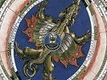

  
[Intangible Textual Heritage](../../index)  [Sky Lore](../index) 
[Index](index)  [Previous](argr09)  [Next](argr11) 

------------------------------------------------------------------------

[Buy this Book at
Amazon.com](https://www.amazon.com/exec/obidos/ASIN/B0027P88F0/internetsacredte)

------------------------------------------------------------------------

  
*Astrology and Religion Among the Greeks and Romans*, by Franz Cumont,
\[1912\], at Intangible Textual Heritage

------------------------------------------------------------------------

p. 77

### LECTURE V. Astral Mysticism [1](#fn_81)--Ethics and Cult

A theology which was based on theories of celestial mechanism, which
deified mere abstractions such as Time and its subdivisions, which
attributed a sacred character to numbers themselves, must, it would
seem, have been repellent by reason of its dry metaphysical character. A
creation of astronomers, it would appear to have been incapable of
appealing to any but an intellectual *élite*, and of winning over any
but speculative minds. We might well be astonished, at first sight, that
a religion so arid and abstruse should have been able to conquer the
ancient world, and we ask ourselves how it obtained a hold over men's
souls and was able to attract a multitude of believers.

The answer is that this potent system, which set itself to satisfy the
intelligence, made a yet more effective appeal to emotion. If the cults
of the East pretended to answer all the questions which man asks
concerning the world and himself, they also aimed at stirring his
emotions, at arousing in him the rapture of ecstasy.

The leaning towards mysticism, which is one of the characteristic traits
of the Syrian Posidonius, was shared by all the adepts of "Chaldean"
creeds. We must attempt to analyse here the character of this sidereal
mysticism, an original form of devotion, if there ever was one, a
curious and little known expression of religious feeling in the days of
antiquity, and to show what system of ethics sprang from it, what form
of worship corresponded to it, and how it was reconciled with fatalism.
After the theory, we pass on to the practice.

 

p. 78

The magnificent appearance of the glittering sky has always vividly
impressed mankind, and whoever has enjoyed the soft brilliance of an
Eastern night, will understand how in that country adoration was
naturally excited for the inextinguishable centres of light on high. But
this "cosmic emotion," as it has been termed, varies constantly
according to the idea which has been formed of the universe. There is
assuredly an enormous distance between the views of primitive man, who,
when he raised his eyes to the firmament, sometimes dreaded lest this
solid vault should fall and crush him, and the veneration of a Kant,
who, when considering the stellar systems piled up to infinity above
him, felt himself seized with the same respectful wonder that he
bestowed on the moral law which he apprehended within him by reason. The
feeling has been developed with the progress of knowledge, and in
proportion to the precision to which ideas of immensity and eternity
attained. In the Greeks the cosmos did not arouse, as in ourselves, the
troublesome thought of an extension prolonged to infinity beyond the
most distant nebula which the telescope can reach. The world then had
limits. Above the sphere of the fixed stars, which surrounded it on all
sides, the ancients supposed that there was nothing but a void or ether.
Heaven in their astronomy was like the earth in their geography, a much
more limited expression than it is nowadays. The vastness of the visible
constellations was not so overwhelming to them as it is to our
scientific knowledge, and the distances at which they fixed these
bodies, did not suggest to them as to us a distance so great that its
extent transcends the limits of our imagination and even figures cannot
enable us to realise it. When they gazed into the depths of space, they
were not seized to the same degree as we with giddiness at the abysses,
nor crushed by the feeling of their own littleness. They would not have
cried like Pascal, when meditating on the disproportion between man and
nature, incommensurable and speechless: "The eternal silence of these
boundless spaces frightens me." [1](#fn_82) The
feeling which struck the ancients was mainly one of admiration.
Seneca [2](#fn_83)

p. 79

develops this thought, that the stars, even if we do not bear in mind
the benefits which they diffuse over our earthly abode, provoke our
wonder by their beauty and demand our veneration by their majesty.

From the passages which are devoted to celebrating their splendour, I
will quote only one, the final touch of which will make clear the entire
difference which separates the ancient from the modern conception.
Manilius ends his fifth book by a grandiose description of the
brilliance of those moonless nights when even stars of the sixth
magnitude kindle their crowded and gleaming fires, seeds of light amid
the darkness. The glittering temples of the sky then shine with torches
more numerous than the sands of the seashore, than the flowers of the
meadow, than the waves of the ocean, than the leaves of the forest. "If
nature," adds the poet, "had given to this multitude powers in
proportion to its numbers, the ether itself would not have been able to
support its own flames, and the conflagration of Olympus would have
consumed the entire world." [1](#fn_84)

We have seen [2](#fn_85) how admiration for the
beauty of the cosmos, the discovery of the celestial harmony, had led to
the declaration of the existence of a guiding Providence. But this is
not the most characteristic side of the doctrine: all systems of
theology invoke the order of nature as a proof of the existence of God.
What is more original is that they took this "cosmic emotion" which
every man feels and transformed it into a religious sentiment.

The resplendent stars, which eternally pursue their silent course above
us, are divinities endowed with personality and animated by feelings. On
the other hand, the soul is a particle detached from the cosmic fires.
The warmth which animates the human microcosm, is part of the same
substance which vivifies the universe, the reason which guides us
partakes of the nature of those luminaries which enlighten it. [3](#fn_86) Itself a fiery

p. 80

essence, it is kin to the gods which glitter in the firmament. Thus
contemplation of the heaven becomes a communion. The desire which man
feels to fix his eyes long upon the star-spangled vault, is a divine
passion which transports him. A call from heaven draws him towards the
radiant spaces. In the splendour of the night his spirit is intoxicated
with the glow which the fires above shed upon him. As men possessed, or
as the corybantes in the delirium of their orgies, he gives himself up
to ecstasy, which frees him from the trammels of his flesh and lifts
him, far above the mists of our atmosphere, into the serene regions
where move the everlasting stars. Borne on the wings of enthusiasm, he
projects himself into the midst of this sacred choir and follows its
harmonious movements. Then he partakes in the life of these luminous
gods, which from below he sees twinkling in the radiance of the ether;
before the appointed hour of death he participates in their divinity,
and receives their revelations in a stream of light, which by its
brilliance dazzles even the eye of reason.

Such are the sublime effusions in which the mystic eloquence of a
Posidonius delights. Nevertheless in this learned theology, whose first
authors were astronomers, erudition never loses its rights. Man,
attracted by the brightness of the sky, does not only take an
unspeakable delight in considering the rhythmic dance of the stars,
regulated by the harmonies of a divine music produced by the movements
of the celestial spheres. Never weary of this ever-repeated spectacle,
he does not confine himself to enjoying it. The thirst for knowledge,
which is innate in him, impels him to enquire what is the nature of
these glowing bodies whose radiance reaches him, to discover the causes
and the laws of their unceasing movements. He aspires to comprehend the
course of the constellations and the sinuous path of the planets, which
should reveal to him the rules of life and the secrets of destiny. As
soon as he approaches the limits of the heavens, his desire to
understand them is inflamed by the actual facility which he experiences
in satisfying it. The transports which draw him towards the higher
regions, do not dull but enlighten his mind. Are not all discoveries of
astronomy revelations of their nature made by the sidereal gods to their

p. 81

earnest disciples? This mystic contemplation of heaven, source of all
intelligence, will be the religious ideal of lofty spirits. The
astronomer Ptolemy, who of all the savants of antiquity had perhaps the
most influence on succeeding generations, will forget his complicated
calculations and his arduous researches to sing of this intoxication. We
have preserved the following lines of his [1](#fn_87): "Mortal as I am, I know that I am born
for a day, but when I follow the serried multitude of the stars in their
circular course, my feet no longer touch the earth; I ascend to Zeus
himself to feast me on ambrosia, the food of the gods."

Let us compare this serene ecstasy with the transports of Dionysiac
intoxication, such as Euripides for example depicts for us so strikingly
in the Bacchæ, and we shall at once realise the distance which separates
this astral religion from the earlier paganism. In the one, under the
stimulus of wine, the soul communicates with the exuberant forces of
nature, and the overflowing energy of physical life expresses itself in
tumultuous exaltation of the senses and impetuous disorder of the
spirit. In the other, it is with pure light that reason quenches her
thirst for truth; and "the abstemious intoxication," [2](#fn_88) which exalts her to the stars, kindles in
her no ardour save a passionate yearning for divine knowledge. The
source of mysticism is transferred from earth to heaven.

We, who in our northern towns scarcely perceive the light of the stars,
continually veiled in fogs and dimmed by smoke, we to whom they are
merely bodies in a state of incandescence moved by mechanical forces, we
can hardly comprehend the strength of the religious feeling which they
inspired in the men of old. The indefinable impression which is produced
by the great spectacles of nature, the desire which possesses us of
probing the causes of her phenomena, were in their case combined with
the aspirations of faith towards these "visible gods," who were ever
present to be worshipped. The passion for knowledge, the ardour of
devotion, were blended in the deep emotion which was stirred by the idea
of a communion between man and the harmony of the skies.

p. 82

Think of the prestige which such a theory gave to the astrologer who is
in constant relation with the divine stars. It is nowhere more clearly
expressed than in a passage of a rhetorician belonging to the Augustan
age, Arellius Fuscus. [1](#fn_89) "He to whom
the gods themselves reveal the future, who imposes their will even on
kings and peoples, cannot be fashioned," he says, "by the same womb
which bore us ignorant men. His is a superhuman rank. Confidant of the
gods, he is himself divine." Then he adds:

If the pretensions of astrology are genuine, why do
not men of every age devote themselves to this study? Why from our
infancy do we not fix our eyes on nature and on the gods, seeing that
the stars unveil themselves for us, and that we can live in the midst of
the gods? Why exhaust ourselves in efforts to acquire eloquence, or
devote ourselves to the profession of arms? Rather let us lift up our
minds by means of the science which reveals to us the future, and before
the appointed hour of death let us taste the pleasures of the
Blest.

 

This lofty conception, which was formed of astrology, queen of sciences,
this mysticism which gave it a sacred character, entailed ethical
consequences of extreme importance. The *mathematici* of the Roman
empire were the successors of the ancient Chaldean priests, and they
never forgot it. They love to assume the holy guise of incorruptible
prophets, and to consider the exercise of their profession as a
priesthood. They are fond of laying stress on the purity of their
morals, and they complacently enumerate all the qualities which bring
them near to the divine nature,--chastity, sobriety, integrity,
self-renunciation. If others seek fortune at the price of a thousand
efforts, the astrologer, dedicated to arduous research, is bound to
surrender himself entirely to be penetrated by the intelligence of God.

"Impendendus homo est, dens esse ut possit in ipso." [2](#fn_90)

p. 83

Thus astrologers, who profess to discover the mysteries of fate, lead an
austere life, or at any rate they affect it. This is the very condition
of their power. Mortals do not share in the heavenly ecstasy, unless
they have merited it by the morality of their conduct. Science is a
revelation promised to virtue. Man must be purified from all defilement
in order to render himself worthy of the society of the gods, and of the
knowledge of heavenly things. This idea, that a man's vices weigh him
down and detain him here below, is frequently found developed. The
doctrine contrasts the body formed of earth with the sacred fire of the
spirit. All carnal desires in some measure materialise this sacred fire
at the same time that they pollute it, and hinder it from ascending to
the ether. On the other hand, if the soul emancipates itself from the
passions of the body, it will be able to fly lightly and easily to the
stars. In the vehement polemic which Posidonius launches against
Epicurus, he reproaches him, [1](#fn_91) in
regard to his astronomical doctrines, with having been "blinder than a
mole," and he adds: "No wonder, for to discover the real nature of
things is not the part of men devoted to pleasure, but of those whose
virtuous character makes the good their ideal, and who do not prefer to
it the comfort of their beloved flesh." The absurdity of the cosmography
professed by the Epicureans is, in his eyes, a consequence of their
dissolute life. Here we see set forth the idea, so dangerously developed
later, that true knowledge is the reward of piety.

The marvels of nature produce on us a mysterious impression. The view of
immensity elevates us above the vulgarities of life. This feeling,
innate in man, astral religion has seized upon and developed splendidly
in order to make it a source of morality. Theologians celebrate the
spiritual joys which this religion has in store for its adepts, the
intensity of which renders all material delights insipid and
contemptible; in a hundred ways they contrast the meanness of earthly
with the splendour of heavenly things. How should the worshippers of the
sky take delight in chariot-races, or be seduced by the songs and dances
of the theatre, they who have the privilege of contemplating the gods

p. 84

and of listening to their prophetic voices? How utterly do their
thoughts, which move among the stars, scorn from the heights of this
resplendent abode the gilded palaces and the pompous luxury of wealth!
They heap not up silver and gold, treasures worthy of the dark places of
the earth from which avarice draws them, but they fill their souls with
spiritual riches and make them masters of all nature, in such wise that
their possessions extend to the confines of the East and of the West.
Even the privations of exile cannot touch them, since under all climes
they find the same stars at the same distance from their watchful eyes.
Can they but mingle with them, and their souls mount to the bright
regions to which they are drawn by their kinship with the heavenly
fires, it matters but little to them what earth they tread with their
feet. Absorbed in her sublime researches, our reason will disdain the
perishable goods of this life and the gross pleasures of the multitude.
She will free herself from all the carnal desires aroused in her by the
body, fashioned of earth. Thus devotion to science is surrounded in
sidereal worship with a halo of religion. The exaltation of intellectual
life, which alone is divine, leads here to asceticism.

 

Astral mysticism, we see, conceived a blissful state of mind where man,
even on earth, freed himself of all that was earthly, emancipated
himself from the needs of the body, as from bonds, and from the impulses
born of it, to devote himself to the contemplation of nature and of the
starry sky, which imparted to him direct knowledge of divine activity.
This ideal, sternly ascetic, in that it set the satisfaction of bodily
instincts in sharp opposition to the aspirations of sovereign reason,
led to a life of self-renunciation, illumined only by the sacred joys of
study. But has man's will the power to choose this happy lot? Does not
astrology formulate a principle destructive of all morality and all
religion, the principle of fatalism?

Fatalism indeed is the capital principle which astrology imposed on the
world. The Chaldeans were the first to conceive the idea of Necessity
dominating the universe. [1](#fn_92) This is

p. 85

also one of the ruling ideas of the Stoics. [1](#fn_93) An absolute determinism is implied in all
the postulates of the science of stellar influence on human life, and
Manilius has expressed it in a striking line:

"Fata regunt orbem, certa stant omnia lege." [2](#fn_94)

The power of this fatalistic conception in ancient times may be
estimated by its long-continued survival, at least in the East, where it
originated. From the Alexandrine period, it spread over the whole
Hellenic world, and at the close of paganism it is still against this
doctrine that the efforts of Christian apologetics are mainly directed,
but it was destined to outlast all attacks and even to impose itself on
Islam. For, Mahommedanism is, in this respect, the heir of paganism.

The capital objection which its adversaries, whether heathen or
Christian, never ceased to advance against it,--the dialectic of
Carneades made already brilliant use of this weapon,--is the same that
the defenders of the doctrine of free will have never ceased to
repeat--namely, that the absence of free will destroys responsibility:
rewards and punishments are meaningless if men act under a dominating
necessity; if they are born heroes or criminals, morality entails no
merit and immorality no reproach. We cannot set forth here the
metaphysical discussions provoked by this controversy, which always has
been, and always will be, carried on. But, from a practical point of
view, Stoicism proved by facts--an irrefutable argument in ethics--that
fatalism is not incompatible with a manly and active virtue. Nay more,
it was possible to regard it as giving a religious basis to virtue, if
virtue resulted from the accord of microcosm and macrocosm which found
its highest expression in ecstasy. Some modern thinkers, like
Schleiermacher, have made true religion consist in the feeling, on the
part of the creature, of absolute dependence on the infinite Cause of
the universe. Astrology, by strengthening this feeling of dependence,
has been a source of real piety. Its professors elevate to a duty
complete resignation to omnipotent fate, cheerful acceptance

p. 86

of the inevitable. They declare themselves submissive to destiny even
the most capricious, like an intelligent slave who guesses his master's
wishes in order to satisfy them, and can make the harshest servitude
tolerable. This passionate surrender, this eagerness to submit to divine
Fate inspired certain souls in days of old with feelings so fervent as
to recall the rapture of Christian devotion, which burns to subject
itself to the will of God. It has been observed that the renunciation of
Demetrius, quoted by Seneca, [1](#fn_95) affords
a singular parallel to one of the most famous Christian prayers, the
"Suscipe" of St. Ignatius, which ends the book of *Spiritual Exercises*:

I have but one complaint to address to you, immortal
gods, that you did not make me sooner know your will. I would myself
have anticipated what, at your call, I offer to submit to now. Would you
take my children? It is for you that I have reared them. Do you desire
some part of my body? Take it from me; it is but a slight sacrifice I
make, since I must soon leave it altogether. Do you desire my life? Why
should I hesitate to restore to you that which you gave me? . . . I am
not constrained to aught, I suffer nought against my will, I am not
obedient to God, I am in accord with him, and the more so, because I
know that everything takes place in virtue of an immutable law
proclaimed from all eternity.

It is the ideal of pure Stoicism that is expressed in this effusion,
but, if it cannot be called anti-religious, it was at least in
contradiction to all established religions. If an irrevocable Destiny is
imposed on us, no sacred ceremony can change its decrees. Worship is
unavailing, it is idle to demand from divination the secrets of a future
which nothing can alter, and prayers--to use an expression of
Seneca [2](#fn_96)--are nothing but the
consolations of sickly souls.

And without doubt certain spirits, as Suetonius states of the Emperor
Tiberius, [3](#fn_97) "fully convinced that
everything is ruled by Fate, neglected the practice of religion." The
astrologer Vettius Valens [4](#fn_98) declares
it useless. "It is impossible to defeat

p. 87

by sacrifice that which has been established from the beginning of
time." We must therefore reverence the superior power which rules the
universe, without demanding aught of it, and we must content ourselves
with the joy which is caused by a feeling of intimate union of creature
with creator.

But ordinary people did not rise to this haughty ideal of piety. A
Peripatetic of the third century, Alexander of Aphrodisiac, has forcibly
characterised the want of logic which led the majority of mankind to act
in contradiction to their theories. [1](#fn_99)

Those \[he says\] who maintain energetically in
their discourses that Fate is inevitable and who attribute all events to
it, seem to place no reliance on it in the actions of their own lives.
For they call upon Fortune, thus recognising that it has an action
independent of Fate; and moreover they never cease to pray to the gods,
as though these could grant their prayers even in opposition to Fate;
and they do not hesitate to have recourse to omens, as though it were
possible for them, by learning any fated event in advance, to guard
themselves against it. The reasons which they invent to establish a
harmony between their theories and their conduct, are but pitiful
sophisms.

And in fact, as a Christian writer of the fourth century observes, if
the pagans of Rome were about to marry, if they intended to make a
purchase, or aspired to some dignity, they hastened to ask the
soothsayer for prognostications, while at the same time praying the
Fates to grant them years of prosperity.

A fundamental inconsistency which we noted from the beginning [2](#fn_100) is obvious in all this development of
astrology, which professed to become an exact science, but which always
remained a sacerdotal theology. The stars were regarded as divine at
Babylon before the doctrine of universal determinism had been
constructed, and this character was preserved--in defiance of logic. In
the temples of Oriental gods astrology assumed, or rather maintained, a
very different character from that under which it presented itself in
the schools or the observatories. A didactic treatise like the
*Tetrabiblos* of Ptolemy,

p. 88

where the effects of the planets are traced to physical causes, could
never have become the gospel of any sect. In the sidereal cults Fortune
will no longer be represented as a goddess blind and deaf, who with
unreasoning favour or implacable malignity makes sport of deserving and
undeserving alike. Less stress will be laid on the all-powerfulness of
Necessity than upon the divinity of the stars. These were no longer
merely cosmic forces, whose propitious or unpropitious operation was
weakened or strengthened according to the windings of a course fixed
from all eternity. The old mythology had not here been reduced to
mathematical formula. The celestial bodies had remained gods and
goddesses, endowed with senses and qualities, sometimes wroth but always
placable, who could be propitiated by prayers and offerings. Occult
ceremonies, magical incantations, had, it was thought, the power of
rescuing even here below the faithful from the enslavement which Destiny
caused to lie heavy on the rest of mankind, nay more, of bending the
celestial spirits to the will of the believer. Even the theorist
Firmicus Maternus, though vigorously asserting the omnipotence of Fate,
invokes the aid of the gods to enable him to resist the influence of the
stars.

Sidereal determinism, pushed to its extreme consequences, was a theory
of despair, the weight of which crushed the man. He felt himself
mastered, overpowered by blind forces which impelled him as irresistibly
as they caused the celestial spheres to move. His mind sought to escape
from the oppression of this cosmic mechanism, to free itself from the
slavery in which Ἀναγκή held it. No longer was reliance placed upon the
ceremonies of ancient cults to rescue him from the rigour of her
dominion, but Oriental religions provided the remedy for the evil which
they had spread. The new master who has possessed himself of the sky
will be propitiated by new means. Not only magic but also mysteries
profess to teach methods for exorcising Fate. They will be able to
appease the wrath of sidereal powers, and to win their favour by rites
and offerings; they will teach above all how to prolong man's life
beyond the term appointed by Destiny, and to assure him an immortality
of bliss. [1](#fn_101)

p. 89

Thus belief in Fate not only (1) became a source of moral inspiration to
noble minds, but also (2) provided a justification of the necessity of
positive worship.

 

Concerning the worship which was paid to the stars in the West we
possess very few data, even for the most important of all, that of the
Sun. I will not lay stress on certain details which have come down to us
about the rites of the Moon, the stars, the signs of the zodiac, etc. We
shall only mention some liturgical practices which have had permanent
results.

It was customary to worship the rising Sun (*Oriens*) at dawn, at the
moment when its first rays struck the demons who invaded the earth in
the darkness. Tacitus describes to us how, at the battle of Bedriacum in
A.D. 69, the soldiers of Vespasian saluted the rising sun with loud
shouts after the Syrian custom. [1](#fn_102) In
temples thrice a day--at dawn, at midday, and at dusk--a prayer was
addressed to the heavenly source of light, the worshipper turning
towards the East in the morning, towards the South at midday, and
towards the West in the evening. Perhaps this custom survived in the
three daily services of the early Church.

A very general observance required that on the 25th of December the
birth of the "new Sun" should be celebrated, when after the winter
solstice the days began to lengthen and the "invincible" star triumphed
again over darkness. It is certain that the date of this *Natalis
Invicti* was selected by the Church as the commemoration of the
*Nativity* of Jesus, which was previously confused with the Epiphany. In
appointing this day, universally marked by pious rejoicings, which were
as far as possible retained,--for instance the old chariot-races were
preserved,--the ecclesiastical authorities purified in some degree the
customs which they could not abolish. This substitution, which took
place at Rome probably between 354 and 360, was adopted throughout the
Empire, and that is why we still celebrate Christmas on the 25th of
December.

The pre-eminence assigned to the *dies Solis* also certainly

p. 90

contributed to the general recognition of Sunday as a holiday. This is
connected with a more important fact, namely, the adoption of the week
by all European nations. We have seen that in the astrological system
each day was sacred to a planet. It is probable that the worshipper
prayed to the presiding star of each day in turn. We still possess the
text of these prayers addressed to the planets in the East as in the
West. We have some in Greek, but of a late date, and the most curious
are those of the pagans of Harran near Edessa, which an Arabic writer
has transmitted to us in great detail. Thus, for instance, to call upon
Saturn it was necessary to await the favourable moment, to don black
vestments, to approach the sacred place humbly, like a man sunk in
sorrow, to burn a perfume composed of incense and opium mixed with
grease and the urine of a goat, then, at the moment when the smoke
arose, to raise the eyes to the star and say:

"Lord, whose name is august, whose power is
widespread, whose spirit sublime, O Lord Saturn the cold, the dry, the
dark, the harmful, . . . crafty sire who knowest all wiles, who art
deceitful, sage, understanding, who causest prosperity or ruin, happy or
unhappy is he whom thou makest such. I adjure thee, O primeval Father,
by thy great mercies, and thy noble qualities, to do for me this and
that!"

"This having been said," continues the text, which I am abridging, "thou
shalt bow thyself down with humility and contrition, and while bending
thou shalt repeat the prayer several times."

We do not suppose that in the Roman Empire devotees would have gone
through such complicated ceremonies every day in honour of the
planets,--the great prayer to Jupiter fills not less than four
pages,--but certainly the use of an analogous liturgy in certain cults,
notably in the mysteries of Mithra, contributed largely to the adoption
of the week throughout the Roman Empire.

This diffusion of the week and even its invention are much more recent
than is usually supposed. It is known that the Jews already divided time
into consecutive groups of seven days ending with the Sabbath, but these
days were not each under

p. 91

the patronage of a planet: they were merely counted. This system of the
measurement of time originates in the division of the lunar month into
four equal parts. This hebdomadal period is also found elsewhere, but
the astrological week has a much later origin. It is connected with the
general theory of "chronocratories," which assigned to each planet the
dominion over an hour, a day, a year, and even over a period of a
thousand years [1](#fn_103); and the assignment
of each of these to one of the gods is the result of an ingenious
calculation, which is based on the so-called "Chaldean" arrangement of
the planets. Now this arrangement appears nowhere before the second
century B.C., and it may be considered certain that our week is a
creation of the Hellenistic period. It was probably first introduced
into the sidereal cults of Mesopotamia and of Syria, thence passed to
Alexandria, and it is about the age of Augustus that it began to
supplant in Latin countries the old Roman *nundinum* of eight days, and
it ended by replacing all local calendars. Adopted by the Church, in
spite of its suspicious origin, it was imposed on all Christian peoples.
When to-day we name the days Saturday, Sunday, Monday, we are heathen
and astrologers without knowing it, since we recognise implicitly that
the first belongs to Saturn, the second to the Sun, and the third to the
Moon.

If I may be allowed to conclude with an observation, which takes us a
little away from our subject, there can perhaps be no more striking
proof of the power and popularity of astrological beliefs than the
influence which they have exercised over popular language. All modern
idioms preserve traces of it, which we can no longer discern save with
difficulty, survivals of vanished superstitions. Do we still remember,
when we speak of a martial, jovial, or lunatic character, that it must
have been formed by Mars, Jupiter, or the Moon, that an *influence* is
the effect of a fluid emitted by the celestial bodies, that it is one of
these "*astra*" which, if hostile, will cause me a *disaster*, and that,
finally, if I have the good fortune to find myself among you, I
certainly owe it to my *lucky star*?

------------------------------------------------------------------------

### Footnotes

[77:1](argr10.htm#fr_81) See my paper, *Le
mysticisme astral dans l’antiquite* (Bulletins de l’Acad. royale de
Belgique), Mai, 1909.

[78:1](argr10.htm#fr_82) "Le silence éternel de
ces espaces infinis m’effraie." (Pascal, *Pensées*.)

[78:2](argr10.htm#fr_83) Seneca, *De
Beneficiis*, iv, 23.

[79:1](argr10.htm#fr_84) Manil., v, 742:

*Cui si pro numero vires natura dedisset,  
Ipse suas aether flammas sufferre nequiret,  
Totus et accenso mundus flagraret Olympo*.

[79:2](argr10.htm#fr_85) See above, Lecture IV,
[p. 57](argr09.htm#page_57).

[79:3](argr10.htm#fr_86) See above, Lectures I,
[p. 20](argr06.htm#page_20); II, [p. 40](argr07.htm#page_40); IV, [p.
73](argr09.htm#page_73).

[81:1](argr10.htm#fr_87) Anthol. Palat., ix,
577.

[81:2](argr10.htm#fr_88) Νηφάλιος μέθη (Philo).

[82:1](argr10.htm#fr_89) Seneca., *Suasor*., 4.

[82:2](argr10.htm#fr_90) Manilius, iv, 407.

[83:1](argr10.htm#fr_91) Cleomedes, *De Motu
Circul*., ii, 1, § 87.

[84:1](argr10.htm#fr_92) See above, Lecture I,
[p. 17](argr06.htm#page_17).

[85:1](argr10.htm#fr_93) See above, Lecture II,
[p. 40](argr07.htm#page_40).

[85:2](argr10.htm#fr_94) Manil., iv, 14.

[86:1](argr10.htm#fr_95) Seneca, *De Provid.*,
v, 5.

[86:2](argr10.htm#fr_96) Seneca, *Quasi. Nat.*,
ii, 35, "*Aegrae mentis solacia*."

[86:3](argr10.htm#fr_97) Suetonius, *Vita Tib.*,
69.

[86:4](argr10.htm#fr_98) Vettius Valens, v, 9
(p. 220, 28 ed, Kroll).

[87:1](argr10.htm#fr_99) Alex. Aphrod., *De
Anima Mantissa*, p. 182, 18 ed. Bruns.

[87:2](argr10.htm#fr_100) See above, Lecture
I., [p. 18](argr06.htm#page_18).

[88:1](argr10.htm#fr_101) See below, Lecture
VI, [p. 100](argr11.htm#page_100) ss.

[89:1](argr10.htm#fr_102) Tacit., *Hist*., iii,
24.

[91:1](argr10.htm#fr_103) See above, Lecture
IV, p. 67.

------------------------------------------------------------------------

[Next: Lecture VI. Eschatology](argr11)
