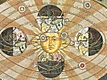

  
[Intangible Textual Heritage](../../index)  [Sky Lore](../index.md) 
[Index](index)  [Previous](cwiu15)  [Next](cwiu17.md) 

------------------------------------------------------------------------

[Buy this Book at
Amazon.com](https://www.amazon.com/exec/obidos/ASIN/0801803470/internetsacredte.md)

------------------------------------------------------------------------

  
*From the Closed World to the Infinite Universe*, by Alexander Koyré,
\[1957\], at Intangible Textual Heritage

------------------------------------------------------------------------

p. 277

### Notes

#### INTRODUCTION AND CHAPTER I

1. Cf. A. N. Whitehead, *Science and the modern
world*, New York, 1925; E. A. Burtt, *The metaphysical foundations of
modern physical science*, New York, 1926; J. H. Randall, *The making of
the modern mind*, Boston, 1926; Arthur O. Lovejoy's classical *Great
chain of being*, Cambridge, Mass., 1936, and my own *Études
Galiléennes*, Paris, 1939.

2. The cosmos conception is only practically,
that is, historically, linked together with the geocentric world-view.
Yet it can be completely divorced from the latter as, for example, by
Kepler.

3. The full story of the transformation of the
space conception from the Middle Ages to modern times should include the
history of the Platonic and Neoplatonic revival from the Florentine
Academy to the Cambridge Platonists as well as that of the atomic
conceptions of matter and the discussions about the vacuum following the
experiments of Galileo, Torricelli and Pascal. But this would double the
volume of this work and, besides, distract us somewhat from the very
definite and precise line of development which we are following here.
Moreover, for some of these problems we can refer our readers to the
classical books of Kurd Lasswitz, *Geschichte des Atomistik*, 2 vols.,
Hamburg und Berlin, 1890, and Ernst Cassirer, *Das Erkenntnisproblem in
der Philosophie und Wissenschaft der neuen Zeit*, 2 vols., Berlin, 1911,
as well as to the recent works of Cornelis de Waard, *L’expérience
barométrique, ses antécédents et ses explications*, Thouars, 1936, and
Miss Marie Boas, "Establishment of the mechanical philosophy," *Osiris*,
vol. x, 1952. See now Max Jammer, *Concepts of space*, Harvard Univ.
Press, Cambridge, Mass., 1954, and Markus Fierz, "Ueber den Ursprung und
Bedeutung von Newtons Lehre vom absoluten Raum," *Gesnerus*, vol. xi,
fasc. 3 / 4, 1954, especially for the space conceptions of Telesio
Pattrizzi and Campanella.

4. On the Greek conceptions of the universe cf.
Pierre Duhem, *Le système du monde*, vol. i and ii, Paris,
1913, 1914; R. Mondolfo, *L’infinito nel pensiero dei Greci*, Firenze,
1934, and Charles Mugler, *Devenir cyclique et la pluralité des mondes*,
Paris, 1953.

p. 278

5. The MS of *De rerum natura* was discovered
in 1417. On its reception and influence cf. J. H. Sandys, *History of
classical scholarship*, Cambridge, 1908, and G. Hadzitz, *Lucretius and
his influence*, New York, 1935.

6. The first Latin translation of Diogenes
Laertius’ *De vita et moribus philosophorum* by Ambrosius Civenius
appeared in Venice in 1475 and was immediately reprinted in Nürnberg in
1476 and 1479.

7. The atomism of the ancients, at least in the
aspect presented to us by Epicurus and Lucretius—it may be that it was
different with Democritus, but we know very little about Democritus—was
not a scientific theory, and though some of its precepts, as for
instance, that which enjoins us to explain the celestial phenomena on
the pattern of the terrestrial ones, *seem* to lead to the unification
of the world achieved by modern science, it has never been able to yield
a foundation for development of a physics; not even in modern times:
indeed, its revival by Gassendi remained perfectly sterile. The
explanation of this sterility lies, in my opinion, in the extreme
sensualism of the Epicurean tradition; it is only when this sensualism
was rejected by the founders of modern science and replaced by a
mathematical approach to nature that atomism—in the works of Galileo, R.
Boyle, Newton, etc.—became a scientifically valid conception, and
Lucretius and Epicurus appeared as forerunners of modern science. It is
possible, of course, and even probable, that, in linking mathematism
with atomism, modern science revived the deepest intuitions and
intentions of Democritus.

8. Cf. René Descartes, "Lettre à Chanut," June
6, 1647, *Oeuvres*, ed. Adam Tannery, vol. v, p. 50 sq., Paris, 1903.

9. Nicholas of Cusa (Nicholas Krebs or
Chrypffs) was born in 1401 in Cues (or Cusa) on the Moselle. He studied
law and mathematics in Padua, then theology in Cologne. As archdeacon of
Liège he was a member of the Council of Basel (1437), was sent to
Constantinople to bring about a union of the Eastern and Western
churches, and to Germany as papal legate (1440). In 1448 he was raised
by Pope Nicholas V to the cardinalate, and in 1450 he was appointed
Bishop of Britten. He died August 11, 1464. On Nicholas of Cusa cf.
Edmond Vansteenberghe, *Le Cardinal Nicolas de Cues*, Paris, 1920; Henry
Bett, *Nicolas of Cusa*, London, 1932; Maurice de Gandillac, *La
philosophie de Nicolas de Cues*, Paris, 1941.

10. Cf. Ernst Hoffmann, *Das Universum von
Nikolas von Cues*, especially the *Textbeilage* by Raymond Klibansky,
pp. 41 sq., which gives the text of Nicholas of Cusa in a critical
edition as well as the bibliography of the problem. The booklet of E.
Hoffmann appeared as "Cusanus

p. 279

\[paragraph continues\] Studien, I" in the
*Sitzungsberichte der Heidelberger Akademie der Wissenschaften,
Philosophisch-Historische Klasse*, Jahrgang 19291930, 3. Abhandlung, Heidelberg, 1930.

11. Cf. *De docta ignorantia*, 1. ii, cap. ii, p. 99. I am following the text of
the latest, critical, edition of the works of Nicholas of Cusa by E.
Hoffmann-R. Klibansky (*Opera omnia, Jussu et auctoritate Academiae
litterarum Heidelbergensii ad codicum fidem edita*, vol. i, Lipsiae, 1932). There is, now, an English
translation of the *De docta ignorantia* by Fr. Germain Heron: *Of
learned ignorance* by Nicholas Cusanus, London, 1954. I have,
nevertheless, preferred to give my own translation of the texts I am
quoting.

12. *Ibid*., p. 99 sq.

13. *Ibid*., p. 100.

14. *Ibid*., p. 100 sq. It is to be
remembered, however, that the conception of the relativity of motion, at
least in the sense of the necessity to relate motion to a resting
reference-point (or body) is nothing new and can already be found in
Aristotle; cf. P. Duhem, *Le mouvement absolu et le mouvement relatif*,
Montlignon, 1909; the optical relativity of motion is studied at length
by Witello (cf. *Opticae libri decem*, p. 167, Basilae, 1572) and, even
more extensively, by Nicole Oresme, (cf. *Le livre du ciel et de la
terre*, ed. by A. D. Meuret and A. J. Denomy, C. S. B., pp. 271 sq.,
Toronto, 1943).

15. *Ibid*., p. 102.

16. *Ibid*., p. 102 sq.

17. *De docta ignorantia*, l. ii, cap. 12, p. 103.

18. Cf. the famous passage of Virgil,
*Provehimur portu terraeque urbesque recedunt*, quoted by Copernicus.

19. This famous saying which describes God as
a *sphaera cuius centrum ubique, circumferentia nullibi* appears for the
first time in this form in the pseudo-Hermetic *Book of the XXIV
philosophers*, an anonymous compilation of the XIIth century; cf.
Clemens Baemker, *Das pseudohermetische Buch der XXIV Meister* (Beiträge
zur Geschichte der Philosophie und Theologie des Mittelalters, fasc.
xxv), Münster, 1928; Dietrich Mahnke,
*Unendliche Sphaere und Allmittelpunct*, Halle/Saale, 1937. In this
*Book of the XXIV philosophers*, the above-mentioned formula forms the
proposition ii.

20. He is, however, referred to by Giovanni
Francesco Pico in his *Examen doctae vanitatis gentium* (Opera, t. ii, p. 773, Basileae, 1573) and Celio
Calcagnini in his *Quod coelum stet, terra moveatur, vel de perenni motu
terrae* (*Opera aliquot*, p. 395, Basileae, 1544); cf. R. Klibansky,
*op. cit.*, p. 41.

p. 280

21. Cf. L. A. Birkenmajer, *Mikolaj Kopernik*,
vol. i, p. 248, Cracow, 1900. Birkenmajer denies any influence of
Nicholas of Cusa on Copernicus. On the medieval "forerunners" of
Copernicus cf. G. McColley, "The theory of the diurnal rotation of the
earth," *Isis*, xxvi, 1937.

22. *De docta ignorantia*, ii, 12, p. 104.

23. Nicholas of Cusa's conception could be
treated as an anticipation of that of Sir William Herschell; and even of
more modern ones.

24. *De docta ignorantia*, ii, 12, p. 104.

25. *Ibid*., p. 105.

26. *Ibid*., p. 107. Once more, one could see
in this conception of Nicholas of Cusa a prefiguration of the theory of
the mutual attraction of the heavenly bodies.

27. *Ibid*., p. 107.

28. *Ibid*., p. 108 sq.

29. Marcellus Stellatus Palingenius, whose
true name was Pier Angelo Manzoli, born at La Stellata some time between
1500 and 1503, wrote, under the title of *Zodiacus vitae*, a didactical
poem, which was printed in Venice (probably) in 1534, rapidly became
extremely popular, especially among Protestants, and was even translated
into English, French and German. The English translation (*Zodiake of
life*) by Barnaby Goodge, appeared in 1560 (the first three books), and
in 1565 the entire poem was printed. It seems that Palingenius was at a
certain time suspected of heresy, but it was only 15 years after his
death (he died in 1543) that, in 1558, the *Zodiacus vitae* was put on
the *Index librorum prohibitorum*. Under Pope Paul II his bones were
disinterred and burnt; cf. F. W. Watson, *The Zodiacus Vitae of
Marcellus Palingenius Stellatus: An old school book*, London, 1908 and
F. R. Johnson, *Astronomical thought in Renaissance England*, pp. 145
sq., Baltimore, 1937.

30. *Zodiacus vitae*, l. vii, *Libra*, ll. 497-99; Engl. transl., p.
118; cf. A. O. Lovejoy, *The great chain of being*, pp. 115 sq.,
Cambridge, Mass., 1936; F. R. Johnson, *op. cit.*, pp. 147 sq.

31. *Zodiacus vitae*, l. ix, *Aquarius*, ll. 601-3 (transl., p. 218).

32. *Ibid*., l. xi, *Aquarius*, ll. 612-616 (transl., p. 218).

33. A. O. Lovejoy, *The great chain of being*,
p. 52 and *passim*.

34. *Zodiacus vitae*, l. xii, *Pisces*, ll. 20-35 (transl., p. 228).

35. *Ibid*., ll. 71-85 (transl., p. 229). The
world-view of Palingenius is beautifully expressed by Edmund Spenser in
his *Hymn of heavenly beauty* (quoted by E. M. W. Tillyard, *The
Elizabethan world picture*, p. 45, London, 1943):

Far above these heavens which here we see, p.
281  
Be others far exceeding these in light,  
Not bounded, not corrupt, as these same be,  
But infinite in largeness and in height,  
Unmoving, incorrupt and spotless bright  
That need no sun t’illuminate their spheres  
But their own native light far passing theirs  
And as these heavens still by degree arise  
Untill they come to their first mover's bound,  
That in his mighty compass doth comprise  
And carry all the rest with him around;  
So those likewise do by degree redound  
And rise more fair till they at last arrive  
To the most fair, whereto they all do strive.

#### CHAPTER II

1. In the technical sense of the word,
Copernicus is a Ptolemean.

2. Cf. Joachim Rheticus, *Narratio prima*. I am
quoting the excellent translation of E. Rosen in his *Three Copernican
treatises*, p. 147, New York, 1939.

3. F. R. Johnson, *Astronomical thought in
Renaissance England*, pp. 24549, Baltimore, 1937; cf. A. O. Lovejoy,
*op. cit.*, pp. 109 sq.

4. John Donne, *Anatomy of the world*, First
Anniversary (1611) ed., Nonesuch Press, p. 202. The disastrous effects
of the seventeenth century's spiritual revolution have recently been
studied with great care and some nostalgic regret by a number of
scholars; cf. *inter alia*, E. M. W. Tillyard, *The Elizabethan world
picture*, London, 1943; Victor Harris, *All coherence gone*, Chicago,
1949; Miss Marjorie H. Nicolson, *The breaking of the circle*, Evanston,
Ill., 1950; S. L. Bethell, *The cultural revolution of the XVIIth
century*, London, 1951. For a non-nostalgic treatment cf. A. O. Lovejoy,
*The great chain of being*, and Basil Willey, *The seventeenth century
background*, Cambridge, 1934.

5. Nicolaus Copernicus, *De revolutionibus
orbium coelestium*, l. i, cap. viii.,

6. According to the mediaeval conception the
central position of the earth is the lowest possible; only Hell is
"lower" than our earthly abode.

7. For the pre-modern, that is, pre-telescopic
astronomy, fixed stars possess a visible and even measurable diameter.
Since, on the other hand, they are rather far away from us and in the
Copernican conception even exceedingly far (cf. *infra*, pp.
[92](cwiu07.htm#page_92)-9.md), their real dimensions must be extremely
large.

p. 282

8. Cf. Grant McColley, "The seventeenth century
doctrine of a plurality of worlds," *Annals of Science*, i, 1936, and "Copernicus and the infinite
universe," Popular Astronomy, xliv, 1936;
cf. Francis R. Johnson, *op. cit.*, pp. 107 sq.

9. Nicolaus Copernicus, *De revolutionibus
orbium coelestium*, l. i, cap. i.

10. *Ibid*., l. i, cap. viii.

11. *Ibid*., l. i, cap. x.

12. A. O. Lovejoy, *op. cit.*, pp. 99 sq.

13. Cf. Sir Walter Raleigh, *The historie of
the world*, London, 1652, pp. 93 sq.; cf. Bethell, *op. cit.*, pp. 46
sq.

14. Cf. *infra*, [p. 94](cwiu07.htm#page_94.md).

15. Giordano Bruno understands them as
teaching the infinity of the universe. I have already examined the case
of Nicholas of Cusa; as for Lucretius, he asserts, indeed, the infinity
of space and that of the *worlds*, but maintains the finiteness of our
visible world and the existence of a limiting heavenly sphere, outside
of which, but inaccessible to our perception, there are other identical
or analogous "worlds." Anachronistically we could consider his
conception as prefigurating the modern conception of island-universes
dispersed in an infinite space, though with a very important difference:
the Lucretian worlds are closed and not connected with each other.

16. Cf. Francis R. Johnson and Sanford V.
Larkey, "Thomas Digges, the Copernican system and the idea of the
infinity of the universe," *The Huntington Library Bulletin*, n. 5
(1934), and Francis R. Johnson, *op. cit.*, pp. 164 sq.; cf. also A. O.
Lovejoy, *op. cit.*, p. 116.

18. *A Perfit Description*, sigs N 3-N 4; cf.
Johnson-Larkey, pp. 88 sq.; Johnson, pp. 165-167.

19. A. O. Lovejoy, *op. cit.*, p. 116.
Giordano Bruno was born in Nola (near Naples) in 1548, became a
Dominican in 1566, but, ten years later in 1576, on account of some
rather heretical views held by him on [transubstantiation](errata.htm#7.md)
and the Immaculate Conception, had to leave both the order and Italy. In
1579 he came to Geneva (where he could not stay), then to Toulouse, and
to Paris (1581) where he lectured on the logical system of Raymundus
Lullus (and wrote some philosophical works, i. e. *De umbris idearum*
and a satiric comedy, *Il Candelajo*); in 1583 he went to England where
he lectured and published some of his best works, such as *La Cana de le
Ceneri*, *De la causa*, *principio et uno* and *De l’infinito universo e
mondi*. From 1585 to 1592 Bruno wandered in Europe (Paris, Marburg,
Wittenberg, Prague, Helmstadt, Zürich), publishing the *De immenso et
innumerabilibus* in 1591. Finally, in 1592 he accepted an invitation to
Venice. Denounced and arrested by the

p. 283

\[paragraph continues\] Inquisition (in
1593), he was brought to Rome, where he remained imprisoned for seven
years, until he was excommunicated and burnt at the stake on February
17, 1600. Cf. Dorothea Waley Singer *Giordano Bruno, his life and
thought*, New York, 1950.

20. Written in 1584.

21. Cf. my *Études Galiléenes*, iii, p. ii sq., and "Galileo and the scientific
revolution of the XVIIth century," *The Philosophical Review*, 1943.

22. Giordano Bruno, *La Cena de le Ceneri*,
dial. terzo, *Opere Italiane*, ed. G. Gentile, vol. i, p. 73, Bari, 1907.

23. *Ibid*., pp. 73 sq.

24. The *De l’infinito universo e mondi* was
written in 1584; the *De immenso et innumerabilibus*, or to quote the
full title, *De innumerabilibus, immenso et infigurabili: sive de
universo et mundis libri octo*, in 1591. I shall base my exposition on
the *De l’infinito universo e mondi* and quote it in the excellent
recent translation of Mrs. Dorothea Waley Singer, adjoined to her
*Giordano Bruno, his life and work*, New York, 1950. I shall give the
reference first to the edition of Gentile (*Opere Italiane*, vol. i); then to Mrs. Singer's translation.

25. Bruno's space is a void; but this void is
nowhere really void; it is everywhere full of being. A vacuum with
nothing filling it would mean a limitation of God's creative action and,
moreover, a sin against the principle of sufficient reason which forbids
God to treat any part of space in a manner different from any other.

26. *De l’inf. univ. e mondi*, p. 309 sq.,
transl., p. 280; cf. *De immenso . . . Opera Latina*, vol. i, part i, p.
259.

27. A. O. Lovejoy, *op. cit.*, p. 119.

28. *De l’inf. universo*, dedic. epistle, p.
275 (transl., p. 246).

29. The famous phrase "le silence éternel de
ces espaces infinis m’effraye" does not express Pascal's own feeling—as
is usually assumed by Pascal's historians—but that of the atheistic
"libertin."

30. *De l’inf. universo*, p. 274 (transl., p.
245).

31. *De l’inf. universo*, p. 280 (transl., p.
250); cf. *De immenso*, i, 4, Opera,
i, i, p.
214.

32. *Ibid*., p. 281 (transl., p. 251).

33. This very famous argument against the
finitude of the universe—or of space—is a good example of the continuity
of philosophical tradition and discussion. Giordano Bruno probably
borrows it from Lucretius (*De rerum natura*, l. i, v. 968 sq.), but it was already widely used
in the discussions of the XIII-XIVth centuries about the plurality of
the worlds and the possibility of the void (cf. my paper quoted in chap.
in, 40) and will be used by Henry More (cf. *infra*, [p.
139](cwiu09.htm#page_139).md) and even by Locke

p. 284

\[paragraph continues\] (cf. An essay on
human understanding, l. ii, §§13, 21).
According to the *Commentaire exégétique et critique* of A. Ernout and
L. Robin to their edition of the *De rerun natura* (p. 180 sq., Paris,
1925), the argument originates with Architas and is used by Endemios in
his *Physics* (cf. H. Diels, *Fragmente der Vorsocratiker*, c. xxxv, A 24, Berlin, 1912). What is more
important, it is to be found in Cicero, *De natura deorum*, i, 20, 54; cf. Cyril Bailey, Lucretius, De
rerun natura, vol. ii, pp. 958 sq.,
Oxford, 1947.

34. *De l’inf. universo*, p. 282 (transl., p.
253).

35. *Ibid*., p. 283 (transl., p. 254); cf.
*Acrotismus Camoeracensis*, *Opera*, i,
i, pp. 133, 134, 140.

36. Cf. *Acrotismus Camoeracensis*, p. 175.

37. *De l’inf. univ.*, p. 286 (transl., p.
256).

38. *Ibid*., p. 289 (transl., p. 259).

39. *Ibid*., p. 334 (transl., p. 304); cf. *De
immenso*, Opera, i, i, p. 218.

40. *Ibid*., p. 335 (transl., p. 304); cf. *De
immenso*, Opera, i; i, p. 290; i,
ii, p. 66.

41. *Ibid*., p. 336 (transl., p. 305); cf. *De
immenso*, i, ii, p. 121.

42. *Ibid*., p. 336 (transl., p. 305).

43. *Ibid*., p. 286 (transl., p. 257).

44. *Ibid*., p. 289 (transl., p. 260).

45. As a scientist he was, sometimes, far
behind it.

46. Cf. F. R. Johnson, *Astronomical thought
in Renaissance England*, p. 216.

47. *G. Guillielmi Gilberti Colcestrensis,
medici Londinensis, De magnete, magnetisque corporibus, et de magno
magnete tellure physiologia nova*, c. vi,
cap. iii; pp. 215 sq., London, 1600;
Gilbert's work was translated by P. Fleury Mottelay in 1892 and by
Sylvanus P. Thompson in 1900. The Mottelay translation was reprinted in
1941 as one of "The Classics of the St. John's Program" under the title:
*William Gilbert of Colchester, physician of London, On the load stone
and magnetic bodies and on the great magnet the Earth*; cf. pp. 319 sq.
According to J. L. E. Dreyer, *A history of astronomy from Thales to
Kepler*, 2nd ed., New York, 1953, p. 348, Gilbert, in his posthumous
work, *De mundo nostro sublunari philosophia nova* (Amstelodami, 1651),
"appears to hesitate between the system of Tycho and Copernicus." This
is not quite exact, since Gilbert, in contradistinction to Tycho Brahe,
(a) asserts the rotation of the earth which Tycho Brahe rejects, and (b)
denies the existence of a sphere of fixed stars, and even the finitude
of the universe still taught by Brahe. Thus Gilbert tells us that though
the majority of the philosophers placed the earth in the center of the
world, there is no reason to do so (l. 2, cap. ii, *De telluris loco*, p. 115): "Telluris

p. 285

vero globum in centro universi manentem omnis fere philosophorum turba
collocavit. At si motum aliquem habuerit praeter diurnam revolutionem
(ut nonnulli existimant) erronem etiam illam oportet esse; sin in suo
sede volveretur tantum, non in circulo, planetarum ritu moveretur. Non
tamen inde, aut ullis aliunde depromptis rationibus, certo persuadetur
eam in universae rerum naturae centro, aut circa centrum, permanere." He
adds, indeed (*ibid*., p. 117), that "Non est autem quo persuaderi
possit in centro universi magis terram reponi quam Lunam, quam Solem;
nec ut in motivo mundo horum unum in centro sit, necesse esse," and
that, moreover, the world itself has no center (p. 119).

On the other hand, though he puts the sun and not the earth in the
center of the moving world (p. 120): "locus telluris non in medio quia
planetae in motu circulari tellurem non observant, tanquam centrum
motionum, sed Solem magis," and tells us that the sun (p. 158) "maximam
vim egendi et impellendi habet, qui etiam motivi mundi centrum est," he
does not tell us outright that the earth belongs to this "moving world"
of the planets.

Though he quotes Copernicus and even tells us that Copernicus erred in
ascribing to the earth three motions, instead of two (around its axis
and around the sun), the third one, that which, according to Copernicus,
turned the axis of the earth in order to keep it pointing always in the
same direction being not a motion at all, but lack of it (p. 165):
"Tertius motus a Copernico inductus non est motus omnino, sed telluris
est directio stabilis," he does not assert the truth of the heliocentric
world-view.

He tells us, indeed (l. i, cap. xx, *De vacuo separato*), that the Aristotelian
objections against the void are worthless, that things can just as well
move in the void space as remain immobile in it and that the earth can
very well be a planet and turn around the sun like the others; that,
nevertheless, he does not want to discuss this question (l. i, cap. xx, *De
vacuo separato*, p. 49): "Cujus rei veritatem sic habeto. Omnia
quiescunt in vacuo posita; ita quies plurimis globis mundi. At nonnulli
globi et infinitis viribus et actu aliorum corporum aguntur circa
quaedam corpora, ut planetae circa Solem, Luna circa Tellurem et erga
Solem.

"Quod si Sol in medio quiescit ut Canis, ut Orion, ut Arcturus, turn
planetae, tum etiam tellus, a Sole aguntur in orbem, consentientibus
propter bonum ipsis globorum formis: si vero tellus in medio quiescat
(de cujus motu annuo non est huius loci disceptare) aguntur circa ipsam
cetera moventia."

It is possible, of course, that Gilbert really considered that the
discussion of the annual motion of the earth was out of place in a book

p. 286

devoted to the development of a new philosophy of our sublunar world.
Yet it is difficult to admit that, if he was fully convinced of the
truth of the Copernican astronomy, he would so consistently avoid saying
it, even when asserting its daily rotation, as, for instance in chap. VI
of book II of the *Philosophia nova* (p. 135): "Terram circumvolvi
diurno motu, verisimile videtur: an vero circulari aliquo motu annuo
cietur, non hujus est loci inquirere." It seems, thus, that Gilbert was
either not very much interested in the problem, or sceptical about the
possibility to reach a solution and that he hesitated between an
improved Copernicanism (such as Kepler's) and an improved Tycho Brah-ism
(such as Longomontanus’).

#### CHAPTER III

1. In pointing out the analogy between Kepler's
views and those of some modern scientists and philosophers of science I
am not committing an anachronism: epistemology and logic are, indeed,
nearly as old as science itself and empiricism or positivism are by no
means new inventions.

2. The sun represents, symbolizes, and perhaps
even embodies God the Father, the stellar vault, the Son, and the space
in between, the Holy Ghost.

3. Cf. *De stella nova in pede Serpentarii*,
cap. xxi, pp. 687 (*Opera omnia*, ed.
Frisch, vol. ii, Frankofurti et Erlangae,
1859). The *De stella nova* was published in 1606.

4. *Ibid*., p. 688.

5. *Ibidem*.

6. *Ibidem*.

7. *Ibidem*.

8. *Ibidem*.

9. A perfectly reasonable assumption, and quite
analogous to that of contemporary astronomy, about the distribution of
galaxies.

10. *De stella nova*, p. 689.

11. *Ibidem*.

12. *Ibidem*.

13. The sky being "above" us, the stars are
"elevated" in respect to us; thus to place them at a greater distance
from us (or the centre of the world) is to give them a greater
"elevation."

14. *Ibid*., pp. 689 sq.

p. 287

15. The absence of stellar parallaxes imposes
a *minimum* to the distance separating us from the fixed stars.

15a. Marcus Manilius, a Stoic, who lived in
the Augustan age, author of a great astrological poem, *Astronomicon
libri quinque*, which was edited by Regiomontanus in Nürnberg in 1473.

16. *Ibid*., p. 690.

17. *Ibidem*.

18. Two minutes is the magnitude of the
*visible* diameter of a star for the unassisted eye.

19. *Ibidem*.

20. *Ibid*., p. 691.

21. *Ibidem*.

22. *Ibidem*.

23. *Ibidem*.

24. J. Kepler, *Dissertatio cum Nuntio Sidereo
nuper ad mortales misso a Galileo Galilei*, p. 490 (*Opera omnia*, vol.
ii), Frankoforti et Erlangae, 1859.
Wacherus = the Imperial Councillor Wackher von Wackenfels who was the
first to inform Kepler about the discoveries of Galileo. Brutus = the
Englishman Edward Bruce who was a partisan of Giordano Bruno and who,
some years before (Nov. 5, 1603), sent to Kepler a letter (from Venice)
in which he expressed his belief in the infinity of the world; according
to Bruce fixed stars were suns surrounded by planets like our sun, and,
like our sun, endowed with a rotational motion. Bruce's letter is quoted
by Frisch, *Opera omnia*, vol. ii, p.
568, and published by Max Caspar in his edition of Kepler (Johannes
Kepler, *Gesammelte Werke*, vol. iv, p.
450, München, 1938).

25. The fixed stars, as seen by a Galilean
telescope, do not appear as light-points; they still have visible
dimensions; cf. *supra*, [p. 191](cwiu11.htm#page_191.md).

26. *Epitome astronomiae Copernicanae*, liber
i, pars ii, p. 136 (*Opera omnia*, vol. vi, Frankoforti et Erlangae, 1866).

27. *Ibidem*.

28. *Ibidem*.

29. *ibid*., p. 137.

30. *Ibidem*.

31. *Ibid*., p. 138.

32. *Ibidem*.

33. *Ibidem*.

34. *Ibidem*.

35. *Ibidem*.

36. *Ibid*., p. 139.

37. Contemporary cosmology, on the other hand,
seems to have recognized

p. 288

the value of the old doubts about the possibility of an actually
infinite world, and turned back to a finitist conception.

38. That is the conception ascribed by
Plutarch (or Pseudo-Plutarch) to the Stoics.

39. *Ibid*., p. 139.

40. Cf. my paper, "Le vide et l’espace infini
au XIVème siècle," *Archives d’histoire doctrinale et littéraire du
Moyen-Age*, xvii, 1949.

#### CHAPTER IV

1. Galileo Galilei, *Sidereus nuncius* . . .
Venetiis, 1610; there is an English translation by E. S. Carlos, *The
sidereal messenger*, London, 1880. Large parts of this translation are
reprinted in Harlow Shapley and Helen E. Howarth, *A source book in
astronomy*, New York, 1929. Though not using this translation I refer to
it whenever possible. The [expression](errata.htm#8.md) *Sidereus Nuncius*
was used by Galileo as meaning: the *message* of the stars. Yet Kepler
understood it as meaning: the messenger of stars. This mistranslation
became generally accepted and was corrected only in the recent edition
of the *Nuncius* by Mrs. M. Timpanaro-Cardini, Florence, 1948.

2. Cf. *Sidereus nuncius*, pp. 59 sq. (*Opere*,
*Edizione Nazionale*, v. iii, Firenze,
1892), *Source book*, p. 41.

3. On the discovery of the telescope cf. Vasco
Ronchi, *Galileo e il cannochiale*, Udine, 1942, and *Storia della
luce*, 2 ed., Bologna, 1952.

4. *Sidereus nuncius*, p. 75, *Source book*, p.
46.

5. *Ibid*., p. 76.

6. *Ibid*., p. 78.

7. Galileo Galilei, *Letter to Ingoli*, p. 526.
*Opere, Ed. Naz.*, vol. vi, Firenze,
1896.

8. It is interesting to note that the
conception according to which heavenly bodies are inhabited is referred
to by Galileo as "commonly held."

9. *Letter to Ingoli*, p. 525.

10. *Ibid*., p. 518.

11. Galileo Galilei, *Dialogo sopra i due
massimi sistemi del mondo* (*Opere, Ed. Naz.*, vol. vii), p. 44; Firenze, 1897; cf. also p. 333.
The *Dialogue* is easily available now in the excellent modernization of
the old Salusbury translation by Professor Giorgio di Santillana,
Galileo Galilei, *Dialogue on the great world systems*, Chicago, 1953,
as well as in the new translation by Stillman Drake, Galileo Galilei,
*Dialogue concerning the two* 

p. 289

*chief world systems, Ptolemaic and Copernican*, Berkeley and Los
Angeles, 1953.

12. *Dialogo*, p. 306.

13. *Letter to Ingoli* (*Opere*, vol. vi), pp.
518, 529.

14. *Dialogo*, *loc. cit.*

15. Cf. *Letter to Liceti*, of February 10,
1640; Opere, vol. xviii, pp. 293 sq.,
Firenze, 1906.

16. Cf. R. Descartes, *Principia
philosophiae*, part ii, §4, p. 42.
(*Oeuvres*, ed. Adam Tannery, vol. viii,
Paris, 1905.)

17. *Principia philosophiae*, pt. ii, §10, p. 45.

18. *ibid*., §11, p. 46.

19. *Ibid*., §13, p. 47.

20. *Ibid*., §13, p. 47.

21. *Ibid*., §16, p. 49.

22. *Ibid*., §21, p. 52.

23. *Ibid*., §22, p. 52.

24. *Ibidem*.

25. *Principia philosophiae*, p. i, §26, p. 54.

26. *Ibid*., §27, p. 55.

27. *Ibidem*.

28. *Principia philosophiae*, p. iii, §1, p. 80.

29. *Ibid*., §2, pp. 81 sq.

#### CHAPTER V

1. Cf. Miss Marjorie H. Nicolson, "The early
stages of Cartesianism in England," *Studies in Philology*, vol. xxviii, 1929. Henry More accepted Cartesian
physics, though only partially, and the Cartesian rejection of
substantial forms, but he never abandoned his belief in the existence,
and action, of "spiritual" agents in nature and never adopted the
Cartesian strict opposition of matter—reduced to extension—to spirit,
defined by self-consciousness and freedom. Henry More, accordingly,
believes in animals 'having souls and in souls' having a non-material
extension; cf. also Miss Nicolson's *The breaking of the circle*,
Evanston, Ill., 1950.

2. These letters were published by Clersellier
in his edition of the correspondence of Descartes (*Lettres de M.
Descartes où sont traittées les plus belles questions de la morale, de
la physique, de la médecine et des mathématiques* . . . Paris, 1657) and
republished by Henry More

p. 290

himself (with a rather angry preface) in his *Collection of severall
philosophical writings* of 1662. I am quoting them according to the text
of the Adam-Tannery edition of the works of Descartes (*Oeuvres*, vol.
v, Paris, 1903).

3. *Letter to Descartes*, ii-xii, 1648,
pp. 238 sq.

4. In this work, written in 1646, he shows
himself an enthusiastic follower of the Lucretian-Brunonian doctrine of
the infinity of worlds; cf. Lovejoy, *op. cit.*, pp. 125, 347.

5. On Gassendi see K. Lasswitz, *op. cit.*, and
R. P. Gaston Sortais, *La philosophie moderne, depuis Bacon jusqu’à
Leibniz*, vol. ii, Paris, 1922; also
*Pierre Gassendi, sa vie et son oeuvre*, Paris, 1955. Gassendi is not an
original thinker and does not play any role in the discussion I am
studying. He is a rather timorous mind and accepts, obviously for
theological reasons, the finitude of the world immersed in void space;
yet, by his revival of Epicurean atomism and his insistence upon the
existence of the void, he undermined the very basis of the discussion,
that is, the traditional ontology which still dominated the thought not
only of Descartes and More but also of Newton and Leibniz.

6. *Letter to Descartes*, p. 242.

7. In the Cartesian world vortices which
surround fixed stars limit each other and prevent each other from
spreading and dissolving under the influence of centrifugal force; if
they were limited in number, and therefore in extension, then, first the
outermost ones and then all the others would be dispersed and
dissipated.

8. *Letter to Descartes*, p. 242.

9. Namely, by arguments based upon the
consideration of God's omnipotence.

10. Descartes to Henry More, 5, ii, 1649, pp. 267 sq.

11. *Ibid*., pp. 269 sq.

12. *Ibid*., p. 274.

13. *Ibid*., p. 275.

14. Second letter of H. More to Descartes, 5,
iii, 49; pp. 298 sq.

15. *Ibid*., pp. 304 sq.

16. *Ibid*., p. 305.

17. *Ibid*., p. 302. More's argument against
Descartes is a re-edition of Plotinus’ argument against Aristotle.

18. *Ibid*., p. 312; cf. *supra*.

19. Second letter of Descartes to Henry More,
15, iv, 1649; pp. 340 sq.

20. *Ibid*., p. 342.

21. *Ibid*., p. 343.

p. 291

22. Such was, in any case, the opinion of
Pascal. Yet, after all, what is the God of a philosopher supposed to be
if not a philosophical God?

23. *Ibid*., p. 344.

24. *Ibid*., p. 345.

25. Dated the 23rd of July, 1649 (*Oeuvres*,
vol. v, pp. 376 sq.).

26. At least, he started writing an answer—in
August 1649—though he did not send it to Henry More.

27. Dated the 21st of October, 1649, vol.
v, pp. 434 sq.

28. It is possible, of course, that, as he
went to Sweden on Sept. 1, 1649 and died there on Feb. 11, 1650,
Descartes did not receive this last letter of Henry More.

29. Cf. my *Essai sur les preuves de
l’existence de Dieu chez Descartes*, Paris, 1923, and "Descartes after
three hundred years," *The University of Buffalo Studies*, vol. xix, 1951.

#### CHAPTER VI

1. Henry More has not received the
monographical treatment to which he is undoubtedly entitled. On him, and
on the Cambridge Platonists in general, cf. John Tulloch, *Rational
theology and Christian philosophy in England in the XVIIIth century*,
vol. ii, Edinburgh and London, 1874; F.
J. Powicke, *The Cambridge Platonists*, London, 1926; J. H. Muirhead,
*The Platonic tradition in Anglo-Saxon philosophy*, London, 1931; T.
Cassirer, *Die Platonische Renaissance in England und die Schule von
Cambridge*, Leipzig, 1932; English translation: *The Platonic
Renaissance in England and the Cambridge School*, New Haven, 1953.
Selections of the philosophical writings of Henry More (namely from *The
antidote against atheism*, *The immortality of the soul*, and the
*Enchiridium metaphysicum in translation*) were published in 1925 by
Miss Flora J. Mackinnon with an interesting introduction, valuable
notes, and an excellent bibliography: *Philosophical writings of Henry
More*, New York, 1925. Cf. Marjorie Nicolson, *Conway letters, the
correspondence of Anna, Viscountess Conway, Henry More and their
friends*, 1642-1684, London, 1930; Markus Fierz, "Ueber den Ursprung und
Bedeutung der Lehre Newtons vom absolutem Raum," *Gesnerus*, vol. xi, fasc. 3 / 4, 1954; Max Jammer, *Concept of
space*, Harvard Univ. Press, Cambridge, Mass., 1954. Both Markus Fierz
and Max Jammer seem to me to exaggerate the real influence of cabalist
space conceptions on Henry More (and his predecessors). In my opinion,
it was a typical

p. 292

case of reprojection into the past of modern conceptions in order to
back them up by sacred or venerable authorities; yet, as we know,
misunderstanding and misinterpretation play an important part in the
history of thought. It seems to me, moreover, that Fierz and Jammer
themselves are not quite innocent of the sin of retroprojection,
forgetting that space conceptions formed before the invention of
geometry were not, and could not, be identical or even similar to the
conceptions devised after this momentous event.

2. Henry More, *An antidote against atheisme,
or an appeal to the natural faculties of the minde of man, whether there
be not a God*, London, 1652; second ed. corrected and enlarged, London,
1655; third edition, corrected, and enlarged, "with an Appendix
thereunto annexed," London, 1662. I am quoting this edition as given in
Henry More's *Collection of severall philosophical writings*, London,
1662.

3. Henry More, *The immortality of the soul, so
farre forth as it is demonstrable from the knowledge of nature and the
light of reason*, London, 1669; second edition in the *Collection of
severall philosophical writings* of 1662. It is this edition that I am
quoting.

4. Henricus Morus, *Enchiridium metaphysicum
sive de rebus incorporeis succincta et luculenta dissertatio*, Londini,
1671.

5. Henry More, *An antidote against atheism*,
book i, cap. iv, §3, p. 15.

6. Henry More, *The immortality of the soul*,
b. i, c. ii, axiom ix, p.
19.

7. Cf. R. Zimmerman, "Henry More and die vierte
Dimension des Raumes," *Kaiserliche Akademie der Wissenschaften*,
Philosophisch-historische Klasse, Sitzungsberichte, Bd. 98, pp. 403-sq.,
Wien, 1881.

8. Henry More, The immortality of the soul, b.
i, c. ii,
§11, p. 20.

9. *Ibid*., 6, i, c. iii, §§1
and 2, pp. 21 sq.

10. Axiom ix
(b. i, c. ii, p. 19) tells us that "There are some
Properties, Powers and Operations, immediately appertaining to a thing,
of which no reasons can be given, nor ought to be demanded, nor the Way
or Manner of the cohesion of the Attribute with the subject can by any
means be fancied or imagined."

11. Cf. William Gilbert, *De magnete*, ch.
xii, p. 308: "The magnetic force is
animate, or imitates the soul; in many respects it surpasses the human
soul while that is united to an organic body."

11a. Cf. also Markus Fierz, *op. cit.*, pp.
91 sq.

12. Henry More, *The immortality of the soul*,
b. iii, c. xii, §1, p. 193.

13. *Ibid*., preface, §12, p. 12.

14. An antidote against atheism, c. ii, c. ii, §1,
p. 43.

15. *Ibid*., Appendix (of 1655), cap. vii, §1, p. 163.

16. *Ibidem*.

p. 293

17. *Ibid*., §§4, 5, 6, pp. 164 sq.

18. *Enchiridium metaphysicum*, part i, cap. vi, v.
42.

19. *Ibidem*.

20. *Ibidem*.

21. *Ibid*., cap. vi, 4, p. 44.

22. *Ibid*., cap. vi, 11, p. 51.

23. *Ibid*., cap. vii, 3, p. 53.

24. This definition is given by Descartes in
the *Principia philosophiae*, part ii,
§25.

25. *Enchiridium metaphysicum*, cap. vii, 7, p. 56.

26. *Ibid*., c. vii, 6, p. 55.

27. *Ibidem*.

28. *Ibidem*.

29. *Ibidem*.

30. *Ibid*., c. viii, 6, p. 68.

31. *Ibid*., c. viii, 7, p. 69.

32. *Ibid*., c. viii, 8, pp. 69 sq.

33. *Ibid*., c. viii, 9, p. 70.

34. *Ibid*., c. viii, 10, p. 71.

35. *Ibid*., c. viii, 11, p. 72.

36. *Ibid*., c. viii, 12, p. 72.

37. *Ibidem*.

#### CHAPTER VII

1. Cf. Nicolas Malebranche, *Méditations
chrétiennes*, méd. ix, §9, p. 172, Paris,
1926. On Malebranche cf. H. Gouhier, *La philosophie de Malebranche*,
Paris, 1925.

2. *Ibidem*.

3. *Ibid*., §10, p. 173.

4. *Ibid*., §8, pp. 171 sq.

5. *Ibid*., §11, p. 174.

6. *Ibid*., §12, pp. 174 sq.

7. Cf. Malebranche, *Correspondance avec J. J.
Dortous de Mairan*, ed. nouvelle, précédée d’une introduction par Joseph
Moreau, Paris, 1947.

8. Cf., e. g., the already quoted book of E. A.
Burtt, *The metaphysical foundations of modern physical science*, New
York, 1925; second ed., London, 1932.

9. Cf. *Sir Isaac Newton's mathematical
principles of natural philosophy*,

p. 294

translated into English by Andrew Motte in 1729, the translation revised
by Florian Cajori, p. 6, Berkeley, Calif., 1946.

10. *Ibid*., p. 8.

11. *Ibidem*.

12. *Ibid*., p. 6.

13. *Ibidem*.

14. *Ibidem*.

15. *Ibidem*.

16. *Ibidem*.

17. *Ibidem*.

18. *Ibid*., p. 7. The example of the sailor
is discussed by Descartes in the *Principia philosophiae*, ii, 13, 32.

19. *Ibid*., p. 8.

20. His pupil, Dr. Clarke, will indeed do it;
cf. *infra*, [p. 275](cwiu15.htm#page_275.md).

21. *Ibid*., p. 9.

22. *Ibid*., p. 10.

23. *Ibidem*.

24. *Ibid*., p. 11. As against Descartes,
*Principia*, ii, 13.

24a. Cf. Ernst Mach, *The science of
mechanics*, Chicago, 1902, pp. 232 sq.; cf. also Max Jammer, *op. cit.*,
pp. 104 sq.; 121 sq.; 140 sq.

25. *Ibid*., p. 12.

26. *Ibid*., book iii, The system of the world, Lemma IV, cor.
III, p. 497.

27. *Ibid*., book iii, The system of the world, prop. V, theorem
VI, scholium, cor. III, p. 414.

28. *Ibid*., cor. IV, p. 415.

29. As a matter of fact, they have been listed
also by Boyle and Gassendi who, in contradistinction to Descartes,
insist on impenetrability as an irreducible property of body distinct
from mere extension.

30. *Ibid*., rule III, pp. 398 sq. The text I
am referring to appeared in the *second* edition of the *Principia*;
yet, as it represents the fundamental views of Newton which inspired his
whole system, I feel it necessary to quote it here. On the difference
between the *first* and the subsequent editions of the *Principia*, cf.
my papers "Pour une édition critique des oeuvres de Newton," *Revue
d’Histoire des Sciences*, 1955, and "Expérience et hypothèse chez
Newton," *Bulletin de la Société Française de Philosophie*, 1956.

31. *Ibid*., book I, sect. XI, prop. LXIX,
schol., p. 192.

32. Cf. my *Études Galiléennes*. II, *La loi
de la chute des corps*, and III, *Galilée et la loi d’inertie*.

33. *Ibid*., *loc. cit.*

34. *Four Letters from Sir Isaac Newton to the
Reverend Dr. Bentley*,

p. 295

\[paragraph continues\] Letter II (Jan.
17, 1692-93), p. 210, London, 1756; reprinted in *Opera omnia*, ed. by
Samuel Horsley, 5 vols., London, 1779-85 (vol. iv, pp. 429-442), and also in the *Works* of R.
Bentley, vol. in, London, 1838. I am quoting this edition.

35. Letter III (Feb. 25, 1692-93), *ibid*., p.
211.

36. *Eight sermons preach’d at the Honourable
Robert Boyle lecture in the first year MDCXCII*, By Richard Bentley,
Master of Arts, London, 1693. The first sermon proves *The folly of
atheism and . . . Deism even with respect to the present life*, the
second demonstrates that *matter and motion cannot think*, the third,
fourth and fifth present *A confutation of atheism from the structure of
the human body*, the sixth, seventh and eighth, forming the second part
of the work, *A confutation of atheism from the origin and frame of the
world*. I am quoting the last edition (Works, v. iii) of this book that has seen nine of them in
English, and one in Latin (Berolini, 1696); cf. Part II, sermon VII
(preached Nov. 7th, 1692), pp. 152 sq.

37. *Ibid*., p. 154.

38. *Ibid*., p. 157.

39. *Ibid*., pp. 162 sq.

40. *Ibid*., p. 163.

41. *Letters from Sir Isaac Newton to the
Reverend Dr. Bentley*, Letter I, pp. 203 sq.

42. *A confutation of atheism from the origin
and frame of the world*, p. 165.

43. *Ibid*., p. 170.

44. *Ibid*., pp. 175 sq.

45. On the cosmical optimism of the XVIIIth
century, cf. Lovejoy, *op. cit.*, pp. 133 sq.; E. Cassirer, *Die
Philosophie der Aufklärung*, Tübingen, 1932.

#### CHAPTER VIII

1. Joseph Raphson is chiefly known as the
author of the violently pro-Newtonian *Historia Fluxionum, sive
Tractatus Originem et Progressum Peregregiae Istius Methodis Brevissimo
Compendio* (*Et quasi synoptice*) *Exhibens*, Londini, 1715.

2. *Analysis Æquationum Universalis seu ad
Aequationes Algebraicas Resolvendas Methodus Generalis et Expedita, Ex
nova Infinitarum Serierum Methodo, Deducta et Demonstrata.* Editio
*secunda* cui accedit *Appendix de Infinito Infinitarum Serierum
progressu ad Equationum Algebraicarum Radices* eliciendas. Cui etiam
Annexum est De Spatio Reali seu Ente Infinito conamen Mathematico Metaphysicum,
Authore

p. 296

\[paragraph continues\] Josepho Raphson A. M. et Reg. Soc. Socio.,
Londini, 1702. The first edition of J. Raphson's work, without the
above-mentioned appendices, appeared in 1697.

3. *De ente infinito*, cap. iv, p. 67.

4. Cf. *infra*, pp. [193](cwiu11.htm#page_193.md),
[196](cwiu11.htm#page_196.md).

5. *De ente infinito*, cap. iv, pp. 57 sq.

6. *Ibid*., pp. 70 sq.

7. *Ibid*., cap. v, p. 72.

8. *Ibid*., Def. I.

9. *Ibid*., Scholium, p. 73.

10. *Ibidem*.

11. *Ibid*., pp. 74 sq.

12. *Ibid*., Scholium, p. 76. On the space
theories of the *Cabala* cf. Max Jammer, *op. cit.*, pp. 30 sq.

13. *Ibid*., corollarium.

14. *Ibidem*.

15. *Ibid*., p. 78.

16. *Ibid*., p. 80.

17. *Ibid*., cap. vi, p. 82.

18. *Ibid*., p. 83.

19. *Ibid*., pp. 83 sq.

20. *Ibid*., p. 85.

21. *Ibid*., pp. 90 sq.

22. *Ibid*., p. 91.

23. *Ibid*., p. 91.

24. *Ibid*., pp. 91 sq.

25. *Ibid*., p. 94.

26. *Ibid*., p. 93.

27. *Ibid*., p. 95.

#### CHAPTER IX

1. Strange as it may seem, the adjunction of
these "queries," numbered 17 to 43, to the Latin edition of the
*Opticks* in 1706 seems to have escaped the attention of Newton's
historians who, usually, attribute these queries to the second (English)
edition of 1617 of his *Opticks*. Thus, for instance, L. T. More, *Isaak
Newton*, New York-London, 1934, p. 506, note: "A second edition (octavo)
bears the advertisement 1717. It was published in 1718. . . . The number
of new Queries added

p. 297

begins with the seventeenth." Leon Bloch's *La philosophie de Newton*,
Paris, 1908, is an honorable exception to the afore-mentioned rule; and
today, Mr. H. G. Alexander, editor of *The Leibniz-Clarke
correspondence*, Manchester University Press, 1956.

2. *Philosophical principles of natural
religion* by George Cheyne, M. D. and F. R. S., London, 1705. The second
edition of Cheyne's book, published under the title *Philosophical
principles of religion, natural and revealed*, London, 1615, "corrected
and enlarged," contains two parts: Part I, "containing the *Elements of
Natural Philosophy* and the Proofs of Natural
Religion arising from them," and a Part II, "containing the
*Nature* and *Kinds of Infinities*, the *Arithmetick* and *Uses*, and
the *Philosophick Principles of Reveal’d Religion*, now first
published." Strangely enough the common title page, as well as that of
the second part, bears the date 1715, whereas that of the first part,
the date 1716. As a matter of fact, or at least according to David
Gregory who held this information from Newton himself, it was the
publication by Dr. Cheyne of his *Fluxionum methodus inversa sive
quantitatum fluentium leges generales*, London, 1703 (rather sharply
criticized by A. De Moivre in his *Animadversiones in Dr. G. Cheyne's
Fluxionum methodus* . . . London, 1704), which prompted Newton to
publish the *Two treatises on the species and magnitudes of curvilinear
figures*, that is, *The quadrature of curves* and *The enumeration of
the lines of the third order;* (cf. *David Gregory, Isaak Newton and
their circle*, Extracts from David Gregory's *Memoranda*, edited by W.
G. Hiscock, pp. 22 sq., Oxford, 1937). In the selfsame *Memoranda* under
the date of December 21, 1705, we find also the following, very
interesting passage (*ibid*., pp. 29-30): "Sir Isaak Newton was with me
and told me that he had put 7 pages of Addenda to his Book of Lights and
Colours in this new latin edition of it. He has by way of quaere
explained the explosion of Gun powder, all the chief Operations of
Chymistry. He has shewed that Light is neither a communication of motion
nor of a Pressure. He inclines to believe it to be projected minute
bodys. He has explained in those Quaerys the double Refraction in
Iseland Crystall. His Doubt was whether he should put the last Quaere
thus. *What the space that is empty of bodies is filled with*. The plain
truth is that he believes God to be omnipresent in the literal sense.
And that as we are sensible of Objects where their images are brought
within the brain, so God must be sensible of every thing being
intimately present with every thing: for he supposes that as God is
present in space where there is no body, he is present in space where a
body is also present. But if this way of proposing this his notion be
too bold, he thinks of doing it thus. *What cause did the Ancients
assign of* 

p. 298

\[paragraph continues\] *Gravity*. He
believes that they reckoned God the Cause of it, nothing else, that is
no body being the cause; since every body is heavy.

"Sir Isaak believes that the Rays of Light enter into the composition of
most Natural Bodies that is the small particles that are projected from
a lucid body in form of Rays. As plain this may be the case with most
combustible, inflammable bodies." On the relations of light and matter
according to Newton cf. Helène Metzger, *Newton, Stahl, Boerhaave et la
doctrine chimique*, Paris, 1930.

3. *Optice* . . . l. iii, qu. 20, pp. 312 sq.; London, 1706; qu. 28
of the English edition; cf. I. Bernard Cohen's edition of the *Opticks*,
New York, 1952, p. 369. As the English edition certainly gives the
original text of Newton himself, I will quote this latter giving first
the page numbers of the Latin, and then those of the afore-mentioned
edition.

4. *Ibid*., pp. 322 sq.; pp. 375-76. The
existence of various "impellent" and "repellent" forces acting between
the "particles" of bodies is already asserted by Newton in the preface
of the *Principia*.

5. *Ibid*., p. 376.

6. *Ibid*., p. 335; pp. 388 sq.

7. *Ibid*., p. 335 sq.; pp. 389 sq.

8. *Ibid*., p. 337; p. 394.

9. *Ibid*., pp. 337 sq.; pp. 394 sq.

10. *Ibid*., pp. 338 sq.; pp. 395-396.

11. *Ibid*., pp. 340 sq.; pp. 397 sq.

11a. The reasoning is, of course, utterly
false and it is rather astonishing that Newton could have made it and
that neither he himself nor his editors noticed this falsehood.

12. *Ibid*., p. 343; p. 399.

13. *Ibid*., pp. 343 sq.; p. 400.

14. *Ibid*., p. 345; p. 402.

15. *Ibid*., p. 346; p. 403.

#### CHAPTER X

1. George Berkeley, *Principles of human
knowledge*, §110; p. 89 (*The works of George Berkeley Bishop of
Cloyne*, ed. by A. A. Luce and T. E. Jessop, vol. i, Edinburgh, 1949).

2. *Ibid*., §111, p. 90.

3. *Ibid*., §117, p. 94.

4. On the 18th of February 1673. Roger Cotes
wrote to Newton (cf.

p. 299

\[paragraph continues\] *Correspondence of
Sir Isaak Newton and Professor Cotes* . . . ed. J. Edleston, London,
1850, pp. 153 sq.): ". . . I think it will be proper \[to\] add
something by which your book may be cleared from some prejudices which
have been industriously laid against it. As that it deserts mechanical
causes, is built upon miracles and recurrs to Occult qualities. That you
may not think it unnecessary to answer such Objections you may be
pleased to consult a Weekly Paper called *Memoires of Literature* and
sold by Ann Baldwin in Warwick-Lane. In the 18th Number of ye second
Volume of those Papers which was published May 5th, 1712, you will find
a very extraordinary letter of Mr. Leibnitz to Mr. Hartsoeker which will
confirm what I have said." Indeed, in this letter, dated Hanover,
February 10, 1711, Leibniz who, as a matter of fact already had attacked
Newton in his *Théodicée* (*Essai de Théodicée, Discours de la
Conformité de la Foi avec la Raison*, §19, Amsterdam, 1710) assimilated
the Newtonian gravity to an "occult quality," so "occult" that it could
never be cleared up even by God. It is well known that neither Leibniz
nor Huygens had ever accepted the Newtonian conception of gravitation,
or attraction. Cf. René Dugas, *Histoire de la mécanique au
XXVIIe siècle*, Neuchatel, 1954, cap. xii, *Retour au Continent*, pp. 446 sq. and
cap. xvi, *Réaction des Newtoniens*, pp.
556 sq.

4a. In the first line, Henry More and Joseph
Raphson.

5. Cf. *Mathematical principles of natural
philosophy*, translated into English by Andrew Motte in 1729. The
translation revised . . . by Florian Cajori, General Scholium, pp. 543
sq., Berkeley, Cal., 1946.

6. *Ibid*., pp. 544 sq.

7. *Ibid*., p. 545.

8. *Ibidem*.

9. *Ibidem*.

10. *Ibid*., p. 546.

11. *Ibid*., pp. 546 sq.

12. Professor Cajori follows Andrew Motte in
translating Newton's *fingo* by *frame*. It seems to be that the old
term *feign* (used by Newton himself) is both more correct and more
expressive.

13. *Principles*, preface, p. xx.

14. *Ibid*., p. xxix.

15. *Ibid*., p. xxvii.

16. *Ibid*., pp. xxxi sq.

17. Principles, p. 547. On the XVIIth century
conception of "spirit" cf. E. A. Burtt, *op. cit.*, and A. J. Snow,
*Matter and gravity in Newton's philosophy*, Oxford, 1926.

p. 300

#### CHAPTER XI

1. Wilhelmine Caroline, later Queen Caroline,
was born Princess of Brandenburg-Anspach and in 1705 became the wife of
George Augustus, Electoral Prince of Hanover. It was as Princess of
Hanover that she became intimate with Leibniz; as Leibniz put it
himself, she "inherited" him from Sophie Charlotte of Prussia.

2. Cf. "An extract of a letter written in
November 1715," §§3 and 4, published in *A Collection of papers, which
passed between the late learned Mr. Leibnitz and Dr. Clarke. In the
years 1715 and 1716 Relating to the Principles of Natural Philosophy and
Religion. With an Appendix*, pp. 3 and 5, London, 1717. Leibniz writes,
of course, in French, and Clarke, in English. But he accompanies the
publication of the originals by a translation of Leibniz's "papers" into
English (probably made by himself) and of his own "replies" into French
(probably made by the Abbé Conti). Moreover, he adds to the text a
series of footnotes with references to relevant passages in Newton's
writings. This polemic is now available in the excellent edition of G.
H. Alexander, *The Leibniz-Clarke correspondence*, Manchester Univ.
Press, 1956; cf. also René Dugas, *La mécanique au XVII siècle*, cap.
xvi, §3, pp. 561 sq.

3. The choice of Dr. Samuel Clarke was rather
obvious. Dr. Clarke, Rector of St. James’, Westminster, was not only a
philosophical theologian—in 1704-5 he gave the Boyle Lectures—but also
was former chaplain of Queen Anne, removed, to say the truth, from this
charge for lack of orthodoxy (he was practically an Arian). However,
after Queen Anne's death he became an intimate of Princess Caroline with
whom, at her request, he had weekly philosophical conversations in which
other gentlemen interested in discussing philosophical problems
participated. Thus it was only natural that, as Des Maizeaux tells us in
the preface to his own French re-edition of the *Collection of papers*
(*Recueil de diverses pièces sur la philosophie, la religion naturelle,
l’histoire, les mathématiques etc.*, 2 vols., Amsterdam, 1720, p. II):
"Madame la Princesse de Galles, accoutumée aux Recherches Philosophiques
les plus abstraites et les plus sublimes fit voir cette Lettre à M.
Clarke et souhaita qu’il y répondit. . . . Elle envoyait à M. Leibniz
les Réponses de M. Clarke et communiquait à M. Clarke les nouvelles
difficultés, ou les Instances de M. Leibniz." Indeed, Dr. Clarke as an
intimate friend of Sir Isaac, and a Newtonian of long standing, could be
relied upon to represent the philosophical views of his master.

p. 301

In my opinion we must go even farther: it is utterly unconceivable that
Clarke should accept the role of philosophical spokesman (and defender)
of Newton without being entrusted by the latter to do it, nay, without
having secured the collaboration of the great man, at least in the form
of approval.

I am, thus, morally certain that Clarke communicated to Newton *both*
Leibniz's letters and his own replies to them. It is indeed unthinkable
that in the midst of his bitter fight with Leibniz about the priority of
the invention of the calculus, Newton who "aided" both Keill and Raphson
in their attacks against Leibniz, as he "aided" Des Maiseaux some years
later in the preparation of his edition of the "*Collection of papers*"
(the second volume of his edition carries the history of the calculus
controversy by publishing translations of selected pieces of the
*Commercium epistolicum*), should remain aloof and disinterested in the
face of an assault upon his religious view and an accusation,
practically, of atheism, by the selfsame Leibniz. As a matter of fact,
the Princess of Wales informed Leibniz (Caroline to Leibniz, Jan. 10,
1716, in O. Klopp, *Die Werke von Leibniz*, Hanover, 1864-84, vol. xi, p. 71, quoted in *The Leibniz-Clarke
correspondence*, Manchester Univ. Press, 1956, p. 193) that he was right
in his supposition that these letters were not written without the
advice of Newton. Strange as it may seem, the importance of Clarke's
papers as representing *literally* the metaphysical views of Newton has
never been recognized, with the result that their study was completely
neglected by the historians both of Newton and of Leibniz. Thus, for
instance, L. T. More, *op. cit.*, p. 649: "It seems probable that Newton
was even more exasperated by Leibniz's attack on the anti-Christian
influence of the *Principia* than by the controversy over the invention
of the calculus. To justify himself he guided Des Maizeaux in preparing
for publication the long debate between Leibniz and Samuel Clarke on the
religious significance of the Newtonian Philosophy. For this purpose he
gave to the author the documents relating to the controversy, and
assisted him in preparing an historical preface which reviewed the whole
affair."

4. Cf. *supra*, pp.
[181](cwiu10.htm#page_181.md)-89.

4a. As a matter of fact (cf. *supra*, [p.
209](cwiu12.htm#page_209).md) Newton, at least once, identified space with
God's *sensorium*.

5. "Dr. Clarke's first reply," *A collection
of papers* . . ., pp. 15 sq.

5a. The Socinians did not believe in
predestination, nor in the Trinity.

6. " Mr. Leibniz's second paper," *ibid*., p.
25.

7. *Ibid*., p. 33.

8. Especially his allusion to Socinianism,
because, as a matter of fact both

p. 302

\[paragraph continues\] Sir Isaac Newton
and Dr. Samuel Clarke were much nearer to Socinianism than to the
teaching of the Established Church: neither of them, indeed, accepted
the Trinitarian conception of God; they were both—as also John
Locke—Unitarians; cf. H. McLachlan, *The religious opinions of Milton,
Locke and Newton*, Manchester, 1941. On Newton's metaphysical and
religious views, cf. Helène Metzger, *Attraction universelle et religion
naturelle*, Paris, 1938, and E. W. Strong, "Newton and God," *Journal of
the History of Ideas*, vol. xiii, 1952.

9. Or, at least, proclaims.

10. " Dr. Clarke's second reply," *ibid*., p.
41. *Intelligentia supramundana*, or more exactly, *extra mundana*, is
an expression of Leibniz; cf. *Théodicée*, §217.

11. *Ibid*., p. 45.

12. "Mr. Leibniz's third paper," *ibid*., p.
57.

13. *Ibid*., p. 59.

14. *Ibid*., p. 69.

15. "Dr. Clarke's third reply," *ibid*., p.
77. Dr. Clarke uses the term "property" in his own "replies" as well as
in the translation of Leibniz's "papers"—and one understands full well
why he does not use the more correct one, "attribute": just because
Leibniz has mentioned Spinoza. But Leibniz himself *uses* the term
"attribute"; moreover the French translation of Clarke's "replies,"
reviewed and acknowledged by Clarke himself, uses "attribute" for
"property."

16. Dr. Clarke's example is rather bad as, in
this case, there would be a *relative* displacement of "our world" in
respect to the fixed stars.

17. The use of the principle of inertia in
the discussion of the old problem whether God can move the world in a
straight line (cf. my paper quoted *supra*, cap. iii, n. 43) is rather ingenious.

18. "Dr. Clarke's third reply," *ibid*., p.
85.

19. For Leibniz reality and individuality are
inseparable.

20. " Mr. Leibniz's fourth paper," *ibid*.,
p. 97.

21. *Ibid*., p. 103.

22. Thus, practically, Leibniz and Descartes
are in full agreement.

23. "Mr. Leibniz's fourth paper," *ibid*.,
pp. 115 sq.

24. *Ibidem*.

25. *Ibidem*. Leibniz will mention Henry More
in his fifth paper, n. 48: "To conclude. If the space (which the author
fancies) void of bodies is not altogether empty: what is it then full
of? Is it full of extended spirits perhaps, or immaterial
[substances](errata.htm#9.md), capable of extending and contracting of
themselves; which move therein and penetrate each other without any
inconveniency, as the shadows of two bodies penetrate one

p. 303

another upon the surface of a wall? Methinks I see the revival of the
odd imaginations of Dr. Henry More (otherwise a learned and well meaning
man) and of some others who fancied that those spirits can make
themselves impenetrable whenever they please."

26. *Ibidem*.

27. *Ibidem*.

28. *Ibid*., p. 101.

29. *Ibidem*.

30. "Dr. Clarke's fourth reply," *ibid*., p.
121.

31. We even have to suppose it if we want to
link atomism with mathematical philosophy.

32. *Ibid*., p. 125.

33. *Ibidem*.

34. *Ibidem*.

35. *Ibid*., p. 127.

36. *Ibid*., p. 131.

37. It is rather interesting to see Dr.
Clarke use Henry More's famous concept and term.

38. *Ibid*., p. 127.

39. *Ibid*., p. 135.

40. *Ibid*., p. 139.

41. *Ibid*., p. 139.

42. *Ibid*., p. 141.

43. *Ibid*., p. 149.

44. *Ibid*., p. 151.

45. This latter behaviour is, more often than
not, branded as "arbitrariness."

46. "Mr. Leibniz's fifth paper," *ibid*., p.
181.

47. *Ibidem*.

48. *Ibid*., p. 211.

49. *Ibid*., p. 183.

50. *Ibid*., p. 207.

51. *Ibid*., p. 231.

52. *Ibid*., p. 189.

53. *Ibid*.; p. 193.

54. *Ibid*., p. 195.

55. *Ibidem*.

56. *Ibid*., p. 235.

57. *Ibid*., p. 259.

58. *Ibid*., pp. 269 sq.

59. "Dr. Clarke's fifth reply," *ibid*., p.
295.

p. 304

60. *Ibid*., p. 313.

61. *Ibid*., pp. 301 sq.

62. *Ibid*., p. 349.

63. *Ibid*., p. 367.

64. *Ibid*., p. 335.

------------------------------------------------------------------------

[Next: Index](cwiu17.md)
