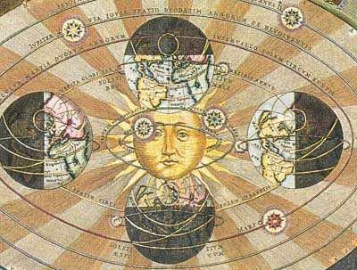

  
[Intangible Textual Heritage](../../index)  [Sky Lore](../index.md) 

------------------------------------------------------------------------

[Buy this Book at
Amazon.com](https://www.amazon.com/exec/obidos/ASIN/0801803470/internetsacredte.md)

------------------------------------------------------------------------

<table width="75%">
<colgroup>
<col style="width: 50%" />
<col style="width: 50%" />
</colgroup>
<tbody>
<tr class="odd">
<td width="50%" data-valign="TOP"> 
print from Harmonia Macrocosmica, A. Cellarius (detail) [1660] (Public Domain Image)</td>
<td width="50%" data-valign="CENTER"><h4 id="from-the-closed-world-to-the-infinite-universe" data-align="CENTER">From the Closed World to the Infinite Universe</h4>
<h5 id="by-alexandre-koyré" data-align="CENTER">by Alexandre Koyré</h5>
<h4 id="section" data-align="CENTER">[1957]</h4></td>
</tr>
</tbody>
</table>

------------------------------------------------------------------------

[Contents](#contents)    [Start Reading](cwiu00.md)    [Page
Index](pageidx)    [Text \[Zipped\]](cwiutxt.zip.md)

------------------------------------------------------------------------

|                                                                                                                           |
|---------------------------------------------------------------------------------------------------------------------------|
|  |

The infinite Universe of the New Cosmology, infinite
in Duration as well as in Extension, in which eternal matter in
accordance with eternal and necessary laws moves endlessly and aimlessly
in eternal space, inherited all the ontological attributes of Divinity.
Yet only those--all the others the departed God took away with Him.--[p.
276](cwiu15.htm#page_276.md).

Space is the place...--[p.
257](cwiu14.htm#page_257.md).

This is a study of the evolution of cosmology from antiquity to mid-20th
century. Up to the renaissance the world was thought to be bounded by a
distant but finite sphere, the empyrean heaven, beyond which must be the
realm of the divine. As science started to discover the true nature of
the stars, the planets, and the heavens, natural philosophers came up
with new models of the universe. In the process they had to try to
explain a number of very obvious everyday phenomena like gravity, force,
and mass, and some not so intuitive, such as infinity and relative
motion.

That the universe is immense is no longer controversial. The question of
whether it is infinite depends on whether space has zero, negative or
positive curvature, and that is still being tested. Now scientists are
wondering whether there may be an *infinity of universes*. This is a
great book if you are interested in the history of science, astronomy,
or the 'big questions' of cosmology or ontology.

------------------------------------------------------------------------

 [Title Page and Front Matter](cwiu00.md)  
[Preface](cwiu01.md)  
[Contents](cwiu02.md)  
[Introduction](cwiu03.md)  
[I. The Sky and the Heavens](cwiu04.md)  
[II. The New Astronomy and the New Metaphysics](cwiu05.md)  
[III. The New Astronomy Against the New Metaphysics](cwiu06.md)  
[IV. Things Never Seen Before and Thoughts Never Thought](cwiu07.md)  
[V. Indefinite Extension or Infinite Space](cwiu08.md)  
[VI. God and Space, Spirit and Matter](cwiu09.md)  
[VII. Absolute Space, Absolute Time and Their Relations to
God](cwiu10.md)  
[VIII. The Divinization of Space](cwiu11.md)  
[IX. God and the World: Space, Matter, Ether and Spirit](cwiu12.md)  
[X. Absolute Space and Absolute Time: God's Frame of Action](cwiu13.md)  
[XI. The Work-Day God and the God of the Sabbath](cwiu14.md)  
[XII. Conclusion: The Divine Artifex and the Dieu Fainéant](cwiu15.md)  
[Notes](cwiu16.md)  
[Index](cwiu17.md)  
