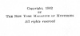

  
[Intangible Textual Heritage](../../index)  [Astrology](../index) 
[Index](index)  [Next](hba01) 

------------------------------------------------------------------------

[Buy this Book at
Amazon.com](https://www.amazon.com/exec/obidos/ASIN/0766187152/internetsacredte)

------------------------------------------------------------------------

  
*The Hindu Book of Astrology*, by Bhakti Seva, \[1902\], at Intangible
Textual Heritage

------------------------------------------------------------------------

#### THE

# HINDU BOOK

###### ——OF——

## ASTROLOGY

 

|                                                                                                                            |
|----------------------------------------------------------------------------------------------------------------------------|
| OR YOGIC KNOWLEDGE OF THE STARS AND PLANETARY FORCES AND HOW TO CONTROL THEM TO OUR ADVANTAGE … |

 

 

###### BY

##### BHAKTI SEVA (The Blissful Prophet)

 

#### PUBLISHED BY

#### THE NEW YORK MAGAZINE OF MYSTERIES

#### 22 North William Street, New York City

#### \[1902\]

Scanned, proofed and formatted by John Bruno Hare at Intangible Textual
Heritage, March 2008. This text is in the public domain in the US
because it was published prior to 1923

  [  
Click to enlarge](img/cover.jpg)  
Front Cover and Spine  

  [  
Click to enlarge](img/title.jpg)  
Title Page  

 
[  
Click to enlarge](img/verso.jpg)  
Verso  

------------------------------------------------------------------------

[Next: Chart](hba01)
