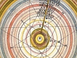

  
[Intangible Textual Heritage](../../index)  [Astrology](../index) 
[Index](index)  [Previous](hba02)  [Next](hba04) 

------------------------------------------------------------------------

[Buy this Book at
Amazon.com](https://www.amazon.com/exec/obidos/ASIN/0766187152/internetsacredte)

------------------------------------------------------------------------

  
*The Hindu Book of Astrology*, by Bhakti Seva, \[1902\], at Intangible
Textual Heritage

------------------------------------------------------------------------

p. 7

# THE HINDU BOOK

###### OF

## ASTROLOGY

For thousands of years the Hindu Astrologers have by their knowledge of
the solar system been enabled to formulate a system of Astrology which
enables them to speak with scientific authority and certainty with
respect to the planetary influences upon mankind.

Each person is born in or under one of the twelve signs of the Zodiac
and is thus influenced more or less throughout life by the planetary
conditions at time of birth.

In this work I propose to state the natural tendencies of each person
and in a certain way indicate what they should do and what they should
not do to make their life a success.

p. 8

By referring to your sign, which is indicated by the date and month when
you were born, you will see what your natural tendencies are, and what
it is best for you to do to attract and use unseen forces and powers
which are your birthright, and which will aid you to make your future
bright.

Each and every person is naturally endowed with peculiar and great
powers which make for good, and also are born with tendencies which must
be corrected in order that the higher and good powers and forces may be
able to work to advantage. No matter how bad your lot may seem to you,
and how difficult it is for you to get along in the world, you can
readily change all darkness to the brightest sunshine if you only go
about it in the right spirit.

The first step to take is to fix in your mind a strong desire for what
you wish, and persistently and patiently hold this desire until you get
it fulfilled. In India, men, through the advice of eminent astrologers,
will have an aspiration to accomplish a certain thing, and will
persistently hold and believe they will be successful in attaining what
they desire until they get their aspiration satisfied.

There are three things absolutely essential to happiness and which will
always bring success; viz., hope, patience and determination—persistent

p. 9

determination to reach success. When we learn to exercise our mind and
will on hope, patience and determination, we find a wide door open to
permanent health, wealth, honor and happiness. One who grumbles and
complains and whines and murmurs because others are successful will
never have fair Fortune's smile; the unseen powers cannot and will not
help any soul who whines, complains and murmurs in a world that is
filled with health, wealth and happiness. The grumbler and complainer is
never loved; no one desires to help such a being. Indeed, the world leas
no use for such persons, as they are repulsive. Their natures are
poisoned with pessimism and they repel and drive from them constantly
millions of good things.

The Devas (angels) can and do help the bright and cheerful ones who are
full of hope, and aspire to great and good things; while the lazy,
indolent and whining beings are surrounded by low and degrading forces,
which keep them always from everything that is good in this world of
good things.

There is a cause for every effect. There is a reason why some men and
women are successful, and a reason why others are sick and worried and
poverty-stricken, miserable and unhappy.

No one can reach success or happiness until he

p. 10

or she first calmly, yet with grim determination, says: I Will Be What I Will to Be. My Life Must Be One of
Success and Happiness. My Mistakes and Errors Will Not Discourage Me;
But I Will Profit By Them and Make Them Serve As Stepping Stones to
Truth And Success.

It is always wise to calmly reflect upon the past; but very unwise and
exceedingly foolish and weakening to brood or worry about the missteps
we have taken. No matter what happens to you keep a cheerful and hopeful
mind and you will eventually succeed beyond all your fondest
expectations. Health, success and happiness is always abundantly
measured out by the higher and unseen powers to those who are
persistently patient, hopeful and courageous.

No matter what one of the twelve signs of the Zodiac you are born under,
you can develop into a good and successful person if you will pay strict
attention to the golden truths printed in this book. Scarcely one person
of the large and growing human family pay enough attention to questions
bearing upon individual happiness, prosperity, harmony and health. This
book should be read many times and carefully studied because it contains
vital truths respecting our well-being. It suggests

p. 11

to an open and aspiring mind the Tremendous
Power of the Will, which, if intelligently exercised, can do
wonders. Anyone, with a little mental effort, can train and develop the
will just as easy as we can train and develop the muscles by persistent
physical exercise. "The moment we fully and vitally realize who and what
we are, we then begin to build our own world even as God builds His."

As long as one thinks he is weak; that he is a poor worm of the dust;
that he has no chance; that his fate is to be whirled hither and thither
by forces over which he has no control, just that long he will be at the
mercy of such forces. But, I tell you, everyone can control these forces
and powers and can accomplish grand results the very moment he cleanses
his mind of fear and doubt about his ability to succeed. As A Man Thinks So He Will Be. Continually
think disease and you will continually be weak and sick; continually
think poverty and you will continually be poverty-stricken. These are
truths, *absolute* truths.

We must strenuously strive to be Sound, Helpful
and Sensible; we must be strong, self-reliant, self-supporting
and not dependent. Servile dependence in money matters is no longer
deemed honorable. Poverty cannot bring happiness. To

p. 12

abolish poverty we must work with faith and hope, and banish once and
for all time any and all fears of failure,—worry about the past, or
apprehension about the future. We must live intensely in the present,
let go the past, and the future will take care of itself. We Are All Masters of Our Own Fate. Fools Believe in
Luck and Chance.

Each one occupies a good place in the Universal Zodiac, and all our
sufferings are due entirely to a lack of knowledge and wisdom. Now, my
sole aim in writing this book, is to wake people up out of the delusions
in which they live. I tell you all, you are greater beings than you
imagine you are; that your dormant or latent powers and forces are great
and wonderful; that YOU and YOU alone limit yourself and suffer because
you will not rouse yourself to the grand truths which wise and good men
have taught for thousands of years, namely, that you are all the
children of ONE great loving Father, who is ever trying to point you the
way to Eternal happiness through the Yogis,
Adepts and Masters who are the mediums through whom God the
Blessed Father works to help His children. There is a good time coming
for all of us, and we can hasten that time by a little thought.

Blessed be all the *Yogis*, *Sankaras*, *Vidyaranya*,

p. 13

and *King Sudhanva*, and blessed be all the readers

of my books, and may joy, peace, health, prosperity and happiness come
to all beings on this planet.

Bhakti Seva, Mystic No. 10,           
22 North William Street,        
New York City.

------------------------------------------------------------------------

[Next: Capricorn](hba04)
