  
[Intangible Textual Heritage](../../index)  [Sky Lore](../index) 
[Index](index)  [Previous](how04)  [Next](how06) 

------------------------------------------------------------------------

[Buy this Book at
Amazon.com](https://www.amazon.com/exec/obidos/ASIN/0762420189/internetsacredte)

------------------------------------------------------------------------

*Harmonies of the World*, by Johannes Kepler, tr. Charles Glenn Wallis
\[1939\], at Intangible Textual Heritage

------------------------------------------------------------------------

### 4. IN WHAT THINGS HAVING TO DO WITH THE PLANETARY MOVEMENTS HAVE THE HARMONIC CONSONANCES BEEN EXPRESSED BY THE CREATOR, AND IN WHAT WAY?

Accordingly, if the image of the retrogradation and stations is taken
away and the proper movements of the planets in their real eccentric
orbits are winnowed out, the following distinct things still remain in
the planets: 1) The distances from the sun. 2) The periodic times. 3)
The diurnal eccentric arcs. 4) The diurnal delays in those arcs. 5) The
angles at the sun, and the diurnal arcs apparent to those as it were
gazing from the sun. And again, all of these things, with the exception
of the periodic times, are variable in the total circuit, most variable
at the mean longitudes, but least at the extremes, when, turning away
from one extreme longitude, they begin to return to the opposite. Hence
when the planet is lowest and nearest to the sun and thereby delays the
least in one degree of its eccentric, and conversely in one day
traverses the greatest diurnal arc of its eccentric and appears fastest
from the sun: then its movement remains for some time in this strength
without [perceptible](errata.htm#2) variation, until, after passing the
perihelion, the planet gradually begins to depart farther from the sun
in a straight line; at that same time it delays longer in the degrees of
its eccentric circle; or, if you consider the movement of one day, on
the following day it goes forward less and appears even more slow from
the sun until it has drawn close to the highest apsis and made its
distance from the sun very great: for then longest of all does it delay
in one degree of its eccentric; or on the contrary in one day it
traverses its least arc and makes a much smaller apparent movement and
the least of its total circuit.

p. 1024

Finally, all these things may be considered either as they exist in any
one planet at different times or as they exist in different planets:
whence, by the assumption of an infinite amount of time, all the affects
of the circuit of one planet can concur in the same moment of time with
all the affects of the circuit of another planet and be compared, and
then the total eccentrics, as compared with one another, have the same
ratio as their semidiameters or mean intervals; but the arcs of two
eccentrics, which are similar or designated by the same number \[of
degrees\], nevertheless have their true lengths unequal in the ratio of
their eccentrics. For example, one degree in the sphere of Saturn is
approximately twice as long as one degree in the sphere of Jupiter. And
conversely, the diurnal arcs of the eccentrics, as expressed in
astronomical terms, do not exhibit the ratio of the true journeys which
the globes complete in one day \[283\] through the ether, because the
single units in the wider circle of the upper planet denote a quarter
part of the journey, but in the narrower circle of the lower planet a
smaller part.

Therefore let us take the second of the things which we have posited,
namely, the periodic times of the planets, which comprehend the sums
made up of all the delays—long, middling, short—in all the degrees of
the total circuit. And we found that from antiquity down to us, the
planets complete their periodic returns around the sun, as follows in
the table:

[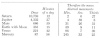  
Click to enlarge](img/102400.jpg)

Accordingly, in these periodic times there are no harmonic ratios, as is
easily apparent, if the greater periods are continuously halved, and the
smaller are continuously doubled, so that, by neglecting the intervals
of an octave, we can investigate the intervals which exist within one
octave.

[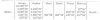  
Click to enlarge](img/102401.jpg)

All the last numbers, as you see, are counter to harmonic ratios and
seem, as it were, irrational. For let 687, the number of days of Mars,
receive as its measure 120, which is the number of the division of the
chord: according to this measure Saturn will have 117 for one sixteenth
of its period, Jupiter less than 95 for one eighth of its period, the
earth less than 64, Venus more than 78 for twice its period, Mercury
more than 61 for four times its period. These numbers do not

p. 1025

make any harmonic ratio with 120, but their neighbouring numbers—60, 75,
80, and 96—do. And so, whereof Saturn has 120, Jupiter has approximately
97, the Earth more than 65, Venus more than 80, and Mercury less than
63. And whereof Jupiter has 120, the Earth has less than 81, Venus less
than 100, Mercury less than 78. Likewise, whereof Venus has 120, the
Earth has less than 98, Mercury more than 94. Finally, whereof the Earth
has 120, Mercury has less than 116. But if the free choice of ratios had
been effective here, consonances which are altogether perfect but not
augmented or diminished would have been taken. Accordingly we find that
God the Creator did not wish to introduce harmonic ratios between the
sums of the delays added together to form the periodic times.

\[284\] And although it is a very probable conjecture (as relying on
geometrical demonstrations and the doctrine concerning the causes of the
planetary movements given in the *Commentaries on Mars*) that the bulks
of the planetary bodies are in the ratio of the periodic times, so that
the globe of Saturn is about thirty times greater than the globe of the
Earth, Jupiter twelve times, Mars less than two, the Earth one and a
half times greater than the globe of Venus and four times greater than
the globe of Mercury: not therefore will even these ratios of bodies be
harmonic.

But since God has established nothing without geometrical beauty, which
was not bound by some other prior law of necessity, we easily infer that
the periodic times have got their due lengths, and thereby the mobile
bodies too have got their bulks, from something which is prior in the
archetype, in order to express which thing these bulks and periods have
been fashioned to this measure, as they seem disproportionate. But I
have said that the periods are added up from the longest, the middling,
and the slowest delays: accordingly geometrical fitnesses must be found
either in these delays or in anything which may be prior to them in the
mind of the Artisan. But the ratios of the delays are bound up with the
ratios of the diurnal arcs, because the arcs have the inverse ratio of
the delays. Again, we have said that the ratios of the delays and
intervals of any one planet are the same. Then, as regards the single
planets, there will be one and the same consideration of the following
three: the arcs, the delays in equal arcs, and the distance of the arcs
from the sun or the intervals. And because all these things are variable
in the planets, there can be no doubt but that, if these things were
allotted any geometrical beauty, then, by the sure design of the highest
Artisan, they would have been received that at their extremes, at the
aphelial and perihelial intervals, not at the mean intervals lying in
between. For, given the ratios of the extreme intervals, there is no
need of a plan to fit the intermediate ratios to a definite number. For
they follow of themselves, by the necessity of planetary movement, from
one extreme through all the intermediates to the other extreme.

Therefore the intervals are as follows, according to the very accurate
observations of Tycho Brahe, by the method given in the *Commentaries on
Mars* and investigated in very persevering study for seventeen years.

p. 1026

Intervals Compared with Harmonic Ratios [1](#fn_2)

[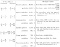  
Click to enlarge](img/102600.jpg)

\[285\] Therefore the extreme intervals of no one planet come near
consonances except those of Mars and Mercury.

But if you compare the extreme intervals of different planets with one
another, some harmonic light begins to shine. For the extreme diverging
intervals of Saturn and Jupiter make slightly more than the octave; and
the converging,

p. 1027

a mean between the major and minor sixths. So the diverging extremes of
Jupiter and Mars embrace approximately the double octave; and the
converging, approximately the fifth and the octave. But the diverging
extremes of the Earth and Mars embrace somewhat more than the major
sixth; the converging, an augmented fourth. In the next couple, the
Earth and Venus, there is again the same augmented fourth between the
converging extremes; but we lack any harmonic ratio between the
diverging extremes: for it is less than the semi-octave (so to speak)
*i.e.*, less than the square root of the ratio 2 : 1. Finally, between
the diverging extremes of Venus and Mercury there is a ratio slightly

p. 1028

less than the octave compounded with the minor third; between the
converging there is a slightly augmented fifth.

Accordingly, although one interval was somewhat removed from harmonic
ratios, this success was an invitation to advance further. Now my
reasonings were as follows: First, in so far as these intervals are
lengths without movement, they are not fittingly examined for harmonic
ratios, because movement is more properly the subject of consonances, by
reason of speed and slowness. Second, inasmuch as these same intervals
are the diameters of the spheres, it is believable that the ratio of the
five regular solids applied proportionally is more dominant in them,
because the ratio of the geometrical solid bodies to the celestial
spheres (which are everywhere either encompassed by celestial matter, as
the ancients hold, or to be encompassed successively by the accumulation
of many revolutions) is the same as the ratio of the plane figures which
may be inscribed in a circle (these figures engender the consonances) to
the celestial circles of movements and the other regions wherein the
movements take place. Therefore, if we are looking for consonances, we
should look for them not in these

p. 1029

intervals in so far as they are the semidiameters of spheres but in them
in so far as they are the measures of the movements, *i.e.*, in the
movements themselves, rather. Absolutely no other than the mean
intervals can be taken as the semi-diameters of the spheres; but we are
here dealing with the extreme intervals. Accordingly, we are not dealing
with the intervals in respect to their spheres but in respect to their
movements.

Accordingly, although for these reasons I had passed on to the
comparison of the extreme movements, at first the ratios of the
movements remained the same in magnitude as those which were previously
the ratios of the intervals, only inverted. Wherefore too, certain
ratios, which are discordant and foreign to harmonies, as before, have
been found between the movements. But once again I judged that this
happened to me deservedly, because I compared with one another eccentric
arcs which are not expressed and numbered by a measure of the same
magnitude but are numbered in degrees and minutes which are of diverse
magnitude in diverse planets, nor do they from our place give the
appearance of being as great as the number of each says, except only at
the centre of the eccentric of each planet, which centre rests upon no
body; and hence it is also unbelievable that there is any sense or
natural instinct in that place in the world which is capable of
perceiving this; or, rather, it was impossible, if I was comparing the
eccentric arcs of different planets with respect to their appearance at
their centres, which are different for different planets. But if diverse
apparent magnitudes are compared with one another, they ought to be
apparent in one place in the world in such a way that that which
possesses the faculty of comparing them may be present in that place
from which they are all apparent. Accordingly, I judged that the
appearance of these eccentric arcs should be removed from the mind or
else should be formed differently. But if I removed the appearance and
applied my mind to the diurnal journeys of the planets, I saw that I had
to employ the rule which I gave in Article IX of the preceding chapter.

\[286\] Accordingly if the diurnal arcs of the eccentric are multiplied
by the mean intervals of the spheres, the following journeys are
produced:

[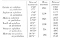  
Click to enlarge](img/102900.jpg)

Thus Saturn traverses barely one seventh of the journey of Mercury; and
hence, as Aristotle judged consonant with reason in Book II of *On the
Heavens*, the planet which is nearer the sun always traverses a greater
space than the planet which is farther away—as cannot hold in the
ancient astronomy.

p. 1030

And indeed, if we weigh the thing fairly carefully, it will appear to be
not very probable that the most wise Creator should have established
harmonies between the planetary journeys in especial. For if the ratios
of the journeys are harmonic, all the other affects which the planets
have will be necessitated and bound up with the journeys, so that there
is no room elsewhere for establishing harmonies. But whose good will it
be to have harmonies between the journeys, or who will perceive these
harmonies? For there are two things which disclose to us harmonies in
natural things: either light or sound: light apprehended through the
eyes or hidden senses proportioned to the eyes, and sound through the
ears. The mind seizes upon these forms and, whether by instinct (on
which Book IV speaks profusely) or by astronomical or harmonic
ratiocination, discerns the concordant from the discordant. Now there
are no sounds in the heavens, nor is the movement so turbulent that any
noise is made by the rubbing against the ether. Light remains. If light
has to teach these things about the planetary journeys, it will teach
either the eyes or a sensorium analogous to the eyes and situated in a
definite place; and it seems that sense-perception must be present there
in order that light of itself may immediately teach. Therefore there
will be sense-perception in the total world, namely in order that the
movements of all the planets may be presented to sense-perceptions at
the same time. For that former route—from observations through the
longest detours of geometry and arithmetic, through the ratios of the
spheres and the other things which must be learned first, down to the
journeys which have been exhibited—is too long for any natural instinct,
for the sake of moving which it seems reasonable that the harmonies have
been introduced.

Therefore with everything reduced to one view, I concluded rightly
\[287\] that the true journeys of the planets through the ether should
be dismissed, and that we should turn our eyes to the apparent diurnal
arcs, according as they are all apparent from one definite and marked
place in the world—namely, from the solar body itself, the source of
movement of all the planets; and we must see, not how far away from the
sun any one of the planets is, nor how much space it traverses in one
day (for that is something for ratiocination and astronomy, not for
instinct), but how great an angle the diurnal movement of each planet
subtends in the solar body, or how great an arc it seems to traverse in
one common circle described around the sun, such as the ecliptic, in
order that these appearances, which were conveyed to the solar body by
virtue of light, may be able to flow, together with the light, in a
straight line into creatures, which are partakers of this instinct, as
in Book IV we said the figure of the heavens flowed into the foetus by
virtue of the rays.

Therefore, if you remove from the proper planetary movement the
parallaxes of the annual orbit, which gives them the mere appearances of
stations and retrogradations, Tycho's astronomy teaches that the diurnal
movements of the planets in their orbits (which are apparent as it were
to spectator at the sun) are as shown in the table on the opposite page.

Note that the great eccentricity of Mercury makes the ratio of the
movements differ somewhat from the ratio of the square of the distances.
For if you make the square of the ratio of 100, the mean distance, to
121, the aphelial distance, be the ratio of the aphelial movement to the
mean movement of 245´32″, then an aphelial movement of 167 will be
produced; and if the square of the ratio of 100 to 79, the perihelial
distance, be the ratio of the perihelial to the same mean movement, then
the perihelial movement will become 393; and both cases are

p. 1031

[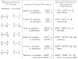  
Click to enlarge](img/103100.jpg)

greater than I have here laid down, because the mean movement at the
mean anomaly, viewed very obliquely, does not appear as great, *viz*.,
not as great as

245'32", but about 5' less. Therefore, too, lesser aphelial and
perihelial movements will be elicited. But the aphelial \[appears\]
lesser and the perihelial greater, on account of theorem 8, Euclid's
*Optics*, as I remarked in the preceding Chapter, Article VI.

Accordingly, I could mentally presume, even from the ratios of the
diurnal eccentric arcs given above, that there were harmonies and
concordant intervals between these extreme apparent movements of the
single planets, since I saw that everywhere there the square roots of
harmonic ratios were dominant, but knew that the ratio of the apparent
movements was the square of the ratio of the eccentric movements. But it
is possible by experience itself, or without any ratiocination to prove
what is affirmed, as you see \[288\] in the preceding table. The ratios
of the apparent movements of the single planets approach very close to
harmonies, in such fashion that Saturn and Jupiter embrace slightly more
than the major and minor thirds, Saturn with a ratio of excess of 53 :
54, and Jupiter with one of 54 : 55 or less, namely approximately a
sesquicomma; the Earth, slightly more (namely 137 : 138, or barely a
semicomma) than a semitone; Mars somewhat less (namely 29 : 30, which
approaches 34 : 35 or 35 : 36) than a fifth; Mercury exceeds the octave
by a minor third rather than a whole tone, *viz*., it is about 38 : 39
(which is about two commas, *viz*., 34 : 35 or 35 : 36) less than a
whole tone. Venus alone falls short of any of the concords the diesis;
for its ratio is between two and three commas, and it exceeds two thirds
of a diesis, and is about 34 : 35 or 35 : 36, a diesis diminished by a
comma.

p. 1032

The moon, too, comes into this consideration. For we find that its
hourly apogeal movement in the quadratures, *viz*., the slowest of all
its movements, to be 26´26″; its perigeal movement in the syzygies,
*viz*., the fastest of all, 35´12″, in which way the perfect fourth is
formed very precisely. For one third of 26´26″ is 8´49″, the quadruple
of which is 35´16″. And note that the consonance of the perfect fourth
is found nowhere else between the apparent movements; note also the
analogy between the fourth in consonances and the quarter in the phases.
And so the above things are found in the movements of the single
planets.

But in the extreme movements of two planets compared with one another,
the radiant sun of celestial harmonies immediately shines at first
glance, whether you compare the diverging extreme movements or the
converging. For the ratio between the diverging movements of Saturn and
Jupiter is exactly the duple or octave; that between the diverging,
slightly more than triple or the octave and the fifth. For one third of
5´30″ is 1´50″, although Saturn has 1´46″ instead of that. Accordingly,
the planetary movements will differ from a consonance by a diesis more
or less, *viz*., 26 : 27 or 27 : 28; and with less than one second
acceding at Saturn's aphelion, the excess will be 34 : 35, as great as
the ratio of the extreme movements of Venus. The diverging and
converging movements of Jupiter and Mars are under the sway of the
triple octave and the double octave and a third, but not perfectly. For
one eighth of 38´1″ is 4´45″, although Jupiter has 4´30″; and between
these numbers there is still a difference of 18 : 19, which is a mean
between the semitone of 15 : 16 and the diesis of 24 : 25, namely,
approximately a perfect lemma of 128 : 135. [1](#fn_3) Thus one fifth of 26´14″ is 5´15″, although
Jupiter has 5´30″; accordingly in this case the quintuple ratio is
diminished in the ratio of 21 : 22, the augment in the case of the other
ratio, *viz*., approximately a diesis of 24 : 25.

The consonance 5 : 24 comes nearer, which compounds a minor instead of a
major third with the double octave. For one fifth of 5´30″ is 1´6″,
which if multiplied by 24 makes 26´24″, does not differ by more than a
semicomma. Mars and the Earth have been allotted the least ratio,
exactly the sesquialteral or perfect fifth: for one third of 57´3″ is
19´1″, the double of which is 38´2″, which is Mars’ very number, *viz*.,
38´11″. They have also been allotted the greater ratio of 5 : 12, the
octave and minor third, but more imperfectly. For one twelfth of 61´18″
is 5´6½″, which if multiplied by 5 gives 25´33″, although instead of
that Mars has 26´14″. Accordingly, there is a deficiency of a diminished
diesis approximately, *viz*., 35 : 36. But the Earth and Venus together
have been allotted 3 : 5 as their greatest consonance and 5 : 8 as their
least, the major and minor sixths, but again not perfectly. For one
fifth of 97´37″, which if multiplied by 3 gives 58´33″, which is greater
than the movement of the Earth in the ratio 34 : 35, which is
approximately 35 : 36: by so much do the planetary ratios differ from
the harmonic. Thus one eighth of 94´50″ is 11´51″ +, five times which is
59´16″, which is approximately equal to the mean movement of the Earth.
Wherefore here the planetary ratio is less than the harmonic \[289\] in
the ratio of 29 : 30 or 30 : 31, which is again approximately 35 : 36,
the diminished diesis; and thereby this least ratio of these planets
approaches the consonance of the perfect fifth. For one third of 94´50″
is 31´37″, the double of which is 63´14″, of which the 61´18″ of the
perihelial movement of the Earth falls short in the ratio

p. 1033

of 31 : 32, so that the planetary ratio is exactly a mean between the
neighbouring harmonic ratios. Finally, Venus and Mercury have been
allotted the double octave as their greatest ratio and the major sixth
as their least, but not absolute-perfectly. For one fourth of 384´ is
96´0″, although Venus has 94´50″. Therefore the quadruple adds
approximately one comma. Thus one fifth of 164´ is 32´48″, which if
multiplied by 3 gives 98´24″, although Venus has 97´37″. Therefore the
planetary ratio is diminished by about [two](errata.htm#3) thirds of a
comma, *i.e.*, 126 : 127.

Accordingly the above consonances have been ascribed to the planets; nor
is there any ratio from among the principal comparisons (*viz*., of the
converging and diverging extreme movements) which does not approach so
nearly to some consonance that, if strings were tuned in that ratio, the
ears would not easily discern their imperfection--with the exception of
that one excess between Jupiter and Mars.

Moreover, it follows that we shall not stray far away from consonances
if we compare the movements of the same field. For if Saturn's 4 : 5
comp. 53 : 54 are compounded with the intermediate 1 : 2, the product is
2 : 5 comp. 53 : 54, which exists between the aphelial movements of
Saturn and Jupiter. Compound with that Jupiter's 5 : 6 comp. 54 : 55,
and the product is 5 : 12 comp 54 : 55, which exist between the
perihelial movements of Saturn and Jupiter. Thus compound Jupiter's 5 :
6 comp. 54 : 55 with the intermediate ensuing ratio of 5 : 24 comp. 158
: 157, the product will be 1 : 6 comp. 36 : 35 between the aphelial
movements. Compound the same 5 : 24 comp. 158 : 157 with Mars’ 2 : 3
comp. 30 : 29, and the product will be 5 : 36 comp. 25 : 24
approximately, *i.e.*, 125 : 864 or about 1 : 7, between the perihelial
movements. This ratio is still alone discordant. With 2 : 3 the third
ratio among the intermediates, compound Mars’ 2 : 3 less 29 : 30; the
result will be 4 : 9 comp. 30:29, *i.e.*, 40 : 87, another discord
between the aphelial movements. If instead of Mars’ you compound the
Earth's 15 : 16 comp. 137 : 138, you will make 5 : 8 comp. 137 : 138
between the perihelial movements. And if with the fourth of the
intermediates, 5 : 8 comp. 31 : 30, or 2 : 3 comp. 31 : 32, you compound
the Earth's 15 : 16 comp. 137 : 138, the product will be approximately 3
: 5 between the aphelial movements of the Earth and Venus. For one fifth
of 94´50″ is 18´58″, the triple of which is 56´54″, although the Earth
has 57´3″. If you compound Venus’ 34 : 35 with the same ratio, the
result will be 5 : 8 between the perihelial movements. For one eighth of
97´37″ is 12´12″+ which if multiplied by 5 gives 61´1″, although the
Earth has 61´18″. Finally, if with the last of the intermediate ratios,
3 : 5 comp. 126 : 127 you compound Venus’ 34 : 35, the result is 3 : 5
comp. 24 : 25, and the interval, compounded of both, between the
aphelial movements, is dissonant. But if you compound Mercury's 5 : 12
comp. 38 : 39, the double octave or 1 : 4 will be diminished by
approximately a whole diesis, in proportion to the perihelial movements.

Accordingly, perfect consonances are found: between the converging
movements of Saturn and Jupiter, the octave; between the converging
movements of Jupiter and Mars, the octave and minor third approximately;
between the converging movements of Mars and the Earth, the fifth;
between their perihelial, the minor sixth; between the extreme
converging movements of Venus and Mercury, the major sixth; between the
diverging or even between the perihelial, the double octave: whence
without any loss to an astronomy which has been built, most subtly of
all, upon Brahe's observations, it seems that the residual very slight

p. 1034

discrepancy can be discounted, especially in the movements of Venus and
Mercury.

But you will note that where there is no perfect major consonance, as
between Jupiter and Mars, there alone have I found the placing of the
solid figure to be approximately perfect, since the perihelial distance
of Jupiter is approximately three times the aphelial distance of Mars,
in such fashion that this pair of planets strives after the perfect
consonance in the intervals which it does not have in the movements.

\[290\] You will note, furthermore, that the major planetary ratio of
Saturn

and Jupiter exceeds the harmonic, *viz*., the triple, by approximately
the same quantity as belongs to Venus; and the common major ratio of the
converging and diverging movements of Mars and the Earth are diminished
by approximately the same. You will note thirdly that, roughly speaking,
in the upper planets the consonances are established between the
converging movements, but in the lower planets, between movements in the
same field. And note fourthly that between the aphelial movements of
Saturn and the Earth there are approximately five octaves; for one
thirty-second of 57´3″ is 1´47″, although the aphelial movement of
Saturn is 1´46″.

Furthermore, a great distinction exists between the consonances of the
single planets which have been unfolded and the consonances of the
planets in pairs. For the former cannot exist at the same moment of
time, while the latter absolutely can; because the same planet, moving
at its aphelion, cannot be at the same time at the opposite perihelion
too, but of two planets one can be at its aphelion and the other at its
perihelion at the same moment of time. And so the ratio of plain-song or
monody, which we call choral music and which alone was known to the
ancients, [1](#fn_4) to polyphony—called "figured
song,"; [2](#fn_5) the invention of the latest
generations—is the same as the ratio of the consonances which the single
planets designate to the consonances of the planets taken together. And
so, further on, in Chapters 5 and 6, the single planets will be compared
to the choral music of the ancients and its properties will be exhibited
in the planetary movements. But in the following chapters, the planets
taken together and the figured modern music will be shown to do similar
things.

------------------------------------------------------------------------

### Footnotes

[1026:1](how05.htm#fr_2) GENERAL NOTE: Throughout
this text Kepler's *concinna* and *inconcinna* are translated as
"concordant" and "discordant." *Concinna* is usually used by Kepler of
all intervals whose ratios occur within the "natural system" or the just
intonation of the scale. *Inconcinna* refers to all ratios that lie
outside of this system of tuning. "Consonant" (*consonans*) and
"dissonant" (*dissonans*) refer to qualities which can be applied to
intervals within the musical system, in other words to "concords."
"Harmony" (*harmonia*) is used sometimes in the sense of "concordance"
and sometimes in the sense of "consonance."

*Genus durum* and *genus molle* are translated either as "major mode"
and "minor mode," or as "major scale" and "minor scale," or as "major
kind" and "minor kind" (of consonances). The use of modus, to refer to
the ecclesiastical modes, occurs only in Chapter 6.

As our present musical terms do not apply strictly to the music of the
sixteenth and seventeenth centuries, a brief explanation of terms here
may be useful. This material is taken from Kepler's *Harmonies of the
World*, Book III.

An octave system in the minor scale (*Systema octavae in cantu molli*)

[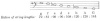  
Click to enlarge](img/102601.jpg)

p. 1027

In the major scale (*In cantu duro*)

[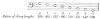  
Click to enlarge](img/102700.jpg)

As in all music, these scales can be repeated at one or more octaves
above. The ratios would then all be halved, *i.e.*,

[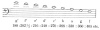  
Click to enlarge](img/102701.jpg)

Various intervals which Kepler considers are:

[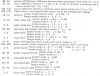  
Click to enlarge](img/102702.jpg)

p. 1028

[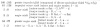  
Click to enlarge](img/102800.jpg)

All these are simple intervals. When one or more octaves are added to
any simple intervals the resultant interval is a "compound" interval.

1 : 3 equals ½ × ⅔—an octave and a perfect fifth

3 : 32 equals (½)3 × ¾—three octaves and a perfect fourth

1 : 20 equals (½)4 × (16/20)—four octaves and a major third

Concords: All intervals from diesis downward on above list.

Consonances: Minor and major thirds and sixths, perfect fourth, fifth,
and octave.

"Adulterine" consonances: sub-minor third, ditone, lesser imperfect
fourth and fifth, greater imperfect fourth and fifth, imperfect minor
sixth, greater major sixth.

Dissonances: All other intervals.

Throughout this work Kepler, after the fashion of the theorists of his
time, uses the ratios of string lengths rather than the ratios of
vibrations as is usually done today. String lengths are, of course,
inversely proportionate to the vibrations. That is, string lengths 4 : 5
are expressed in vibrations as 5 :4. This accounts for the descending
order of the scale, which follows the increasing numerical order. It is
an interesting fact that Kepler's minor and major scales are inversions
of each other and hence, when expressed in ratios of vibrations, are in
the opposite order from those in ratios of string lengths:

[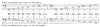  
Click to enlarge](img/102801.jpg)

An arbitrary pitch G is chosen to situate these ratios. This g or
"gamma" was usually the lowest tone of the sixteenth-century musical
gamut.

ELLIOTT CARTER, JR.

[1032:1](how05.htm#fr_3) *cf*. Footnote to
*Intervals Compared with Harmonic Ratios*, p. 1026.

[1034:1](how05.htm#fr_4) The choral music of the
Greeks was monolinear, everyone singing the same melody together.—E. C.,
Jr.

[1034:2](how05.htm#fr_5) In plain-song all the
time values of the notes were approximately equal, while in "figured
song" time values of different lengths were indicated by the notes,
which gave composers an opportunity both to regulate the way different
contrapuntal parts joined together and to produce many expressive
effects. Practically all melodies since this time are in "figured song"
style.—E. C., Jr.

------------------------------------------------------------------------

[Next: 5. In The Ratios of the Planetary Movements Which Are
Apparent...](how06)
