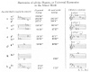
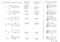
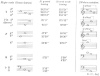
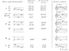
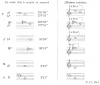
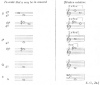

  
[Intangible Textual Heritage](../../index)  [Sky Lore](../index.md) 
[Index](index)  [Previous](how07)  [Next](how09.md) 

------------------------------------------------------------------------

[Buy this Book at
Amazon.com](https://www.amazon.com/exec/obidos/ASIN/0762420189/internetsacredte.md)

------------------------------------------------------------------------

*Harmonies of the World*, by Johannes Kepler, tr. Charles Glenn Wallis
\[1939\], at Intangible Textual Heritage

------------------------------------------------------------------------

### 7. THE UNIVERSAL CONSONANCES OF ALL SIX PLANETS, LIKE COMMON FOUR-PART COUNTERPOINT, CAN EXIST

\[295\] But now, Urania, there is need for louder sound while I climb
along the harmonic scale of the celestial movements to higher things
where the true archetype of the fabric of the world is kept hidden.
Follow after, ye modern musicians, and judge the thing according to your
arts, which were unknown to antiquity. Nature, which is never not lavish
of herself, after a lying-in of two thousand years, has finally brought
you forth in these last generations, the first true images of the
universe. By means of your concords of various voices, and through your
ears, she has whispered to the human mind, the favorite daughter of God
the Creator, how she exists in the innermost bosom.

(Shall I have committed a crime if I ask the single composers of this
generation for some artistic motet instead of this epigraph? The Royal
Psalter and the other Holy Books can supply a text suited for this. But
alas for you! No more than six are in concord in the heavens. For the
moon sings here monody separately, like a dog sitting on the Earth.
Compose the melody; I, in order that the book may progress, promise that
I will watch carefully over the six parts. To him who more properly
expresses the celestial music described in this work, Clio will give a
garland, and Urania will betroth Venus his bride.)

It has been unfolded above what harmonic ratios two neighbouring planets
would embrace in their extreme movements. But it happens very rarely
that two, especially the slowest, arrive at their extreme intervals at
the same time; For example, the apsides of Saturn and Jupiter are about
81° apart. Accordingly,

p. 1041

while this distance between them measures out the whole zodiac by
definite twenty-year leaps [1](#fn_10.md), eight
hundred years pass by, and nonetheless the leap which concludes the
eighth century, does not carry precisely to the very apsides; and if it
digresses much further, another eight hundred years must be awaited,
that a more fortunate leap than that one may be sought; and the whole
route must be repeated as many times as the measure of digression is
contained in the length of one leap. Moreover, the other single pairs of
planets have periods like that, although not so long. But meanwhile
there occur also other consonances of two planets, between movements
whereof not both are extremes but one or both are intermediate; and
those consonances exist as it were in different tunings
\[*tensionibus*\]. For, because Saturn tends from *G* to *b*, and
slightly further, and Jupiter from *b* to *d* and further; therefore
between Jupiter and Saturn there can exist the following consonances,
over and above the octave: the major and minor third and the perfect
fourth, either one of the thirds through the tuning which maintains the
amplitude of the remaining one, but the perfect fourth through the
amplitude of a major whole tone. For there will be a perfect fourth not
merely from *G* of Saturn to *cc* of Jupiter but also from *A* of Saturn
to *dd* of Jupiter and through all the intermediates between the *G* and
*A* of Saturn and the *cc* and *dd* of Jupiter. But the octave and the
perfect fifth exist solely at the points of the apsides. But Mars, which
got a greater interval as its own, received it in order that it should
also make an octave with the upper planets through some amplitude of
tuning. Mercury received an interval great enough for it to set up
almost all the consonances with all the planets within one of its
periods, which is not longer than the space of three months. On the
other hand, the Earth, and Venus much more so, on account of the
smallness of their intervals, limit the consonances, which they form not
merely with the others but with one another in especial, to visible
fewness. But if three planets are to concord in one harmony, many
periodic returns are to be awaited; nevertheless there are many
consonances, so that they may so much the more easily take place, while
each nearest consonance follows after its neighbour, and very often
threefold consonances are seen to exist between Mars, the Earth, and
Mercury. But the consonances of four planets now begin to be scattered
throughout centuries, and those of five planets throughout thousands of
years.

But that all six should be in concord \[296\] has been fenced about by
the longest intervals of time; and I do not know whether it is
absolutely impossible for this to occur twice by precise evolving or
whether that points to a certain beginning of time, from which every age
of the world has flowed.

But if only one sextuple harmony can occur, or only one notable one
among many, indubitably that could be taken as a sign of the Creation.
Therefore we must ask, in exactly how many forms are the movements of
all six planets reduced to one common harmony? The method of inquiry is
as follows: let us begin with the Earth and Venus, because these two
planets do not make more than two consonances and (wherein the cause of
this thing is comprehended) by means of very short intensifications of
the movements.

Therefore let us set up two, as it were, skeletal outlines of harmonies,
each skeletal outline determined by the two extreme numbers wherewith
the limits

p. 1042

of the tunings are designated, and let us search out what fits in with
them from the variety of movements granted to each planet.

Harmonies of all the Planets, or Universal Harmonies in the Major Mode

[  
Click to enlarge](img/104200.jpg.md)

p. 1043

Saturn joins in this universal consonance with its aphelial movement,
the Earth with its aphelial, Venus approximately with its aphelial; at
highest tuning, Venus joins with its perihelial; at mean tuning, Saturn
joins with its perihelial, Jupiter with its aphelial, Mercury with its
perihelial. So Saturn can join in with two movements, Mars with two,
Mercury with four. But with the rest remaining, the perihelial movement
of Saturn and the aphelial of Jupiter are not allowed. But in their
place, Mars joins in with perihelial movement.

The remaining planets join in with single movements, Mars alone with
two, and Mercury with four.

\[297\] Accordingly, the second skeletal outline will be that wherein
the other possible consonance, 5 : 8, exists between the Earth and
Venus. Here one eighth of the 94´50″ of the diurnal aphelial movement of
Venus or 11´51″ +, if multiplied by 5, equals the 59´16″ of the movement
of the Earth; and similar parts of the 97´37″ of the perihelial movement
of Venus are equal to the 61´1″ of the movement of the Earth.
Accordingly, the other planets are in concord in the following diurnal
movements:

[  
Click to enlarge](img/104300.jpg.md)

Here again, in the mean tuning Saturn joins in with its perihelial
movement, Jupiter with its aphelial, Mercury with its perihelial. But at
highest tuning approximately the perihelial movement of the Earth joins
in.

p. 1044

[  
Click to enlarge](img/104400.jpg.md)

[And](errata.htm#5.md) here, with the aphelial movement of Jupiter and the
perihelial movement of Saturn removed, the aphelial movement of Mercury
is practically admitted besides the perihelial. The rest remain.

Therefore astronomical experience bears witness that the universal
consonances of all the movements can take place, and in the two modes
\[*generum*\], the major and minor, and in both genera of form, or (if I
may say so) in respect to two pitches and in any one of the four cases,
with a certain latitude of tuning and also with a certain variety in the
particular consonances of Saturn, Mars, and Mercury, of each with the
rest; and that is not afforded by the intermediate movements alone, but
by all the extreme movements too, except the aphelial movement of Mars
and the perihelial movement of Jupiter; because since the former
occupies *f* sharp; and the latter, *d* Venus, which occupies
perpetually the intermediate *e* flat or *e*, does not allow those
neighbouring dissonances in the universal consonance, as she would do if
she had space to go beyond *e* or *e* flat. This difficulty is caused by
the wedding of the Earth and Venus, or the male and the female. These
two planets divide the kinds \[*genera*\] of consonances into the major
and masculine and the minor and feminine, according as the one spouse
has gratified the other—namely, either the Earth is in its aphelion, as
if preserving \[298\] its marital dignity and performing works worthy of
a man, with

p. 1045

\[paragraph continues\] Venus removed and
pushed away to her perihelion as to her distaff; or else the Earth has
kindly allowed her to ascend into aphelion or the Earth itself has
descended into its perihelion towards Venus and as it were, into her
embrace, for the sake of pleasure, and has laid aside for a while its
shield and arms and all the works befitting a man; for at that time the
consonance is minor.

But if we command this contradictory Venus to keep quiet, *i.e.*, if we
consider what the consonances not of all but merely of the five
remaining planets can be, excluding the movement of Venus, the Earth
still wanders around its *g* string and does not ascend a semitone above
it. Accordingly *b*♭, *b*, *c*, *d*, *e*<u>♭</u>, and e can be in
concord with *g*, whereupon, as you see, Jupiter, marking the *d* string
with its perihelial movement, is brought in. Accordingly, the difficulty
about Mars’ aphelial movement remains. For the aphelial movement of the
Earth, which occupies *g*, does not allow it on *f* sharp; but the
perihelial movement, as was said above in Chapter V, is in discord with
the aphelial movement of Mars by about half a diesis.

[  
Click to enlarge](img/104500.jpg.md)

Here at the most grave tuning, Saturn and the Earth join in with their
aphelial movements; at the mean tuning, Saturn with its perihelial and
Jupiter with its aphelial; at the most acute, Jupiter with its
perihelial.

p. 1046

[  
Click to enlarge](img/104600.jpg.md)

Here the aphelial movement of Jupiter is not allowed, but at the most
acute tuning Saturn practically joins in with its perihelial movement.

But there can also exist the following harmony of the four planets,
Saturn, Jupiter, Mars, and Mercury, wherein too the aphelial movement of
Mars is present, but it is without latitude of tuning.

p. 1047

[  
Click to enlarge](img/104700.jpg.md)

[  
Click to enlarge](img/104701.jpg.md)

p. 1048

Accordingly the movements of the heavens are nothing except a certain
everlasting polyphony (intelligible, not audible) with dissonant
tunings, like certain syncopations or cadences (wherewith men imitate
these natural dissonances), which tends towards fixed and prescribed
clauses—the single clauses having six terms (like voices)— and which
marks out and distinguishes the immensity of time with those notes.
Hence it is no longer a surprise that man, the ape of his Creator,
should finally have discovered the art of singing polyphonically \[*per
concentum*\], which was unknown to the ancients, namely in order that he
might play the everlastingness of all created time in some short part of
an hour by means of an artistic concord of many voices and that he might
to some extent taste the satisfaction of God the Workman with His own
works, in that very sweet sense of delight elicited from this music
which imitates God.

NOTE: The comparison Kepler draws between the celestial harmonies and
the polyphonic music of his time may be clarified by a simple example
for four voices from—Palestrina, *O Crux:*

 

As will be observed each of the four voices (as it would also be with
the six to which Kepler refers) moves from one consonant chord to
another while following a graceful melodic line. Sometimes bits of
scales or passing tones are added to give a voice more melodic freedom
expressiveness. For the same reason a voice may remain on the same note
while the other voices change to a new chord. When this becomes a
dissonance (called a syncopation) in the new chord it usually resolves
by moving one step downward to a tone that is consonant with the other
voices. As in this example each section or "[clause](errata.htm#6.md)" ends
with a cadence.

E. C., JR.

------------------------------------------------------------------------

### Footnotes

[1041:1](how08.htm#fr_10.md) That is to say, since
Saturn and Jupiter have one revolution with respect to one another every
twenty years, they are 81° apart once every twenty years, while the
end-positions of this 81° interval traverse the ecliptic in leaps, so to
speak, and coincide with the apsides approximately once in eight hundred
years. C. G. W.

------------------------------------------------------------------------

[Next: 8. In the Celestial Harmonies Which Planet Sings Soprano, Which
Alto, Which Tenor, and Which Bass?](how09.md)
