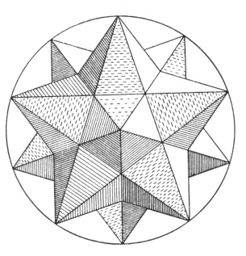

  
[Intangible Textual Heritage](../../index)  [Sky Lore](../index.md) 

------------------------------------------------------------------------

[Buy this Book at
Amazon.com](https://www.amazon.com/exec/obidos/ASIN/0762420189/internetsacredte.md)

------------------------------------------------------------------------

<table width="75%">
<colgroup>
<col style="width: 50%" />
<col style="width: 50%" />
</colgroup>
<tbody>
<tr class="odd">
<td width="50%" data-valign="TOP"></td>
<td width="50%" data-valign="CENTER"><h1 id="harmonies-of-the-world" data-align="CENTER">Harmonies of the World</h1>
<h2 id="by-johannes-kepler" data-align="CENTER">by Johannes Kepler</h2>
<h3 id="tr.-by-charles-glenn-wallis" data-align="CENTER">tr. by Charles Glenn Wallis</h3>
<h4 id="section" data-align="CENTER">[1939]</h4></td>
</tr>
</tbody>
</table>

------------------------------------------------------------------------

[Contents](#contents)    [Start Reading](how00.md)

------------------------------------------------------------------------

|                                                                                                                           |
|---------------------------------------------------------------------------------------------------------------------------|
|  |

*Nature, which is never not lavish of herself, after a lying-in of two
thousand years, has finally brought you forth in these last generations,
the first true images of the universe. By means of your concords of
various voices, and through your ears, she has whispered to the human
mind, the favorite daughter of God the Creator, how she exists in the
innermost bosom.*--\[[p. 1040](how08.md)\].

Johannes Kepler, who originally studied theology, was introduced to the
Copernican world-view while studying for his Master's degree in
Philosophy at the University of Tübingen. He wrote a paper attempting to
reconcile the Copernican system with the Bible. Although he wanted to
enter the ministry, he was offered a chair of astronomy at the Lutheran
school of Graz, which he accepted.

He became convinced that there was a relationship between the five
regular solids and the structure of the known solar system. His first
work on Astronomy, Precursor of Cosmographic Dissertations or the
Cosmographic Mystery, published in 1596, brought him to the attention of
Tycho Brahe and Galileo. Banished from his homeland by an edict against
Protestants in 1598, Kepler eventually ended up in Prague, where he
worked under Tycho. On Tycho's death, Kepler took over his post and
inherited Tycho's massive archive of observations.

Johannes Kepler published Harmonies of the World in 1619. This was the
summation of his theories about celestial correspondences, and ties
together the ratios of the planetary orbits, musical theory, and the
Platonic solids. Kepler's speculations are long discredited. However,
this work stands as a bridge between the Hermetic philosophy of the
Renaissance, which sought systems of symbolic correspondences in the
fabric of nature, and modern science. And today, we finally have heard
the music of the spheres: data from outer system probes have been
translated into acoustic form, and we can listen to strange clicks and
moans from Jupiter's magnetosphere.

Towards the end of Harmonies Kepler expressed a startling idea,--one
which Giordiano Bruno had been persecuted for, two decades before--the
plurality of inhabited worlds. He muses on the diversity of life on
Earth, and how it was inconceivable that the other planets would be
devoid of life, that God had "adorned\[ed\] the other globes too with
their fitting creatures". \[pp.
[1084](how11.htm#page_1084)-[1085](how11.htm#page_1085.md)\]

*Production Notes*: this is an excerpt from the standard English edition
of Kepler's works, which has been published in part and whole numerous
times. Due to non-renewal, this text has fallen into the public domain
in the US. The translator, Charles Glenn Wallis, is often uncredited,
but if you see an English translation of this on the market, it will
undoubtably be the Wallis translation. The particular copytext I used
was the one published in volume 16 of The Great Books of the Western
World; I have corrected minor spelling errors in the [usual
fashion](errata.md).

------------------------------------------------------------------------

 [Title Page](how00.md)  
[Proem](how01.md)  
[1. Concerning the Five Regular Solid Figures](how02.md)  
[2. On the Kinship Between the Harmonic Ratios and the Five Regular
Figures](how03.md)  
[3. A Summary of Astronomical Doctrine Necessary For Speculation Into
the Celestial Harmonies](how04.md)  
[4. In What Things Having To Do With the Planetary Movements Have the
Harmonic Consonances Been Expressed By the Creator, and In What
Way?](how05.md)  
[5. In The Ratios of the Planetary Movements Which Are
Apparent...](how06.md)  
[6. In The Extreme Planetary Movements the Musical Modes or Tones Have
Somehow Been Expressed](how07.md)  
[7. The Universal Consonances of All Six Planets, Like Common Four-Part
Counterpoint, Can Exist](how08.md)  
[8. In the Celestial Harmonies Which Planet Sings Soprano, Which Alto,
Which Tenor, and Which Bass?](how09.md)  
[9. The Genesis of the Eccentricities in the Single Planets From the
Procurement of the Consonances Between Their Movements](how10.md)  
[10. Epilogue Concerning the Sun, By Way of Conjecture](how11.md)  
