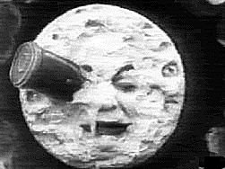

  
[Intangible Textual Heritage](../../index)  [Sky Lore](../index.md) 

------------------------------------------------------------------------

[Buy this Book on
Kindle](https://www.amazon.com/exec/obidos/ASIN/B002L16MO4/internetsacredte.md)

------------------------------------------------------------------------

<table width="75%">
<colgroup>
<col style="width: 50%" />
<col style="width: 50%" />
</colgroup>
<tbody>
<tr class="odd">
<td width="50%" data-valign="TOP"> 
still from A Journey to the Moon, by G. Melies [1902] -- public domain image</td>
<td width="50%" data-valign="CENTER"><h1 id="moon-lore" data-align="CENTER">Moon Lore</h1>
<h2 id="by-rev.-timothy-harley" data-align="CENTER">by Rev. Timothy Harley</h2>
<h4 id="section" data-align="CENTER">[1885]</h4></td>
</tr>
</tbody>
</table>

------------------------------------------------------------------------

[Contents](#contents)    [Start Reading](ml00.md)    [Page
Index](pageidx)    [Text \[Zipped\]](ml.txt.gz.md)

------------------------------------------------------------------------

|                                                                                                                           |
|---------------------------------------------------------------------------------------------------------------------------|
|  |

Written just eighty-four years before Neil Armstrong stepped on the
moon, this is a Victorian collection of moon lore: myths, folklore,
superstitions and just plain whimsy from all lands. Although
contemporary astronomers had fairly well wrapped up the question of
whether there was water and air on the moon, Harley still suspected that
the moon was inhabited. However, there was still much that was unknown
about the moon until the first probes were crash-landed on it (for
instance, whether the surface was covered with vast, deep layers of
dust). So we shouldn't feel too smug, even though we've played golf
there. The universe will continue to surprise us.

------------------------------------------------------------------------

 [Title Page](ml00.md)  
[Quotations](ml01.md)  
[Table of Contents](ml02.md)  
[Preface](ml03.md)  
[List of Illustrations](ml04.md)  

### Moon Spots

[I. Introduction](ml05.md)  
[II. The Man in the Moon](ml06.md)  
[III. The Woman in the Moon](ml07.md)  
[IV. The Hare in the Moon](ml08.md)  
[V. The Toad in the Moon](ml09.md)  
[VI. Other Moon Myths](ml10.md)  

### Moon Worship

[I. Introduction](ml11.md)  
[II. The Moon Mostly a Male Deity](ml12.md)  
[III. The Moon a World-Wide Deity](ml13.md)  
[IV. The Moon a Water-Deity](ml14.md)  

### Moon Superstitions

[I. Introduction](ml15.md)  
[II. Lunar Fancies](ml16.md)  
[III. Lunar Eclipses](ml17.md)  
[IV. Lunar Influences](ml18.md)  

### Moon Inhabitation

[Moon Inhabitation](ml19.md)  

 

[Appendix](ml20.md)  
[Notes](ml21.md)  
