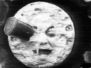

  
[Intangible Textual Heritage](../../index)  [Sky Lore](../index) 
[Index](index)  [Previous](ml03)  [Next](ml05) 

------------------------------------------------------------------------

[Buy this Book on
Kindle](https://www.amazon.com/exec/obidos/ASIN/B002L16MO4/internetsacredte)

------------------------------------------------------------------------

  
*Moon Lore*, by Timothy Harley, \[1885\], at Intangible Textual Heritage

------------------------------------------------------------------------

p. xv

# LIST OF ILLUSTRATIONS

<table data-border="0" width="779">
<colgroup>
<col style="width: 50%" />
<col style="width: 50%" />
</colgroup>
<tbody>
<tr class="odd">
<td data-valign="TOP" width="77%">
1. VOYAGING TO THE MOON 
           From Domingo Gonsales, 1638.
</td>
<td data-valign="TOP" width="23%">
<em></em><a href="ml00.htm#img_front">Frontispiece</a>.
</td>
</tr>
<tr class="even">
<td data-valign="TOP" width="77%">
2 THE MAN IN THE MOON 
           From Hone's <em>Facetiæ and Miscellanies</em>, 1821. 
                  Drawn by George Cruikshank.
</td>
<td data-valign="TOP" width="23%">
<a href="ml06.htm#img_00900">9</a>
</td>
</tr>
<tr class="odd">
<td data-valign="TOP" width="77%">
3. "THE MAN IN THE MOON DRINKS CLARET" 
           (From the Bagford Ballads, ii. 119, Brit. Mus.)
</td>
<td data-valign="TOP" width="23%">
<a href="ml06.htm#img_01200">12</a>
</td>
</tr>
<tr class="even">
<td data-valign="TOP" width="77%">
4. "WHO'LL SMOAK WITH THE MAN IN THE MOON?" 
           (Banks' Collection in Brit. Mus.)
</td>
<td data-valign="TOP" width="23%">
<a href="ml06.htm#img_01300">13</a>
</td>
</tr>
<tr class="odd">
<td data-valign="TOP" width="77%">
5. THE MAN IN THE MOON 
           From Ludwig Richter's <em>Der Familienschatz</em>, Leipzig, p. 25.
</td>
<td data-valign="TOP" width="23%">
<a href="ml06.htm#img_02800">28</a>
</td>
</tr>
<tr class="even">
<td data-valign="TOP" width="77%">
6. SEAL 
           In the <em>Archæological Journal</em> for March, 1848, p. 68.
</td>
<td data-valign="TOP" width="23%">
<a href="ml06.htm#img_02800">28</a>
</td>
</tr>
<tr class="odd">
<td data-valign="TOP" width="77%">
7. REPRESENTATION OF THE SABBATH-BREAKER IN GYFFYN CHURCH, NEAR CONWAY 
           From Baring-Gould's <em>Curious Myths</em>.
</td>
<td data-valign="TOP" width="23%">
<a href="ml06.htm#img_03200">32</a>
</td>
</tr>
<tr class="even">
<td data-valign="TOP" width="77%">
8. THE HARE IN THE MOON 
           From Collin de Plancy's <em>Dictionnaire Infernal</em>.
</td>
<td data-valign="TOP" width="23%">
<a href="ml08.htm#img_06300">63</a>
</td>
</tr>
</tbody>
</table>

 

------------------------------------------------------------------------

[Next: I. Introduction](ml05)

