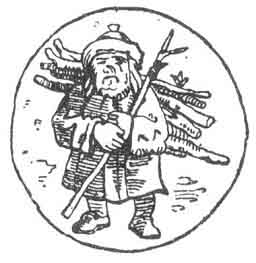
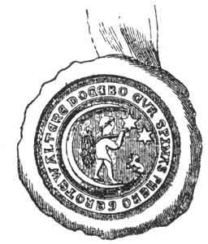

  
[Intangible Textual Heritage](../../index)  [Sky Lore](../index) 
[Index](index)  [Previous](ml05)  [Next](ml07) 

------------------------------------------------------------------------

[Buy this Book on
Kindle](https://www.amazon.com/exec/obidos/ASIN/B002L16MO4/internetsacredte)

------------------------------------------------------------------------

  
*Moon Lore*, by Timothy Harley, \[1885\], at Intangible Textual Heritage

------------------------------------------------------------------------

### II. THE MAN IN THE MOON.

We must not be misunderstood. By the man in the moon we do not mean any
public tavern, or gin-palace, displaying that singular sign. The last
inn of that name known to us in London stands in a narrow passage of
that fashionable promenade called Regent Street, close to Piccadilly.
Nor do we intend by the man in the moon the silvery individual who pays
the election expenses, so long as the elector votes his ticket. Neither
do we mean the mooney, or mad fellow who is too fond of the cup which
cheers and then inebriates; nor even one who goes mooning round the
world without a plan or purpose. No; if we are not too scientific, we
are too straightforward to be allured by any such false lights as these.
By the man in the moon we mean none other than that illustrious
personage, whose shining

p. 6

countenance may be beheld many a night, clouds and fogs permitting,
beaming good-naturedly on the dark earth, and singing, in the language
of a lyric bard,

"The moon is out to-night, love,  
  Meet me with a smile."

But some sceptic may assail us with a note of interrogation, saying, "Is
there a man in the moon?" "Why, of course, there is!" Those who have
misgivings should ask a sailor; he knows, for the punsters assure us
that he has been to *sea*. Or let them ask any *lunatic*; he should
know, for he has been so *struck* with his acquaintance, that he has
adopted the man's name. Or ask any little girl in the nursery, and she
will recite, with sweet simplicity, how

   "The man in the moon  
    Came down too soon,  
And asked the way to Norwich."

The darling may not understand why he sought that venerable city, nor
whether he ever arrived there, but she knows very well that

   "He went by the south,  
    And burnt his mouth  
With eating hot pease porridge."

But it is useless to inquire of any stupid joker, for he will idly say
that there is no such man there, because, forsooth, a certain single
woman who was sent to the moon came back again, which she would never
have

p. 7

done if a man had been there with whom she could have married and
remained, Nor should any one be misled by those blind guides who darkly
hint that it is all moonshine. There is not an Indian moonshee, nor a
citizen of the Celestial Empire, some of whose ancestors came from the
nocturnal orb, who does not know better than that. Perhaps the wisest
course is to inquire within. Have not we all frequently affirmed that we
knew no more about certain inscrutable matters than the man in the moon?
Now we would never have committed ourselves to such a comparison had we
not been sure that the said man was a veritable and creditable, though
somewhat uninstructed person. But our feelings ought not to be wrought
upon in this way. We "had rather be a dog, and bay the moon, than such a
Roman" as is not at least distantly acquainted with that brilliant
character in high life who careers so conspicuously amid the
constellations which constitute the upper ten thousand of super-mundane
society. And now some inquisitive individual may be impatient to
interrupt our eloquence with the question, "What are you going to make
of the man in the moon?" Well, we are not going to make anything of him.
For, first, he is a man; therefore incapable of improvement. Secondly,
he is in the moon, and that is out of our reach. [\*7](#fn_0) All that we can promise

[\*7](#fr_3) Besides, as old John Lilly says in
the prologue to his *Endymion* (1591), "There liveth none under the
sunne, that knows what to make of the man in the moone."

p. 8

just now is, to furnish a few particulars of the man himself; some
account of calls which he is reported to have made to his friends here
below; and also some account of visits which his friends on earth have
paid him in return.

We know something of his residence, whenever he is at home: what do we
know of the man? We have been annoyed at finding his lofty name
desecrated to base uses. If "imagination may trace the noble dust of
Alexander, till he find it stopping a bung-hole," literature traces the
man in the moon, and discovers him pressed into the meanest services.
Our readers need not be disquieted with details; though our own
equanimity has been sorely disturbed as we have seen scribblers dragging
from the skies a "name at which the world grows pale, to point a moral,
or adorn a tale." Political squibs, paltry chapbooks, puny satires, and
penny imbecilities, too numerous for mention here, with an occasional
publication of merit, have been printed and sold at the expense of the
man in the moon. For the sake of the curious we place the titles and
dates of some of these in an appendix and pass on. We have not learned
very many particulars relating to the domestic habits or personal
character of the man in the moon, consequently our smallest biographical
contributions will be thankfully received. We must not be pressed for
his photograph, at present. We certainly wish it could have been
procured; but though photography has taken some splendid views of the

p. 9

 

  [  
Click to enlarge](img/00900.jpg)  
THE MAN IN THE MOON  
*Geo. Cruikshank*; Hone's ''*Facetiæ*,'' 1821.  

"If Cæsar can hide the sun with a blanket, or put the moon in his
pocket, we will pay him tribute for light" (*Cymbeline*).

 

p. 10 p. 11

face of the moon, it has not yet produced any perfect picture of the
physiognomy of the man. It should always be borne in mind that, as
Stilpo says in the old play of *Timon*, written about 1600, "The man in
the moone is not in the moone superficially, although he bee in the
moone (as the Greekes will have it) catapodially, specificatively, and
quidditatively." [4](ml21.htm#fn_6) This
beautiful language, let us explain for the behoof of any foreign reader,
simply means that he is not always where we can get at him; and
therefore his venerable visage is missing from our celestial portrait
gallery. One fact we have found out, which we fear will ripple the pure
water placidity of some of our best friends; but the truth must be told.

"Our man in the moon drinks clarret,  
With powder-beef, turnep, and carret.  
If he doth so, why should not you  
Drink until the sky looks blew?" [5](ml21.htm#fn_7)

Another old ballad runs:

"The man in the moon drinks claret,  
  But he is a dull Jack-a-Dandy;  
Would he know a sheep's head from a carrot,  
  He should learn to drink cyder and brandy."

In a *Jest Book of the Seventeenth Century* we came across the following
story: "A company of gentlemen coming into a tavern, whose signe was the
Moone, called for a quart of sacke. The drawer told them they had none;
whereat the gentlemen wondring were told by the drawer that the man in

p. 12

the moon always drunke claret." [6](ml21.htm#fn_8) Several astronomers assert the
absence of water in the moon; if this be the case, what is the poor man
to drink? Still, it is an unsatisfactory announcement to us all; for we
are afraid that it is the claret which makes him look so red in the face
sometimes when he is full, and gets a little fogged. We have ourselves
seen

 

   
''THE MAN IN THE MOON DRINKS CLARET.''  
''Bagford Ballads,'' ii. 119.

 

him actually what sailors call "half-seas over," when we have been in
mid-Atlantic. We only hope that he imbibes nothing stronger, though it
is said that moonlight is but another name for smuggled spirits. The
lord of Cynthia must not be too hastily suspected, for, at most, the
moon fills her horn but once

p. 13

a month. Still, the earth itself being so invariably sober, its
satellite, like Cæsar's wife, should be above suspicion. We therefore
hope that our lunar hero may yet take a ribbon of sky-blue from the
milky way, and become a staunch abstainer; if only for example's sake.

Some old authors and artists have represented the

 

   
BANKS' COLLECTION OF SHOP BILLS.

 

man in the moon as an inveterate smoker, which habit surprises us, who
supposed him to be

"Above the smoke and stir of this dim spot  
Which men call Earth,"

as the magnificent Milton has it. His tobacco must be bird's-eye, as he
takes a bird's-eye view of things;

p. 14

and his pipe is presumably a meer-sham, whence his "sable clouds turn
forth their silver lining on the night." Smoking, without doubt, is a
bad practice, especially when the clay is choked or the weed is
worthless; but fuming against smokers we take to be infinitely worse.

We are better pleased to learn that the man in the moon is a poet.
Possibly some uninspired groveller, who has never climbed Parnassus, nor
drunk of the Castalian spring, may murmur that this is very likely, for
that all poetry is "moonstruck madness." Alas if such an antediluvian
barbarian be permitted to "revisit thus the glimpses of the moon, making
night hideous" as he mutters his horrid blasphemy! We, however, take a
nobler view of the matter. To us the music of the spheres is exalting as
it is exalted; and the music of earth is a "sphere-descended maid,
friend of pleasure, wisdom's aid." We are therefore disposed to hear the
following lines, which have been handed down for publication. Their
title is autobiographical, and, for that reason, they are slightly
egotistical.

"A SHREWD OLD FELLOW'S THE MAN IN THE MOON."

"From my palace of light I look down upon earth,  
When the tiny stars are twinkling round me;  
Though centuries old, I am now as bright  
As when at my birth Old Adam found me.  
Oh! the strange sights that I have seen,  
Since earth first wore her garment of green!  
King after king has been toppled down, p. 15  
And red-handed anarchy's worn the crown!  
From the world that's beneath me I crave not a boon,  
For a shrewd old fellow's the Man in the Moon.  
And I looked on 'mid the watery strife,  
When the world was deluged and all was lost  
Save one blessed vessel, preserver of life,  
Which rode on through safety, though tempest tost.  
I have seen crime clothed in ermine and gold,  
And virtue shuddering in winter's cold.  
I have seen the hypocrite blandly smile,  
While straightforward honesty starved the while.  
Oh! the strange sights that I have seen,  
Since earth first wore her garment of green!  
I have gazed on the coronet decking the brow  
Of the villain who, breathing affection's vow,  
Hath poisoned the ear of the credulous maiden,  
Then left her to pine with heart grief laden.  
Oh! oh! if this, then, be the world, say I,  
I'll keep to my home in the clear blue sky;  
Still to dwell in my planet I crave as a boon,  
For the earth ne'er will do for the Man in the Moon." [7](ml21.htm#fn_9)

This effusion is not excessively flattering to our "great globe," and
"all which it inherit"; and we surmise that the author was in a
misanthropic mood when it was written. Yet it is serviceable sometimes
to see ourselves as others see us. On the other hand, we have but little
liking for those who "hope to merit heaven by making earth a hell," in
any sense. We prefer to believe that the tide is rising though the waves
recede, and that our dark world is waxing towards the full-orbed glory
"to which the whole creation moves."

Here for the present we part company with the man in the moon as
material for amusement, that

p. 16

we may track him through the mythic maze, where, in well-nigh every
language, he has left some traces of his existence. As there is a side
of the moon which we have never seen, and according to Laplace never
shall see, there is also an aspect of the matter in hand that remains to
be traversed, if we would circumambulate its entire extent. Our subject
must now be viewed in the magic mirror of mythology. The antiquarian
Ritson shall state the question to be brought before our honourable
house of inquiry. He denominates the man in the moon "an imaginary
being, the subject of perhaps one of the most ancient, as well as one of
the most popular, superstitions of the world." [8](ml21.htm#fn_10) And as we must explore the vestiges
of antiquity, Asiatic and European, African and American, and even
Polynesian, we bespeak patient forbearance and attention. One little
particular we may partly clear up at once, though it will meet us again
in another connection. It will serve as a sidelight to our legendary
scenes. In English, French, Italian, Latin, and Greek, the moon is
feminine; but in all the Teutonic tongues the moon is masculine. Which
of the twain is its true gender? We go back to the Sanskrit for an
answer. Professor Max Müller rightly says, "It is no longer denied that
for throwing light on some of the darkest problems that have to be
solved by the student of language, nothing is so useful as a critical
study of Sanskrit." [9](ml21.htm#fn_11) Here the
word for the moon is *mâs*, which is masculine. Mark how even what
Hamlet calls "words, words, words"

p. 17

lend their weight and value to the adjustment of this great argument.
The very moon is masculine, and, like Wordsworth's child, is "father of
the man."

If a bisexous moon seem an anomaly, perhaps the suggestion of Jamieson
will account for the hermaphrodism: "The moon, it has been said, was
viewed as of the masculine gender in respect of the earth, whose husband
he was supposed to be; but as a female in relation to the sun, as being
his spouse." [10](ml21.htm#fn_12) Here, also, we
find a clue to the origin of this myth. If modern science, discovering
the moon's inferiority to the sun, call the former feminine, ancient
nescience, supposing the sun to be inferior to the moon, called the
latter masculine. The sun, incomparable in splendour, invariable in
aspect and motion, to the unaided eye immaculate in surface, too
dazzling to permit prolonged observation, and shining in the daytime,
when the mind was occupied with the duties of pastoral, agricultural, or
commercial life, was to the ancient simply an object of wonder as a
glory, and of worship as a god. The moon, on the contrary, whose
mildness of lustre enticed attention, whose phases were an embodiment of
change, whose strange spots seemed shadowy pictures of things and beings
terrestrial, whose appearance amid the darkness of night was so welcome,
and who came to men susceptible, from the influences of quiet and gloom,
of superstitious imaginings, from the very beginning grew into a
familiar spirit of kindred form with their own, and though regarded as
the subordinate and

p. 18

wife of the sun, was reverenced as the superior and husband of the
earth. With the transmission of this myth began its transmutation. From
the moon being a man, it became a man's abode: with some it was the
world whence human spirits came; with others it was the final home
whither human spirits returned. Then it grew into a penal colony, to
which egregious offenders were transported; or prison cage, in which,
behind bars of light, miserable sinners were to be exposed to all
eternity, as a warning to the excellent of the earth. One thing is
certain, namely, that, during some phases, the moon's surface strikingly
resembles a man's countenance. We usually represent the sun and the moon
with the faces of men; and in the latter case the task is not difficult.
Some would say that the moon is so drawn to reproduce some lunar deity:
it would be more correct to say that the lunar deity was created through
this human likeness. Sir Thomas Browne remarks, "The sun and moon are
usually described with human faces: whether herein there be not a pagan
imitation, and those visages at first implied Apollo and Diana, we may
make some doubt." [11](ml21.htm#fn_13) Brand, in
quoting Browne, adds, "Butler asks a shrewd question on this head, which
I do not remember to have seen solved:--

'Tell me but what's the natural cause,  
Why on a Sign no Painter draws  
The *Full Moon* ever, but the *Half*?'"  
                        (Hudibras, B. II., c. iii.) [12](ml21.htm#fn_14)

p. 19

Another factor in the formation of our moon-myth was the
anthropomorphism which sees something manlike in everything, not only in
the anthropoid apes, where we may find a resemblance more faithful than
flattering, but also in the mountains and hills, rivers and seas of
earth, and in the planets and constellations of heaven. Anthropomorphism
was but a species of personification, which also metamorphosed the
firmament into a menagerie of lions and bears, with a variety of birds,
beasts, and fishes. Dr. Wagner writes: "The sun, moon, and stars, clouds
and mists, storms and tempests, appeared to be higher powers, and took
distinct forms in the imagination of man. As the phenomena of nature
seemed to resemble animals either in outward form or in action, they
were represented under the figure of animals." [13](ml21.htm#fn_15) Sir George W. Cox points out how
phrases ascribing to things so named the actions or feelings of living
beings, "would grow into stories which might afterwards be woven
together, and so furnish the groundwork of what we call a legend or a
romance. This will become plain, if we take the Greek sayings or myths
about Endymion and Selênê. Here, besides these two names, we have the
names Protogenia and Asterodia. But every Greek knew that Selênê was a
name for the moon, which was also described as Asterodia because she has
her path among the stars, and that Protogenia denoted the first or early
born morning. Now Protogenia was the mother of Endymion, while Asterodia
was his wife; and so far the

p. 20

names were transparent. Had all the names remained so, no myth, in the
strict sense of the word, could have sprung up; but as it so happened,
the meaning of the name Endymion, as denoting the sun, when he is about
to plunge or dive into the sea, had been forgotten, and thus Endymion
became a beautiful youth with whom the moon fell in love, and whom she
came to look upon as he lay in profound sleep in the cave of
Latmos." [14](ml21.htm#fn_16) To this growth and
transformation of myths we may return after awhile; meanwhile we will
follow closely our man in the moon, who, among the Greeks, was the young
Endymion, the beloved of Diana, who held the shepherd passionately in
her embrace. This fable probably arose from Endymion's love of
astronomy, a predilection common in ancient pastors. He was, no doubt,
an ardent admirer of the moon; and soon it was reported that Selênê
courted and caressed him in return. May such chaste enjoyment be ours
also! We may remark, in passing, that classic tales are pure or impure,
very much according to the taste of the reader. "To the jaundiced all
things seem yellow," say the French; and Paul said, "To the pure all
things are pure: but unto them that are defiled is nothing pure."
According to Serapion, as quoted by Clemens Alexandrinus, the tradition
was that the face which appears in the moon is the soul of a Sibyl.
Plutarch, in his treatise, *Of the Face appearing in the roundle of the
Moone*, cites the poet Agesinax as saying of that orb,

p. 21

"All roundabout environed  
With fire she is illumined:  
And in the middes there doth appeere,  
Like to some boy, a visage cleere;  
Whose eies to us doe seem in view,  
Of colour grayish more than blew:  
The browes and forehead tender seeme,  
The cheeks all reddish one would deeme." [15](ml21.htm#fn_17)

The story of the man in the moon as told in our British nurseries is
supposed to be founded on Biblical fact. But though the Jews have a
Talmudic tradition that Jacob is in the moon, and though they believe
that his face is plainly visible, the Hebrew Scriptures make no mention
of the myth. Yet to our fireside auditors it is related that a man was
found by Moses gathering sticks on the Sabbath, and that for this crime
he was transferred to the moon, there to remain till the end of all
things. The passage cited in support of this tale is *Numbers* xv.
32-36. Upon referring to the sacred text, we certainly find a man
gathering sticks upon the Sabbath day, and the congregation gathering
stones for his merciless punishment, but we look in vain for any mention
of the moon. *Non est inventus*. Of many an ancient story-teller we may
say, as Sheridan said of Dundas, "the right honourable gentleman is
indebted to his memory for his jests and to his imagination for his
facts."

Mr. Proctor reminds us that "according to German nurses, the day was not
the Sabbath, but Sunday. Their tale runs as follows: Ages ago there went
one Sunday an old man into the woods to hew sticks. He

p. 22

cut a faggot and slung it on a stout staff, cast it over his shoulder,
and began to trudge home with his burthen. On his way he met a handsome
man in Sunday suit, walking towards the church. The man stopped, and
asked the faggot-bearer, 'Do you know that this is Sunday on earth, when
all must rest from their labours?' 'Sunday on earth, or Monday in
heaven, it's all one to me!' laughed the woodcutter. 'Then bear your
bundle for ever!' answered the stranger. 'And as you value not Sunday on
earth, yours shall

 

 

 

be a perpetual moon-day in heaven; you shall stand for eternity in the
moon, a warning to all Sabbath-breakers.' Thereupon the stranger
vanished, and the man was caught up with his staff and faggot into the
moon, where he stands yet." [16](ml21.htm#fn_18)

In Tobler's account the man was given the choice of burning in the sun,
or of freezing in the moon; and preferring a lunar frost to a solar
furnace, he is to be seen at full moon seated with his bundle of sticks
on his back. If "the cold in clime are cold in blood," we may be
thankful that we do not hibernate eternally

p. 23

in the moon and in the nights of winter, when the cold north winds
blow," we may look up through the casement and "pity the sorrows of this
poor old man."

Mr. Baring-Gould finds that "in Schaumberg-lippe, the story goes, that a
man and a woman stand in the moon: the man because he strewed brambles
and thorns on the church path, so as to hinder people from attending
mass on Sunday morning; the woman because she made butter on that day.
The man carries his bundle of thorns, the woman her butter tub. A
similar tale is told in Swabia and in Marken. Fischart says that there
'is to be seen in the moon a mannikin who stole wood'; and Prætorius, in
his description of the world, that 'superstitious people assert that the
black flecks in the moon are a man who gathered wood on a Sabbath, and
is therefore turned into stone.'" [17](ml21.htm#fn_19)

The North Frisians, among the most ancient and pure of all the German
tribes, tell the tale differently. "At the time when wishing was of
avail, a man, one Christmas Eve, stole cabbages from his neighbour's
garden. When just in the act of walking off with his load, he was
perceived by the people, who conjured (wished) him up in the moon. There
he stands in the full moon, to be seen by everybody, bearing his load of
cabbages to all eternity. Every Christmas Eve he is said to turn round
once. Others say that he stole willow-boughs, which he must bear for
ever. In Sylt the story goes that he was a sheep-stealer, that enticed

p. 24

sheep to him with a bundle of cabbages, until, as an everlasting warning
to others, he was placed in the moon, where he constantly holds in his
hand a bundle of cabbages. The people of Rantum say that he is a giant,
who at the time of the flow stands in a stooping posture, because he is
then taking up water, which he pours out on the earth, and thereby
causes the flow; but at the time of the ebb he stands erect and rests
from his labour, when the water can subside again." [18](ml21.htm#fn_20)

Crossing the sea into Scandinavia, we obtain some valuable information.
First, we find that in the old Norse, or language of the ancient
Scandinavians, the sun is always feminine, and the moon masculine. In
the *Völu-Spá*, a grand, prophetic poem, it is written--

"But the sun had not yet learned to trace  
The path that conducts to her dwelling-place  
To the moon arrived was not the hour  
When he should exert his mystic power  
Nor to the stars was the knowledge given,  
To marshal their ranks o'er the fields of heaven." [19](ml21.htm#fn_21)

We also learn that "the moon and the sun are brother and sister; they
are the children of Mundilföri, who, on account of their beauty, called
his son Mâni, and his daughter Sôl." Here again we observe that the moon
is masculine." Mini directs the course of the moon, and regulates Nyi
(the new moon) and Nithi (the waning moon). He once took up two children
from the earth, Bil and Hiuki, as they were going from the well of
Byrgir, bearing on their shoulders the

p. 25

bucket Sœg, and the pole Simul." [20](ml21.htm#fn_22) These two children, with their
pole and bucket, were placed in the moon, "where they could be seen from
earth"; which phrase must refer to the lunar spots. Thorpe, speaking of
the allusion in the *Edda* to these spots, says that they "require but
little illustration. Here they are children carrying water in a bucket,
a superstition still preserved in the popular belief of the
Swedes." [21](ml21.htm#fn_23) We are all
reminded at once of the nursery rhyme--

"Jack and Jill went up the hill,  
  To fetch a pail of water;  
Jack fell down and broke his crown,  
  And Jill came tumbling after."

Little have we thought, when rehearsing this jingle in our juvenile
hours, that we should some day discover its roots in one of the oldest
mythologies of the world. But such is the case. Mr. Baring-Gould has
evolved the argument in a manner which, if not absolutely conclusive in
each point, is extremely cogent and clear. "This verse, which to us
seems at first sight nonsense, I have no hesitation in saying has a high
antiquity, and refers to the Eddaic Hjuki and Bil. The names indicate as
much. Hjuki, in Norse, would be pronounced Juki, which would readily
become Jack; and Bil, for the sake of euphony and in order to give a
female name to one of the children, would become Jill. The fall of Jack,
and the subsequent fall of Jill, simply represent the vanishing of one
moon spot after another, as the moon wanes. But the old Norse myth had a
deeper signification

p. 26

than merely an explanation of the moon spots. Hjuki is derived from the
verb jakka, to heap or pile together, to assemble and increase; and Bil,
from bila, to break up or dissolve. Hjuki and Bil, therefore, signify
nothing more than the waxing and waning of the moon, and the water they
are represented as bearing signifies the fact that the rainfall depends
on the phases of the moon. Waxing and waning were individualized, and
the meteorological fact of the connection of the rain with the moon was
represented by the children as water-bearers. But though Jack and Jill
became by degrees dissevered in the popular mind from the moon, the
original myth went through a fresh phase, and exists still under a new
form. The Norse superstition attributed *theft* to the moon, and the
vulgar soon began to believe that the figure they saw in the moon was
the thief. The lunar specks certainly may be made to resemble one
figure, but only a lively imagination can discern two. The girl soon
dropped out of popular mythology, the boy oldened into a venerable man,
he retained his pole, and the bucket was transformed into the thing he
had stolen--sticks or vegetables. The theft was in some places exchanged
for Sabbath-breaking, especially among those in Protestant countries who
were acquainted with the Bible story of the stick-gatherer." [22](ml21.htm#fn_24)

The German Grimm, who was by no means a grim German, but a very genial
story-teller, also maintains this transformation of the original myth."
Plainly enough the water-pole of the heathen story has been

p. 27

transformed into the axe's shaft, and the carried pail into the
thornbush; the general idea of theft was retained, but special stress
laid on the keeping of the Christian holiday, the man suffers punishment
not so much for cutting firewood, as because he did it on a
Sunday." [23](ml21.htm#fn_25) Manifestly "Jack
and Jill went up the hill" is more than a Runic rhyme, and like many
more of our popular strains might supply us with a most interesting and
instructive entertainment; but we must hasten on with the moon-man.

We come next to Britain. Alexander Neckam, a learned English abbot,
poet, and scholar, born in St. Albans, in 1157, in commenting on the
dispersed shadow in the moon, thus alluded to the vulgar belief: "Nonne
novisti quid vulgus vocet rusticum in luna portantem spinas? Unde quidam
vulgariter loquens ait,

Rusticus in Luna  
Quem sarcina deprimit una  
Monstrat per spinas  
Nulli prodesse rapinas." [24](ml21.htm#fn_26)

This may be rendered, "Do you not know what the people call the rustic
in the moon who carries the thorns? Whence one vulgarly speaking says,

"The Rustic in the moon,  
Whose burden weighs him down,  
This changeless truth reveals,  
He profits not who steals."

Thomas Wright considers Neckam's Latin version of this popular distich
"very curious, as being the

p. 28

earliest allusion we have to the popular legend of the man in the moon."
We are specially struck with the reference to theft; while no less
noteworthy is the absence of that sabbatarianism, which is the "moral"
of the nursery tale.

In the British Museum there is a manuscript of English poetry of the
thirteenth century, containing an old song composed probably about the
middle of that century. It was first printed by Ritson in his *Ancient
Songs*, the earliest edition of which was published in London, in 1790.
The first lines are as follows:

"Mon in the mone stond ant strit,  
On is bot-forke is burthen he bereth  
Hit is muche wonder that he na down slyt,  
For doute leste he valle he shoddreth and shereth." [25](ml21.htm#fn_27)

 

 

 

In the *Archæological Journal* we are presented with a relic from the
fourteenth century. "Mr. Hudson Taylor submitted to the Committee a
drawing of an impression of a very remarkable personal seal, here

p. 29

represented of the full size. It is appended to a deed (preserved in the
Public Record Office) dated in the ninth year of Edward the Third,
whereby Walter de Grendene, clerk, sold to Margaret, his mother, one
messuage, a barn and four acres of ground in the parish of
Kingston-on-Thames. The device appears to be founded on the ancient
popular legend that a husbandman who had stolen a bundle of thorns from
a hedge was, in punishment of his theft, carried up to the moon. The
legend reading *Te Waltere docebo cur spinas phebo gero*, 'I will teach
you, Walter, why I carry thorns in the moon,' seems to be an enigmatical
mode of expressing the maxim that honesty is the best policy." [26](ml21.htm#fn_28)

About fifty years later, in the same century, Geoffrey Chaucer, in his
*Troylus and Creseide* adverts to the subject in these lines:

"(Quod Pandarus) Thou hast a full great care  
Lest the chorl may fall out of the moone."  
                                   (Book i. Stanza 147.)

And in another place he says of Lady Cynthia, or the moon:

"Her gite was gray, and full of spottis blake,  
And on her brest a chorl painted ful even,  
Bering a bush of thornis on his backe,  
Whiche for his theft might clime so ner the heaven."

Whether Chaucer wrote the *Testament and Complaint of Creseide*, in
which these latter lines occur, is doubted, though it is frequently
ascribed to him. [27](ml21.htm#fn_29)

p. 30

Dr. Reginald Peacock, Bishop of Chichester, in his *Repressor*, written
about 1449, combats "this opinioun, that a man which stale sumtyme a
birthan of thornis was sett in to the moone, there for to abide for
euere."

Thomas Dekker, a British dramatist, wrote in 1630: "A starre? Nay, thou
art more than the moone, for thou hast neither changing quarters, nor a
man standing in thy circle with a bush of thornes." [28](ml21.htm#fn_30)

And last, but not least, amid the tuneful train, William Shakespeare,
without whom no review of English literature or of poetic lore could be
complete, twice mentions the man in the moon. First, in the *Midsummer
Night's Dream*, Act iii. Scene 1, Quince the carpenter gives directions
for the performance of Pyramus and Thisby, who "meet by moonlight," and
says, "One must come in with a bush of thorns and a lanthorn, and say he
comes to disfigure, or to present, the person of Moonshine." Then in Act
v. the player of that part says, "All that I have to say is, to tell you
that the lanthorn is the moon; I, the man in the moon; this thorn-bush,
my thorn-bush; and this dog, my dog." And, secondly, in the *Tempest*,
Act ii., Scene 2, Caliban and Stephano in dialogue:

"*Cal*. Hast thou not dropp'd from heaven?  
*Ste*. Out o' the moon, I do assure thee. I was the man i' the moon,
when time was.  
*Cal*. I have seen thee in her, and I do adore thee: my mistress show'd
me thee, thy dog, and bush."

Robert Chambers refers the following singular

p. 31

lines to the man in the moon: adding, "The allusion to Jerusalem pipes
is curious; Jerusalem is often applied, in Scottish popular fiction, to
things of a nature above this world":

"I sat upon my houtie croutie (hams),  
I lookit owre my rumple routie (haunch),  
And saw John Heezlum Peezlum  
Playing on Jerusalem pipes." [29](ml21.htm#fn_31)

Here is an old-fashioned couplet belonging probably to our northern
borders:

"The man in the moon  
Sups his sowins with a cutty spoon."

Halliwell explains *sowins* to be a Northumberland dish of coarse
oatmeal and milk, and a *cutty* spoon to be a very *small* spoon. [30](ml21.htm#fn_32)

Wales is not without a memorial of this myth, for Mr. Baring-Gould tells
us that "there is an ancient pictorial representation of our friend the
Sabbath-breaker in Gyffyn Church, near Conway. The roof of the chancel
is divided into compartments, in four of which are the evangelistic
symbols, rudely, yet effectively painted. Besides these symbols is
delineated in each compartment an orb of heaven. The sun, the moon, and
two stars, are placed at the feet of the Angel, the Bull, the Lion, and
the Eagle. The representation of the moon is as follows: in the disk is
the conventional man with his bundle of sticks, but without the
dog." [31](ml21.htm#fn_33) Mr. Gould says, "our
friend the Sabbath-breaker perhaps the artist

p. 32

would have said "the thief," for stealing appears to be more antique.

 

   
REPRESENTATION IN GYFFYN CHURCH, NEAR CONWAY.

 

A French superstition, lingering to the present day, regards the man in
the moon as Judas Iscariot, transported to the moon for his treason.
This plainly is a Christian invention. Some say the figure is Isaac
bearing a burthen of wood for the sacrifice of himself on Mount Moriah.
Others that it is Cain carrying a bundle of thorns on his shoulder, and
offering to the Lord the cheapest gift from the field. [32](ml21.htm#fn_34) This was Dante's view, as the
succeeding passages will show:

"For now doth Cain with fork of thorns confine  
On either hemisphere, touching the wave  
Beneath the towers of Seville. Yesternight  
The moon was round."  
                             (*Hell*. Canto xx., line 123.)

"But tell, I pray thee, whence the gloomy spots  
Upon this body, which below on earth  
Give rise to talk of Cain in fabling quaint?"  
(*Paradise*, ii. 50.) [33](ml21.htm#fn_35)

 

p. 33

When we leave Europe, and look for the man in the moon under other
skies, we find him, but with an altogether new aspect. He is the same,
and yet another; another, yet the same. In China he plays a pleasing
part in connubial affairs. "The Chinese 'Old Man in the Moon' is known
as *Yue-lao*, and is reputed to hold in his hands the power of
predestining the marriages of mortals--so that marriages, if not,
according to the native idea, exactly made in heaven, are made somewhere
beyond the bounds of earth. He is supposed to tie together the future
husband and wife with an invisible silken cord, which never parts so
long as life exists." [34](ml21.htm#fn_36) This
must be the man of the Honey-moon, and we shall not meet his superior in
any part of the world. Among the Khasias of the Himalaya Mountains "the
changes of the moon are accounted for by the theory that this orb, who
is a man, monthly falls in love with his wife's mother, who throws ashes
in his face. The sun is female." [35](ml21.htm#fn_37) The Slavonic legend, following
the Himalayan, says that "the moon, King of night and husband of the
sun, faithlessly loves the morning Star, wherefore he was cloven through
in punishment, as we see him in the sky." [36](ml21.htm#fn_38)

"One man in his time plays many parts," and the man in the moon is no
exception to the rule. In Africa his *rôle* is a trying one; for "in
Bushman astrological mythology the moon is looked upon as a man who
incurs the wrath of the sun, and is consequently pierced by the knife
(*i.e.* rays) of the latter.\[paragraph
continues\]

p. 34

This process is repeated until almost the whole of the moon is cut away,
and only a little piece left; which the moon piteously implores the sun
to spare for his (the moon's) children. (The moon is in Bushman
mythology a male being.) From this little piece, the moon gradually
grows again until it becomes a full moon, when the sun's stabbing and
cutting processes recommence." [37](ml21.htm#fn_39)

We cross the Atlantic, and among the Greenlanders discover a myth, which
is *sui generis*. "The sun and moon are nothing else than two mortals,
brother and sister. They were playing with others at children's games in
the dark, when *Malina*, being teased in a shameful manner by her
brother *Anninga*, smeared her hands with the soot of the lamp, and
rubbed them over the face and hands of her persecutor, that she might
recognise him by daylight. Hence arise the spots in the moon. Malina
wished to save herself by flight, but her brother followed at her heels.
At length she flew upwards, and became the sun. Anninga followed her,
and became the moon; but being unable to mount so high, he runs
continually round the sun, in hopes of some time surprising her. When he
is tired and hungry in his last quarter, he leaves his house on a sledge
harnessed to four huge dogs, to hunt seals, and continues abroad for
several days. He now fattens so prodigiously on the spoils of the chase,
that he soon grows into the full moon. He rejoices on the death of
women, and the sun has her revenge on the death

p. 35

of men; all males therefore keep within doors during an eclipse of the
sun, and females during that of the moon." [38](ml21.htm#fn_40) This Esquimaux story, which has
some interesting features, is told differently by Dr. Hayes, the Arctic
explorer, who puts a lighted taper into the sun's hands, with which she
discovered her brother, and which now causes her bright light, "while
the moon, having lost his taper, is cold, and could not be seen but for
his sister's light." [39](ml21.htm#fn_41) This
belief prevails as far south as Panama, for the inhabitants of the
Isthmus of Darien have a tradition that the man in the moon was guilty
of gross misconduct towards his elder sister, the sun. [40](ml21.htm#fn_42)

The Creek Indians say that the moon is inhabited by a man and a dog. The
native tribes of British Columbia, too, have their myth. Mr. William
Duncan writes to the Church Missionary Society: "One very dark night I
was told that there was a moon to be seen on the beach. On going to see,
there was an illuminated disk, with the figure of a man upon it. The
water was then very low, and one of the conjuring parties had lit up
this disk at the water's edge. They had made it to wax with great
exactness, and presently it was at full. It was an imposing sight.
Nothing could be seen around it; but the Indians suppose that the
medicine party are then holding converse with the man in the
moon." [41](ml21.htm#fn_43) Mr. Duncan was at
another time led to the ancestral village of a tribe of Indians, whose
chief said to him: "This is the place where our fore

p. 36

fathers lived, and they told us something we want to tell you. The story
is as follows: 'One night a child of the chief class awoke and cried for
water. Its cries were very affecting--"Mother, give me to drink!" but
the mother heeded not. The moon was affected, and came down, entered the
house, and approached the child, saying, "Here is water from heaven:
drink." The child anxiously laid hold of the pot and drank the draught,
and was enticed to go away with the moon, its benefactor. They took an
underground passage till they got quite clear of the village, and then
ascended to heaven.' And," said the chief, "our forefathers tell us that
the figure we now see in the moon is that very child; and also the
little round basket which it had in its hand when it went to sleep
appears there." [42](ml21.htm#fn_44)

The aborigines of New Zealand have a suggestive version of this
superstition. It is quoted from D'Urville by De Rougemont in his *Le
Peuple Primitif* (tom. ii. p. 245), and is as follows:--"Before the moon
gave light, a New Zealander named Rona went out in the night to fetch
some water from the well. But he stumbled and unfortunately sprained his
ankle, and was unable to return home. All at once, as he cried out for
very anguish, he beheld with fear and horror that the moon, suddenly
becoming visible, descended towards him. He seized hold of a tree, and
clung to it for safety; but it gave way, and fell with Rona upon the
moon; and he remains there to this day." [43](ml21.htm#fn_45) Another account of Rona varies

p. 37

in that he escapes falling into the well by seizing a tree, and both he
and the tree were caught up to the moon. The variation indicates that
the legend has a living root.

Here we terminate our somewhat wearisome wanderings about the world and
through the mazes of mythology in quest of the man in the moon. As we do
so, we are constrained to emphasize the striking similarity between the
Scandinavian myth of Jack and Jill, that exquisite tradition of the
British Columbian chief, and the New Zealand story of Rona. When three
traditions, among peoples so far apart geographically, so essentially
agree in one, the lessons to be learned from comparative mythology ought
not to be lost upon the philosophical student of human history. To the
believer in the unity of our race such a comparison of legends is of the
greatest importance. As Mr. Tylor tells us, "The number of myths
recorded as found in different countries, where it is hardly conceivable
that they should have grown independently, goes on steadily increasing
from year to year, each one furnishing a new clue by which common
descent or intercourse is to be traced." [44](ml21.htm#fn_46) The same writer says on another
page of his valuable work, "The mythmaking faculty belongs to mankind in
general, and manifests itself in the most distant regions, where its
unity of principle develops itself in endless variety of form." [45](ml21.htm#fn_47) Take, for example, China and
England, representing two distinct races, two languages, two

p. 38

forms of religion, and two degrees of civilization yet, as W. F. Mayers
remarks, "No one can compare the Chinese legend with the popular
European belief in the 'Man in the Moon,' without feeling convinced of
the certainty that the Chinese superstition and the English nursery tale
are both derived from kindred parentage, and are linked in this
relationship by numerous subsidiary ties. In all the range of Chinese
mythology there is, perhaps, no stronger instance of identity with the
traditions that have taken root in Europe than in the case of the
legends relating to the moon." [46](ml21.htm#fn_48) This being the case, our present
endeavour to establish the consanguinity of the nations, on the ground
of agreement in myths and modes of faith and worship, cannot be labour
thrown away. The recognition of friends in heaven is an interesting
speculation; but far more good must result, as concerns this life at
least, from directing our attention to the recognition of friends on
earth. If we duly estimate the worth of any comparative science, whether
of anatomy or philology, mythology or religion, this is the grand
generalization to be attained, essential unity consistent and concurrent
with endless multiformity; many structures, but one life; many creeds,
but one faith; many beings and becomings, but all emanating from one
Paternity, cohering through one Presence, and converging to one
Perfection, in Him who is the Author and Former and Finisher of all
things which exist. Let no man therefore ridicule a myth as

p. 39

puerile if it be an aid to belief in that commonweal of humanity for
which the Founder of the purest religion was a witness and a martyr. We
have sought out the man in the moon mainly because it was one out of
many scattered stories which, as Max Müller nobly says, "though they may
be pronounced childish and tedious by some critics, seem to me to
glitter with the brightest dew of nature's own poetry, and to contain
those very touches that make us feel akin, not only with Homer or
Shakespeare, but even with Lapps, and Finns, and Kaffirs." [47](ml21.htm#fn_49) Vico discovered the value of
myths, as an addition to our knowledge of the mental and moral life of
the men of the myth-producing period. Professor Flint tells us that
mythology, as viewed by the contemporaries of Vico, "appeared to be
merely a rubbish-heap, composed of waste, worthless, and foul products
of mind; but he perceived that it contained the materials for a science
which would reflect the mind and history of humanity, and even asserted
some general principles as to how these materials were to be interpreted
and utilised, which have since been established, or at least endorsed,
by Heyne, Creuzer, C O Müller, and others." [48](ml21.htm#fn_50) Let us cease to call that common
which God has cleansed, and with thankfulness recognise the solidarity
of the human race, to which testimony is borne by even a lunar myth.

We now return to the point whence we deflected, and rejoin the chief
actor in the selenographic

p. 40

comedy. It is a relief to get away from the legendary man in the moon,
and to have the real man once more in sight. We are like the little boy,
whom the obliging visitor, anxious to show that he was passionately fond
of children, and never annoyed by them in the least, treated to a ride
upon his knee. "Trot, trot, trot; how do you enjoy that, my little man?
Isn't that nice?" "Yes, sir," replied the child, "but not so nice as on
the real donkey, the one with the four legs." It is true, the mythical
character has redeeming traits; but then he breaks the Sabbath,
obstructs people going to mass, steals cabbages, and is undergoing
sentence of transportation for life. While the real man, who lives in a
well-lighted crescent, thoroughly ventilated; whose noble profile is
sometimes seen distinctly when he passes by on the shady side of the
way; whose beaming countenance is at other times turned full upon us,
reflecting nothing but sunshine as he winks at his many admirers: he is
a being of quite another order. We do not forget that he has been
represented with a claret jug in one hand, and a claret cup in the
other; that he frequently takes half and half; that he is a smoker; that
he sometimes gets up when other people are going to bed; that he often
stops out all the night; and is too familiar with the low song--

"We won't go home till morning."

But these are mere eccentricities of greatness, and with all such
irregularities he is "a very delectable, highly respectable" young
fellow; in short,

p. 41

"A most intense young man,  
A soul-full-eyed young man,  
An ultra-poetical, super-aesthetical,  
Out-of-the-way young man."

Why, he has been known to take the shine out of old Sol himself; though
from his partiality to us it always makes him look black in the face
when we, Alexander-like, stand between him and that luminary. We, too,
are the only people by whom he ever allows himself to be eclipsed.
Illustrious man in the moon I he has lifted our thoughts from earth to
heaven, and we are reluctant to leave him. But the best of friends must
part; especially as other lunar inhabitants await attention.

"Other inhabitants!" some one may exclaim. Surely! we reply; and though
it will necessitate a digression, we touch upon the question *en
passant*. Cicero informs us that "Xenophanes says that the moon is
inhabited, and a country having several towns and mountains in
it." [49](ml21.htm#fn_51) This single dictum
will be sufficient for those who bow to the influence of authority in
matters of opinion. Settlement of questions by "texts" is a saving of
endless pains. For that there are such lunar inhabitants must need
little proof. Every astronomer is aware that the moon is full of
craters; and every linguist is aware that "cratur" is the Irish word for
creature. Or, to state the argument syllogistically, as our old friend
Aristotle would have done: "Craturs" are inhabitants; the moon is full
of craters; therefore the

p. 42

moon is full of inhabitants. We appeal to any unbiased mind whether such
argumentation is not as sound as much of our modern reasoning, conducted
with every pretence to logic and lucidity. Besides, who has not heard of
that astounding publication, issued fifty years since, and entitled
*Great Astronomical Discoveries lately made by Sir John Herschel, LL.D.,
F.R.S., etc., at the Cape of Good Hope*? One writer dares to designate
it a singular satire; stigmatizes it as the once celebrated *Moon Hoax*,
and attributes it to one Richard Alton Locke, of the United States. What
an insinuation! that a man born under the star-spangled banner could
trifle with astronomy. But if a few incredulous persons doubted, a
larger number of the credulous believed. When the first number appeared
in the New York Sun, in September, 1835, the excitement aroused was
intense. The paper sold daily by thousands; and when the articles came
out as a pamphlet, twenty thousand went off at once. Not only in Young
America, but also in Old England, France, and throughout Europe, the
wildest enthusiasm prevailed. Could anybody reasonably doubt that Sir
John had seen wonders, when it was known that his telescope contained a
prodigious lens, weighing nearly seven tons, and possessing a magnifying
power estimated at 42,000 times? A reverend astronomer tells us that Sir
Frederick Beaufort, having occasion to write to Sir John Herschel at the
Cape, asked if he had heard of the report current

p. 43

in England that he (Sir John) had discovered sheep, oxen, and flying
*men* in the moon. Sir John had heard the report; and had further heard
that an American divine had "improved" the revelations. The said divine
had told his congregation that, on account of the wonderful discoveries
of the present age, lie lived in expectation of one day calling upon
them for a subscription to buy Bibles for the benighted inhabitants of
the moon. [50](ml21.htm#fn_52) What more needs
to be said? Give our astronomical mechanicians a little time, and they
will produce an instrument for full verification of these statements
regarding the lunar inhabitants; and we may realize more than we have
imagined or dreamed. We may obtain observations as satisfactory as those
of a son of the Emerald Isle, who was one day boasting to a friend of
his excellent telescope. "Do you see yonder church?" said he. "Although
it is scarcely discernible with the naked eye, when I look at it through
my telescope, it brings it so close that I can hear the organ playing."
Two hundred years ago, a wise man witnessed a wonderful phenomenon in
the moon: he actually beheld a live elephant there. But the unbelieving
have ever since made all manner of fun at the good knight's expense.
Take the following burlesque of this celebrated discovery as an
instance. "Sir Paul Neal, a conceited virtuoso of the seventeenth
century, gave out that he had discovered 'an elephant in the moon.' It
turned out that a mouse had crept into his telescope, which had

p. 44

been mistaken for an elephant in the moon." [51](ml21.htm#fn_53) Well, we concede that an elephant
and a mouse are very much alike; but surely Sir Paul was too sagacious
to be deceived by resemblances. If we had more faith, which is
indispensable in such matters, the revelations of science, however
extraordinary or extravagant, would be received without a murmur of
distrust. We should not then meet with such sarcasm as we found in the
seventeenth century *Jest Book* before quoted: "One asked why men should
thinke there was a world in the moone? It was answered, because they
were lunatique."

According to promise, we must make mention of at least one visit paid by
our hero to this lower world. We do this in the classic language of a
student of that grand old University which stands in the city of Oxford.
May the horns of Oxford be exalted, and the shadow of the University
never grow less, while the moon endureth!

"The man in the moon! why came he down  
  From his peaceful realm on high;  
Where sorrowful moan is all unknown,  
  And nothing is born to die?  
The man in the moon was tired, it seems,  
Of living so long in the land of dreams;  
'Twas a beautiful sphere, but nevertheless  
Its lunar life was passionless;  
Unchequered by sorrow, undimmed by crime,  
Untouched by the wizard wand of time;  
'Twas all too grand, there was no scope  
For dread, and of course no room for hope  
To him the future had no fear,  
To make the present doubly dear; p. 45  
The day no cast of coming night,  
To make the borrowed ray more bright;  
And life itself no thought of death,  
To sanctify the boon of breath:--  
In short, as we world-people say,  
The man in the moon was *ennuyé*." [52](ml21.htm#fn_54)

Poor man in the moon! what a way he must have been in! We hope that he
found improving fellowship, say among the Fellows of some Royal
Astronomical Society; and that when he returned to his skylight, or
lighthouse on the coast of immensity's wide sea, he returned a wiser and
much happier man. It is for us, too, to remember with Spenser, "The
noblest mind the best contentment has."

And now we record a few visits which men of this sublunary sphere are
said to have paid to the moon. The chronicles are unfortunately very
incomplete. Aiming at historical fulness and fidelity, we turned to our
national bibliotheca at the British Museum, where we fished out of the
vasty deep of treasures a MS. without date or name. We wish the Irish
orator's advice were oftener followed by literary authors. Said he,
"Never write an anonymous letter without signing your name to it." This
MS. is entitled "*Selenographia*, or News from the world in the moon to
the lunatics of this world. By Lucas Lunanimus of Lunenberge." [53](ml21.htm#fn_55) We are here told how the author,
"making himself a kite of ye hight(?) of a large sheet, and tying
himself to the tayle of it, by the help of some trusty friends, to whom
he promised mountains of land in this his new-found

p. 46

world; being furnished also with a tube, horoscope, and other
instruments of discovery, he set saile the first of Aprill, a day
alwaies esteemed prosperous for such adventures." Fearing, however, lest
the date of departure should make some suspicious that the author was
desirous of making his readers April fools, we leave this aërial tourist
to pursue his explorations without our company, and listen to a learned
bishop, who ought to be a canonical authority, for the man in the moon
himself is an overseer of men. Dr. Francis Godwin, first of Llandaff,
afterwards of Hereford, wrote about the year 1600 *The Man in the
Moone*, or a discourse of a voyage thither. This was published in 1638,
under the pseudonym of Domingo Gonsales. The enterprising aeronaut went
up from the island of El Pico, carried by wild swans. *Swans*, be it
observed. It was not a wild-goose chase. The author is careful to tell
us what we believe so soon as it is declared. "The further we went, the
lesser the globe of the earth appeared to us; whereas still on the
contrary side the moone showed herselfe more and more monstrously huge."
After eleven days' passage, the exact time that Arago allowed for a
cannon ball to reach the moon, "another earth" was approached. "I
perceived that it was covered for the most part with a huge and mighty
sea, those parts only being drie land, which show unto us here somewhat
darker than the rest of her body; that I mean which the country people
call *el hombre della Luna*, the man of the moone."\[paragraph continues\]

p. 47

This last clause demands a protest. The bishop knocks the
country-people's man out of the moon, to make room for his own man,
which episcopal creation is twenty-eight feet high, and weighs
twenty-five or thirty of any of us. Besides ordinary men, of
extraordinary measurement, the bishop finds in the moon princes and
queens. The females, or lunar ladies, as a matter of course, are of
absolute beauty. Their language has "no affinity with any other I ever
heard." This is a poor look-out for the American divine who expects to
send English Bibles to the moon. "Food groweth everywhere without
labour": this is a cheering prospect for our working classes who may
some day go there. "They need no lawyers": oh what a country! "And as
little need is there of physicians." Why, the moon must be Paradise
regained. But, alas! "they die, or rather (I should say) cease to live."
Well, my lord bishop, is not that how we die on earth? Perhaps we need
to be learned bishops to appreciate the difference. If so, we might
accept episcopal distinction.

Lucian, the Greek satirist, in his *Voyage to the Globe of the Moon*,
sailed through the sky for the space of seven days and nights and on the
eighth "arrived in a great round and shining island which hung in the
air and yet was inhabited. These inhabitants were Hippogypians, and
their king was Endymion." [54](ml21.htm#fn_56)
Some of the ancients thought the lunarians were fifteen times larger
than we are, and our oaks but bushes compared with their trees. So

p. 48

natural is it to magnify prophets not of our own country.

William Hone tells us that a Mr. Wilson, formerly curate of Halton Gill,
near Skipton-in-Craven, Yorkshire, in the last century wrote a tract
entitled *The Man in the Moon*, which was seriously meant to convey the
knowledge of common astronomy in the following strange vehicle: A
cobbler, Israel Jobson by name, is supposed to ascend first to the top
of Penniguit; and thence, as a second stage equally practicable, to the
moon; after which he makes the grand tour of the whole solar system.
From this excursion, however, the traveller brings back little
information which might not have been had upon earth, excepting that the
inhabitants of one of the planets, I forget which, were made of "pot
metal." [55](ml21.htm#fn_57) This curious tract,
full of other extravagances, is rarely if ever met with, it having been
zealously bought up by its writer's family.

We must not be detained with any detailed account of M. Jules Verne's
captivating books, entitled *From the Earth to the Moon*, and *Around
the Moon*. They are accessible to all, at a trifling cost. Besides, they
reveal nothing new relating to the Hamlet of our present play. Nor need
we more than mention "the surprising adventures of the renowned Baron
Munchausen." His lunarians being over thirty-six feet high, and "a
common flea being much larger than one of our sheep," [56](ml21.htm#fn_58) Munchausen's moon must be
declined, with thanks.

p. 49

"Certain travellers, like the author of the *Voyage au monde de
Descartes*, have found, on visiting these different lunar countries,
that the great men whose names they had arbitrarily received took
possession of them in the course of the sixteenth century, and there
fixed their residence. These immortal souls, it seems, continued their
works and systems inaugurated on earth. Thus it is, that on Mount
Aristotle a real Greek city has risen, peopled with peripatetic
philosophers, and guarded by sentinels armed with propositions,
antitheses, and sophisms, the master himself living in the centre of the
town in a magnificent palace. Thus also in Plato's circle live souls
continually occupied in the study of the prototype of ideas. Two years
ago a fresh division of lunar property was made, some astronomers being
generously enriched." [57](ml21.htm#fn_59)

That the moon is an abode of the departed spirits of men, an upper
hades, has been believed for ages. In the Egyptian *Book of
Respirations*, which M. p. J. de Horrack has translated from the MS. in
the Louvre in Paris, Isis breathes the wish for her brother Osiris "that
his soul may rise to heaven in the disk of the moon." [58](ml21.htm#fn_60) Plutarch says, "Of these soules
the moon is the element, because soules doe resolve into her, like as
the bodies of the dead into the earth." [59](ml21.htm#fn_61) To this ancient theory Mr. Tylor
refers when he writes, "And when in South America the Saliva Indians
have pointed out the moon, their paradise where no mosquitoes are, and
the Guaycurus

p. 50

have shown it as the home of chiefs and medicine-men deceased, and the
Polynesians of Tokelau in like manner have claimed it as the abode of
departed kings and chiefs, then these pleasant fancies may be compared
with that ancient theory mentioned by Plutarch, that hell is in the air
and elysium in the moon, and again with the mediæval conception of the
moon as the seat of hell, a thought elaborated in profoundest bathos by
Mr. M. F. Tupper:

'I know thee well, O Moon, thou cavern'd realm,  
Sad satellite, thou giant ash of death,  
Blot on God's firmament, pale home of crime,  
Scarr'd prison house of sin, where damnèd souls  
Feed upon punishment. Oh, thought sublime,  
That amid night's black deeds, when evil prowls  
Through the broad world, thou, watching sinners well,  
Glarest o'er all, the wakeful eye of--Hell!'

Skin for skin, the brown savage is not ill-matched in such speculative
lore with the white philosopher." [60](ml21.htm#fn_62)

The last journey to the moon on our list we introduce for the sake of
its sacred lesson. Pure religion is an Attic salt, which wise men use in
all of their entertainments: a condiment which seasons what is otherwise
insipid, and assists healthy digestion in the compound organism of man's
mental and moral constitution. About seventy years since, a little tract
was published, in which the writer imagined himself on *luna firma*.
After giving the inhabitants of the moon an account of our terrestrial
race, of its fall and redemption, and of the unhappiness

p. 51

of those who neglect the great salvation, he says, "The secret is this,
that nothing but an infinite God, revealing Himself by His Spirit to
their minds, and enabling them to believe and trust in Him, can give
perfect and lasting satisfaction." He then adds, "My last observation
received the most marked approbation of the lunar inhabitants: they
truly pitied the ignorant triflers of our sinful world, who prefer
drunkenness, debauchery, sinful amusements, exorbitant riches, flattery,
and other things that are highly esteemed amongst men, to the pleasures
of godliness, to the life of God in the soul of man, to the animating
hope of future bliss." [61](ml21.htm#fn_63)

Here the man in the moon and we must part. Hitherto some may have
supposed their thoughts occupied with a mere creature of imagination, or
gratuitous creation of an old-world mythology. Perhaps the man in the
moon is nothing more: perhaps he is very much more. Possibly we have
information of every being in the universe; and possibly there are
beings in every existing world of which we know nothing whatever. The
latter possibility we deem much the more probable. Remembering our
littleness as contrasted with the magnitude of the whole creation, we
prefer to believe that there are rational creatures in other worlds
besides this small-sized sphere in, it may be, a small-sized system.
Therefore, till we acquire more conclusive evidence than has yet been
adduced, we will not regard even the moon as an empty abode, but as the
home of beings

p. 52

whom, in the absence of accurate definition, we denominate men. Whether
the man in the moon have a body like our own, whether his breathing
apparatus, his digestive functions, and his cerebral organs, be
identical with ours, are matters of secondary moment. The Fabricator of
terrestrial organizations has limited himself to no one type or form,
why then should man be the model of beings in distant worlds? Be the man
in the moon a biped or quadruped; see he through two eyes as we do, or a
hundred like Argus; hold he with two hands as we do, or a hundred like
Briarius; walk he with two feet as we do, or a hundred like the
centipede, "the mind's the standard of the man" everywhere. If he have
but a wise head and a warm heart; if he be not shut up, Diogenes--like,
within his own little tub of a world, but take an interest in the
inhabitants of kindred spheres; and if he be a worshipper of the one God
who made the heavens with all their glittering hosts;--then, in the
highest sense, he is a *man*, to whom we would fain extend the hand of
fellowship, claiming him as a brother in that universal family which is
confined to no bone or blood, no colour or creed, and, so far as we can
conjecture, to no world, but is co-extensive with the household of the
Infinite Father, who cares for all of His children, and will ultimately
blend them in the blessed bonds of an endless confraternity. Whether we
or our posterity will ever become better acquainted in this life with
the man in the moon is problematical; but in the ages to come, "when the

p. 53

manifold wisdom of God" shall be developed among "the principalities and
powers in heavenly places," he may be something more than a myth or
topic of amusement. He may be visible among the first who will declare
every man in his own tongue wherein he was born the wonderful works of
God, and he may be audible among the first who will lift their
hallelujahs of undivided praise when every satellite shall be a
chorister to laud the universal King. Let us, brothers of earth, by high
and holy living, learn the music of eternity; and then, when the discord
of "life's little day " is hushed, and we are called to join in the
everlasting song, we may solve in one beatific moment the problem of the
plurality of worlds, and in that solution we shall see more than we have
been able to see at present of the man in the moon.

------------------------------------------------------------------------

[Next: III. The Woman in the Moon](ml07)

