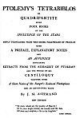

  
[Intangible Textual Heritage](../../index)  [Sky Lore](../index) 
[Index](index)  [Next](ptb01) 

------------------------------------------------------------------------

p. iii

# PTOLEMY'S TETRABIBLOS

###### OR

### QUADRIPARTITE

###### BEING

### FOUR BOOKS

###### OF THE

## *INFLUENCE OF THE STARS*

##### NEWLY TRANSLATED FROM THE GREEK PARAPHRASE OF PROCLUS

###### WITH

### A PREFACE, EXPLANATORY NOTES

###### AND

#### *AN APPENDIX*

###### CONTAINING

#### EXTRACTS FROM THE ALMAGEST OF PTOLEMY

###### AND THE WHOLE OF HIS

### CENTILOQUY

###### TOGETHER WITH

### *A Short Notice of Mr. Ranger's Zodiacal Planisphere*

###### AND AN EXPLANATORY PLATE

## By J. M. ASHMAND

###### NEW EDITION

<table data-border="0">
<colgroup>
<col style="width: 100%" />
</colgroup>
<tbody>
<tr class="odd">
<td data-valign="top" width="408">
"Ye stars, which are the poetry of Heaven! 
If, in your bright leaves, we would read the fate 
Of men and empires,--’tis to be forgiven." 
                                         LORD BYRON.
</td>
</tr>
</tbody>
</table>

#### London, Davis and Dickson

#### \[1822\]

NOTICE OF ATTRIBUTION  
Scanned at Intangible Textual Heritage, March 2005. John Bruno Hare,
redactor. This text is in the public domain worldwide. These files may
be used for any non-commercial purpose, provided this notice of
attribution is left intact in all copies.

[  
Click to enlarge](img/title.jpg)  
Title Page  

p. v

TO THE  
*AUTHOR OF "WAVERLEY"*  
THIS TRANSLATION  
OF A  
WORK CONTAINING THE BEST ACCREDITED PRINCIPLES  
OF  
ASTROLOGY  
IS DEDICATED  
*With the most profound admiration of his unrivalled Talents*  
WHICH COULD ALONE HAVE RESTORED  
INTEREST TO THE SPECULATIONS  
OF AN  
*ANTIQUATED SCIENCE*.

------------------------------------------------------------------------

[Next: Advertisement](ptb01)
