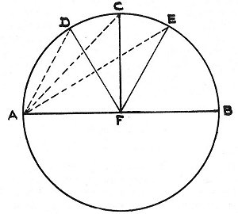

  
[Intangible Textual Heritage](../../index)  [Sky Lore](../index.md) 
[Index](index)  [Previous](ptb18)  [Next](ptb20.md) 

------------------------------------------------------------------------

### CHAPTER XVI

### MUTUAL CONFIGURATIONS OF THE SIGNS

THERE are certain familiarities or connections between different parts
of the [zodiac](errata.htm#4.md); and the chief of these is that which
exists between such parts as are configurated with each other.

This mutual configuration attaches to all parts diametrically distant
from each other, containing between them two right angles, or six signs,
or a hundred and eighty degrees: it also exists in all parts at the
triangular distance from each other, containing between them one right
angle and a third, or four signs, or a hundred and twenty degrees; also,
in all parts at the quadrate distance from each other, containing
between them exactly one right angle, or three signs, or ninety degrees;
and, also, in all parts at the hexagonal distance from each other,
containing between them two-thirds of a right angle, or two signs, or
sixty

p. 25

degrees [1](#fn_54.md) These several distances are
taken for the following reasons: the distance by diameter, however, is
in itself sufficiently clear, and requires no further explanation; but,
as to the rest, after the diametrical points have been connected by a
straight line, AB; the space of the two right angles, contained on the
diameter, is then to be divided into aliquot parts of the two greatest
denominations; that is to say, into halves, AFC, CFB, and into thirds,
AFD, DFE, EFB: there will then be provided for the third part (AD) a
super-proportion (DC), equal to its own half; and for the half (AC) a
super-proportion (CE), equal to its own third part; so that the division
into two aliquot parts,

 

\[paragraph continues\] AC, CB, will make the quartile distance AC; and
the division into three aliquot parts, AD, DE, EB, will make the sextile
distance AD, and the trinal distance AE. The respective
super-proportions (on either side of the intermediate quartile AC,
formed by the one right angle AFC), will also again make the quartile AC
(if there be added to the sextile, AD, the super-proportion DC, equal to
the half of the sextile), and the trine AE (if there be added to the
quartile AC the super-proportion CE, equal to the third part of the
quartile).

Of these configurations, the trine and the sextile are each called

p. 26

harmonious, because they are constituted between signs of the same kind;
being formed between either all feminine or all masculine signs. The
opposition and quartile are considered to be discordant, because they
are configurations made between signs not of the same kind, but of
different natures and sexes [1](#fn_55.md).

------------------------------------------------------------------------

### Footnotes

[25:1](ptb19.htm#fr_54.md) Whalley, in his note
upon this chapter, seems to have been surprised that no mention is made
here by Ptolemy of the *conjunction*; but he overlooked the fact that
the chapter treats only of parts of the zodiac configurated *with each
other*; and that it was not possible for Ptolemy to conceive how any
part could be configurated *with itself*. It is, therefore, by no means
wonderful that the conjunction is not inserted here along with the rest
of the aspects; although it is frequently adverted to in subsequent
chapters, and its efficacy particularly described.

[26:1](ptb19.htm#fr_55.md) From the tenor of this
chapter it was formerly doubted whether the author intended to admit in
his theory only zodiacal aspects, and to reject those which are called
mundane; but Placidus has referred to the 4th Chapter of the 8th Book of
the Almagest (which will be found in the Appendix to this translation)
to prove that Ptolemy distinctly taught two kinds of aspect; one in the
zodiac and one in the world. Whalley quotes the opinion of Placidus,
which he says is farther confirmed by the Lath Chapter of the 3rd Book
of this very treatise, where it is stated that the ascendant and the
eleventh house are in sextile to each other; the ascendant and the
mid-heaven in quartile; the ascendant and the ninth house in trine; and
the ascendant and the occidental angle in opposition; all which
certainly seems to be applicable to mundane aspects in particular.

------------------------------------------------------------------------

[Next: Chapter XVII. Signs Commanding and Obeying](ptb20.md)
